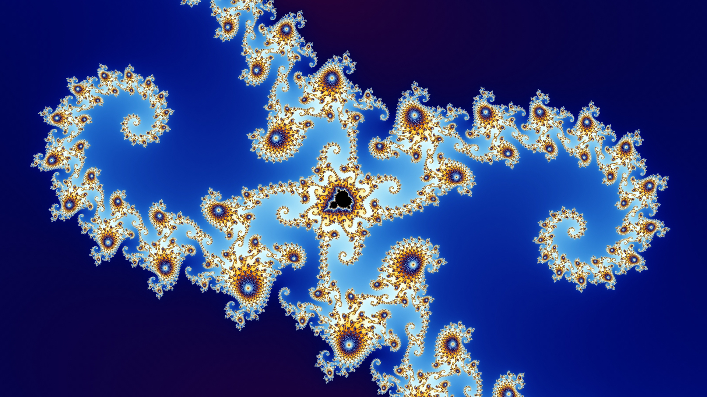
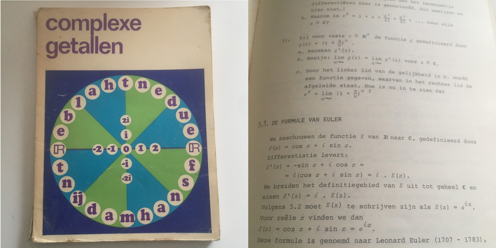
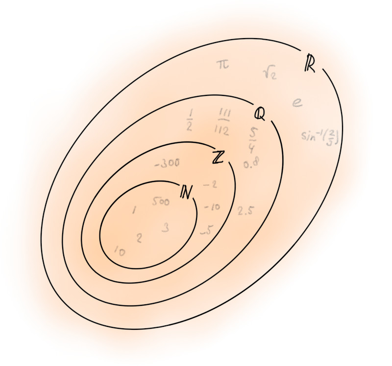
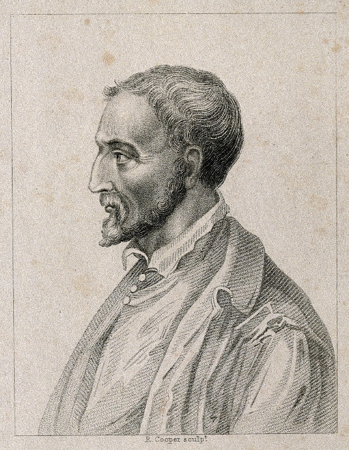
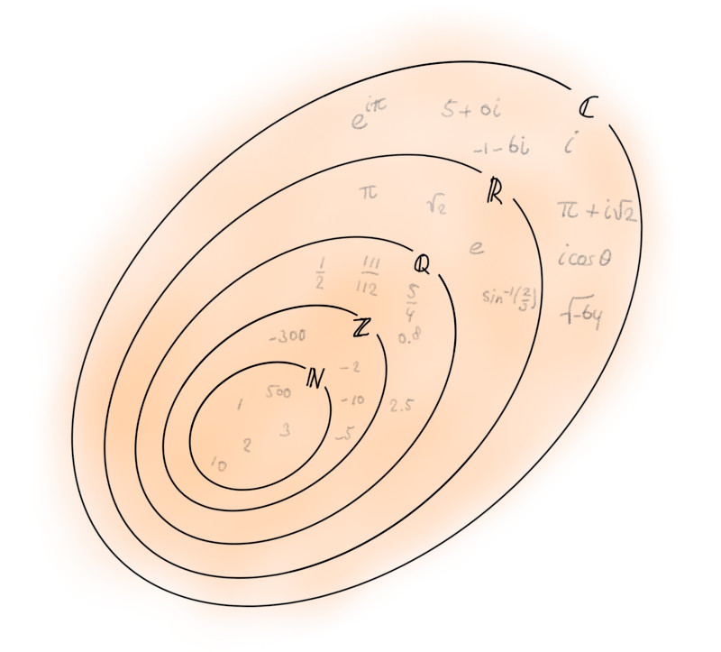
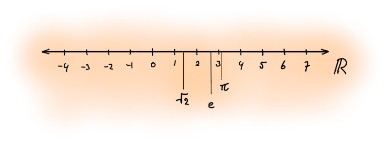
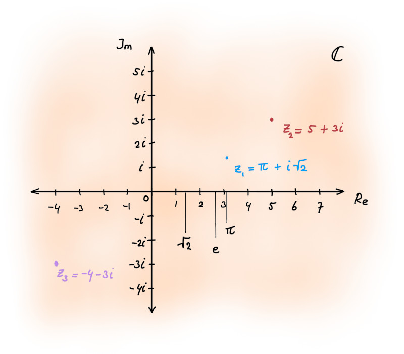

::: {.column-screen}

:::



::: {.lead-in}
Complex numbers have fascinated me since high school. Usually, it's where we are taught about natural numbers, integers, rational, irrational, and real numbers but never about complex numbers. This post is for those who might be interested in an easy introduction into the realm, or rather, plane of complex numbers. And they're not without practical significance either: no electronic device such as the one you're using to read this post could have been built without physicists, electrical engineers, and computer scientists knowing anything about the gift of complex numbers from sixteenth century mathematicians.
:::

# Blown away

"There are such things as *negative* numbers", explained my father to me when I must have been about six or seven years old since I was a second-year pupil in primary school. He explained the notion of negative possession when owing a certain number of marbles to someone which was greater than the number of marbles you physically carry with you. As this was one of those I-still-remember-where-I-was-when moments, like it was yesterday, I remember sitting on the floor besides the coffee table in the living room of our terraced house in the town of Emmeloord, which had been reclaimed just forty-three years earlier from the IJsselmeer, a lake formerly part of the North Sea.

I clearly remember feeling exactly the same when he had told me earlier our planet wasn't flat and when my Mum told me in the car yet a few months earlier, that we were living on the sea floor. The cap of my mind was blown away, yet again. It took a while before I managed to fold my slow and wet brain lobes around the notion that negative numbers existed, even though you couldn't see them in the real world like you could "see" regular numbers such as in lengths or the number of marbles.[^1]

I hastened to tell my primary school teacher excitedly about negative numbers. She just nodded and then told me to proceed with doing my homework on boring regular arithmetic. She had a point as I wasn't very good at it.

Fast forward to when I must have been about fifteen or sixteen when I read about complex numbers in a popular textbook about quantum mechanics. The fact that they were called "complex" may have triggered my curiosity as I assumed that term pertained to it being very difficult, but mostly because, apparently, so-called *imaginary numbers* are a thing! I had that exact same feeling again. The cap of my mind had melted. The whole notion seemed to radiate some kind of magical power. What sorcery was this? Could this be a doorway to extra dimensions?

The next day, I told my mathematics teacher, Mr Es – Es is not his actual name but it was his two-letter code in our high school timetable. I've always found it appropriate Es is also the symbol for the element Einsteinium in the periodic system. As his first name happened to be the same, my friends and I used to joke that we were on our way to the lessons of Albert Einstein.

Mr Es did what every good teacher does when a student tells you something they get enthusiastic about: he encouraged it – in his case by lending me his old textbook from when he was a first-year mathematics student in Amsterdam. It was an introductory text about complex numbers at the level of undergraduate mathematics.

I'm ashamed to say I kept it. It was one of those instances where, after the $n$th time of moving house, I realised, oh my god, I still have this!? It's also true that I treasured it. It carries a special meaning to me. It signifies how, at least once in my lifetime, I felt acknowledged in what stirred me deeply at the time. A thing I couldn't really share with friends or anyone close in general, I suddenly shared with someone very clever whose name was denoted by the symbol for Einsteinium.

Thanks to the miracle of internet, we got back in touch, about twenty-five years later. I confessed I had always kept it and apologised. He had indeed wondered where it had been as he once wanted to show it to someone else. But I could keep it as he was cleaning out the attic anyway. And he was glad it had done something for me as he learnt about my current engagements in a bit of maths and physics.

I felt guilty. I still do. Someone else could have enjoyed it just as much as I have. And now I have prevented that from happening through his book. So, whoever you are, my sincerest apologies.

I hope, one day, I will be able to ignite sparks of joy for the beautiful mathematics of complex analysis to many others. I also hope you might experience at least a fraction of the amazement I felt and that the newly gained insight on the concept of "numbers" might turn out to be beyond what you were able to imagine so far. So, let this be a beginning.

# Number sets

We all know and love (or hate, depending) the natural numbers: the whole numbers we count things with. 1, 2, 3, etc. Some mathematicians will want to include the number 0 while others don't. In any case, this mathematical set of numbers is called the natural numbers and is denoted by the symbol $\mathbb{N}$.

Then my father told me about the negative numbers, such as -1, -2, -3, etc. If you include the natural numbers and add to that these negative numbers, and add the number 0 to it (if you hadn't already), then the result is an entirely new set of numbers called the integers, denoted by the symbol $\mathbb{Z}$.

To denote that the set $\mathbb{N}$ is part of the larger set $\mathbb{Z}$, people use this symbol for subset, $\subset$. They will write $\mathbb{N} \subset \mathbb{Z}$, the natural numbers are a subset of the integers.

Of course, there's the ratios. The fractions. Between 1 and 2, there's 1.5. So, in fraction-notation, that's $\frac{3}{2}$. They're obviously not whole numbers. They're rational numbers because they can be represented by a ratio of integers. This number set is symbolised by $\mathbb{Q}$. We now have:

$$\mathbb{N} \subset \mathbb{Z} \subset \mathbb{Q}.$$

It is interesting to note that, therefore, by this expression of subsets of subsets, even numbers such as 9 are rational numbers. On the surface, it's not a fraction. Below the surface, however, it can be expressed as a ratio of integers: $9 = \frac{9}{1} = \frac{18}{2} = \frac{36}{4}$, for example (and infinitely more).

But wait, there's more. Fractions such as 1.5 and 3.2 are finite. What if the decimals don't end? What if you can't write a particular kind of numbers as ratios, such as with the number $\pi$ or $\sqrt{2}$? These numbers are called the irrational numbers. They are all the numbers which aren't rational. There's no symbol for that.[^2]

Instead, there's a symbol for all the natural numbers, the integers, the rational numbers, and the irrational numbers altogether.[^3] They're called the real numbers and this set is denoted by $\mathbb{R}$. This is the set we're all used to working with. We now have:

$$\mathbb{N} \subset \mathbb{Z} \subset \mathbb{Q} \subset \mathbb{R}.$$

The set of real numbers $\mathbb{R}$ contains all the numbers. Or does it?

# The secret of del Ferro, del Fiore, Tartaglia, and Cardano

Well, you guessed it. Here they come, the complex numbers. Let's do just a tiny bit of maths. Remember what the quadratic of a number was? And what a square root was? What is the square root of 64, in other words, $\sqrt{64}$? Yes, that's 8. Because 8 times 8, or 8 squared, or $8^2$ equals 64.

Okay, suppose $x^2 = 64$, what is $x$ then? Well, you do exactly the same thing, you un-square $x$ by taking its square root. And you have to do the same with the number after the equal sign. So, $\sqrt{x^2} = \sqrt{64}$, in other words, $x = 8$.

::: {style="width: 30%; float: right; margin: 0 0 1rem 1.5rem;"}

:::

Maybe you remember this comes in handy when calculating the lengths of the edges of your piece of land. Suppose, the surface area of your square piece of land is 64 square kilometre (or square miles). What is the length of an edge of that land? That's 8 kilometre (or miles).

All these calculations take place in the realm of $\mathbb{R}^+$, the positive part of all real numbers. Note that no surface area of a piece of land can be negative. In other words, a surface area of -64 square metres is nonsensical. Also, the square root of -64 has no solution. It's not -8, because -8 times -8, or $(-8)^2$ is simply 64 again, because a negative number times a negative number equals a positive number as we proved in an [earlier post](https://opencurve.info/minus-minus-and-negative-times-negative/).

::: {style="width: 30%; float: right; margin: 0 0 1rem 1.5rem;"}

:::

Sometime in the sixteenth century, somewhere in Italy, Scipione del Ferro, professor of the University of Bologna, solved a slightly different kind of equation. It was a so-called cubic equation. Where we basically found the solution to a quadratic equation such as $x^2 = 64$ from the top of our heads, he found solutions for a cubic equation such as $x^3 + x^2 + 6x + 3 = 0$. Del Ferro was known for not wanting to publish any of his proofs and solutions. He kept a secret notebook and that was it.

On his death bed, however, he told his pupil Antonio Maria del Fiore the secret to solving it. Del Fiore went on to challenge Niccolò Fontana Tartaglia, a mathematician residing in Venice at the time. Tartaglia had actually solved it himself before and trusted the formula to Gerolamo Cardano, the then Milan-based polymath and genius. Tartaglia messaged the solution in the form of a poem (no less!) but didn't entrust the proof to him.

Of course, Cardano was able to reconstruct the proof anyway. As he learnt that del Ferro had also found the solution, he then proceeded to publish it all in his *Ars Magna* from 1545, much to the chagrin of Tartaglia.

So, what was the secret so many large minds had been secretive about? A new type of number.

# *i*maginary

Let's take a simpler example. Suppose we have the following simplistic quadratic equation: $x^2 - 4 = 0$. To solve it, we "move" the 4 to the other side of the equal sign, by adding 4 to both sides: $x^2 - 4 + 4 = 0 + 4$, which simply becomes $x^2 = 4$. If you apply the square root to both sides, you get $\sqrt{x^2} = \sqrt{4}$. The solution to this equation is thus $x = 2$ or $x = -2$ (because $-2 \times -2 = 4$ too).

Good. Basically, the mathematicians of the sixteenth century opined that they should be able to solve a variation of this equation as well: $x^2 + 4 = 0$. Let's bring the 4 again to the other side of the equal sign by subtracting 4 on both sides: $x^2 + 4 - 4 = 0 - 4$, which becomes $x^2 = -4$. Now, again, the question is, what is $x$?

Let's try and apply the square root to both sides again: $\sqrt{x^2} = \sqrt{-4}$. Halt. Stop. What is the square root of -4? What is the square root of a negative number?

We have the same situation where we are to apply the square root of a negative surface area. The answer isn't -2, because $-2 \times -2 = 4$, not -4. What then?

Before del Ferro, Tartaglia, and Cardano, people would have said that there simply is no solution. Thanks to them, however, we can solve it. The answer lies in the following definition:

$$i^2 = -1.$$

This seemingly simple act enables us to solve $x^2 = -4$. We can then write $x = 2i$ or $x = -2i$.

Let's take our first solution, $x = 2i$. If we square this, we get $x^2 = (2i)^2$, which we can also write as $x^2 = 2^2i^2$. Now, since $i^2 = -1$, we can substitute that to get $x^2 = 2^2(-1)$, which is, of course, $x^2 = -4$. *Ecco!*

The same goes for the other solution, $x = -2i$. If we square this, we get $x^2 = (-2i)^2$, which we can write as $x^2 = (-2)^2i^2 = 4i^2 = 4(-1) = -4$. *Ecco!*

So, you may ask, what devilish entity is this $i^2 = -1$? The letter $i$ stands for "imaginary" and so, $i$ is a so-called imaginary number.

Now, because $i^2 = -1$, you can also write[^4] that $i = \sqrt{-1}$. And that's the crazy part: how can you calculate the square root of a negative number? How can you calculate the square root of a negative surface area? The answer is, you can't. Not in the realm of the real numbers $\mathbb{R}$, that is. However, we're not in Kansas anymore, Dorothy. We're in a new land called the complex numbers. Bye $\mathbb{R}$, and welcome to $\mathbb{C}$.

Here are some examples of complex numbers: $2i$, $\frac{2}{3}i$, $i\sqrt{2}$, $i \pi$, $-0.25i$. What's more, you can add these imaginary numbers to a real number such as 3, like so: $3 + 2i$ or $3 + \frac{2}{3}i$ etc. These sums are their own answer. They are complex numbers.

::: {.callout-note appearance="minimal"}
A complex number $z$ is of the form $z = a + bi$, where $a$ and $b$ are real numbers and $i^2 = -1$. The first real number, $a$, is called the real part of $z$. The last real number, $b$, is called the imaginary part of $z$. The set of all complex numbers is denoted by $\mathbb{C}$.
:::

And so, we now have:

$$\mathbb{N} \subset \mathbb{Z} \subset \mathbb{Q} \subset \mathbb{R} \subset \mathbb{C}.$$

Note that every real number is a complex number, but not every complex number is a real number. That is what one thing being a subset of another thing means. For instance, the real number 9 is a complex number where $b = 0$. In other words, the real number 9 can be written as the complex number $9 + 0i$, which is simply 9, which thus happens to be a real number too.

But $z = 3 + 2i$ is not a real number, because it has an imaginary part which is not equal to zero. So, $z$ is now exclusively a complex number.

::: {style="width: 80%; margin: 1.5rem auto;"}

:::

# Complex plane

Graphically, all the real numbers of $\mathbb{R}$ can be thought of as a point on the number line.

So, where do complex numbers reside?

Owing to people such as Wallis, Wessel, Argand, Buée, Mourey, Warren, Français, Bellavitis, Gauss, and Euler[^5], the idea to extend the real number line with an *imaginary number line perpendicular to the real number line* came to fruition. What you get is the so-called complex (geometric) plane, sometimes called the $z$-plane, Gauss plane or Argand plane.

So, a complex number such as $z = 3 + 2i$, "contains" the real number 3 along the real axis, and the imaginary part, along the imaginary axis, sits at $2i$. A complex number is therefore always represented by a point in a two-dimensional space. Note that all the numbers from all the subsets of complex numbers, i.e. $\mathbb{R}$ all the way down to $\mathbb{N}$, can also be represented by a point in this same two-dimensional complex space – it's just that they all reside on the real axis.

As you can imagine, doing calculations with complex numbers has become an exercise of geometry now! In fact, one of the most beautiful equations in mathematics (at least to my taste) pertains to trigonometry in the complex plane; it's called Euler's Formula.

# Not so imaginary

It's unfortunate that this number $i$ and any real number multiplication of it are called *imaginary numbers*. It was the renowned French philosopher and mathematician René Descartes who coined the term imaginary numbers because he considered them to be illusory. In fact, even Cardano had described them as "some recondite third kind of thing".[^6]

It's unfortunate because "imaginary" leads to semantic ambiguity. I get it: you would never see something like $\sqrt{-1}$ in the real world. But neither would you see $\sqrt{2}$ out in the wild, for that matter. And yet, it's the exact length of the hypotenuse of a particular right triangle, which a skilled DIY person could make while you're waiting. To me, "real" numbers such as $\pi = 3.1415926535897\dots$ without ever ending are as real as "imaginary" numbers are (and vice versa). Circles are a real thing and $\pi$ can be used to do calculations on them. Well, with imaginary numbers you can do calculations on them just as well.

Complex numbers are used in a variety of sciences. In Einstein's relativity, which makes GPS navigation possible, you could make use of so-called imaginary time. This sounds like a concept straight from a science-fiction novel; however, imaginary time is a well-defined concept. In fact, in a [previous post](https://opencurve.info/deriving-the-lorentz-transformations-from-a-rotation-of-frames-of-reference-in-standard-configuration-with-real-time-wick-rotated-to-imaginary-time/), we used this to derive the central set of equations in relativity, called the Lorentz transformations. See how the word "imaginary" might invoke unwanted ambiguity?

To make quantum mechanics work – the most successful theory to date – complex numbers are all over the place. Without them, the computer, mobile phone, tablet, TV, VCR, even your modern fridge – they wouldn't have worked as no engineer would have been able to produce integrated circuits. The [wave function](https://opencurve.info/this-is-not-an-atom#wavefunctions) is a complex function living in a complex separable Hilbert space, taking on complex probability amplitudes, evolving according to the Schrödinger equation, which itself is a complex equation.

In mathematics, one of the better-known areas of research where complex numbers play a central role is the study of complex dynamical systems. The featured image above is a detail of the famous [Mandelbrot set](https://en.wikipedia.org/wiki/Mandelbrot_set). It's a special collection of complex numbers, the projection of which you see plotted colourfully in the complex plane. The study of (complex) fractals also informs all kinds of patterns in nature and growth, even weather forecasts, and climate science – they're all informed by complex-dynamical areas of mathematical interest. Also, we've [used them](https://opencurve.info/lab-centrifuges-and-prime-numbers/) in a previous post, calculating whether a lab centrifuge with $n$ available spots can be balanced out by a $k$ number of test tubes.

A fun application of complex numbers is computer games. To calculate rotations in three-dimensional space, computer scientists make use of quaternions, which are an extension of the complex plane. A quaternion is an expression of the form $a + bi + cj + dk$, where $a, b, c, d$ are any old real numbers, and $i^2 = j^2 = k^2 = -1$. However, this is perhaps an interesting subject for another bit of maths and physics.

---

### Image credits and references

* *Featured image: Mandelbrot set – Step 6 of a zoom sequence by [Wolfgang Beyer](https://www.flickr.com/photos/lcisa/4750623290/in/photostream/) under [CC BY-NC-SA 2.0](https://creativecommons.org/licenses/by-nc-sa/2.0/); adapted to fit layout.*
* *Hopscotch Game by [ncassullo](https://pixabay.com/users/ncassullo-6121332/).*
* *Niccolò Fontana Tartaglia. [Rijksmuseum](https://www.rijksmuseum.nl/nl/collectie/RP-P-1909-4459), Dutch National Museum. Public domain.*
* *Girolamo Cardano. [Wellcome Images](http://www.wellcome.ac.uk/News/Media-office/Press-releases/2014/WTP055466.htm) under [CC BY 4.0](https://creativecommons.org/licenses/by/4.0/deed.en).*

[^1]: Inexplicably, I had never considered the fact that temperature could get below 0 °C, which it still did, back then in The Netherlands. We used to enjoy an outdoor activity called ice skating, on frozen lakes, ponds, rivers, and ditches.
[^2]: Often, mathematicians circumvent the lack of a symbol by writing something like $\mathbb{R} \setminus \mathbb{Q}$.
[^3]: Yes, indeed, my dear fellow mathematician, you thought correctly, I am skipping [transcendental numbers](https://en.wikipedia.org/wiki/Transcendental_number) here (and algebraic numbers, for that matter). As all transcendental numbers are irrational numbers but not all irrational numbers are transcendental, I decided it over-complicated things in what was supposed to be an introductory text on complex enough numbers anyway.
[^4]: Although, I actually prefer to use $i^2 = -1$ over $i = \sqrt{-1}$ even though the latter has been mentioned in many school books. However, I believe it might lead to confusion. Since we have the rule that $\sqrt{a}\sqrt{b} = \sqrt{ab}$ where $a$ and $b$ are positive real numbers, you might try to apply this rule to negative real numbers, such as when $a = b = -1$. You would then get the incorrect statement $\sqrt{-1}\sqrt{-1} = \sqrt{(-1)(-1)} = \sqrt{1} = 1$, which is wrong as it should be equal to -1. That's why I try to avoid using $i = \sqrt{-1}$ where I can.
[^5]: Cooke, R. (2005). *The history of mathematics: a brief course*. 2nd edn. New York, N.Y.: Wiley.
[^6]: Open University (2014). *Essential mathematics 1*. Milton Keynes: Open University.