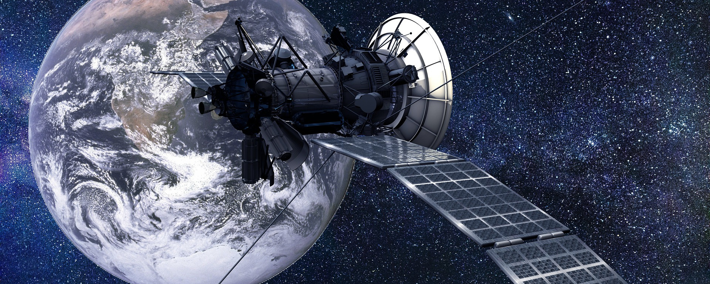

::: {.column-screen}
{width="100%"}
:::

::: {.column-margin}
::: {.author-sidebar}
{.author-photo}

::: {.author-name}
[**KJ Runia, BSc (Hons) MInstP AMIMA**](../../about.qmd)
:::

::: {.author-bio}
Founder & author. Holds a Bachelor of Science (Honours) degree in Mathematics and Physics from the School of Mathematics and Statistics and the School of Physical Sciences at The Open University, Walton Hall, Milton Keynes. Studies currently for an MPhys (Master of Physics). Is a Member of the Institute of Physics (IOP) and an Associate Member of the Institute of Mathematics and its Applications (IMA).
:::
:::
:::

::: {.lead}
Last Christmas, my father and one of my brothers wondered how a spacecraft's planetary slingshot works. It's a well-known manoeuvre to get a big swing forward by passing by a planet. They realized that if the craft falls toward the planet due to its gravitational pull, it will gain momentum. However, as soon as it has flung around the planet, wouldn't that same gravitation slow down the craft just as much? Great question, of course, so, let's dive into this gravity assist short and simple.
:::

# Symmetry

First things first, you are absolutely right in thinking that the gravitational pull of the planet is a symmetrical situation. The same 'force' pulling the craft toward the planet making it accelerate, will also slow it down once it has reached its maximum point around the planet when it tries to escape the planet's influence again, continuing its journey in space.

So, the whole planet's gravity system is entirely symmetrical. What isn't symmetrical though... is that the planet has an orbital momentum[^1] around the Sun! The planets in our solar system all orbit around the Sun. Though at different rates, their position relative to the Sun changes every single second. This means they have a great deal of momentum and we, the rather clever clumps of human cells that we sometimes are, can exploit this. So, by using the gravitational pull of the planet to get closer to it, the craft gains an additional tug by the simple fact that the planet itself is also moving through space. And so, while the momentum the spacecraft gained by the planet's gravitational pull was lost again while escaping the planet's gravitation, it did gain a bit of the planet's orbital momentum!

As soon as the train is coming through the station, you start running along with it on the platform. You pull out your grappling hook gun and grapple onto the train. Then you press the button so that the retractable cable attached to the hook pulls you toward the train (still speeding along its trajectory). At the right moment, you release the hook, spread out your batwings, and away you go, having parasitized off of the train's momentum for a little bit.

And you're right, this also means that the train lost a bit of its momentum due to you 'pushing off of it'. However, due to the huge difference between your mass and the train's mass, in combination with either velocities, the train's momentum loss is negligible while your momentum increase is significant.

The same goes for the planet. A spacecraft doing a gravity slingshot, or, enjoying a gravity assist, as it's also called, will decrease the orbital velocity of the planet, meaning that the planet's orbit will get closer to the Sun. Of course, given the ratio between the spacecraft's mass and the planet's mass, this amount is negligible.

Two of the most famous instances of gravity assists are the voyages of Voyager [1](https://en.wikipedia.org/wiki/Voyager_1) and [2](https://en.wikipedia.org/wiki/Voyager_2). In the animation below, made by [Phoenix7777](https://commons.wikimedia.org/wiki/User:Phoenix7777), published under [CC BY-SA 4.0](https://creativecommons.org/licenses/by-sa/4.0/deed.en), you can see the trajectory of Voyager 2, where it gained assists from several of our solar system's planets. Earth is the fast-orbiting blue dot. Jupiter is green, Saturn is cyan, Uranus is yellow, and orange is Neptune. And while the Voyager spacecrafts flew by the planets, they sent some of the [best postcards](https://voyager.jpl.nasa.gov/galleries/images-voyager-took/) back to Earth.

# Deceleration

Of course, what goes around, may come around too. If you'd like the spacecraft to decelerate, you make it fly opposite the planet's orbital motion. This way it slows down while donating a (negligible) bit to a planet's momentum.

So, what Christmas message can we take from this? That's right. Even the tiniest entity in the Universe is capable of changing an entire planet's momentum. No matter how small, its effects are significant.

[^1]: Momentum is mass times velocity in a specific direction