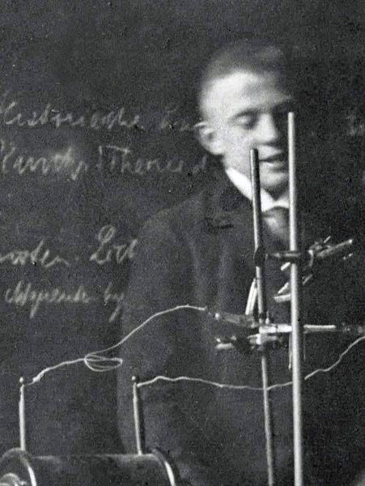
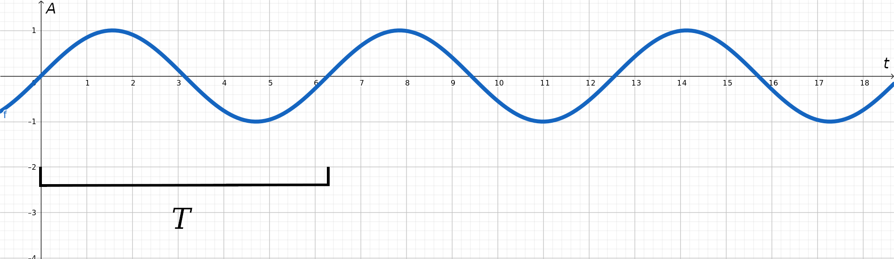
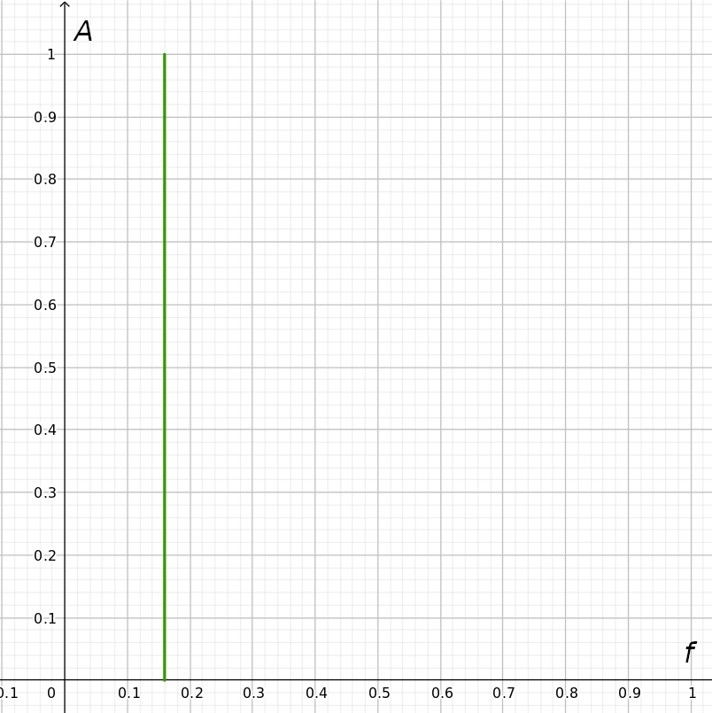
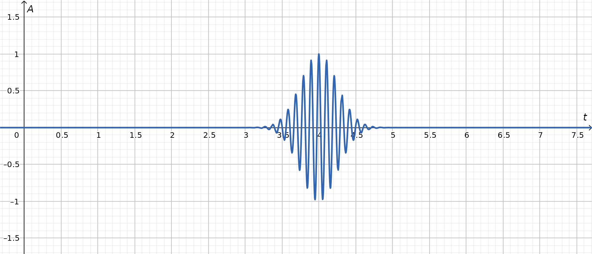
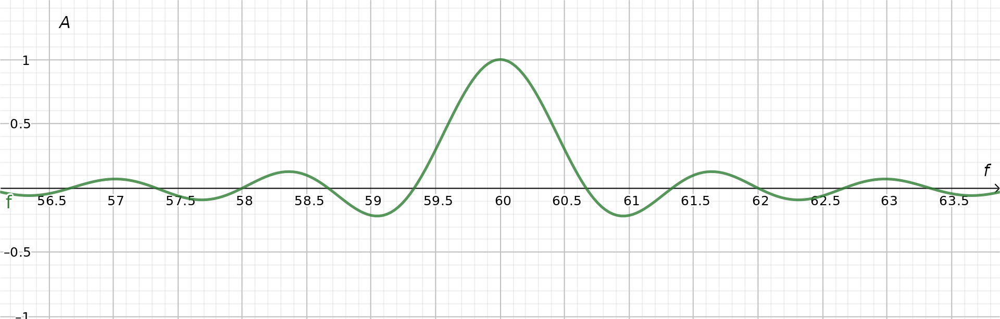
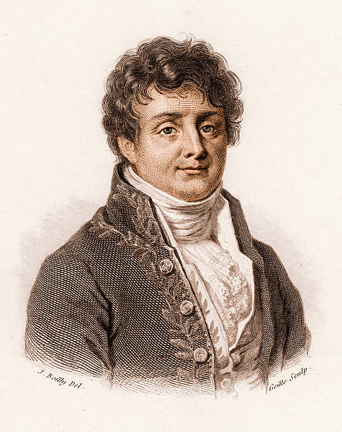

::: {.column-screen}

:::



::: {.lead-in}
It's perhaps not as famous as Einstein's formula but in this day and age many people may still have heard at least once of the phrase "Heisenberg's uncertainty principle". It plays an important role in quantum mechanics. You may have heard that every time you observe or measure matter, due to the crudeness or inherent inaccuracy of the measurement device, you will inevitably disturb your own observation. This would then preclude you from gaining accurate knowledge with satisfying certainty. In fact, in general, Heisenberg's uncertainty principle states that nothing can be certain. At the risk of sounding vague and vanilla, all of these statements are completely and utterly wrong. Let's look at what it really says, shall we?
:::

::: {style="width: 60%; margin: 1.5rem auto;"}
{#fig-heisenberg fig-alt="Black and white photograph of a young Werner Heisenberg in a suit standing behind laboratory apparatus and a chalkboard with German handwriting."}
:::

# Fourier transform pairs

Trade-offs. Who doesn't hate them? Remember when your parents told you that you could have this but then not have that or maybe just a bit of this but then less or fewer of that? Unsurprisingly, at least three famous philosophers have written a few words on this, each in their own way lamenting on the existence of trade-offs and how to deal with them. One chose to become all rebellious about it and [wrote](https://en.wikipedia.org/wiki/I_Want_It_All_(Queen_song)): "I want it all, I want it all, and I want it now!" (May, 1988). The other two, however, chose to be more pragmatic about it as they [postulated](https://en.wikipedia.org/wiki/You_Can%27t_Always_Get_What_You_Want) that "you can't always get what you want" (Jagger & Richards, 1968). Obviously, they knew that, sometimes, life brings you Fourier transform pairs. The more well-known example is of course Heisenberg's uncertainty principle.

::: {.callout-note appearance="minimal"}
If you limit a particle's range of possible positions in space ($\Delta x$), you increase its range of possible momenta[^1] along the $x$-direction ($\Delta p_x$), and vice versa.
:::

This is formalised as follows:

$$\Delta x \Delta p_x \geq \dfrac{\hbar}{2}.$$

Just to be absolutely clear: the delta symbol $\Delta$ is a range of a certain quantity. Usually, a $\Delta$ is defined as the difference between two values. Suppose you measure point $A$ of your garden fence to be $0.1$ metre away from your wall and point $B$ to be $0.7$ metre away from your wall, then the $\Delta$ of the distances, i.e. the length between points $A$ and $B$, is $0.7 - 0.1 = 0.6$ metre.

In Heisenberg's principle, it is stated that the product of the *range* of possible positions $\Delta x$ and the *range* of possible momenta $\Delta p_x$ is greater than or equal to some number. Mind you, it's a tiny number. The symbol $\hbar$ stands for the [Planck constant](https://en.wikipedia.org/wiki/Planck_constant) divided by $2\pi$, and the result gets cut in half yet again.

This means that whenever one is getting bigger, $\Delta p_x$ for instance, the other is getting smaller, which is then $\Delta x$. And vice versa.

::: {.callout-tip collapse="true"}
## Click here if you'd like to do a bit of maths. It's very easy.

Just to get an intuitive insight into this relation, suppose $\dfrac{\hbar}{2} = 1$, and so, suppose $\Delta x \Delta p_x = 1$. Furthermore, suppose $\Delta x = 0.5$. What value does $\Delta p_x$ have to be to satisfy this equation? Exactly, $\Delta p_x$ has to be $2$, because $0.5 \times 2 = 1$, or else the equation is false.

Now, let's make $\Delta x$ smaller. In other words, we're going to try to pinpoint the location with much more precision. So, let's say, $\Delta x = 0.001$. What value does $\Delta p_x$ have to become to satisfy this equation? You guessed right, $\Delta p_x$ has to become even larger: $\Delta p_x = 1000$, because $0.001 \times 1000 = 1$. If you were to reverse the situation – decreasing the size of $\Delta p_x$ – then, in turn, $\Delta x$ would have to become larger.

In reality, $\dfrac{\hbar}{2}$ is much smaller than 1. It is, in fact, about $5.273 \times 10^{-35}\text{ J}\cdot\text{s}$. That's thirty-four zeros behind the decimal point and then ending in 5273. It's incredibly small. Don't worry about this; we'll get back to that later.

Hopefully, now you see the relation between $\Delta x$ and $\Delta p_x$ as put forward by Heisenberg's formulation. They complement each other. Whenever a range of possible values becomes larger – in other words, the $\Delta$ or range of value options is larger – its actual value becomes more uncertain, hence the use of the word "uncertainty" in Heisenberg's uncertainty principle.[^2]
:::

But why is this? While this principle plays a central role in quantum mechanics, it's actually not fundamentally a quantum-mechanical law. This principle exists more generally in many instances in physics, and, even more generally, in mathematics.

In mathematics, the variables position and momentum are said to be a Fourier transform pair. Put in yet other mathematical jargon, position and momentum are said to be conjugate variables.

# Sound

A well-known, non-quantum-mechanical example of the uncertainty principle is determining the pitch of a sound. How "high" a note is depends on the frequency.

The most familiar way we depict sound waves is a simple sine wave. It represents the simplest of sounds possible. Also, it's the most boring of sounds possible.

The $x$-axis represents time. The $y$-axis represents the amplitude of the sound or the loudness, the intensity of it. As you can see, the sound wave repeats itself over time; the pattern is cyclic. One whole cycle is when the plot has completed going up, going down, going further down, and going up again. The time it takes to complete one cycle is designated by the symbol $T$, called the period.[^3] So, this particular sound wave is said to be periodic.

{#fig-sine-time .img-border fig-alt="A continuous periodic sine wave plotted on a grid against time on the x-axis and amplitude on the y-axis."}

The shorter the period – the quicker the cycles are – the higher the tone. Another way of saying this is that the higher the frequency, the higher the tone. The mathematical relationship between period $T$ and frequency $f$ is the following expression:

$$f = \dfrac{1}{T}.$$

If the period gets shorter, i.e. the value of $T$ becomes smaller, then the value of $f$ becomes larger, which means a higher tone.

Seeing as the time period $T = 2\pi\text{ seconds}$, the frequency diagram looks like a spike at $\dfrac{1}{2\pi}\text{ Hz}$. In this frequency diagram, the $x$-axis is the frequency and the $y$-axis is still the amplitude.

{#fig-sine-freq .img-border fig-alt="A single sharp vertical green spike on a grid at frequency f equals one divided by two pi, showing a single discrete frequency."}

So, there are now two ways in which we can describe the sound wave: either by frequency (@fig-sine-freq) or by change over time (@fig-sine-time).

Notice that the sound wave plotted as a function of time (@fig-sine-time) has no beginning nor end. For all we know, that plot could just go on forever, to an infinite amount of time, in both directions. Suppose we would ask the question at what time exactly does the sound exist? The answer is: always. *There is no particular, specific time at which it exists.*

In other words, we could write that $\Delta t = \infty$.

Notice, however, that the frequency plot looks very finite: just one stroke. One well-defined, finite stroke. If we were to ask the question what frequency exactly does the sound have? The answer is: there is a particular, specific, *exact* frequency at which it exists and it is $\dfrac{1}{2\pi}\text{ Hz} \approx 0.16\text{ Hz}$.

# Fourier analysis

In reality, no sound is going to be infinitely long. Pluck a guitar string and it will fade out as the energy dissipates slowly. Also, at some point it started – meaning, before that, it didn't exist. In other words, in reality, a sound wave usually exists in a finite range of time.

Let's limit our sound wave to a range in time, so it looks more like the sound of a "blip" and less like an infinite tone of boredom. Again, the $x$-axis represents time and the $y$-axis represents the amplitude.

{#fig-wavelet-time .img-border fig-alt="A Morlet wavelet showing a localized wave packet with oscillating peaks centered around t equals 4 on a grid, flatlining elsewhere."}

As you can see, the sound now exists in a more defined range of time – roughly 1.5 seconds. In other words, $\Delta t \approx 1.5\text{ seconds}$. That's a whole lot smaller than the old $\Delta t = \infty$.

Now, we ask ourselves, what is its frequency? The difficulty now is that it's hard to pinpoint an exact period $T$. The evolution of the plot is quite different from our infinitely long sine wave. Yes, we can identify kind of those cycles we're looking for; however, no cycle has the same shape, so, technically, we're dealing with multiple cycles at once. And guess what: its frequency-amplitude plot looks like this:

{#fig-wavelet-freq .img-border fig-alt="A continuous frequency spectrum showing a broad central peak surrounded by smaller side lobes on a grid, representing multiple frequencies."}

As you can see, it has become difficult to pinpoint the exact frequency of our wavelet. It exists at a variety of frequencies and amplitudes.

So, while the "time window" of the sound wave has become more exact, the frequency has now become "less certain".

::: {style="width: 32%; float: right; margin: 0 0 1rem 1.5rem;"}
{fig-alt="Engraved historic portrait of French mathematician and physicist Joseph Fourier in an elegant coat with embroidered collar."}
:::

The brilliant mathematician Joseph Fourier discovered that a wavelet such as in @fig-wavelet-time can actually be constructed by adding many infinite waves at many frequencies. Put differently, Fourier analysis shows that our wavelet is the culmination of a superposition of many waves at many frequencies.

{#fig-wavelet-fourier .img-border fig-alt="Stack of sinusoidal waves with increasing frequencies aligned on a grid, summing at the bottom into a single localized wavelet packet."}

Now you see why the frequency-amplitude plot has changed from a very specific value in @fig-sine-freq to the wider set of frequencies in @fig-wavelet-freq. In the latter case, the wavelet "contains" multiple waves at *multiple* frequencies, so when you *Fourier transform* its time-amplitude plot to its frequency-amplitude plot, the frequency has become "uncertain".

::: {.callout-note appearance="minimal"}
The relation between time $\Delta t$ and frequency $\Delta f$ in ordinary classical physics is fundamentally complementary. No quantum mechanics needed.

In mathematical jargon, time and frequency are so-called [Fourier transform pairs](https://en.wikipedia.org/wiki/Conjugate_variables) or [conjugate variables](https://en.wikipedia.org/wiki/Conjugate_variables).

The term "uncertainty principle" pertains to the general phenomenon that Fourier transforms (such as between time and frequency) entail a fundamental, mathematical trade-off between types of information carried by the two transformed variables. Heisenberg then showed that this principle also holds in quantum mechanics. And so, the uncertainty principle in quantum mechanics is called Heisenberg's uncertainty principle.
:::

# The De Broglie relation

Time to go back to quantum mechanics. Remember that a particle's best description is a [wave function](https://opencurve.info/this-is-not-an-atom#wavefunctions)? A wave function is the mathematical expression of a particle containing all possible states it can assume once we measure it.

Instead of a *time*-amplitude plot, let's represent a particle by a *space*-amplitude plot. To make it a little bit easier, let's take the wave function of a particle of which the amplitude only varies along one dimension of space, $x$.

Here is a representation of a particle's wave function along one dimension of space (along a "straight line"). The $x$-axis represents a position in space. The $y$-axis represents the amplitude of the wave function (which is proportional to the probability of finding the particle in that particular position $x$).

{#fig-free-electron .img-border fig-alt="Graph of an infinite, unconfined sine wave representing a free particle's wave function with a clearly defined wavelength lambda across the x-axis."}

It was the eminent French physicist [Louis de Broglie](https://en.wikipedia.org/wiki/Louis_de_Broglie)[^4] who formulated the relationship between a particle's wave function wavelength $\lambda$ and its momentum $p$:

$$\lambda = \dfrac{h}{p},$$

where $h$ is the [Planck constant](https://en.wikipedia.org/wiki/Planck_constant). Incidentally, this is the equation better known as De Broglie's matter wave hypothesis, stating that matter, such as electrons, possess a wave-like characteristic.[^5] This [won](https://www.nobelprize.org/prizes/physics/1929/broglie/facts/) him the Nobel Prize, no less.

If we rewrite this to solve for $p$, we get:

$$p = \dfrac{h}{\lambda}.$$

So, clearly, a wave's momentum is determined by its wavelength. The smaller the wavelength, the greater the momentum. What is the wavelength? It's the length between two peaks (or two troughs). The higher the frequency, the smaller the wavelength. Now have a look at @fig-free-electron again. As you can see, the infinite wave of a free particle has a well-defined wavelength. The logical conclusion is that the *momentum* is also well-defined. Nevertheless, @fig-free-electron also shows that the particle's *position* is not defined at all!

Let's turn this on its head and limit the range of possible positions of our particle. No longer is it a free particle. It is now confined within a finite range of locations.

{#fig-bound-electron .img-border fig-alt="Graph of a localized electron wave function restricted strictly between x equals 0 and x equals pi, with flat zero lines outside this boundary."}

What we've done in @fig-bound-electron is making $\Delta x$ smaller than it was in @fig-free-electron (where it was infinitely large). In fact, $\Delta x = \pi$ wide. By the same Fourier transform mechanism as with the time-frequency pair, the complementary sister of position space $\Delta x$, namely momentum space $\Delta p_x$, will now become less certain.

To construct a limited wave function such as the one in @fig-bound-electron, Fourier analysis shows that you need – again – a bunch of waves at different frequencies in superposition (added on top of each other).

{#fig-bound-electron-fourier .img-border fig-alt="Multiple sine waves of different frequencies stacked on a grid, combining at the bottom into a spatially confined wave pulse."}

::: {.callout-note appearance="minimal"}
So, when it comes to quanta, Heisenberg's uncertainty principle states that there's a fundamental trade-off between information on position and momentum.[^6] This is due to the fact that they are a Fourier transform pair or conjugate variables.

This also means that if you constrain a particle to a minuscule $\Delta x$, its wave function will start to contain momenta $\Delta p_x$ all over the place. It will occupy many more velocity possibilities, including the much faster velocities. If you were to subsequently perform a measurement, the probability of finding it moving at higher speeds is now much larger!
:::

# Scale and effect

At the scale of the big bad world, we never see this effect. If you would confine a bowling ball in a limited space, you will not see its momentum increase dramatically. It won't suddenly start bouncing up and down. Conversely, if you swoop the bowling ball with considerable momentum, it won't suddenly start appearing everywhere and nowhere at the same time: its position is still quite clear. You won't suddenly quantum tunnel through the pins or be rolling on all bowling lanes of the neighbouring players at the same time. If it doesn't hit a single pin, then that's not because it's suddenly in a state of superposition with regard to its possible locations of existence. You're just not that good.

::: {style="width: 80%; margin: 1.5rem auto;"}
{fig-alt="A woman in bowling attire throwing a bowling ball down a brightly lit alley lane."}
:::

You won't notice any of these quantum effects in your everyday-scaled objects. Only when you're dealing with particles. Or atoms. However, as soon as the mass increases, it all changes. Why? Partly because Planck's constant is so darn small.[^7] It's just $5.273 \times 10^{-35}\text{ J}\cdot\text{s}$, remember? That's small.

All this knowledge does allow for some fun calculations. For instance, if you were to confine a bowling ball with a mass of $7.2\text{ kg}$ ($16\text{ lb}$) inside a box where $\Delta x = 22\text{ cm}$ ($8.66\text{ inches}$), by Heisenberg's uncertainty principle, the ball's speed will be $3.283 \times 10^{-35}\text{ m/s}$. That means that after $965.9$ billion years it might have moved a distance equal to the diameter of a proton. That amount of time is seventy times the age of our current universe. Granted, quantum-mechanical effects aren't zero, but as you can see (or rather, as one can calculate), on our everyday scale, these effects are quite meaningless.

Sometimes, weird films such as [What the #$*! Do We (K)now!?](https://www.imdb.com/title/tt0399877/reference) and [What the Bleep!?: Down the Rabbit Hole](https://www.imdb.com/title/tt0499596/reference) will want to make you believe such quantum things can happen anyway. They will mention Heisenberg's uncertainty principle like it is a magical law allowing us to do whatever. I hope that this post has shown that Heisenberg's uncertainty principle is not about that. Nor does the uncertainty principle itself have its roots in quantum mechanics. It's basically wave mechanics, the classical stuff, which all first-year undergraduates in physics have to learn in their first or second semester.

A few months ago, I stumbled across a video showing an Australian senator's question to the head of the *Commonwealth Scientific and Industrial Research Organisation*, an Australian federal government agency responsible for scientific research. Clearly, the senator had – shall we say "read something about Heisenberg's uncertainty principle". During a senate hearing for a legislative committee, the senator questioned if research done in climate change should be taken with precaution as Heisenberg's uncertainty principle stands in the way of accurate measurements.[^8]

I suspect this discussion pertained to a study where a satellite uses infrared radiation to perform surface and/or atmospheric remote sensing. He continued to state that as infrared light has lower frequencies than visible light, it's "very difficult" to understand the properties of infrared radiation based on Heisenberg's uncertainty principle.

Many things were going on (wrong) in this one short bit of speaking time of the senator, as is usual when someone hasn't caught up on quantum physics as much. Which is understandable, but no less gnawing to [watch](https://twitter.com/MichaelM_ACT/status/1235123136602898433?s=20) (the link opens a new tab and leads to a short video on Twitter).

In any case, I genuinely hope that this article contributed at least a sliver of knowledge to educate the electorate of the world, so we can all vote as informed and responsibly as possible for the right persons for the right jobs, besides one's preferred socioeconomic idealism.

If you should take one thing from this post, it's that Heisenberg's uncertainty principle is not about anything spiritual nor does it have anything to do with scientific measurement mistakes: it's good, old wave mechanics and Fourier analysis taught to undergrads in their first year at university. It works and it works well. It does not lead to science not being able to know things about the universe. In fact, it increased our knowledge of it. In fact, no modern information device would have worked without it. After all, you're reading this with an electronic device which exists thanks to Fourier, Heisenberg, and De Broglie, among others. All that with a bit of more maths and more physics at the same time.

---

### Image credits and references

* *Photo Werner Heisenberg by [Friedrich Hund](https://en.wikipedia.org/wiki/Friedrich_Hund), a German physicist who took this photo in Heisenberg's place of residence, Göttingen, in 1924. Uploaded to Wikimedia Commons under [CC BY 3.0](https://creativecommons.org/licenses/by/3.0/) by Friedrich Hund's son, [Gerhard Hund](https://en.wikipedia.org/wiki/Gerhard_Hund). Colour-corrected version by Martin Geisler.*
* *Portrait of Joseph Fourier by Julien-Léopold Boilly (1823). [Wellcome Collection](https://wellcomecollection.org/works/mzp484w6) under [CC BY 4.0](https://creativecommons.org/licenses/by/4.0/).*
* *Bowling alley photo via Pixabay / pxhere.com (CC0 Public Domain).*

[^1]: Momentum is the product of mass $m$ and velocity $v$, so $p = mv$. It's a measure for the amount of motion of an object.
[^2]: In fact, it's statistics. The $\Delta$-sign could just as well be a $\delta$-sign (or $\sigma$), so $\sigma_x \sigma_{p_x} \geq \dfrac{\hbar}{2}$, which signifies its statistical character more accurately. After all, the wave function is about probabilities.
[^3]: It is also possible to measure the time-distance between two peaks or two troughs.
[^4]: Many physicists have tried and mispronounced his last name. It should sound like "broy" where the *r* is produced at the back of the throat, like the French *r* – a "dry" kind of *r*. In [this interview](https://www.ina.fr/video/AFE04002106) with him, you can hear the French presenter pronouncing his name (just after 0:16 seconds). It's *not* "brog-ly" nor "bro-ly". Thank you.
[^5]: Do note that this same equation shows that this wave-like behaviour of large bodies such as our bodies, brains, bowling balls, tennis balls, and animals is completely and utterly negligible as we will demonstrate at the end of this post.
[^6]: Another pair is energy and time. This is interesting in the context of Hawking radiation. We'll get to that, don't worry.
[^7]: And because the number of interactions between atoms increases exponentially, causing any quantum effect to disappear due to decoherence.
[^8]: He basically sought a "scientific" way to put climate science in doubt – which, apparently, he is not a proponent of. I do not claim to know anything about Australian politics, or even at great depth about climate science; however, when a legislator starts talking quantum physics – well, I do know stuff about that.