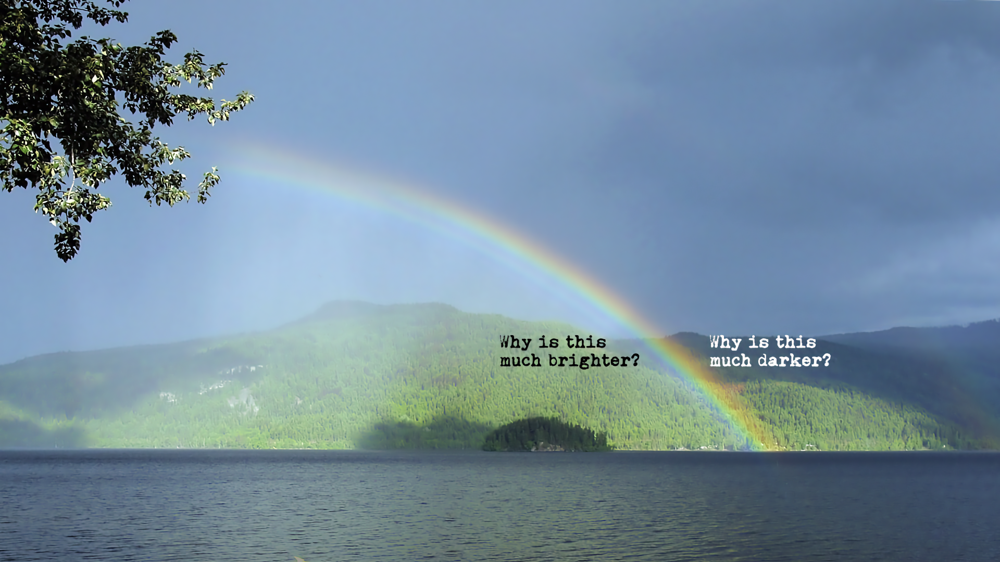
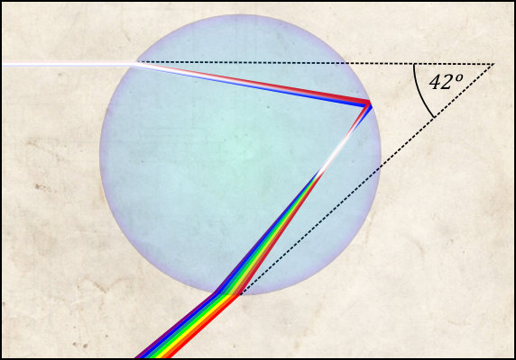

::: {.column-screen}

:::



::: {.lead-in}
If you haven't yet seen it, next time you see a rainbow, you will look for it: an intense difference between the inside and the outside of the primary rainbow. Also, next time you see a rainbow, you will know *why* this is. Not always as visible but certainly present if there are enough water drops to go around and the intensity of light is sufficient, there will be a secondary rainbow. The darker space between the primary and secondary is called **Alexander's (dark) band**.[^1]
:::

Just in case you didn't know, there are three requirements for a rainbow. The Sun should be shining behind you. There should be raindrops in front of you, be it thousands of metres up and away from you or even just a few metres (e.g., a lawn sprinkler). And there should be no clouds or anything else in the way between the Sun, the raindrops, and your eyes.

# Refraction and dispersion

As you may know, light bundles are refracted by any transparent material they encounter. Twice, actually, at the two surfaces they pass through. This is due to the fact that light, being an electromagnetic disturbance, changes the electric properties of the material, which in turn changes the electromagnetic field inside the material, which in turn changes the direction of the light. In a [previous article](https://opencurve.info/why-exactly-do-glass-and-liquids-refract-light/), we delved deeper into the quantum physics of the matter.

It just so happens that red light gets refracted at a smaller angle than violet light, i.e. red light gets 'bent' less. Furthermore, the angle between the incident light ray and red light exiting the water drop is always *maximally* about 42°, while in the case of violet light this is *maximally* about 40°. In other words, you won't see violet light exiting the raindrop at 42° – it's all red in that region. Everything in between is yellow, green, and blue – the rest of the rainbow colours. This is depicted in Figure 3. This is the reason why the 'white' light from the Sun – which is rather a blend of all the colours of the rainbow and not at all white – gets dispersed in a specific order of different colours.

Now, suppose millions of tiny raindrops linger in the air in front of you. Depending on a raindrop's height relative to you, you are only able to see its outgoing light (having been refracted and reflected inside of it) at a specific angle. Some are at a height just right for you to spot only their red light refractions, while others are at a height offering you a view on their violet light refractions.

In Figure 4, you can see the relation between the (order of the) colours you can see, the different angles at which different colours exit a raindrop as well as the height of the raindrop. When the raindrop is low enough, all colours are mixed again. Red, yellow, green, violet – they can all exit the raindrop at an angle smaller than 40°. This is the reason why 'white' light is being brought about 'inside' the primary rainbow.

The raindrops don't reflect light just once, as shown in Figure 3. Sometimes light gets reflected twice inside, as shown in the first two drops in Figure 5. This is how the inverted order of the colours of the secondary rainbow arises. Sometimes light exits the drop but never reaches your eye because they are too high. Some light is 'lost' in a sense. This is why the band between the primary and secondary rainbow is extra dark compared to the rest of the sky.

---

*Figure 1, photograph of Alexander's band by [Gnangarra](https://commons.wikimedia.org/wiki/File:Alexanders_band_gnangarra.jpg) under [CC BY-SA 3.0 AU](https://creativecommons.org/licenses/by/3.0/au/).*

*Figure 5, primary and secondary rainbow illustration by [CMG Lee](https://commons.wikimedia.org/wiki/User:Cmglee) under [CC BY-SA 4.0](https://creativecommons.org/licenses/by-sa/4.0/deed.en), adapted by [@kjrunia](https://twitter.com/kjrunia).*

[^1]: The Greek philosopher Alexander of Aphrodisias was the first to mention this phenomenon in one of his commentaries on Aristotle's work on meteorology.