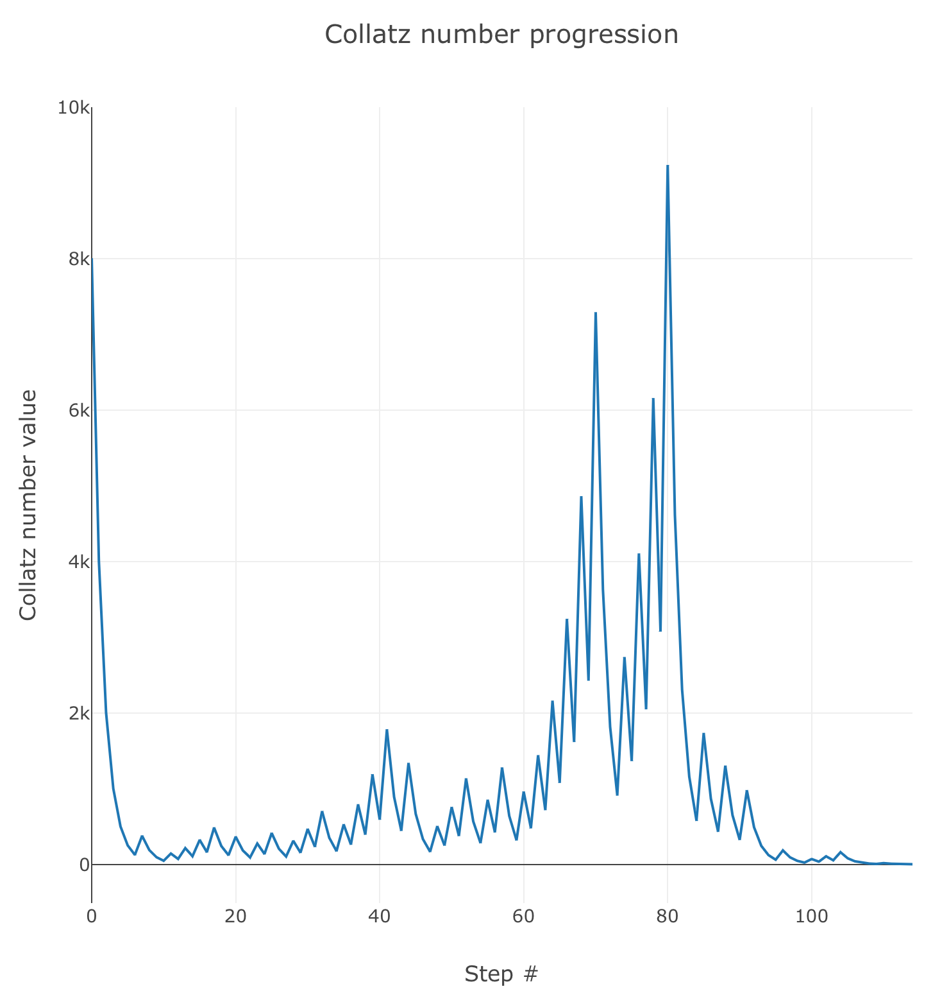
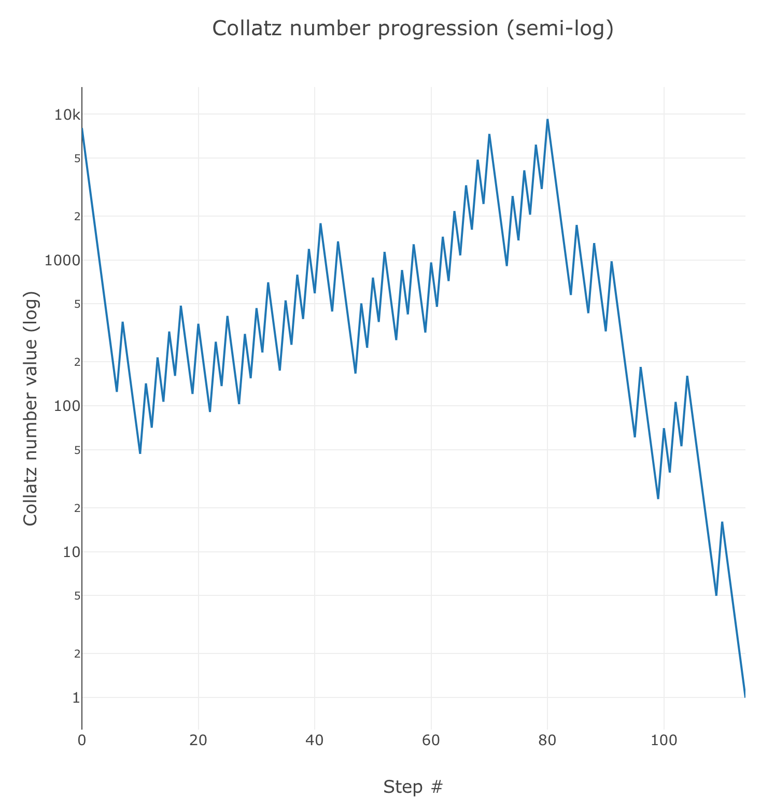
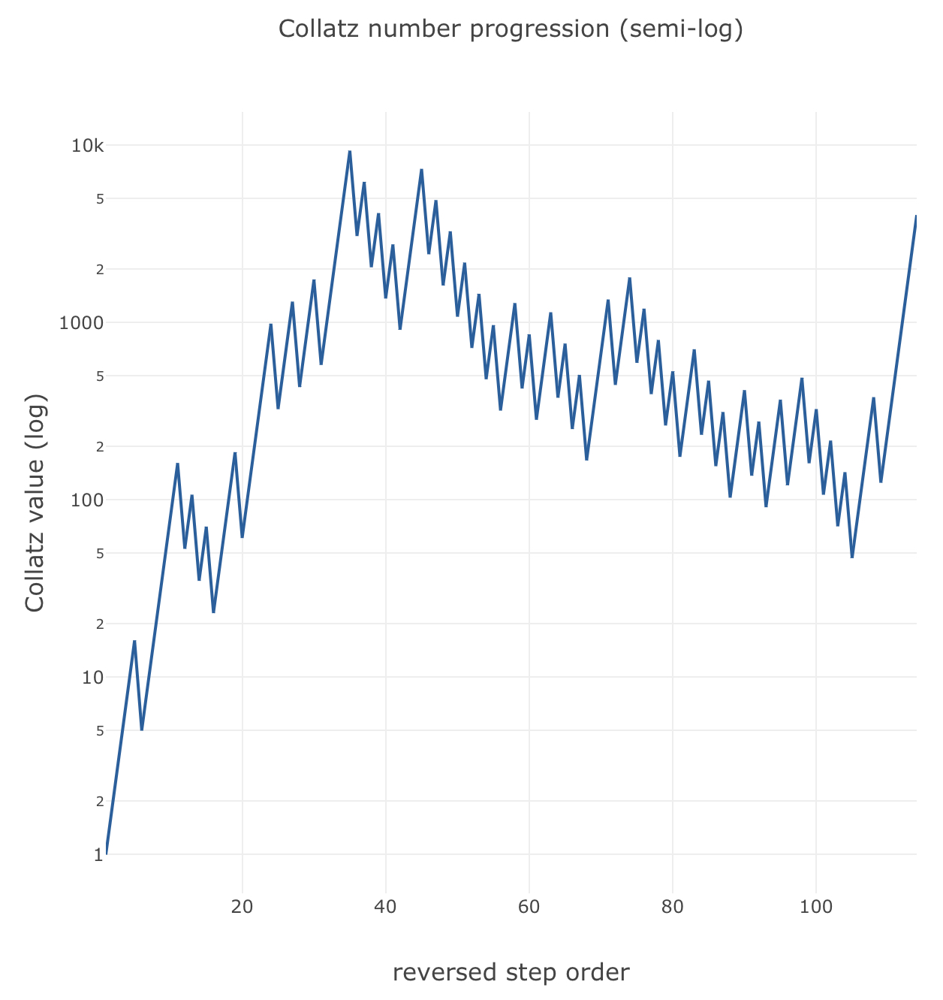
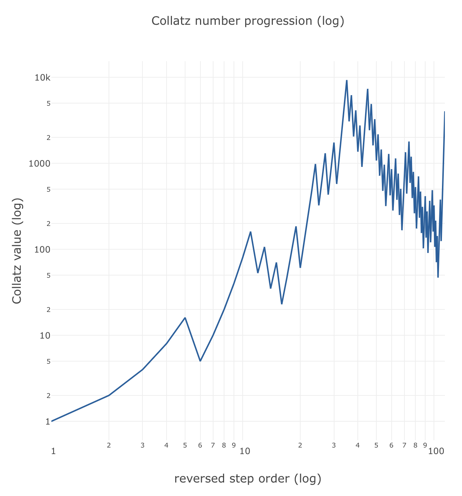

::: {.column-screen}

:::



::: {.lead-in}
This Conjecture is probably one of the easiest to understand which hasn't yet been proven in the history of mathematics. The beauty of this one is that a student in the last forms of primary school might very well be able to do the calculations while, thus far, not even the greatest mathematical minds have been able to prove if and why the Collatz Conjecture is true or not. The great, late Hungarian mathematician Paul Erdős has been quoted as saying: 'Mathematics may not be ready for such problems.'[^1]
:::

# The rules

There is some controversy over whether the prolific German mathematician Lothar Collatz was actually the first to come up with the idea in 1937, two years after receiving his doctorate. It is also known as the '$3n + 1$ problem', the Ulam conjecture, Kakutani's Problem, the Thwaites Conjecture, Hasse's Algorithm, or the Syracuse Problem. If you were under the impression most of these refer to other, actual people, then you are correct.

As the rules of the Conjecture are so simple, it is likely many people have had the same idea independently of one another.

Here are the rules:

1. Take any positive, whole number – a positive integer, as it's called.
2. Do either of the following:
   * if the number is even, divide by 2;
   * if the number is odd, multiply by 3, add 1.
3. Take the result and do either of the following:
   * if the result is 1, stop;
   * if the result is not 1, go back and do step 2 again, but this time using the result to do either of the two operations, and so on.

::: {.callout-note appearance="minimal"}
The Collatz Conjecture goes as follows: no matter which positive integer you start from, irrespective of the number of steps, you will always get 1 as final outcome.
:::

*(Note that if you would continue to do the steps with 1, you would simply cycle back to 1 in just three steps until the end of time. That's just boring and silly, so stop at 1.)*

# Example

Let's try it out. Let's start with 10:

* 10 is even; divided by 2 equals 5.
* 5 is odd; multiplied by 3 plus 1 equals 16.
* 16 is even; divided by 2 equals 8.
* 8 is even; divided by 2 equals 4.
* 4 is even; divided by 2 equals 2.
* 2 is even; divided by 2 equals 1. We're there!

This took us 6 steps. You can try a few numbers yourself if you'd like. Well, that is, have your computer, mobile phone, or tablet do the boring work, which you can do via [our online calculator](https://tools.opencurve.info/collatzconjecture/).

# Visualisation

As you probably saw via the link above, we can also visualise the steps produced by the Collatz algorithm. We will quickly show a few alternatives before moving on to the most famous one, the [Edmund Harriss visualisation](#the-edmund-harriss-visualisation) (for which we wrote a JavaScript applet, yay!).

Suppose we plot the progression of the results of our example. We started with 10. As you can see, the values fluctuate a bit before descending to 1:

Have a look at the next one. We started at 8000. The numerical progression is:

$$8000 \to 4000 \to 2000 \to 1000 \to 500$$
$$\to 250 \to 125 \to 376 \to 188 \to 94$$
$$\to 47 \to 142 \to 71 \to 214 \to \dots$$
$$\to 4 \to 2 \to 1$$

That's a whole lot of numbers before the algorithm leads to 1. A hundred and fourteen steps, to be precise. This is what it looks like:

::: {style="width: 80%; margin: 1.5rem auto;"}

:::

As you can see, the whole plot fluctuates quite a bit. It's a bit of a mess, really. There's no distinct pattern other than it eventually converging to 1. As the values may become quite large very quickly, let's plot the same graph in a semi-log grid. The $y$-axis is logarithmic, the $x$-axis remains linear.

Just to humour ourselves, let's reverse the step order, so that the plot is mirrored and converges to the value 1 in the bottom-left corner:

As we're not sure how many steps it might take before a sequence of numbers ends with 1, let's also change the $x$-axis to a log scale. We get this:

With this one, we can probably visualise a whole bunch of sequences! Lastly, let's now plot a *series of sequences*! 

Firstly, we let our JavaScript applet calculate the sequence starting at 10000. Then we let it calculate the sequence starting at 9999. And so on, downwards, until it reaches 4. And then have it all plotted, all at once! To prevent it from becoming too dense, as several sequences will overlap each other, we add a little transparency to each plot. If the same 'path' has been taken, that path will appear 'darker'. This is the result:

This almost becomes some form of art. If you would frame this plot, without the titles, axes, and scales – just the plot – you could have a piece of geometrical art bearing the title 'The Collatz Conjecture' or something like that. 

With [this applet](https://tools.opencurve.info/collatzconjecture/collatzcollection.html), you can generate your own 'art' like the one above.

# The Edmund Harriss visualisation

[Edmund Harriss](https://maxwelldemon.com/), a mathematician working at the University of Arkansas, came up with a beautiful visualisation of progressions of Collatz sequences, which was [featured](https://youtu.be/LqKpkdRRLZw) on the mathematical YouTube channel Numberphile.

The rules of visualisation are simple. While iterating through the Collatz rules, the algorithm goes as follows: if the current step is twice the value of the next step, rotate a fixed amount clockwise, otherwise rotate half of that fixed amount anticlockwise (and, again, stop at value 1). 

The result is a bundle of threads which looks like some sort of organic entity – messy and seemingly randomised within certain constraints, just like nature.

We wrote a JavaScript applet to produce an approximation of his visualisation, which was used to generate the header image. You can try it [here](https://tools.opencurve.info/collatzconjecture/collatz-harriss.html) yourself.

Having visualised in several ways the kind of disorderly fashion in which the Collatz sequences progress, it may not seem surprising it has proven to be hard to crack the code. Well, the underlying mathematical code, that is, not the JavaScript code.

---

[^1]: Guy, Richard K. (2004). "E17: Permutation Sequences". *Unsolved problems in number theory* (3rd ed.). Springer-Verlag. pp. 336–7. ISBN 0-387-20860-7. Zbl [1058.11001](https://zbmath.org/?format=complete&q=an:1058.11001).