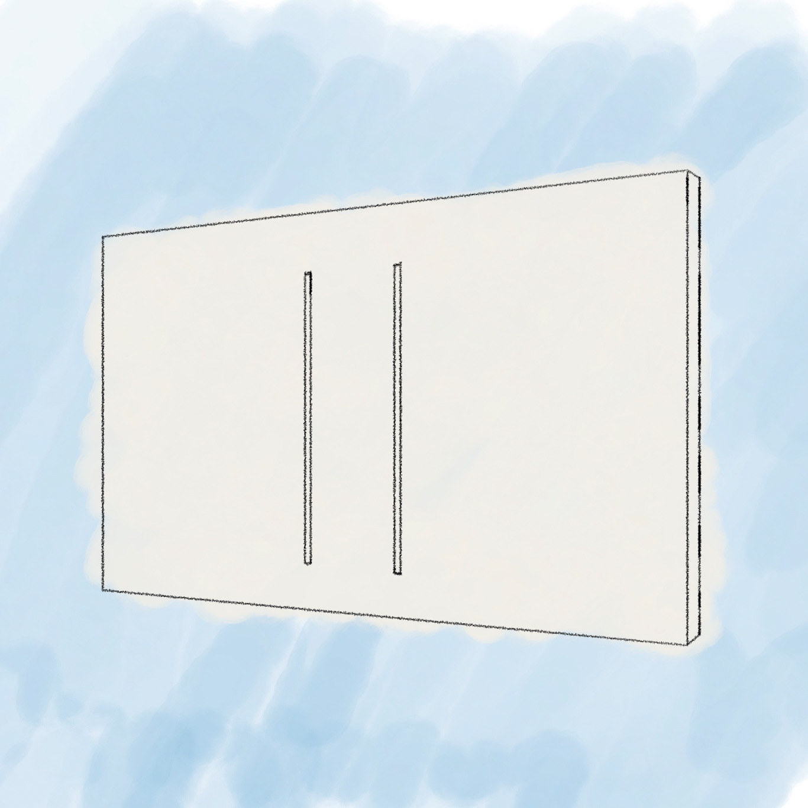
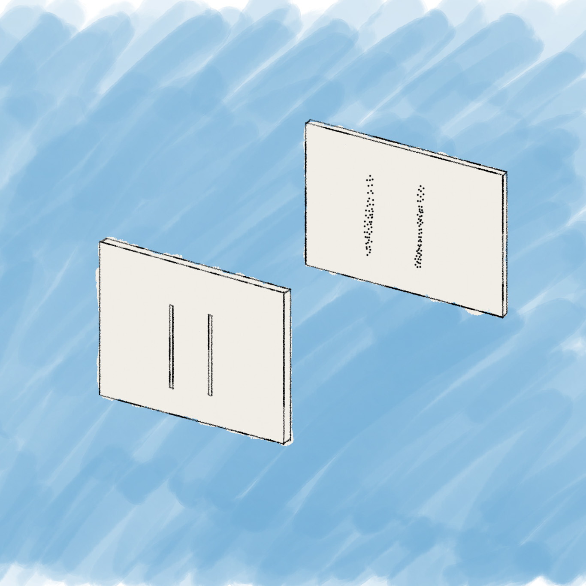
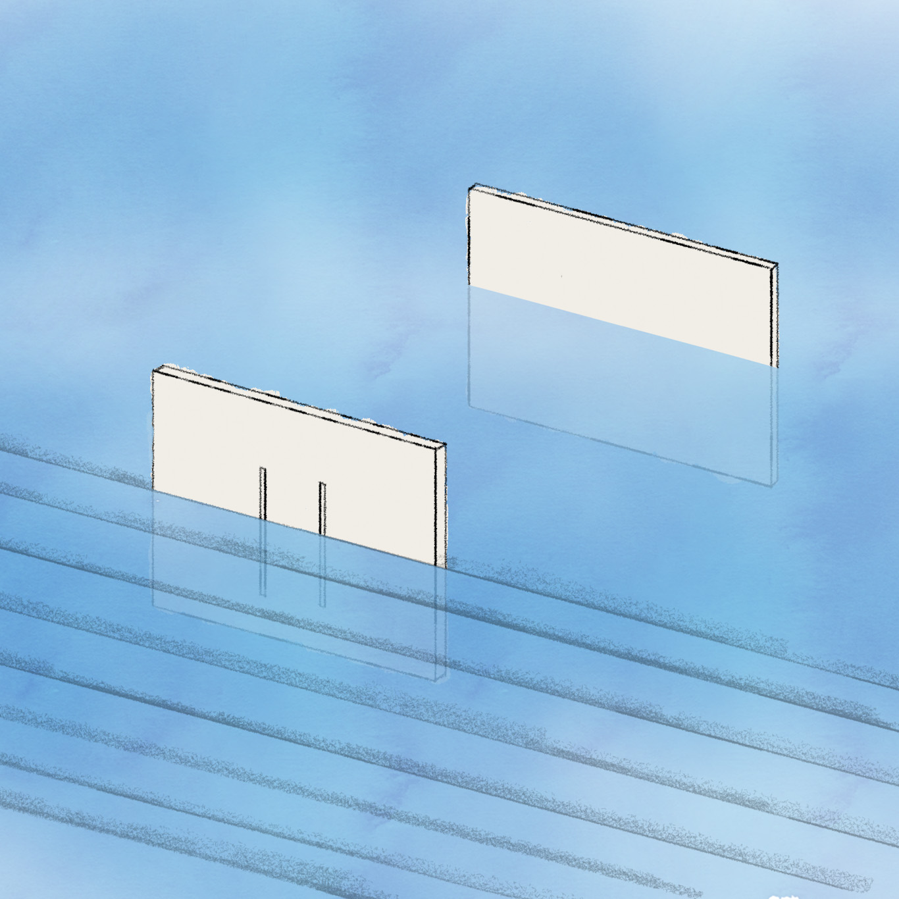
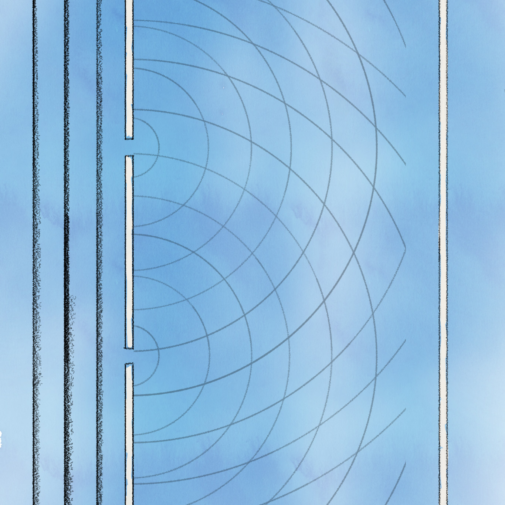
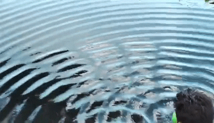
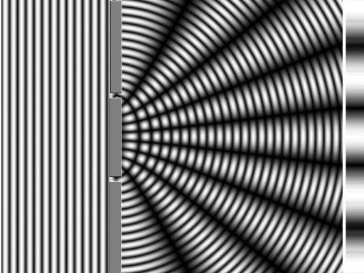
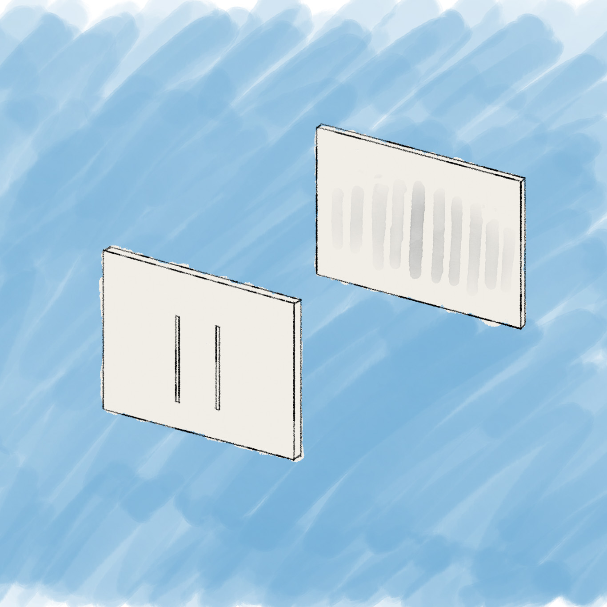
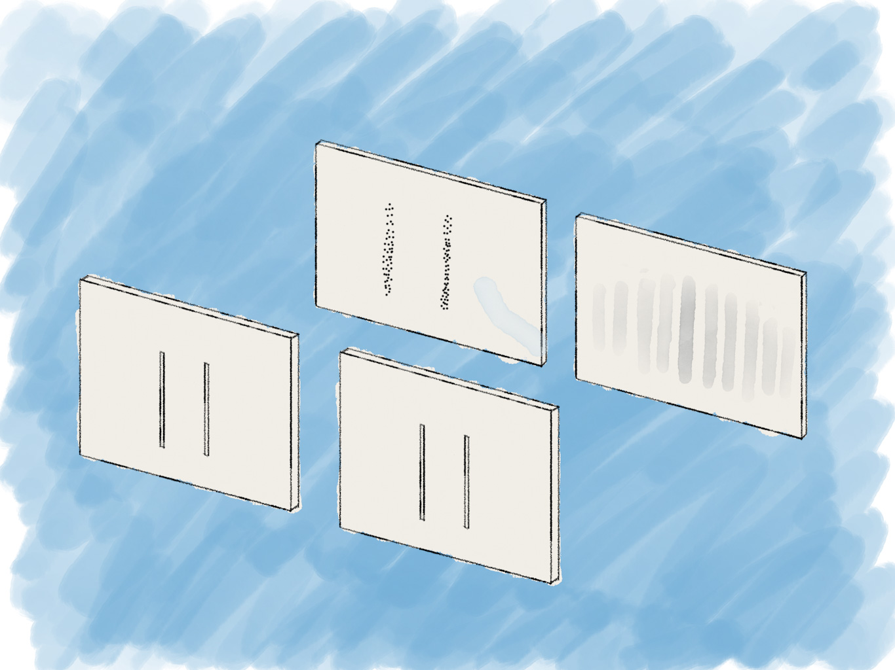
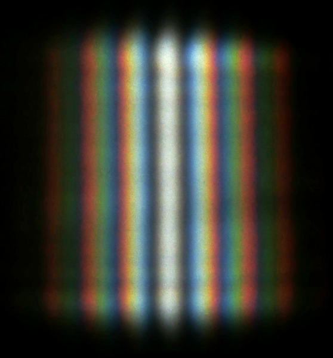
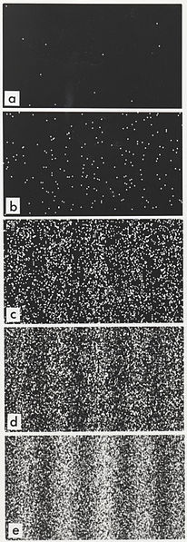

::: {.column-screen}

:::



::: {.lead-in}
Over three hundred years ago, grumpy old men with 17th-century wigs or 18th-century black-ribboned man ponytails were divided into two camps. They were squabbling over what type of phenomenon light is. "Light is waves", said [Huygens](https://en.wikipedia.org/wiki/Christiaan_Huygens), [Hooke](https://en.wikipedia.org/wiki/Robert_Hooke), [Euler](https://en.wikipedia.org/wiki/Leonhard_Euler) and friends. "No no, light is particles", said [Newton](https://en.wikipedia.org/wiki/Isaac_Newton), [Laplace](https://en.wikipedia.org/wiki/Pierre-Simon_Laplace) and colleagues. Fast forward to 1990 and even my physics teacher in high school confesses he still wasn't sure about the correct answer.
:::

His confusion is understandable. Even though he could have known the correct way of thinking about it, the reason for these murky waters can be traced back to the now famous set of double-slit experiments.

So, join me in tumbling through the slits of science, into the mad world of quantum physics, where one thing was proven to be in two places at once. Or was it?

::: {.callout-note icon=false appearance="simple"}
**Listen to this article** *(audio edition; note that visual figures are referenced)*

<audio controls style="width: 100%; margin-top: 0.5rem;" src="The-double-slit-experiment.m4a"></audio>
:::

# The set-up

Suppose you had a shotgun capable of spraying a cloud of numerous tiny lead pellets in one shot. If you'd aim it at a screen containing two thin slits, so only some might get through, what shooting pattern should you expect to appear on a screen behind it?

::: {style="width: 80%; margin: 1.5rem auto;"}

:::

I'm quite confident your answer will correlate strongly with the situation as depicted in Figure 2.

::: {style="width: 80%; margin: 1.5rem auto;"}

:::

This is exactly what you would expect if the things you're using to shoot with are tiny pellets or tiny *particles*. No surprise here.

Now imagine, we'd slowly submerge the screen with the two slits half-way into a pond. Water waves are slowly rolling towards the first screen as depicted in Figure 3.

::: {style="width: 80%; margin: 1.5rem auto;"}

:::

What would these waves look like after they've gone through the slits? When seen from above, it would look like Figure 4.

::: {style="width: 80%; margin: 1.5rem auto;"}

:::

The two slits transform the waves into two circularly spreading waves. Like two stones thrown into a pond. You can see how the waves will intersect with each other. You might expect some interaction to occur at these crossroads and you would be right.

In fact, let's have a look at a real pond. In the animation of Figure 5, you can clearly see how these two circular waves interfere with each other. If two crests meet, they amplify each other's amplitude, whereas two troughs meeting amplify each other's trough-ness (also amplitude but in the other direction). And where a crest meets a trough, they cancel each other out!

::: {style="width: 80%; margin: 1.5rem auto;"}

:::

Now have a look at the animation of Figure 6 and observe especially what the second screen receives: patches where the waves hit the screen are white and patches where there are no waves at all are black.

::: {style="width: 80%; margin: 1.5rem auto;"}

:::

So, now we know what happens if waves would be thrown at the two slits. Contrary to what you see when you would shoot pellets towards the screen, you would see what's depicted in Figure 7.

::: {style="width: 80%; margin: 1.5rem auto;"}

:::

So, now we have two options. If whatever we're shooting at the slits is particles, we get what's on the left in Figure 8. If we're aiming waves at the slits, we get what is on the right in Figure 8.

::: {style="width: 85%; margin: 1.5rem auto;"}

:::

# Young's interference experiment

Thomas Young was a polymath and physician. In the 1790s, he wrote a thesis on the physical and mathematical properties of sound. In 1800, he presented to the Royal Society, the UK's national academy of sciences, his theory that light is a wave too. He was met with great skepticism as the likes of Newton and Laplace were proponents of the light-is-particles theory.

Young then showed how they were wrong. A notable fact is that he didn't actually use two slits. He had a bundle of sunlight pass through a pinhole so as to obtain a very tiny bundle of sunlight. He then placed a "slip of card" in front of the pinhole, essentially splitting the small bundle in two even smaller bundles which then interfere with each other. The resulting light pattern would have looked like the one shown in Figure 9.

::: {style="width: 80%; margin: 1.5rem auto;"}

:::

If light were particles, you would have seen an entirely different pattern. This result, however, completely corresponds to the wave theory of light. Young concluded therefore that light is indeed a wave phenomenon. He called this the most important of his achievements.

This marked the beginning of the acceptance of the wave theory of light (yay for Huygens and friends) and a departure from the particle theory of light (nay for Newton and fr... well, colleagues, at least).

# Or particles after all?

Max Planck, Albert Einstein, and a few other colleagues would later show that light is particles after all. [In a previous post](https://opencurve.info/the-formula-that-got-albert-einstein-the-nobel-prize-and-should-stop-us-getting-sunburn-all-the-time/), *The formula that got Albert Einstein the Nobel Prize and should stop us getting sunburn all the time*, we discussed Einstein's finding which won him the Nobel Prize.

In short, Max Planck and Albert Einstein showed that certain behaviour of light could only be explained if it consisted of small packets of energy, quanta as they were labelled.

::: {style="width: 40%; float: right; margin: 0 0 1rem 1.5rem;"}

:::

Apart from that, experimenters found another peculiarity. In the 1960s, electrons were generally expected to behave like particles – like pellets or ball bearings. So, instead of light, they fired one electron at a time towards a splitter and had a screen behind that capture the electron. What they initially saw was to be expected: a few (11) loose dots on the screen as shown in Figure 10. However, as the individual electrons kept being fired, one after the other, an astonishing pattern started to emerge – the kind you would expect to see in the case of interfering waves! Wait, what?

Are they waves after all? But they were individual electrons! How?

Needless to say, experimenters did the same thing with individual photons, the quanta of light Max Planck and Einstein were talking about. Extremely low-intensity light was produced up to the point where single photons were shot at the screen. The same result. They seem to behave like particles at first, but then this wave pattern emerges.

# Two places at once?

Theorists then theorised that the only explanation was that a single electron and a single photon somehow went through the two slits at the same time, enabling some kind of self-interference so that this wave pattern would emerge while also preserving a particle pattern at the same time.

To test this theory, people put particle detectors at the two slits in order to see if the single electron or the single photon indeed flew through both slits at the same time.

The result was again astonishing: the wave pattern disappeared and what they got was instead the pattern you'd expect to see if the particles were actual particles – the pattern was like the pattern in Figure 2. At the same time, they never detected the particle at both detectors. They were ever only detected by one detector – as if they were particles.

As soon as they removed the detectors, however, the wave pattern emerged again.

And even if they placed just one detector at one slit, the wave pattern disappeared again and the particle pattern showed up.

It was as if the electron and the photon knew when they were being watched and then decided to behave differently.

This is called the *measurement problem*. In the next post, we will discuss this at greater depth.

People now started talking about the *wave-particle duality* of elementary particles. Are particles truly particles or waves? They're both, people now said. Sometimes they're waves, sometimes they're particles.

# Fields

Of course, nowadays, the reigning theoretical paradigm is quantum field theory – mathematical field descriptions to capture the behaviour of "particles" such as the electron, the photon, and a whole zoo of elementary constituents of our reality. The most successful quantum field theory to date is called the Standard Model of particle physics. [In a previous post](https://opencurve.info/why-exactly-do-glass-and-liquids-refract-light/), *Why, exactly, do glass and liquids refract light?*, we dive a little bit into quantum field theory.

In short, the question of whether light is particles or waves has been answered: it's fields. The same goes for electrons. And all the other elementary "particles". It's all fields.

As long as no interaction with the outside world such as detectors takes place, a photon or electron are part of the wave functions of their respective electromagnetic and electron fields, governed by the Schrödinger equation. They are very much like waves. However, as soon as they interact with something, such as a detector, what is detected is a particle, merely a slice of a photon's or electron's entire wave function.

I promise we will unpack these two last paragraphs in a later post. We expounded on that a little bit already in [This is not an atom](https://opencurve.info/this-is-not-an-atom/).

# But, please, tell me now, are they in two places?

No, not even technically. Linguistically then? Also, no. That statement is likely the result of mixing up or lack of a better way of providing both metaphorical and physical descriptions of what is going on – it also reveals the still-present, outdated notion of what photons and electrons were supposed to be. If electrons were in two places at once, you still imagine them being small, little pellets, two copies of which fly through both slits, somehow interfering with each other. And that's just not so.

The correct expression is that electrons and photons and the likes *don't have a definite location*: their existence is simply spread out in space according to the wave function, the time-evolution of which in turn obeys the Schrödinger equation. Again, do give [This is not an atom](https://opencurve.info/this-is-not-an-atom/) a read where this is explained in more detail.

Pretty mind-bending stuff, right? Good. Welcome to the club. Great minds before you have had to take their time to wrap their heads around the double-slit experiment. Now you're one of them.

---

### Image credits and references

* *Featured image by [Free-Photos](https://pixabay.com/photos/?utm_source=link-attribution&utm_medium=referral&utm_campaign=image&utm_content=984114) via Pixabay.*
* *Sunlight diffraction pattern by Aleksandr Berdnikov under [CC BY-SA 4.0](https://creativecommons.org/licenses/by-sa/4.0/deed.en).*
* *Single electron build-up series. Results of a double-slit experiment performed by Dr. Tonomura showing the build-up of an interference pattern of single electrons. Numbers of electrons are 11 (a), 200 (b), 6000 (c), 40000 (d), 140000 (e). By [Belsazar](https://commons.wikimedia.org/wiki/File:Double-slit_experiment_results_Tanamura_2.jpg) under [CC BY-SA 3.0](https://creativecommons.org/licenses/by-sa/3.0/deed.en).*