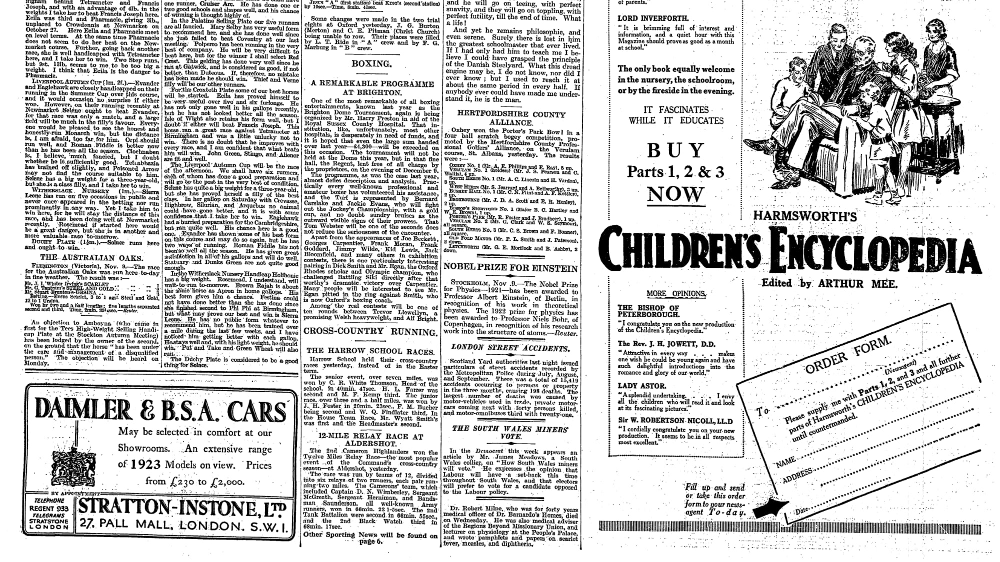

::: {.column-screen}

:::



::: {.lead-in}
In 1921, Albert Einstein [won](https://www.nobelprize.org/prizes/physics/1921/einstein/facts/) the Nobel Prize "for his services to Theoretical Physics, and especially for his discovery of the law of the photoelectric effect". Not a word about relativity. So, no, he did not win the Prize with $E=mc^2$. Though it is his most famous equation—which, by the way, is not the complete version—it is not his Nobel Prize-winning formula. We will write it down, but first, we describe what this photoelectric effect is.
:::

Different stuff is made up of different molecules. Different molecules are made up of different atoms. Different atoms are made up of a variety of nuclear composites and different numbers of electrons. So far, nothing new, perhaps, but here's the thing: if electrons are exposed to particular amounts of energy, they can be ejected away from the nucleus.

An atom of which one or more electrons have been blasted away is called an *ion*. The process is called *ionisation*. Whether this occurs depends on a few things, such as the type of stuff (the type of atoms and how they are bound together) and the specific energy it is exposed to.

If ionisation at the surface of a material is achieved by normal light, we call this the photoelectric effect: light (the 'photo'-part) causing electrons to leave their nucleus (the 'electric'-part).

# Not about intensity

One peculiar thing is worth mentioning. In fact, it was this puzzle that led Albert to his equation. It turned out that what matters is the *frequency* of the light beam, i.e. the colour of the light, *not* the *intensity* of it, i.e. the power per square metre, or Joule per second (watt) per square metre.

Imagine, in the diagram above, that a billion yellow photons would radiate towards the atom and nothing happened; the electron would stay where it was. Now imagine a billion billion billion billion yellow photons approaching the atom. Still nothing would happen as it is not about intensity.

Yellow light is less energetic than blue light, so if you would replace the light bulb for a source that delivers pure blue light, with even one blue photon, it could happen easily (though you would have to aim impossibly precisely, so it makes sense to actually radiate a lot). This puzzled many scientists, but Albert solved it and won the Nobel Prize.

With his discovery, quantum physics was starting to get momentum. He, and other good physicists of his time, showed that light could be seen as little packets of energy, which scientists started calling photons. A beam of light was now a stream of photons. The intensity, the amount of photons per second per square metre, doesn’t matter, but the frequency of a photon, or energy per photon, does.

# DNA

While this is all cool and useful for scientific purposes, we certainly do not want any electrons of the DNA molecules of our skin breaking away from their atomic confines. Atomic bonds would be destroyed and our DNA would become mutated. Even though astonishing molecular biological processes in our body repair defects like this in a staggering, basically inconceivable number of cases, some errors might slip through and may even become the start of tumour growth. Therefore, it is important to know what energy domains would cause our beloved bodily electrons to be blasted off so that humanity can learn to avoid those dangerous environments.

The problem arises when we get into the mid to high-energy electromagnetic radiation, or light, or photons, if you will. We're talking the dangerous kind of ultraviolet here, the type of UV causing DNA mutation to occur: UVB to be precise. A photon of UVB-light is about 1.8 times more energetic than a photon of the yellowish light in your home and almost a million times more energetic than a mobile phone photon. So, don't be scared of being home. As soon as you set foot outside, though, be afraid. Not of the dark, but of the light, for ionising UVB-light is emitted by the Sun.

Fortunately, as stated before, our bodies have evolved to repair the damage when necessary. This is why even X-rays are okay and hospitals and dentists make sure not to expose you to doses of energetic photons you wouldn't survive. Continuous monitoring of its uses and effects is prerequisite.

It's partly a question of the [law of large numbers](https://en.wikipedia.org/wiki/Law_of_large_numbers), though. If the number of freely whizzing electrons is large enough, they themselves will become the main cause of an increasing number of damaged DNA molecules, and, eventually, some repairs will fail or not even take place. So, while it is not instantly dangerous, we do recommend some [reading up](https://www.nhs.uk/live-well/healthy-body/sunscreen-and-sun-safety/) on the subject of sunbathing. Use UV protection. Don't get sunburnt. And give your body a chance to recover from the ruthless blasts of ionising UV radiation. Forget microwaves, the problem is crispy skin.

# The formula

So, now we finally get to Albert's Nobel Prize-winning formula. Here it is:

$$\frac{1}{2}m_ev^2_\text{max} = h\nu - \phi$$

It doesn't look as sassy as the other one, right? And yet, it's the one that allows us to calculate if, for instance, electrons of our body's carbon atoms get blasted out by the photons emitted by the lamp in your lavatory (they do not). Or if the laser pointer knocks some electrons out (it doesn't), which we use anyway, because we need to point at things on our PowerPoint slides as they might well be ill-designed (they are).

So, $\frac{1}{2}m_ev^2_\text{max}$ means maximum kinetic energy, which is simply the energy with which an electron flies away from its nucleus. If its value turns out to be smaller than or equal to zero, then the electron is not affected at all. It'll keep stuck to its nucleus. If it is larger than zero, then off it goes. 

The symbol $h$ is a constant, which we needn't worry too much about. It's a number and it's called the Planck constant. The Greek letter $\nu$ is the frequency of the photon. In the diagram above, a few have been mentioned. Mind you, $h\nu$ means $h \times \nu$ and is the energy of a photon. Mathematicians, physicists, engineers, and other folks just like to leave out the $\times$-sign. The Greek letter $\phi$ is the so-called work function. It is the minimal energy needed for the occurrence of a photoelectric effect. Its value depends on the type of atom, molecule, material, and surface you want to calculate the photoelectric effect of.

# In conclusion

::: {.callout-note appearance="minimal"}
Notice Einstein's formula does not have any term relating to the *number* of photons radiated per second per square metre towards the atom of interest, i.e. the *intensity*. Only the *frequency* is important. This means that atoms—such as your body—will be left undisturbed irrespective of the power of the radiation they are exposed to. There may be a bit of heat, but there is no ionisation. The potential danger lies in frequency ($\nu$), such as that of UV light and higher. Here, both dosage and capability of recovery play a crucial role.
:::

::: {style="width: 35%; float: right; margin: 0 0 1rem 1.5rem;"}

:::

The value of the Planck constant is $h = 6.626070 \times 10^{-34}\text{ J}\cdot\text{s}$ (Joule-second). The value of the work function of carbon, of which our entire body is made, including our DNA, is $\phi = 8.0108831 \times 10^{-19}\text{ J}$. If a WiFi photon has a frequency of 2.5 GHz, you can calculate yourself if it would yank the electrons from a carbon atom. Remember to convert 2.5 GHz to $2.5 \times 10^9\text{ s}^{-1}$ (per second). 

Thanks to Albert, calculating this has become child's play. We could do the maths on the back of an envelope. If all the terms on the right-hand side of the equal sign turn out to be larger than zero, then sell your router immediately and—based on the spectrum diagram—you most definitely ought to refrain from switching on the light while frequenting the lavatory. Good luck with the calculation! (Or check the [working out](https://opencurve.info/en-back-of-the-envelope-photo-electric-effect/).)

---

*Featured image: a 14-year-old Albert Einstein, photographed in 1893. Credits: Emilio Segrè Visual Archives / American Institute of Physics / Science Photo Library / Universal Images Group.*

*Smaller image of an even younger Albert Einstein: Credits Emilio Segrè Visual Archives / American Institute of Physics / Science Photo Library / Universal Images Group.*

*Newspaper article: "Nobel Prize for Einstein." Times, 10 Nov. 1922, p. 5. The Times Digital Archive.*