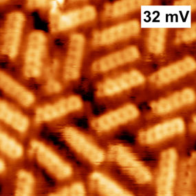
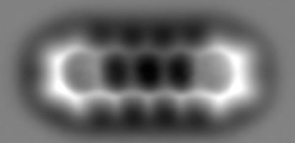
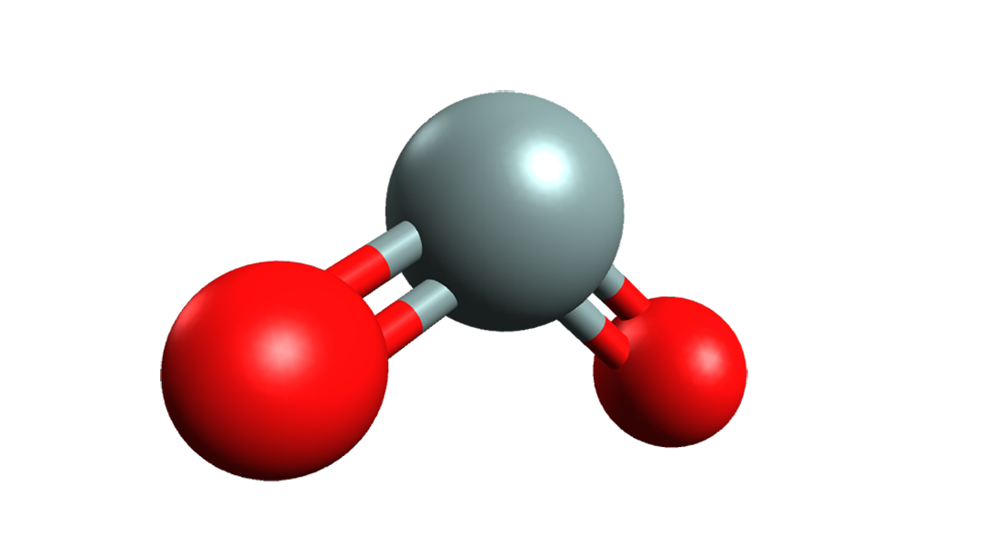
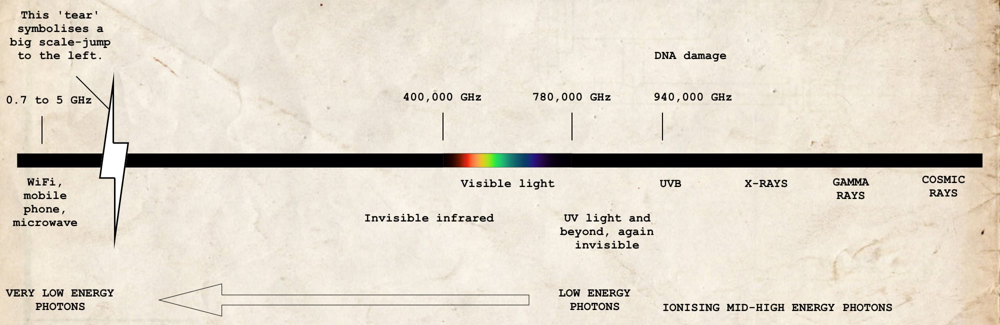

::: {.column-screen}
{width="100%"}
:::



::: {.lead-in}
Imagine transparent materials didn't exist. What would cars look like? How would you be able to look at the cold Winter Moon from your bedroom window without getting cold yourself? Would air be opaque too? What about the lenses in our eyes? And if all materials consist of molecules, how is it that the molecules of glass are transparent while others aren't? This last question was asked by the oldest[^1] son of one of my best friends last week.
:::

Firstly, I'll try to give an answer as short as possible. If you'd like to know more, you can read on. Be warned, however: the article is quite possibly a bit long. It's just that the answer to this seemingly easy question asks for quite some background knowledge. On the other hand, with a brilliant question like this one—let's just say, you're asking for it.

::: {.callout-note icon=true appearance="default" title="Short Answer"}
Sometimes the composition of a molecule is such that its electrons will hardly respond to passing photons. For all intents and purposes, they will leave them be. At most, they will change their course a little. To our eyes, the material is then transparent.

If electrons do react to incoming photons, they might reflect them or absorb all of their energy, making the photons disappear. Sometimes they just vibrate a little bit and make the entire atoms vibrate a little bit too ([phonon](https://en.wikipedia.org/wiki/Phonon)), but nothing much else happens. The material just increases temperature for a minuscule amount. Sometimes the electrons vibrate so much that they'll radiate that energy very soon after, causing new photons to be created, which then move on to the rest of the universe. To us, that material is then opaque; the photons radiated from the material end up in our eyes.

So, this was the short version. If you'd like to know more, do read on!
:::

# Molecules, atoms, elementary particles

Perhaps you know this but just to be sure: all solids, liquids, and gasses consist of molecules. Here you see a photo of a bunch of so-called pentacene[^2] molecules made by Canadian scientists[1]. These molecules aren't present in glass, however, it does give an impression of what molecules can look like.

{fig-align="center"}

Every caterpillar-like thingy is a molecule. When they stick close enough together, they form a solid. If they are capable of sliding past each other, it's a liquid. And if they're capable of jiggling a lot more away from each other, it's a gas.

It's possible to look more closely. Those molecules consist of atoms. Do have a look at this cool photo of one such molecule which Swiss physicists and one physicist at Utrecht University were able to snap in 2009[^3].

{fig-align="center"}

You might be able to distinguish five hexagonal shapes with protrusions. At every corner and every protrusion, an atom is present. You don't see the individual atoms – they're too small for that. However, you can see the structure formed by the chain of atoms, thereby shaping the molecule into existence.

Back to glass. The window in your bedroom is composed of different types of molecules. There are a lot of [silicon dioxide molecules](https://en.wikipedia.org/wiki/Silicon_dioxide), [sodium carbonate](https://en.wikipedia.org/wiki/Sodium_carbonate) molecules, [calcium oxide](https://en.wikipedia.org/wiki/Calcium_oxide) molecules, [magnesium oxide](https://en.wikipedia.org/wiki/Magnesium_oxide) molecules, and some [aluminium oxide](https://en.wikipedia.org/wiki/Aluminium_oxide) molecules. Here you see a drawing of one such silicon dioxide molecule.

::: {style="width: 70%; margin: 0 auto;"}

:::

Do they look like that for real? No, absolutely not. It's just a [conceptual model](https://en.wikipedia.org/wiki/Conceptual_model). In science, a model is meant to be a tool and never an exact copy of reality. And yet, we use models as they are quite helpful for imagining what we're working with and for doing calculations on them. You have to keep in mind, though, it's not what it really looks like.

From (the model of) the silicon dioxide molecule you can see that it is comprised of three atoms: one silicon atom (grey) and two oxygen atoms[^4] (red). You may also wonder what these two little bars on each side are supposed to be. They symbolise the electrons which are shared by all the atoms amongst each other. Atoms can stick together when they share electrons with each other. In other words, it refers to how strong the atomic bond is. More bars equals a stronger bond.

Every atom consists of yet smaller parts. Apart from one[^5], atoms are made up of three types of particles: electrons, protons, and neutrons. At the core of the atom are all the protons and neutrons. The electrons kind of swirl around them in a cloud-like type of existence. As electrons don't themselves consist of smaller things, they are said to be elementary[^6] particles. Here you see a model of an atom.

::: {style="width: 70%; margin: 0 auto;"}

:::

The core (or 'nucleus') with all the protons and neutrons is so small that it's usually drawn as a point or a little ball. However, if you were to zoom in, you'd see a lump of protons and neutrons. Around it there is the cloud-like electron or multiple electrons. (If you'd like to know exactly why a cloud is the model for one or more electrons, you can read [This is not an atom]().)

It's quite possible that an electron is further removed from the nucleus than shown here. If an electron receives energy, it'll jump further away from the nucleus. After a very short period, the electron might jump back to its old position. If it does so, its energy leaves the atom again in the form of light. One of the ways in which the electron receives energy is light.

# Light

What is light? Is it a wave, does it consist of particles? For a long time, physicists had no idea what light was exactly. Since the seventeenth century, great debates went on between physicists supporting [Sir Isaac Newton](https://en.wikipedia.org/wiki/Isaac_Newton) and physicists supporting [Christiaan Huygens](https://en.wikipedia.org/wiki/Christiaan_Huygens). I fear a little that some science teachers at high schools still think it's a big mystery. One of my science teachers in high school told us he was still on the fence whether it's particles or waves. Unfortunately for him, since slightly less than a hundred years ago, we know.

::: {style="width: 70%; margin: 0 auto;"}

:::

What I'm about to tell you is not something you'll likely learn in high school. I'm not sure why but it may have to do with textbook authors finding the mathematics too complicated. So, what you're about to read is more or less what you'll learn at university as a physics student, only without the mathematics.

The problem with the question 'wave or particle' is that it suggests there's only one choice. This is incorrect. The question should be: What is light? The answer is: a field[^7], one of the many Universe-pervading fields present, in this case the *electromagnetic field*. And to be even more precise: light is a *disturbance* of this electromagnetic field. One can describe this disturbance as either a wave or a particle, depending on what is more practical for the matter at hand.

Besides, in modern physics the meaning of the word 'particle' differs from what you'd normally expect. In physics a particle is actually a packet, a wave packet. It's not a pellet, it's not a tiny ball or even a point. It's a tiny packet of information which we mathematically describe as a tiny wave (a disturbance).

::: {style="width: 70%; margin: 0 auto;"}
 was an important, Nobel Prize-winning physicist who made enormous contributions to quantum electrodynamics.](richardfeynman-2.jpg)
:::

According to one of the best theories we have of our Universe to date, so-called quantum electrodynamics[^8] (QED), the Universe is pervaded by a mostly invisible – yet sometimes visible! – electromagnetic field. In most cases, that field does nothing at all. You can't smell it, you can't touch it, you can't see it.

However, when the electromagnetic field is being disturbed at a specific place in the Universe – e.g. on the inside of the LED lamp in your lavatory – then that disturbance will propagate in all directions, from that specific spot in the Universe towards the very rest of the Universe – i.e. the space of your lavatory. This disturbance you can see! I'm not sure how your pets might call this disturbance, however, humans call it light.

::: {style="width: 70%; margin: 0 auto;"}

:::

If your eyes were able to zoom in immensely, you would see that light actually consists of billions and billions and billions of tiny disturbances. Light is a bundle of tiny disturbances in the omnipresent electromagnetic field. Those tiny disturbances used to be called 'light quanta' by [Albert Einstein](https://en.wikipedia.org/wiki/Albert_Einstein) and others. However, since 1928, we call them photons[^9]. In popular books and magazines and even by physicists they are called 'particles'. Again, they're not pellets or tiny balls or anything. The word 'particle' refers to them being very tiny but it doesn't say anything about what they look like. As *model*, tiny pellets or points are sometimes used, however, it's not what they are. Photons are, just like electrons, elementary, however.

In high school and at university, to do calculations on light, the wave model of light is used rather often. The great mathematician and physicist [James Clerk Maxwell](https://en.wikipedia.org/wiki/James_Clerk_Maxwell) was one of the founders of the mathematical framework of the wave model of light. He and others before him are responsible for us still talking about 'light waves' instead of photons. The classical electromagnetic theory of Maxwell works so well that it's compulsory for physics students to study this wonderful theory. So, it's not at all wrong to speak of *light* waves.

{fig-align="center"}

In the twentieth century, however, physicists found that quantum electrodynamics was able to predict and describe more phenomena than Maxwell's classical electromagnetic theory, so the first kind of replaced the latter. Put differently, Maxwell's theory is still highly useful in industrial applications, however, with QED, you can do what Maxwell's theory can do *plus a lot more*.

This is the way it usually goes in physics. The [law of universal gravitation](https://en.wikipedia.org/wiki/Newton%27s_law_of_universal_gravitation) of [Sir Isaac Newton](https://en.wikipedia.org/wiki/Isaac_Newton) works brilliantly. You can even apply it to Mars landings. However, the theory of gravity by [Albert Einstein](https://en.wikipedia.org/wiki/Albert_Einstein), so-called [general relativity](https://en.wikipedia.org/wiki/General_relativity), can do what Newton's theory does and a lot more, more precisely. So, general relativity has kind of replaced Newton's law of universal gravitation. And yet, the latter is compulsory in high school and at university. It's not wrong. It's very useful, even! However, it does have its limitations. That's why we first learn about Newton's gravity and only later do physics students have to learn about Einstein's gravity. Without Einstein's general relativity, Google Maps and GPS-systems inside cars would not have worked properly.

Hence, physics students learn everything about Maxwell's wave theory and only later do they learn about quantum electrodynamics. And without quantum electrodynamics you would not have had computer processors, there would have been no internet, no mobile phones, no touchscreens.

# Light and energy

The great physicist [Max Planck](https://en.wikipedia.org/wiki/Max_Planck) came up with the idea that every photon has a specific energy level. He also showed that with every energy level comes a particular light colour. Bright blue light carries more energy than deep-dark red light. Sometimes light (photons) has (have) so much energy that it has (they have) become invisible to our human eyes. High-energy ultraviolet[^10] light (UV light) is invisible to us. However, if your eyes were much more sensitive than they are now, you would see a very bright 'more violet than violet-coloured' light. Conversely, light can have very little energy. So little even, we won't be able to see it anymore. Hence, infrared[^11] light is invisible to us. However, if our eyes were slightly more sensitive, we would see 'less red than red-coloured' light.

::: {style="width: 70%; margin: 0 auto;"}

:::

WiFi and 4/5G are light too. The photons have very little energy compared to the photons in your lavatory. If our eyes had been thousands of times more sensitive than they are now, you would have seen that the antennas of the WiFi router and the mobile phones are basically lamps radiating 'less than less than less than (thousands of times 'less than') red-coloured' light.

The electromagnetic field pervading our Universe can thus be disturbed at various energy levels. Depending on that, light looks differently. It has varying colours or is invisible – which it is most of the time. Our eyes aren't the best instruments to look around with. Of all possible energy levels the electromagnetic field can be at, we can only discern just a few. That energy portion is what we call visible light.

Another word for disturbances of the electromagnetic field is *electromagnetic radiation*. Depending on the energy level of the radiation, we have different terms for it, such as 'radioactive radiation' or 'gamma radiation'. However, all these things – the lavatory light, the WiFi, 4/5G for the mobile phone, the head lights of the car, the radio waves from the neighbour, the Bluetooth speaker in the kitchen, the x-ray images at the dentist, the microwave – are all light, are all electromagnetic radiation, are all disturbances of the one and the same electromagnetic field. *The only difference is the energy level of that disturbance.*

The correct order going from very little to deadly amounts of energy is the following: radio, WiFi, microwave[^12], 4/5G >> infrared light (TV remote) >> visible light (lavatory light, club lights) >> UV light (take care, apply sunscreen) >> x-rays (only operated by professional medical workers) >> gamma radiation (deadly, except for [Bruce Banner](https://opencurve.info/wp-content/uploads/2019/10/professor-hulk-1.jpg)) >> cosmic radiation (deadly, except for [Captain Marvel](https://opencurve.info/wp-content/uploads/2019/10/captain-marvel-image-brie-larson-1.jpg).

::: {.callout-note appearance="minimal"}
As most electrons inside of walls of houses won't respond much to electromagnetic disturbances (photons) at the energy level of WiFi (very little energy), to WiFi photons, the walls are almost transparent. This is why you can receive WiFi straight through the walls. If your eyes were sensitive enough, you would be able to see the light coming from the router, straight through the walls. Those same electrons, however, *do* react to photons at the much higher energy level corresponding to visible light. This is why *those* photons *do not* fly through the wall. And this is why we find walls to be quite the opaque type objects. Nevertheless, the electrons *do not* respond again to photons at the even higher – much higher – energy levels of x-rays. This is exactly why walls *are* perfectly transparent to [Superman](https://en.wikipedia.org/wiki/Superman).

Depending on the composition of the molecules and atoms do electrons more or less react to the presence of photons at varying energy levels. If electrons of the material do not respond to photons at the energy level corresponding to visible light, then the material is transparent to us.
:::

Below you see a diagram of the full spectrum[^13] of electromagnetic radiation (click to enlarge). As you can see, only a small portion is visible to us.

GHz refers to the frequency of the photon and is a measure for the photon's energy level. The higher the frequency, the higher the energy level. Ultraviolet radiation is where it's starting to become dangerous to us. This is where our cells become damaged ('DNA damage'). As long as you're not exposed to the Sun for too long and x-ray photography is done in very short amounts of time, it's going to be fine. But be careful. Again, gamma radiation and cosmic radiation are deadly. I understand, it doesn't feel comfortable at all, but please, please do listen to your parents when you're going out for a space walk. Put on that spacesuit.

# Impressionable electrons

In the previous century, physicists such as Albert Einstein discovered that electrons can be influenced by incoming photons[^14]. It very much depends on the way the electrons are captured inside the molecules – which depends on the type of atoms – at which energy level photons they will start reacting.

In the case of glass, the electrons do feel electromagnetic disturbances slightly. This is why they do start to jiggle differently just a notch. That jiggling causes changes in the part of the electromagnetic field that is inside of the glass. And these changes will influence the photons (disturbances in that same electromagnetic field) in such a way that they'll change course slightly.

This is why the image behind glass can seem to be slightly warped. The same happens when light goes from air to water (as water, too, contains electrons which react to incoming photons). The electrons don't do too much so that photons can just pass through, however, they do enough so that the photons do change course slightly. Or a lot as you can see by the water in the photo above. In my article Why, exactly, do glass and liquids refract light? we take a deep dive into this phenomenon.

# Why is glass transparent?

::: {.callout-note appearance="minimal"}
And so, glass is transparent as the electrons in glass molecules aren't capable of reacting very much to incoming electromagnetic disturbances (photons). Just a little. So, they do bend the original trajectory of the photons slightly.
:::

There are materials containing electrons responding to all energy levels except those corresponding to blue light, for example. This means that blue light can just pass through while the rest is being absorbed. To us, this material seems to be a blue filter.

It's also possible to produce materials carrying electrons which react to all photons in the visible part of the spectrum. They do this so strongly that photons will be reflected completely. We call that a mirror.

Note that we're talking mostly about photons we can see. To us most glass is transparent. However, we can also produce glass which seems transparent as it lets visible light pass through, while they are much less transparent to birds at the same time.

We are incapable of seeing UV light. Birds can, however. So, if glass is produced in such a way that they will let visible light pass through but not UV light, they seem less transparent to birds, preventing them to bump into it.

So, the answer to the question, 'And if all materials consist of molecules, how is it that the molecules of glass are transparent while others aren't?', should rather be: 'Transparent to whom? To birds? Or to humans?'

[^1]: If I'm not mistaken, thirteen at the time I'm writing this.
[^2]: Dinca, L. E. *et al.* (2015) "Pentacene on Ni(111): Room-Temperature Molecular Packing and Temperature-Activated Conversion to Graphene," *Nanoscale*, 7(7), pp. 3263–3269. doi: [10.1039/C4NR07057G](https://doi.org/10.1039/C4NR07057G).
[^3]: Gross, L. *et al.* (2009) "The Chemical Structure of a Molecule Resolved by Atomic Force Microscopy,"" *Science*, 325(5944), pp. 1110–1114. doi: [10.1126/science.1176210](https://doi.org/10.1126/science.1176210).
[^4]: 'Oxygen' and 'oxide' stem from the ancient-Greek words for 'sharp' (ὀξύς, oxús), and 'birth' (γένος, génos), and the Latin word for 'acid', which is acidus. Lastly, the word 'di' stems from the ancient-Greek δίς (dís), meaning 'twice'. As the molecule consists of two oxygen atoms, the official chemical name of the molecule is thus silicon dioxide.
[^5]: the [hydrogen](https://en.wikipedia.org/wiki/Hydrogen) atom
[^6]: 'Elementary' stems from the Latin word elementum, carrying a meaning like 'first principle'. There is nothing that goes further down than what is elementary. Elements always form the basis for other things.
[^7]: In mathematics and physics, we call this a [gauge field](https://en.wikipedia.org/wiki/Gauge_theory). It's quite abstract mathematics. However, no matter how abstract, it has proven to be highly applicable in practice. Mobile phones would not have existed without these abstract mathematics.
[^8]: 'Quantum' is Latin for 'how much'. Physicists have been using the word as a synonym for 'particle'. Plural is quanta. 'Dynamics' stems from the ancient-Greek δυναμικός, dunamikós, 'powerful' en refers to the theory describing forces and change of forces.
[^9]: This stems from the ancient-Greek φῶς, phôs, which ironically means 'light'.
[^10]: 'Ultra' is Latin for 'beyond'. So, ultraviolet means beyond violet.
[^11]: 'Infra' is Latin for 'below'. So, infrared is 'below' or 'less than' red.
[^12]: If you want to know whether microwave radiation is deadly or not, do give my article [Is microwave oven radiation unhealthy?] a read.
[^13]: 'Spectrum' is Latin for 'appearance'. So, if you speak of the spectrum of something, such as electromagnetism, then you're referring to all of its appearances.
[^14]: This is what he received the Nobel Prize for. You can read more about that in my article [The formula that got Albert Einstein the Nobel Prize and should stop us getting sunburn all the time].