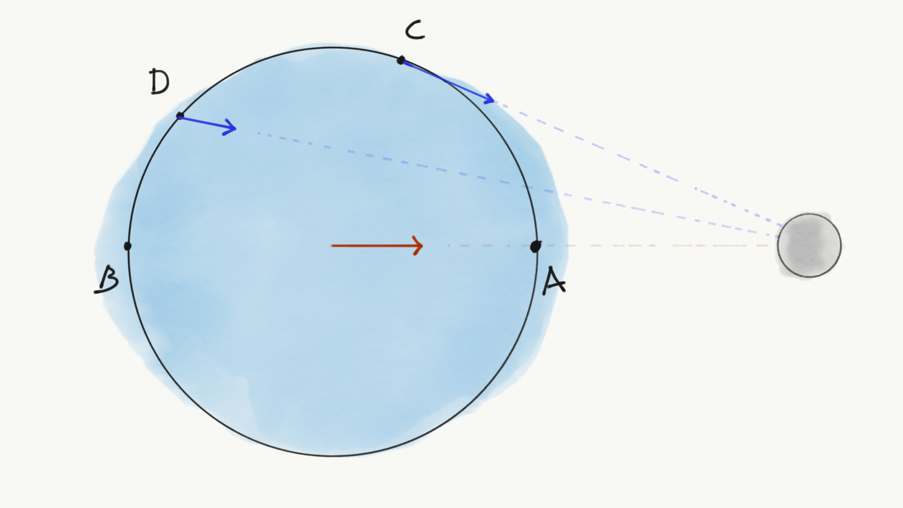
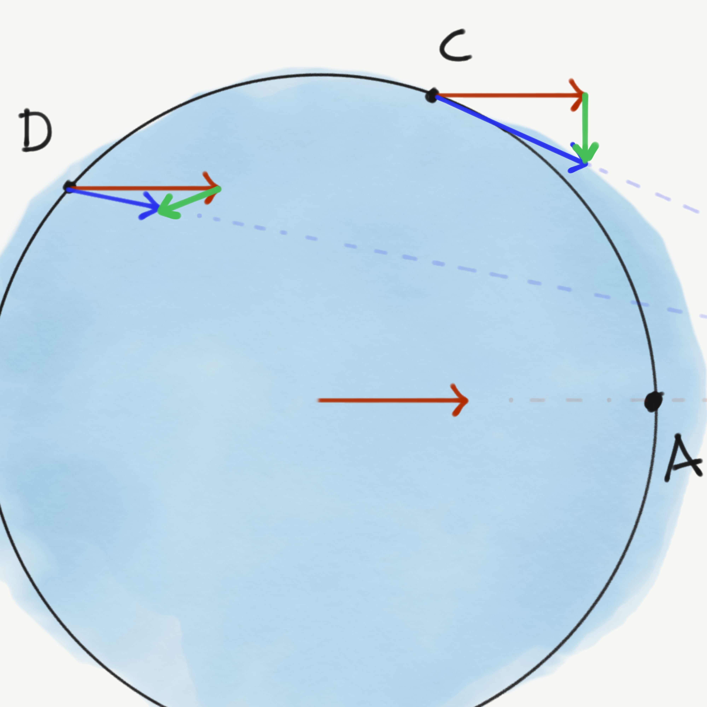

::: {.column-screen}

:::



::: {.lead-in}
The Moon orbits the earth and its gravity is causing the tides. But why don't swimming pools have tides? Or a cup of coffee? Human bodies consist of water, mostly. Aren't they tidally influenced by the Moon? If you're asking all these beautiful questions, then what you thought is causing the tides is probably wrong, and here's why.
:::

Remember, back in high school, when the science or physics teacher had all the air sucked out of a large, transparent tube which contained a feather and a little steel ball or something like that? And that she asked you to predict which would drop to the bottom first if she would turn the tube upside down?

Of course, both objects turned out to fall to the bottom at the exact same speed. We learnt it did not matter if the steel ball had more mass than the feather. Earth's gravity works the same on both. In fact, anything which is being 'pulled down' by our planet's gravity gets to be pulled down at the same rate, no matter how much mass these things have (provided we ignore any form of friction).

# Lunar gravity

Even though the Moon's gravity is smaller than Earth's, the principle is the same. Irrespective of an object's mass, it falls straight to the lunar surface at precisely the same rate as any other thing. On 2 August 1971, NASA Commander David Scott [demonstrated](https://apod.nasa.gov/apod/ap111101.html) that a feather and a hammer hit the Moon's soil simultaneously.

::: {style="width: 75%; margin: 0 auto;"}
](Apollo_15_FH.jpg)
:::

The Moon's gravity is strong enough to have a noticeable effect on Earth, as we all know. Indeed, it is the reason why our oceans have tides. However, if gravity, whether on our planet or on the Moon, acts the same way on every object irrespective of their mass, how come our bathtub does not experience tides, for instance? Yes, it has less mass, but by Cmdr David Scott's experiment, that shouldn't matter. And if the Moon's gravity is capable of pulling on vast bodies of water such as oceans causing them to rise literally meters high, why does our rubber duck not start levitating up in the air as soon as the Moon rushes past our homes?

The answer sounds both obvious and contradictory: because the force of the Moon's gravity is negligibly small, except when it is not.

# The wrong picture

Let's have a look at the simplified drawing of Figure 1. Just to make things a little less complicated, we imagine our planet to be covered by water entirely. There are no continents for now.

::: {style="width: 80%; margin: 0 auto;"}

:::

First misconception. Even though, intuitively, it may seem to be the case, the bulge at point A is *not* because the Moon's gravity is tugging at it, contrary to popular belief.

And in many texts, you might encounter the following incorrect explanation for the bulge at point B. "The Moon's pull is smaller at point B than at point A, so, point B stays more or less where it is, while point A gets pulled more towards the Moon. Everything in between A and B gets stretched like chewing gum. So, from the perspective of someone standing (on land) at point B, the water rises there as well."

This is also mostly incorrect. It is true, the Moon's gravitational pull is smaller at B than it is at A. But that is not what is causing the bulge at point B. Not in the direct way as stated here, that is.

# Many a little makes a mickle

Why don't we have a look at points C and D in two different, little patches of water in Figure 2? The Moon's force of gravity acts on these points at a certain angle as is represented by the blue arrows, or vectors. At the same time, the entire earth experiences a slight force towards the Moon as is modelled by the red vector.

::: {style="width: 80%; margin: 0 auto;"}

:::

So, point C and D undergo two simultaneous forces as is explicitly shown in Figure 3. Note that the blue and red vectors have different directions. Our high school physics or maths teacher then taught us that two or more forces acting on the same point can be modelled as one resultant force.

Now we need to take two important steps:

1. Newton taught us that a force is an acceleration, so, from now on we will regard the arrows in Figure 3 as being accelerations.
2. To determine the acceleration of the patches of water at points C and D relative to Earth's surface, we subtract the red vector from the blue vector. What's left is the green vector, the resultant.

::: {style="width: 75%; margin: 0 auto;"}

:::

In Figure 3, it is shown how the combination of the two gross forces blue and red yield a net force as represented by the green vectors. Do note, the net forces are what is called apparent forces. Think of a car suddenly accelerating. Relative to the ground, your head is standing still for an instant of time. However, from within the car, your head seems like it is being pushed back by some invisible force. Tides are thus being caused by so-called tidal forces, which are apparent forces.

So, if we do the same for many other points, you get many green vectors as they are shown in Figure 4. And guess what, all the green (now black) arrows point in a way that look a lot like bulges in the water.

::: {style="width: 80%; margin: 0 auto;"}

:::

This shows that what actually happens is that every minuscule patch of water gets influenced by a tiny bit of net force in the direction of the places where the bulges will emerge, pushing every other patch in front of it towards the bulges, thereby creating the bulges in the first place.

Now, in the drawing, all arrows are relatively massive, so we can actually see them. In reality, however, the net forces are tiny. Microscopically tiny.

And this is the key to solving the paradox. Even though a net force, resulting from the Moon's gravitational influences, is utterly insignificant on a single patch of the water, the amount of ocean on Earth is quite the opposite of negligible, rendering the sum of all net forces on every cubic patch within the oceanic liquid highly significant, and in some cases, depending on the shape of the land, dangerously significant.

# Conclusion

The Moon's influence on tiny things is tiny. It does not noticeably influence your cup of coffee, your body, your bathtub, ponds, and lakes. Any tidal height difference in a cup of coffee could be thinner than a bacterium, the significance of which is immediately squashed by the mere presence of, well, a bacterium in your coffee, practising its back crawl. If your coffee starts to display any tidal effects, prepare for the Apocalypse and/or escaped dinosaurs. Either case, something is really wrong then.

Even a lake the size of [Lake Michigan](https://goo.gl/maps/6adDET7G3BJ2) will only rise a couple of centimetres—easily negated by its murmuring surface on a sunny day in May. So, you can imagine, your body does not feel a thing. The pressure needed for delivering oxygen to your brains alone squashes out every single tidal influence by the Moon, which would have been smaller than a hair's thickness anyway. If you feel less capable of rational thought, you now know it's not the Moon. But do check your blood pressure.

However, in the case of an ocean, a body with many, many, many tiny, watery parts which can roll, slip and slide freely on top of one another, there will be bulges about where the Moon whizzes. However, the swelling occurs by virtue of pushing not pulling, directly.

::: {.callout-note appearance="minimal"}
In short, a quindecillion minuscule little net forces on every cubic piece of the ocean cause an upward push so the two bulges emerge. Lakes, ponds, bathtubs, human bodies, and coffee mugs do not come close to even a little bit of that amount.
:::

::: {.callout-tip appearance="simple" title="Note"}
The original article omitted to mention how tidal force is an apparent force, resulting in a fundamental misinterpretation of Figures 3 and 4. This has been corrected.
:::

---

*Figure 4 is an adapted version (cropped) of the original made by [Krishnavedala](https://en.wikipedia.org/wiki/User:Krishnavedala) under [CC BY-SA 3.0](https://creativecommons.org/licenses/by-sa/3.0/deed.en).*

*We did not consider the rotation of the earth, the Coriolis effect, the presence of the sun, the presence of land, etc., just to keep it simple. This changes the situation somewhat, but does not change the gist of it all.*