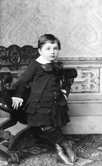

::: {.column-screen}

:::



::: {.lead-in}
Albert Einstein [won](https://www.nobelprize.org/prizes/physics/1921/einstein/facts/) de Nobelprijs "voor zijn verdienste in de theoretische natuurkunde en in het bijzonder zijn ontdekking van de wet van het foto-elektrisch effect". Geen woord over relativiteit. Dus, nee, hij won de prijs niet met $E = mc^2$. Hoewel het zijn bekendste vergelijking is – die overigens niet de volledige versie ervan is – is het niet zijn Nobelprijswinnende formule. We zullen die vermelden, maar eerst beschrijven we wat dit foto-elektrische effect is.
:::

Verschillend spul bestaat uit verschillende moleculen. Verschillende moleculen bestaan uit verschillende atomen. Verschillende atomen bestaan uit verschillende atoomkernsamenstellingen en een verschillend aantal elektronen. Tot zover misschien niets nieuws onder de zon, maar nu komt het: als elektronen aan specifieke hoeveelheden energie worden blootgesteld, kunnen ze uit het atoom gelanceerd worden.

Een atoom waarvan een of meer elektronen is weggeblazen wordt een *ion* genoemd. Het proces heet *ionisatie*. Of dit plaatsvindt, hangt af van een aantal dingen zoals het soort spul (het type atomen en hoe ze met elkaar verbonden zijn) en de specifieke energie waar het aan wordt blootgesteld.

Als ionisatie aan het oppervlak van een materiaal plaatsvindt door middel van normaal licht, noemen we dit het foto-elektrisch effect: licht (waar ‘foto’ naar verwijst) verwijdert elektronen uit het atoom (waar ‘elektrisch’ naar verwijst).

# Niet vanwege de intensiteit

Er is een bijzonderheid de moeite waard om te vermelden. Het is in feite deze centrale puzzel die Albert naar zijn vergelijking leidde. Het geval wilde namelijk dat elektronen *niet* uit de atomen werden gelanceerd door een *hogere intensiteit* van de lichtstraal. Intensiteit is het geleverde vermogen per vierkante meter, uitgedrukt in watt per vierkante meter, of Joule per seconde per vierkante meter. De sleutel lag daarentegen in de *frequentie*, de kleur van het licht.

Stel dat, in het diagram hierboven, een miljard gele fotonen, lichtdeeltjes, richting het atoom zouden worden gestraald en er gebeurde niets; het elektron bij dit type atoom bleef waar het was. Stel je vervolgens voor dat er een miljard miljard miljard miljard gele fotonen naar het atoom zouden stralen. De intensiteit is drastisch omhoog geschroefd, oftewel het vermogen staat op stand elf, zogezegd. Welnu, er zou nog steeds niets gebeuren, want het draait niet om de intensiteit.

Geel licht is minder energetisch dan blauw licht, dus als je de lichtbron zou vervangen door iets dat één blauw foton zou uitzenden, zou het elektron zo maar weg kunnen vliegen (met één foton moet je wel onmogelijk goed mikken dus is het handiger om heel veel uit te zenden). Vele natuurkundigen braken hier het hoofd over, maar Albert loste het op en won de Nobelprijs.

Kwantumfysica kreeg een belangrijke impuls door zijn ontdekking. Hij en andere tijdgenoten toonden aan dat elektromagnetische straling, of licht, gezien kon worden als kleine energiepakketjes die wetenschappers fotonen begonnen te noemen. Een lichtbundel was nu een stroom van fotonen. De intensiteit, de hoeveelheid fotonen per seconde per vierkante meter, doet er niet toe: het draait om de frequentie van een foton, en daarmee de energie per foton.

# DNA

Hoewel dit allemaal gaaf en nuttig is voor allerlei wetenschappelijke doeleinden, willen we absoluut niet dat er elektronen van DNA-moleculen van onze huid losraken. Atoombindingen zouden daarmee vernietigd worden en ons DNA zou worden gemuteerd. Ondanks dat verbluffende moleculair-biologische processen in ons lichaam deze fouten in een onthutsend groot aantal gevallen corrigeren of elimineren, zouden sommige foutjes ertussen kunnen glippen en het begin van tumorgroei kunnen vormen. Daarom is het belangrijk om te weten welke energiedomeinen onze geliefde lichaamselektronen doen verwijderen opdat de mensheid leert deze omstandigheden te vermijden.

Het probleem ontstaat als we terechtkomen in het midden- en hoog-energetische regime van elektromagnetische straling, of licht, of fotonen, zo je wil. We hebben het over de gevaarlijke soort van ultraviolet licht, het type UV dat DNA-mutaties teweeg kan brengen: UVB, om precies te zijn. Een UVB-foton heeft ongeveer 1,8 keer meer energie dan de fotonen van het gelige licht in je huis en ongeveer een miljoen keer meer dan een foton van en naar de mobieletelefoonantenne. Thuis niets te vrezen dus. Maar wees extra voorzichtig zodra je het lichtend pad volgt – het zonverlichte pad, welteverstaan. Ioniserend UVB-licht wordt namelijk uitgezonden door de zon.

Gelukkig, zoals we eerder opmerkten, zijn onze lichamen zodanig geëvolueerd dat ze schade repareren waar nodig. Dit is de reden dat röntgenfoto’s prima gemaakt kunnen worden en ziekenhuizen en tandartsen waken ervoor je niet bloot te stellen aan doseringen die je niet zou overleven. Toezicht op het gebruik en de effecten is een vereiste.

Het is echter gedeeltelijk ook een kwestie van de wet van de grote getallen. Als het aantal vrijelijk rondvliegende elektronen groot genoeg is, worden ze zelf de oorzaak van een groeiend aantal DNA-beschadigingen. De kans neemt toe dat herstelacties falen of zelfs geheel niet meer plaatsvinden. Dus hoewel niet ogenblikkelijk gevaarlijk, raden we aan om [het een en ander](https://www.kwf.nl/voorkomen/zon-uv-huidkanker/smeren-kleren-weren/Pages/default.aspx) te lezen over zonnebaden. Gebruik UV-bescherming. Voorkom dat je huid verbrandt. Geef je lichaam de kans om te herstellen van de meedogenloze, ioniserende UV-straling. Vergeet magnetrons, op de huid gebakken zijn is gevaarlijk.

# De formule

Eindelijk zijn we dan aanbeland bij Alberts Nobelprijswinnende formule. Hier is hij dan:

$$\frac{1}{2}m_ev^2_\text{max} = h\nu - \phi$$

Het ziet er niet zo modieus uit als die andere, nietwaar? En toch, het is de formule die ons in staat stelt om bijvoorbeeld te berekenen of de elektronen van onze koolstofatomen weg worden geblazen door de fotonen van de toiletverlichting (dat doen ze niet). Of dat de laserpen enkele elektronen eruit slaat (dat doet hij niet), die we niettemin nodig hebben om enkele punten aan te wijzen op onze PowerPointpresentatie omdat die wellicht duidelijker en met minder tekst gemaakt had kunnen worden (dat had hij).

Welnu, $\frac{1}{2}m_ev^2_\text{max}$ betekent maximum kinetische energie, oftewel simpelweg de bewegingsenergie waarmee een elektron van de atoomkern weg zoeft. Als de waarde kleiner dan of gelijk is aan nul, dan blijft het elektron ongemoeid. Het blijft rondhangen om zijn atoomkern. Als het groter is dan nul, vertrekt het. 

Het symbool $h$ is een constante waar we ons verder niet druk om hoeven te maken. Het is een getal en het heet de constante van Planck. De Griekse letter $\nu$ is de frequentie van het foton. In het diagram hierboven worden een aantal frequenties genoemd. Let wel, $h\nu$ betekent $h \times \nu$ en is de energie van een foton. Wiskundigen, natuurkundigen, ingenieurs en andere lieden laten het liefst het $\times$-teken achterwege. De Griekse letter $\phi$ is de zogenaamde uittreearbeid. Het is de minimale hoeveelheid energie die benodigd is om het foto-elektrisch effect teweeg te brengen. Deze waarde hangt af van het type atoom, het molecuul, het materiaal en het oppervlak waarvan je het foto-elektrische effect wilt berekenen.

# Tot besluit

::: {.callout-note appearance="minimal"}
Merk op dat Einsteins formule geen term bevat voor de *hoeveelheid* op het atoom afgevuurde fotonen per seconde per vierkante meter, oftewel de intensiteit. Alleen de *frequentie* is belangrijk. Dit betekent dus dat atomen – zoals die in je lichaam – ongemoeid gelaten worden *ongeacht* het *vermogen* van de straling waar ze aan blootgesteld worden. Er is misschien sprake van warmte, maar geen ionisatie. Het eventuele gevaar schuilt in de frequentie ($\nu$), zoals die van UV-licht en hoger. Hier begint dosering en de mogelijkheid om te herstellen een cruciale rol te spelen.
:::

::: {style="width: 35%; float: right; margin: 0 0 1rem 1.5rem;"}

:::

De waarde van de constante van Planck is $h = 6{,}626070 \times 10^{-34}\text{ J}\cdot\text{s}$ (Jouleseconde). De waarde van de uittreearbeid van het koolstofatoom, waar ons lichaam van gemaakt is, bedraagt $\phi = 1{,}8041 \times 10^{-18}\text{ J}$. Als een wifi-foton een frequentie heeft van 2,5 GHz, kun je zelf berekenen of wifi elektronen uit een koolstofatoom slaat. Je moet dan 2,5 GHz even converteren naar $2{,}5 \times 10^9\text{ s}^{-1}$ (per seconde).

Dankzij Albert kan een kind tegenwoordig de was doen. Je kunt het op de achterkant van een envelop uitrekenen. Als alle termen aan de rechterkant van het is-gelijk-teken een waarde opleveren die groter is dan nul, verkoop dan onmiddellijk je router en, gezien het spectrumdiagram, laat sowieso het licht uit op het toilet als je dan echt moet. Succes met uitrekenen! (Of check de [uitwerking](https://opencurve.info/nl-back-of-the-envelope-photo-electric-effect/).)

---

*Uitgelicht portret: een 14-jarige Albert Einstein gefotografeerd in 1893. Credits: Emilio Segrè Visual Archives / American Institute of Physics / Science Photo Library / Universal Images Group. Bron: Young Albert Einstein, physicist. [Photography]. Encyclopædia Britannica ImageQuest.*

*Kleinere afbeelding van een nog jongere Albert Einstein: Credits: Emilio Segrè Visual Archives / American Institute of Physics / Science Photo Library / Universal Images Group. Bron: Young Albert Einstein, physicist. [Photography]. Encyclopædia Britannica ImageQuest.*

*Krantenartikel: "Nobel Prize for Einstein." Times, 10 Nov. 1922, p. 5. The Times Digital Archive.*