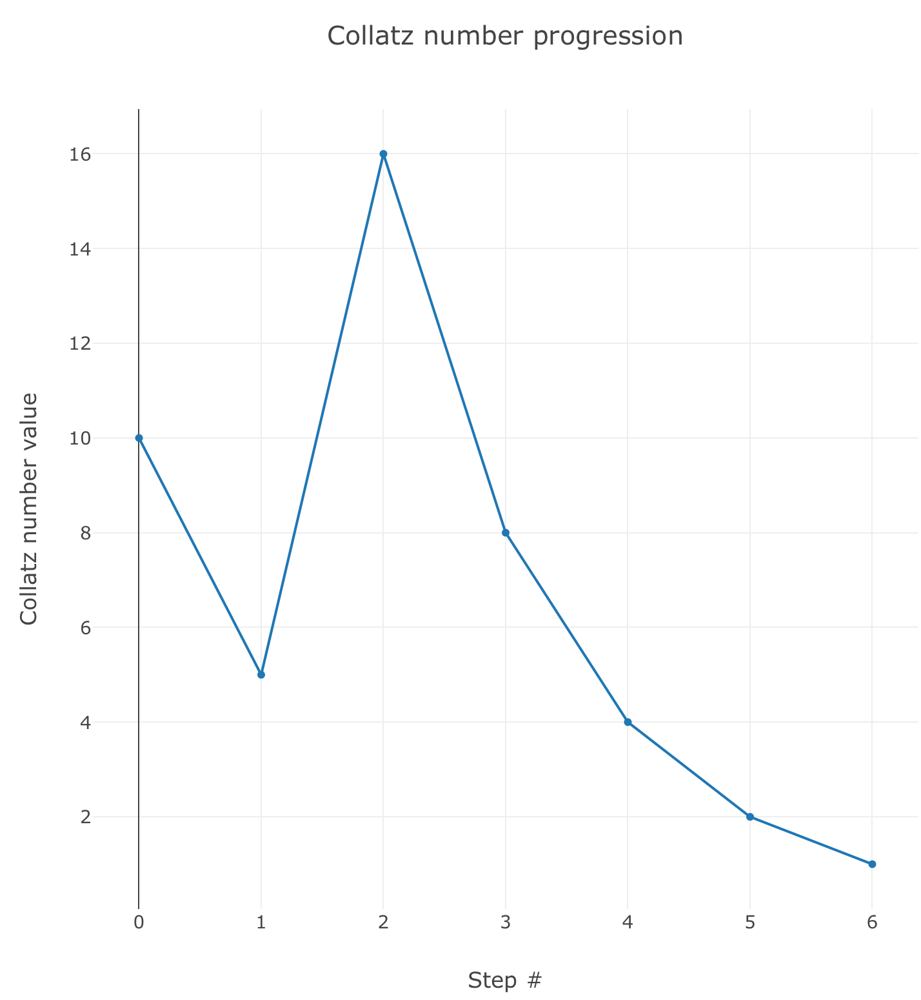

::: {.column-screen}

:::



::: {.lead-in}
Het Vermoeden van Collatz is waarschijnlijk een van de makkelijkst te begrijpen problemen waarvan niettemin nog nooit in de geschiedenis der wiskunde de geldigheid is bewezen. Het mooie is dat een leerling in de laatste groep van de basisschool heel goed in staat is om de berekeningen uit te voeren, terwijl zelfs de grootste wiskundige geesten nog niet in staat zijn gebleken om te bewijzen of en zo ja, waarom het Vermoeden van Collatz waar is of niet. Wijlen de grote Hongaarse wiskundige Paul Erdős wordt vaak geciteerd: 'Wiskunde is waarschijnlijk niet voorbereid op dit soort problemen.'[^1]
:::

# De regels

Er bestaat enige controverse over of het werkelijk de productieve Duitse wiskundige Lothar Collatz was die als eerste op het idee kwam in 1937, twee jaar na zijn promotie tot doctor in de wiskunde. Het is mede hierom ook bekend als het '$3n + 1$ probleem', het Vermoeden van Ulam, het Probleem van Kakutani, het Vermoeden van Thwaites, Hasse's Algoritme of het Probleem van Syracuse. Mocht je vermoeden dat de meeste benamingen verwijzen naar andere mensen, dan klopt dat.

De regels van het Vermoeden zijn zo eenvoudig dat het niet onwaarschijnlijk is dat velen hetzelfde idee kregen, onafhankelijk van elkaar.

De regels zijn als volgt:

1. Neem ieder positief, geheel getal.
2. Doe een van de volgende dingen:
   * als het een even getal is, deel het door 2;
   * als het een oneven getal is, vermenigvuldig met 3 en tel er 1 bij op.
3. Doe met het antwoord een van de volgende dingen:
   * als het antwoord 1 is, stop;
   * als het antwoord niet 1 is, gebruik dan het antwoord om terug te gaan naar stap 2 om er opnieuw een van de twee handelingen mee uit te voeren. En zo verder.

::: {.callout-note appearance="minimal"}
Het Vermoeden luidt als volgt: ongeacht welk positief, geheel getal je neemt als startpunt, ongeacht het aantal stappen die doorlopen moeten worden, je komt altijd uit bij 1.
:::

*(Als je door zou gaan met het getal 1, zou je simpelweg een klein cirkeltje maken en in drie stappen weer terugkeren bij 1, tot het einde der tijden. Dat zou een beetje dom zijn, dus stop er dan gewoon mee.)*

# Voorbeeld

Laten we het eens in de praktijk bekijken. Laten we beginnen met 10:

* 10 is even; gedeeld door 2 is 5.
* 5 is oneven; vermenigvuldigd met 3 plus 1 is 16.
* 16 is even; gedeeld door 2 is 8.
* 8 is even; gedeeld door 2 is 4.
* 4 is even; gedeeld door 2 is 2.
* 2 is even; gedeeld door 2 is 1. We zijn er!

Dit kostte 6 stappen. Je kunt zelf een paar getallen proberen, als je wilt. Dat wil zeggen, je kunt de computer, de telefoon of de tablet het saaie werk laten doen via [ons online rekenhulpmiddel](https://tools.opencurve.info/collatzconjecture/collatzconjecture.html).

# Visualisatie

Zoals je misschien al wel zag via de voorgaande link is het mogelijk om de stappen te visualiseren die geproduceerd worden door het Collatz-algoritme. Hier laten we snel enkele alternatieven de revue passeren voordat we de bekendste visualisatie bespreken, die van [Edmund Harriss](#de-edmund-harriss-visualisatie) (waar we een JavaScript-applet voor schreven, hoera!).

Stel dat we de voortgang van de resultaten van ons voorbeeld hierboven willen visualiseren. We begonnen met 10. Dat ziet er uit zoals hieronder weergegeven. Zoals je ziet, fluctueert de waarde een beetje voordat het neerdaalt naar 1:

Kijk nu eens naar de volgende Collatz-sequentie. We beginnen bij 8000. De numerieke progressie is dan:

$$8000 \to 4000 \to 2000 \to 1000 \to 500$$
$$\to 250 \to 125 \to 376 \to 188 \to 94$$
$$\to 47 \to 142 \to 71 \to 214 \to \dots$$
$$\to 4 \to 2 \to 1$$[cite: 14, 15]

Dat zijn heel veel getallen voordat je uiteindelijk bij 1 uitkomt. Honderdveertien stappen, om precies te zijn. Dit is een visualisatie ervan:

::: {style="width: 80%; margin: 1.5rem auto;"}

:::

Zoals je ziet fluctueert het behoorlijk. Het is een beetje chaotisch, lijkt het. Er is geen duidelijk patroon te zien, anders dan dat je uiteindelijk bij 1 uitkomt. Omdat de waarden vrij groot lijken te kunnen worden, laten we bovenstaande weergave iets wijzigen en het semi-logaritmisch maken. De $y$-as wordt logaritmisch, de $x$-as laten we nog even lineair.

En gewoon, omdat het misschien leuk is, laten we nu de stapvolgorde omdraaien: de grafiek wordt op die manier gespiegeld en convergeert naar 1 in de hoek linksonder.

Omdat het eigenlijk moeilijk te voorspellen is hoeveel stappen een bepaalde serie in beslag gaat nemen, laten we nu ook de $x$-as in een logaritmische schaal zetten. We krijgen dan:

Met deze manier van weergeven kunnen we waarschijnlijk een heleboel van deze sequenties tonen! Laten we als laatste daarom een *reeks van sequenties* gaan plotten!

Oftewel, we laten ons JavaScript-applet eerst een sequentie vanaf het getal 10000 berekenen. Daarna laten we het automatisch een sequentie vanaf het getal 9999 produceren. En zo verder, tot we het begingetal 4 bereiken. En dan plotten we het allemaal tegelijk! Om te voorkomen dat het te warrig gaat worden – aangezien verschillende sequenties elkaar zullen overlappen – maken we de weergave van een sequentie iets doorzichtig. Als sequenties elkaar overlappen wordt de grafiek daar donkerder. Dit is het resultaat:

Het wordt bijna een soort kunst. Als je deze grafiek zou inlijsten, zonder titels, assen en schaalverdelingen – alleen de grafiek – dan zou je een geometrische kunstvorm kunnen hebben met de titel 'Het Vermoeden van Collatz' of iets dergelijks. Ik denk eigenlijk dat ik dat ga doen.

Met [dit applet](https://tools.opencurve.info/collatzconjecture/collatzcollection.html) kun je je eigen 'kunst' genereren.

# De Edmund-Harriss-visualisatie

[Edmund Harriss](https://maxwelldemon.com/), een wiskundige aan de University of Arkansas, bedacht een prachtige visualisatie van Collatz-sequenties. Het werd uitgebreid [besproken](https://youtu.be/LqKpkdRRLZw) op het wiskundige YouTube-kanaal Numberphile.

De regels van zijn visualisatie zijn eenvoudig. Als de huidige stap twee keer zo groot is als de volgende stap, draai een bepaalde hoeveelheid met de klok mee, anders draai de helft van die hoeveelheid tegen de klok in (totdat je natuurlijk de waarde 1 bereikt). 

Het resultaat is een organische bundel van draden – rommelig en ogenschijnlijk willekeurig, binnen bepaalde grenzen, net als in de natuur.

We schreven een JavaScript-applet waarmee we deze manier van weergeven probeerden te benaderen. We gebruikten het om er de grote afbeelding bovenaan deze pagina mee te maken. Je kunt het [hier](https://tools.opencurve.info/collatzconjecture/collatz-harriss.html) zelf proberen.

Als je al deze verschillende visualisaties bekijkt en de ogenschijnlijk wanordelijke voortgang van de sequenties in ogenschouw neemt, is het misschien niet verwonderlijk dat het geheim tot nu toe nog niet gekraakt is.

---

[^1]: Guy, Richard K. (2004). "E17: Permutation Sequences". *Unsolved problems in number theory* (3rd ed.). Springer-Verlag. pp. 336–7. ISBN 0-387-20860-7. Zbl [1058.11001](https://zbmath.org/?format=complete&q=an:1058.11001).