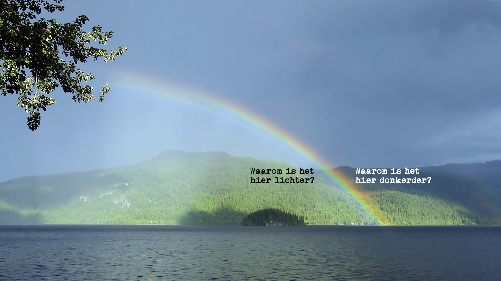
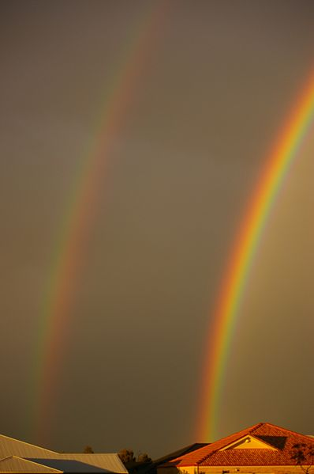
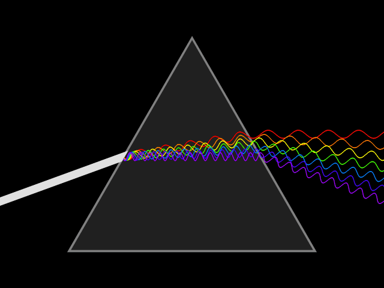
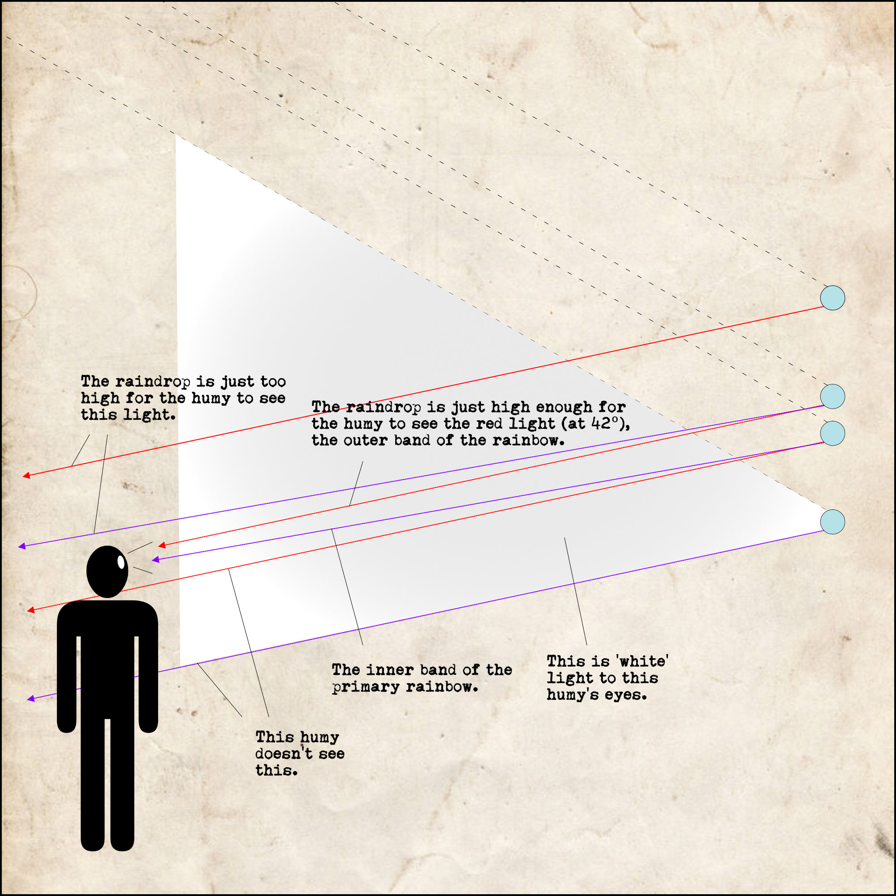
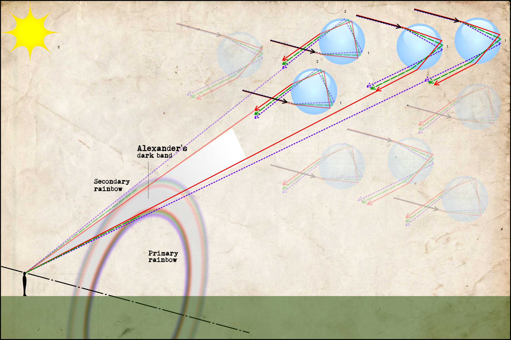

::: {.column-screen}

:::



::: {.lead-in}
Misschien dat het je nog niet was opgevallen, maar de volgende keer zul je het vast wel zien: het heldere verschil tussen de binnenkant en de buitenkant van een primaire regenboog. Bovendien weet je dan ook waarom je ziet wat je ziet. Hoewel niet altijd zichtbaar, maar zeker wel aanwezig als er genoeg waterdruppels en licht voorhanden is, is de secundaire regenboog. De donkere band tussen de primaire en de secundaire regenboog wordt **Alexanders (donkere) band** genoemd.[^1]
:::

Voor het geval je het nog niet wist: er zijn drie dingen benodigd voor een regenboog. Achter je – in je rug – moet de zon schijnen. Voor je moeten regendruppels aanwezig zijn, of het nu duizenden meters omhoog en van je vandaan is of slechts een paar meter (bijvoorbeeld de nevel van een tuinsproeier). Bovendien moeten tussen de zon, de regendruppels en je ogen er zich geen wolken of iets anders bevinden.

# Breking en dispersie

Zoals je misschien weet, worden lichtbundels afgebogen door al het transparant materiaal dat ze ontmoeten. Twee keer – aan de twee oppervlakken waar doorheen ze zich voortplanten. Dit komt omdat licht, een elektromagnetische verstoring, de elektrische eigenschappen van het materiaal verandert. Die veranderen op hun beurt dan weer het elektromagnetische veld in het materiaal. Hierdoor wordt het licht vervolgens afgebogen. In een [vorig artikel](https://opencurve.info/nl/waarom-veroorzaken-glas-en-vloeistoffen-lichtbreking/) gingen we dieper in op de kwantumfysica van deze materie.

Rood licht wordt onder een kleinere hoek afgebogen dan violet licht. Bovendien is de *maximale* hoek tussen de invallende lichtstraal en het uitvallende rode licht ongeveer 42°. Bij violet is dat *maximaal* 40°. Met andere woorden, je zult violet licht nooit een regendruppel zien verlaten onder een hoek van 42° – alles is daar rood. Tussen deze twee hoeken verschijnen de gele, groene en blauwe kleuren. Dit is weergegeven in Figuur 3. Dit vormt de oorzaak voor het fenomeen dat 'wit' licht van de zon – dat uiteraard een mix is van alle kleuren van de regenboog en helemaal niet 'wit' – in een specifieke kleurenvolgorde verstrooid wordt.

Stel nu dat miljoenen kleine regendruppels in de lucht hangen. Of je het daarvandaan gereflecteerde licht kan zien, hangt mede af van de hoogte van die druppel. Sommige zitten precies op de juiste hoogte zodat je alleen het rode licht kan zien, bij andere zie je alleen violet.

In Figuur 4 zie je de relatie tussen de (volgorde van) kleuren die je krijgt te zien, de verschillende hoeken waaronder verschillende kleuren licht uit de druppel ontsnappen en de hoogte van de druppel. Als een regendruppel laag genoeg hangt, worden alle kleuren weer gemixt. Rood, geel, groen, violet – ze kunnen allemaal de druppel verlaten onder een hoek die kleiner is dan 40°. Dit is waarom 'wit' licht ontstaat 'binnen' de primaire regenboog.

De regendruppels reflecteren het licht niet altijd slechts eenmaal, zoals in Figuur 3. Soms wordt het licht twee keer gereflecteerd, zoals in de eerste waterdruppels in Figuur 5. Hier is te zien hoe de omgekeerde volgorde van de kleuren in de secundaire regenboog worden geconstrueerd. Soms verlaat het licht de druppel, maar bereikt het nimmer je ogen – ze zijn te hoog. Een deel van het licht raakt 'verloren'. Dit is waarom de band tussen de primaire en secundaire regenboog altijd net iets donkerder is dan de rest van de lucht.

---

*Figuur 1, foto van Alexanders band door [Gnangarra](https://commons.wikimedia.org/wiki/File:Alexanders_band_gnangarra.jpg) onder [CC BY-SA 3.0 AU](https://creativecommons.org/licenses/by/3.0/au/).*

*Figuur 5, primaire en secundaire regenboog illustratie door [CMG Lee](https://commons.wikimedia.org/wiki/User:Cmglee) onder [CC BY-SA 4.0](https://creativecommons.org/licenses/by-sa/4.0/deed.en), aangepast door [@kjrunia](https://twitter.com/kjrunia).*

[^1]: De eerste vermelding van dit fenomeen werd in 200 n.Chr. geleverd door de Griekse wijsgeer Alexander van Aphrodisias in een commentaar op een werk van Aristoteles over meteorologie.