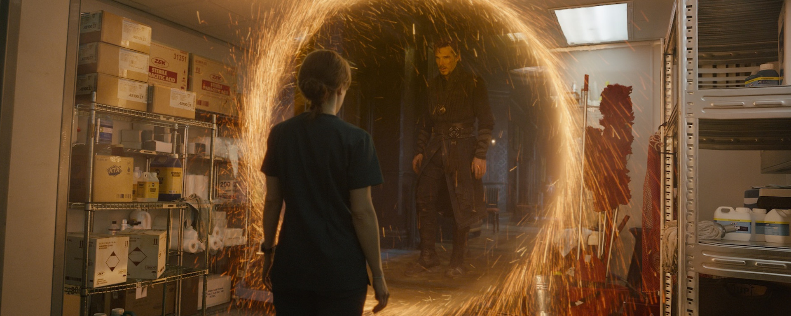
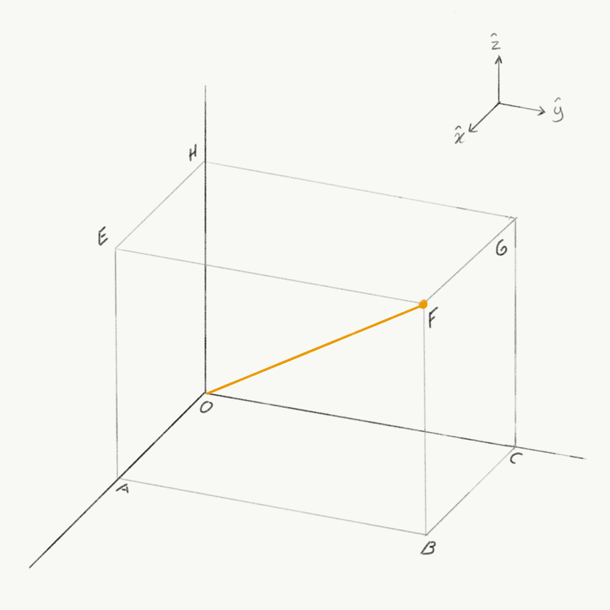
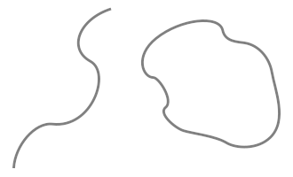
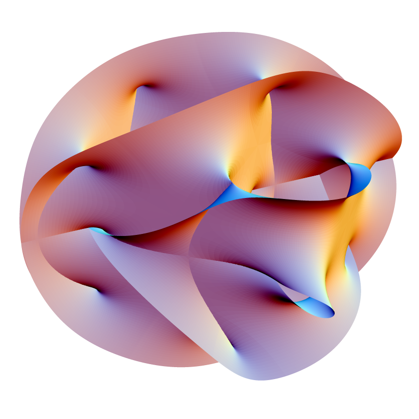

::: {.column-screen}

:::



::: {.lead-in}
Zoals vaker met wetenschappelijke kreten in het dagelijks spraakgebruik, in boeken, in de bios, op tv en op internet – zoals *energie* – is het zelden dat het woord *dimensie* hetzelfde betekent als wat wis- en natuurkundigen menen dat het betekent. Het is zeer waarschijnlijk dat je wel eens de woorden 'hogere' of 'andere dimensies' hebt gezien of gehoord. Het is zelfs niet ondenkbaar dat je zelf die woorden wel eens gebezigd hebt. In deze aflevering verkennen we wat wis- en natuurkundigen bedoelen als ze het over ruimten en dimensies hebben.
:::

# Dimensies zijn geen universums

In sciencefiction en in het alledaagse spraakgebruik is het woord 'dimensie' vaak synoniem aan complete werelden, een (konink)rijk of *pocket universes*. Zo zijn buitenaardse wezens afkomstig van een andere dimensie. En zielen en/of 'essenties' bestaan op een 'hoger bestaansniveau' in een 'andere dimensie van de realiteit'.

Regelmatig worden poorten naar andere dimensies geopend via welke exotische materie en energie worden getransporteerd waar de held of de slechterik van het verhaal gebruik of misbruik van maakt.

Het is ook een favoriete manier om grote afstanden binnen onze realiteit mee af te leggen. Je springt door een dimensionale poort en je springt duizend kilometer verderop door een andere poort. Soms kun je ook tijdreizen via andere dimensies.

En, uiteraard, kunnen dimensies ook binnen onze eigen realiteit worden opgeroepen. En soms zijn die dimensies eigenlijk al aanwezig, maar dan moeten ze alleen nog even zichtbaar gemaakt worden door een krachtige geest. Dit verwijst wederom naar dimensies als een complete wereld die verborgen is binnen onze wereld.

::: {style="width: 85%; margin: 1.5rem auto;"}
) van het [Marvel Cinematic Universe (MCU)](https://nl.wikipedia.org/wiki/Marvel_Cinematic_Universe).](Mirror_Dimension.jpg)
:::

Deze hele paragraaf was enkel bedoeld om je te laten weten dat wat met dimensies wordt bedoeld in de meeste sciencefiction *niet* hetzelfde is als wat er in de wiskunde en de natuurkunde mee wordt bedoeld. Het zijn geen rijken, realiteiten, werelden of *pocket universes*. Als rijken, realiteiten, werelden en *pocket universes* bedoeld worden, dan zijn dat precies de juiste woorden ervoor.

# Normale ruimten en dimensies

Wat bedoelen wis- en natuurkundigen dan als ze het hebben over dimensies?

Vaak verwijzen ze naar echte richtingen waarin je kunt reizen in de normale ruimte. Vooral vogels en vissen zijn prachtige voorbeelden van wezens die zich van nature in alle richtingen van de ruimte kunnen voortbewegen.

Ze kunnen van links naar rechts en omgekeerd (eerste richting). Ze kunnen recht op je af komen en hun reis voortzetten achter je en omgekeerd (tweede richting). En natuurlijk kunnen ze ook van onderen aan komen zetten en doorgaan tot ver boven je schedel en vice versa (derde richting).

Vaak zijn de drie genoemde richtingen haaks op elkaar georiënteerd. Het zijn zogeheten orthogonale richtingen. Alle beweging kan beschreven worden als een combinatie van bewegingen in deze drie orthogonale richtingen, oftewel orthogonale dimensies.

Op de middelbare school hebben we uitgebreid kennisgemaakt met deze drie dimensies. We werden geplaagd met het vinden van afstanden tussen hoekpunten van een kubus langs de randen, de zijvlakken of dwars door het blok. Moderne gadgets en bioscopen gebruiken in dit verband natuurlijk ook de term 3D, driedimensionaal. Zij gebruiken of simuleren de drie orthogonale dimensies op een virtuele of fysieke manier voor ons entertainment.

In wiskundig opzicht levert de mogelijkheid van reizen (of 'transporteren') langs deze drie orthogonale richtingen automatisch een ruimte op, een [topologie](https://nl.wikipedia.org/wiki/Topologie), in een of andere vorm.

Dus, hoewel dimensies ruimten met zich meebrengen, zijn ze niet identiek. En hoewel uit één dimensie technisch gezien een topologie, een ruimte, voortkomt, is het nog steeds een ééndimensionale ruimte waar driedimensionale lichamen niet kunnen leven zonder uit elkaar getrokken te worden.

::: {style="width: 75%; margin: 1.5rem auto;"}

:::

# Euclides en Descartes

Een informele definitie van dimensies is het aantal coördinaten dat nodig is om een object te lokaliseren (in een of andere ruimte). Dus op een plat oppervlak (een vlak) zoals een plafond heb je twee coördinaten nodig om een vlieg te lokaliseren. Een vlieg kan 2 meter van de linkermuur verwijderd zijn (de eerste richting) en 3 meter van de muur tegenover je (de tweede richting, haaks op de eerste richting). De coördinaten van de vlieg zijn dus $(2, 3)$. En dus is een vlak tweedimensionaal.

In de normale, driedimensionale ruimte hebben we drie coördinaten nodig om een vlieg in een kamer te lokaliseren. Een vlieg kan 2 meter van de linkermuur verwijderd zijn, 3 meter van de muur tegenover je en 1,5 meter van de vloer. Zijn coördinaten zijn daarom $(2; 3; 1{,}5)$. We gebruiken nu de puntkomma om de coördinaten van elkaar te scheiden omdat we de komma al voor decimalen gebruiken.

Dit was een van de grote inzichten van [René Descartes](https://nl.wikipedia.org/wiki/René_Descartes) terwijl hij nog tot laat in de middag in bed lag, zo gaat het verhaal althans. Daarom worden deze coördinaten Cartesische of Cartesiaanse coördinaten genoemd. Descartes speelde een sleutelrol in de ontwikkeling van wat we nu het [Cartesisch coördinatenstelsel](https://nl.wikipedia.org/wiki/Cartesisch_coördinatenstelsel) noemen.

De ruimte waar dit type coördinaten bij hoort wordt [Euclidische ruimte](https://nl.wikipedia.org/wiki/Euclidische_ruimte) genoemd; de grote Griekse wiskundige [Euclides](https://nl.wikipedia.org/wiki/Euclides_van_Alexandrië) is de vader van de [Euclidische meetkunde](https://nl.wikipedia.org/wiki/Euclidische_meetkunde).

Ik denk dat gesteld kan worden dat Euclides en Descartes er schuldig aan zijn dat wiskundeleraren in staat zijn gesteld om ons te plagen met honderden wiskundesommen waarmee we de Euclidische ruimte met twee- en driedimensionale Cartesische coördinatenstelsels moesten leren kennen.

::: {style="width: 80%; margin: 1.5rem auto;"}
 schreef. Het huis staat er niet meer; tegenwoordig ziet het er heel anders uit.](instagram-post-descartes-home.jpg)
:::

# Ruimte en tijd

In de echte wereld, naast een locatie in de normale ruimte, is het ook nodig dat je aangeeft *wanneer*. Alleen de mededeling dat je ergens in een kantoor op de kruising van twee straten moet zijn, op de vierentwintigste verdieping (dat zijn de drie dimensies in de normale ruimte in één klap), is eigenlijk niet genoeg. Je mist nog een tijdcoördinaat. *Wanneer* moet je daar zijn?

::: {style="width: 35%; float: right; margin: 0 0 1rem 1.5rem;"}
 van Kurt Vonnegut. Het meldt het bestaan van de Tralfamadorians die in vier dimensies konden zien.](Cover-Slaughterhouse-Five.jpg)
:::

Einstein noemde het feit dat je op een bepaald tijdstip op een bepaalde plek moest zijn een *gebeurtenis*. Met andere woorden, waar we in de normale ruimte met Cartesische coördinaten over een *positie* spraken, gaf Einstein het inzicht dat er nu enkel over *gebeurtenissen* gesproken moet worden in termen van *ruimte en tijd*, de ruimtetijd, met gebruikmaking van ruimtetijdcoördinaten.

Toen Einstein de [speciale relativiteitstheorie](https://opencurve.info/nl/einsteins-speciale-relativiteit-binnen-6-999-minuten-voor-onderweg/) introduceerde, realiseerde de Duitse wiskundige [Hermann Minkowski](https://nl.wikipedia.org/wiki/Hermann_Minkowski) dat de theorie geometrisch ook begrepen kan worden in de vierdimensionale ruimtetijd, waarin tijd de vierde dimensie vormt. We noemen deze ruimte de [Minkowski-ruimte](https://nl.wikipedia.org/wiki/Minkowski-ruimte). Merk op dat we het woord 'ruimte' nu breder zien: het omspant niet alleen de normale ruimtelijke dimensies maar ook een tijddimensie (en is, om technische redenen, niet langer Euclidisch).

Overigens, een ander woord dat wis- en natuurkundigen vaak gebruiken is [variëteit](https://nl.wikipedia.org/wiki/Vari%C3%ABteit_(wiskunde)) ([manifold](https://en.wikipedia.org/wiki/Manifold) in het Engels). Een variëteit is een [topologische ruimte](https://nl.wikipedia.org/wiki/Topologische_ruimte) die verschillende vormen kan aannemen, zoals een tweedimensionaal vlak, een driedimensionale Euclidische ruimte, een vierdimensionale Minkowski-ruimte of iedere andere wiskundige ruimte.

In Einsteins algemene relativiteitstheorie (zwaartekracht) gebruiken we nog steeds een vierdimensionale ruimtetijd, behalve dan dat de vorm niet langer vlak is zoals bij Minkowski. Deze ruimte is vervormd, gekromd, geplooid en uitgerekt. Binnen de beste theorie van de zwaartekracht die we tot nu toe hebben, werken we met de zogenaamde [pseudo-riemann-variëteit](https://nl.wikipedia.org/wiki/Pseudo-riemann-vari%C3%ABteit), vernoemd naar de Duitse wiskundige [Bernhard Riemann](https://nl.wikipedia.org/wiki/Bernhard_Riemann). De dimensies zijn nog steeds alle richtingen die je op kunt gaan, oftewel het minimum aantal coördinaten benodigd om een gebeurtenis te lokaliseren. Echter, hier zijn de dimensies niet noodzakelijkerwijs orthogonaal ten opzichte van elkaar georiënteerd.

::: {style="width: 80%; margin: 1.5rem auto;"}
 toonde regisseur Christopher Nolan een object dat iets met ruimte en tijd van doen had.[^1]](Tesseract-Interstellar.jpg)
:::

# Vier normale, ruimtelijke dimensies

Stel je een [Pac-Man](https://nl.wikipedia.org/wiki/Pac-Man) voor die op het oppervlak van een bol leeft. Voor hen is de wereld plat. Als die alsmaar rechtdoor zou blijven gaan, zou die behoorlijk verrast kunnen zijn als blijkt dat die is teruggekeerd op de plek waar die begon.

::: {style="width: 80%; margin: 1.5rem auto;"}
![Figuur 5. Stel dat je zo plat was als een Pac-Man, reizende over wat een plat vlak lijkt. Alsmaar rechtdoor gaand eindig je uiteindelijk weer waar je begon. Zou het universum een soort hypersfeer[^2] kunnen zijn?](rail.jpg)
:::

Wij, driedimensionale wezens die de meesten van ons zijn, zien de Pac-Mans als kleine vormpjes met kleine oppervlakjes omdat we hen 'van boven' zien, vanuit de derde dimensie. We kunnen tevens zien hoe ze reizen rond het oppervlak van de bol. Ze weten niet wat een sfeer is (een sfeer is enkel het oppervlak van een bol, niet de binnenkant ervan). Ze denken alleen aan platte oppervlakken. Voor ons is het vanzelfsprekend dat ze terugkeren naar de plek waar ze de reis begonnen.

Terug naar onze 3D-wereld. Stel je voor dat we met een ruimteschip door het heelal zouden reizen. In een rechte lijn. Alsmaar rechtdoor. Stel je voor dat we na miljarden jaren weer precies uitkwamen waar we ooit startten: de aarde. Wat zou er gebeurd zijn? Zou ons universum misschien zoals een sfeer kunnen zijn, maar dan vierdimensionaal?

::: {style="width: 35%; float: right; margin: 0 0 1rem 1.5rem;"}
) van Rudy Rucker, en de klassieker [Flatland](https://nl.wikipedia.org/wiki/Flatland).](The_Fourth_Dimension_Rudy_Rucker_book_-_cover_art.jpg)
:::

Hoewel nog geen enkel experiment het bestaan van een vierde ruimtelijke dimensie heeft aangetoond (laat staan een vijfde of een zesde), is het zeer vermakelijk om je in een vierdimensionale wereld te verdiepen en er wat langer over na te denken.

Voor alle duidelijkheid: tijd is hier niet de vierde dimensie. Hier hebben we het louter over ruimtelijke dimensies. Het komt vaak voor dat deze twee verward worden: een vierdimensionale ruimtetijd bestaat uit drie ruimtelijke dimensies plus een tijddimensie, terwijl een vierdimensionale ruimte uit vier ruimtelijke dimensies bestaat, zonder tijd.

# Abstracte ruimten

Er is nog een manier waarop dimensies en ruimten worden gebruikt door wis- en natuurkundigen. Stel je een object voor dat verschillende eigenschappen tegelijk heeft: een positie (in de normale ruimte), beweging, bewegingsrichting, temperatuur en kleur. Om de toestand van dit object te beschrijven heb je meer dan alleen de vier ruimtetijdcoördinaten nodig. Stel dat die $(0; 1; 1; 1)$ zijn. Oftewel: het bevindt zich op tijd $t = 0$ op positie $(x = 1; y = 1; z = 1)$.

Hebben we nu de toestand van het hele object beschreven? Nee, we missen nog wat kengetallen. Het is in beweging, dus het heeft een snelheid, zeg $10\text{ m/s}$. Die snelheid heeft ook een richting. Laat dit naar links zijn. Dan schrijven we op dat de snelheid $-10\text{ m/s}$ is (links is meestal negatief, rechts positief).

Stel dat de temperatuur $273{,}15\text{ K}$ is ($0\text{ \textdegree C}$) en de kleur wit. Hoeveel getallen hebben we dan nodig om de volledige toestand van het object te beschrijven? Zeven (we tellen 'wit' even als een getal).

De coördinaten $(0; 1; 1; 1; -10; 273{,}15; \text{wit})$ horen bij wat we een [faseruimte](https://nl.wikipedia.org/wiki/Faseruimte) noemen: een abstracte ruimte waarin de eigenschappen van een object de dimensies vormen. In dit voorbeeld is de faseruimte zevendimensionaal. Natuurlijk is het onmogelijk je zoiets visueel voor te stellen, maar wiskundig kun je er uitstekend mee rekenen.

We hebben een wat ongebruikelijk voorbeeld genomen om te benadrukken dat dimensies niet altijd gerelateerd hoeven te zijn aan ruimte en tijd. Niettemin is het in de klassieke mechanica gebruikelijk dat faseruimten worden opgebouwd uit dimensies van positie en impuls.

::: {style="width: 45%; float: right; margin: 0 0 1rem 1.5rem;"}
, ontwikkeld door Edward Lorenz om atmosferische convectie te modelleren.](A_Trajectory_Through_Phase_Space_in_a_Lorenz_Attractor.gif)
:::

Een ander voorbeeld van een abstracte ruimte is een [vectorruimte](https://nl.wikipedia.org/wiki/Vectorruimte), waarin iedere coördinaat niet slechts een punt is maar ook een richting en magnitude representeert. Denk aan de wind: ieder punt in die ruimte heeft niet alleen een luchtsnelheid, maar ook een stroomrichting.

In het artikel [Complexe getallen: een inleiding](https://opencurve.info/nl/complexe-getallen-een-inleiding/) werd een geheel nieuwe getallenlijn geïntroduceerd. Alle ruimten die we zojuist noemden, kunnen net zo goed complexe dimensies bevatten. Dat is standaard in de kwantummechanica: abstracte vectorruimten over de complexe getallen waarin golffuncties evolueren. De [Hilbertruimte](https://nl.wikipedia.org/wiki/Hilbertruimte) is daar de centrale arena.

Het [Standaardmodel van de deeltjesfysica](https://nl.wikipedia.org/wiki/Standaardmodel_van_de_deeltjesfysica) is gebaseerd op de symmetrische Lie-groepen $\text{SU}(3) \times \text{SU}(2) \times \text{U}(1)$. De 'S' staat voor *special* en legt restricties op aan de matrices (determinant 1). $\text{U}(1)$ refereert aan de cirkelgroep in het complexe vlak. De dimensie van de reële Lie-algebra behorend bij een unitaire groep zoals $\text{SU}(3)$ is $3^2 - 1 = 8$. Zoals je ziet: dimensies betekenen in een wetenschappelijke context iets heel anders dan in het alledaagse taalgebruik.

::: {.callout-note appearance="minimal"}
Algemeen gesteld is iedere variëteit een ruimte. Dit hoeft niet per se onze fysieke leefruimte te betreffen. Het minimum aantal benodigde parameters om een toestand of positie op deze variëteit eenduidig vast te leggen, vormt de dimensionaliteit van die ruimte.
:::

# Snaartheorieën

Een interessante eend in de bijt is de snaartheorie. Als je de premisse accepteert dat een elementair deeltje zoals een elektron eigenlijk een eendimensionale trillende snaar is, corresponderend met een collectie eigenschappen, dan zijn er automatisch meer dan drie ruimtelijke dimensies nodig om alle deeltjes te kunnen beschrijven. Snaren hebben voldoende vrijheidsgraden nodig om op unieke manieren te kunnen vibreren om zo de hele deeltjesdierentuin te kunnen verklaren.

::: {style="width: 35%; float: right; margin: 0 0 1rem 1.5rem;"}

:::

In verschillende versies van snaartheorieën zijn verschillende aantallen dimensies benodigd (vaak 10 of 11). Deze extra dimensies zijn ruimtelijk van aard. Omdat we ze macroscopisch niet waarnemen, wordt aangenomen dat ze compact zijn: opgerold op nanoschaal volgens specifieke meetkundige structuren.

Tot nu toe is de snaartheorie een puur wiskundig bouwwerk. Geen enkel experiment heeft het bestaan van extra ruimtelijke dimensies kunnen aantonen.

Een eervolle vermelding verdient de [Calabi-Yau-variëteit](https://nl.wikipedia.org/wiki/Calabi-Yau-variëteit). In de supersnaartheorie compactificeren de zes extra ruimtelijke dimensies zich op een dergelijke variëteit. Deze ruimte is driedimensionaal in complexe coördinaten, wat overeenkomt met zes reële dimensies.

::: {style="width: 80%; margin: 1.5rem auto;"}

:::

# Wat kunnen we meenemen?

::: {.callout-note appearance="minimal"}
* **Dimensies zijn geen parallelle werelden:** In de fysieke ruimte zijn het simpelweg de onafhankelijke richtingen waarin een object kan bewegen (drie orthogonale richtingen in ons geval).
* **Ruimtetijd:** Als je tijd modelleert als een dimensie, verkrijgen we een vierdimensionale ruimtetijd (met de restrictie dat tijd eenrichtingsverkeer is).[^3]
* **Geen experimenteel bewijs voor extra dimensies:** Zelfs het meest energierijke experiment ter wereld, de Large Hadron Collider (LHC) van CERN, heeft geen enkel spoor van extra ruimtelijke dimensies gevonden. Het Standaardmodel zónder extra dimensies houdt stand.
* **Abstracte parameters:** Om complexe fysische systemen te modelleren, behandelen wis- en natuurkundigen eigenschappen zoals snelheid, impuls of temperatuur wiskundig als extra assen in een faseruimte.
:::

---

### Licenties en bronvermeldingen

* *De titelafbeelding en Figuur 1 tonen filmbeelden uit Doctor Strange (2016) en Figuur 4 uit Interstellar (2014). Deze beelden worden gebruikt onder de fair-use-bepaling voor educatieve doeleinden.*
* *Figuur 6: Lorenz-aantrekker animatie door Dan Quinn onder [CC BY-SA 3.0](https://creativecommons.org/licenses/by-sa/3.0/deed.nl).*
* *Figuur 8: Calabi-Yau-variëteit door Lunch onder [CC BY-SA 2.5](https://creativecommons.org/licenses/by-sa/2.5/deed.nl), gegenereerd met Mathematica.*

[^1]: Astronaut Joseph Cooper (Matthew McConaughey) bevindt zich in deze ruimtelijke representatie van ruimtetijd. Alle vier dimensies van specifieke *gebeurtenissen* in een kamer over verleden, heden en toekomst zijn uitgespreid over een vierdimensionaal raster (een tesseract) in het binnenste van een zwart gat, waardoor hij zwaartekrachtsignalen door de tijd heen kan sturen.
[^2]: Technisch gezien een 3-sfeer ($S^3$), ingebed in een vierdimensionale Euclidische ruimte ($n+1$).
[^3]: De thermodynamische pijl van de tijd en entropie verdienen uiteraard een eigen analyse.