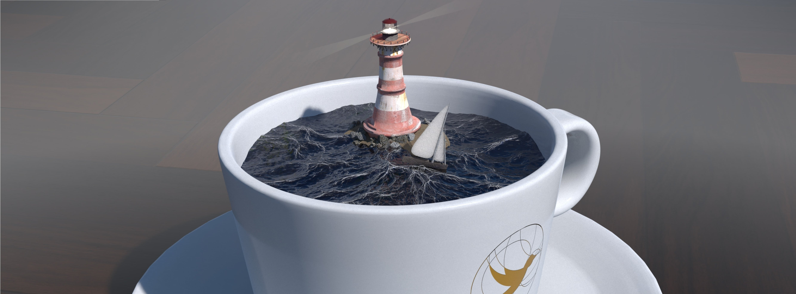
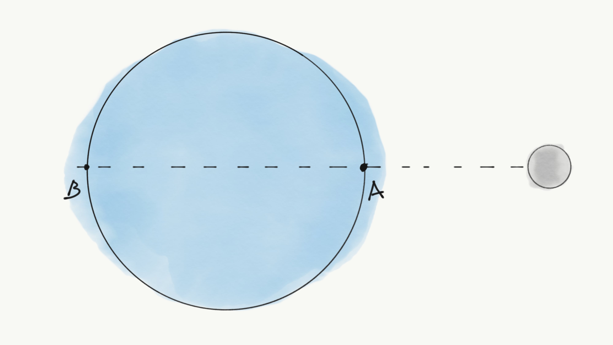
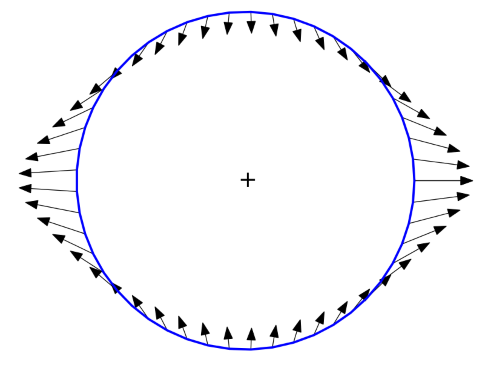

::: {.column-screen}

:::



::: {.lead-in}
De maan draait om de aarde en zijn zwaartekracht veroorzaakt eb en vloed. Maar waarom heeft een zwembad geen eb en vloed? En een kop koffie? Het menselijk lichaam bestaat voor het grootste gedeelte uit water. Staat dat niet ook onder invloed van de maan? Zolang je al deze mooie vragen stelt, kun je er bijna zeker van uitgaan dat wat je dacht dat eb en vloed veroorzaakt, niet juist is.
:::

Herinner je je nog, op de middelbare school, dat de natuurkundeleraar alle lucht uit een grote, doorzichtige koker liet zuigen en dat er in die koker verder niets anders dan een veertje en een stalen kogel of iets dergelijks zat? En dat ze vervolgens vroeg of jullie konden voorspellen welke het eerste de bodem zou raken als ze de koker zou omdraaien?

Uiteraard bleken beide objecten met exact dezelfde snelheid op de bodem te vallen. We leerden dat het niet uitmaakt dat de stalen kogel meer massa heeft dan de veer. De zwaartekracht van de aarde heeft dezelfde uitwerking op beide dingen. Alles, eigenlijk, dat door de zwaartekracht van onze planeet naar beneden wordt 'getrokken', valt met dezelfde snelheid, ongeacht hoe groot de massa van de dingen is (als we iedere vorm van frictie even buiten beschouwing laten).

# Zwaartekracht van de maan

Hoewel de zwaartekracht van de maan kleiner is dan die van de aarde is het principe hetzelfde. Ongeacht de massa van een object valt het recht naar het maanoppervlak met precies dezelfde snelheid als ieder ander ding. Op 2 augustus 1971 toonde NASA-commandant David Scott aan dat een [hamer en een veer](https://apod.nasa.gov/apod/ap111101.html) tegelijk op de maanbodem vallen.

::: {style="width: 75%; margin: 0 auto;"}
](Apollo_15_FH.jpg)
:::

De zwaartekracht van de maan is sterk genoeg voor een merkbaar effect op aarde, zoals we weten. Het is inderdaad de reden waarom onze oceanen eb en vloed kennen. Maar als de zwaartekracht van de aarde of de maan op dezelfde manier objecten beïnvloedt, ongeacht hun massa, hoe komt het dan dat bijvoorbeeld een badkuip geen getijden heeft? Ja, het heeft minder massa, maar commandant David Scotts experiment toonde aan dat dit niet uitmaakt. En als de zwaartekracht van de maan in staat is om immense massa's water, zoals complete oceanen, letterlijk meters omhoog te trekken, hoe komt het dan dat onze badeend niet in de lucht begint te zweven zodra de maan even boven onze huizen zwiept?

Het antwoord is zowel voor de hand liggend alsook enigszins tegenstrijdig: omdat de zwaartekracht van de maan verwaarloosbaar klein is, behalve wanneer het dat niet is.

# Verkeerd beeld

Laten we naar de vereenvoudigde situatie van Figuur 1 kijken. Om het allemaal iets simpeler te maken, stellen we onze planeet voor als een grote waterbal. Er zijn voorlopig geen continenten.

::: {style="width: 80%; margin: 0 auto;"}

:::

De eerste misconceptie. Hoewel het intuïtief het geval lijkt, wordt de uitstulping bij punt A *niet* veroorzaakt doordat de zwaartekracht van de maan aan dat punt trekt, in tegenstelling tot wat regelmatig geschreven wordt.

Bovendien zou je in veel stukjes de volgende onjuiste verklaring voor de uitstulping bij punt B kunnen aantreffen. "De aantrekkingskracht van de maan is kleiner bij punt B dan bij punt A, dus punt B blijft waar het is, terwijl punt A verder richting de maan wordt aangetrokken. Alles tussen A en B wordt als een soort kauwgom uitgerekt. Dus, vanuit het perspectief van iemand die (op 't vaste land) bij punt B staat, stijgt ook daar het water."

Dit is dus ook grotendeels onjuist. Het klopt dat de zwaartekracht van de maan bij B kleiner is dan bij A, maar dat is niet wat de uitstulping veroorzaakt bij punt B. Niet rechtstreeks, zoals hier beschreven, althans.

# Vele kleintjes maken één grote

Laten we de punten C en D bekijken op twee verschillende stukjes water in Figuur 2. De zwaartekracht van de maan werkt op die twee punten onder een hoek, zoals is weergegeven door de blauwe pijlen of vectoren. Tegelijkertijd wordt de gehele aarde door diezelfde zwaartekracht lichtelijk richting de maan verplaatst zoals gemodelleerd is door de rode vector.

::: {style="width: 80%; margin: 0 auto;"}

:::

Dus, punten C en D ondergaan twee gelijktijdige krachten zoals expliciet weergegeven in Figuur 3. Merk op dat de blauwe en rode vectoren verschillende hoeken hebben. Onze natuur- en/of wiskundeleraar op de middelbare school leerde ons vervolgens dat twee of meer krachten uitgeoefend op hetzelfde punt gemodelleerd kunnen worden als één nettokracht, de resultante.

Nu volgen twee belangrijke stappen:

1. Newton leerde ons dat een kracht een versnelling is, dus de pijlen in Figuur 3 zien we vanaf nu als een versnelling.
2. Om de versnelling van het stukje water van de punten C en D ten opzichte van het aardoppervlak te bepalen, trekken we de rode vector af van de blauwe vector. Wat we overhouden is de groene vector, de resultante.

::: {style="width: 75%; margin: 0 auto;"}

:::

In Figuur 3 wordt vertoond hoe de combinatie van de twee rode en blauwe brutokrachten een nettokracht opleveren, hier gerepresenteerd door de groene vectoren. Let op: de nettokrachten zijn wat we schijnkrachten noemen. Denk aan een auto die plotseling optrekt. Ten opzichte van de grond beweegt je hoofd nog even niet, maar gezien vanuit de auto lijkt het alsof je hoofd door een onzichtbare kracht naar achteren wordt geduwd. Een getijde wordt dus veroorzaakt door wat in het Engels een 'tidal force' wordt genoemd, een schijnkracht.

Welnu, als we het bovenstaande uitvoeren voor heel veel punten, verkrijg je de groene vectoren zoals weergegeven in Figuur 4. En warempel, alle groene (hier zwarte) pijlen blijken zich te hebben gerangschikt als waren het de uitstulpingen van de getijden.

::: {style="width: 80%; margin: 0 auto;"}

:::

Dit laat zien wat er eigenlijk plaatsvindt: ieder minuscuul stukje water wordt beïnvloed door een heel klein beetje nettokracht in de richting van waar de uitstulpingen zullen ontstaan, daarbij ieder ander stukje water voor zich uit duwende, richting de uitstulpingen, daarmee überhaupt de uitstulpingen veroorzakend.

In de tekening zijn alle pijlen veel te groot weergegeven, zodat we ze kunnen zien. In werkelijkheid zijn de nettokrachten miniem. Microscopisch miniem.

En dit is de sleutel om de paradox op te lossen. Hoewel een nettokracht, als gevolg van de zwaartekrachtsinvloeden van de maan, volkomen insignificant is op een enkel stukje water, is de hoeveelheid oceaan op aarde bepaald het tegenovergestelde van verwaarloosbaar. De immense optelsom van alle nettokrachten op ieder kubiek stukje in de oceanische vloeistof is kortom zéér significant en in sommige gevallen, afhankelijk van de vorm van het vaste land, levensgevaarlijk significant.

# Conclusie

De invloed van de maan op kleine dingen is minuscuul. Het heeft volstrekt geen merkbare invloed op je koffie, je lichaam, je badkuip, vijvers en meren. Ieder getij in een kop koffie zal kleiner zijn dan een bacterie dik is -- een effect dat onmiddellijk teniet gedaan wordt door de aanwezigheid van een bacterie in je koffie die z'n rugcrawl oefent. Als je koffie toch getijden begint te vertonen, bereid je voor op de Apocalypse en/of ontsnapte dinosauriërs. Hoe dan ook, er is dan iets goed mis.

Zelfs een meer ter grootte van [Lake Michigan](https://goo.gl/maps/6adDET7G3BJ2) zal enkel een paar centimeter omhoog komen — met gemak tenietgedaan door het kabbelende wateroppervlak op een zonnige lentedag. Dus je kunt het je voorstellen dat je lichaam er totaal niets van merkt. Alleen al de bloeddruk benodigd om zuurstof naar je hersenen te vervoeren verpulvert iedere getijde-invloed van de maan — die sowieso kleiner zou zijn geweest dan de dikte van een haar. Als je het gevoel hebt minder in staat te zijn tot rationele gedachten, weet je nu dat het niet de maan is. Maar check je bloeddruk.

In het geval van een oceaan, een vloeibaar lichaam met heel, heel, heel erg veel kleine, waterdeeltjes die vrijelijk over elkaar kunnen rollen en schuiven, zullen er echter inderdaad uitstulpingen verschijnen, daar waar de maan even langs wipt. Het opkomen van de uitstulping geschiedt daarbij door een duwen en niet een trekken.

::: {.callout-note appearance="minimal"}
Kortom, er zijn octiljoen minuscuul kleine nettokrachten op ieder kubiek stukje oceaanwater die een opwaartse stuwing veroorzaken waardoor de twee uitstulpingen ontstaan. Meren, vijvers, badkuipen, menselijke lijven en koffiemokken komen niet eens een beetje in de buurt van die hoeveelheid.
:::

::: {.callout-tip appearance="simple" title="Noot"}
Het oorspronkelijke artikel verzuimde te vermelden dat de getijden het resultaat zijn van een schijnkracht, wat leidde tot een fundamenteel misverstand omtrent Figuur 3 en 4. Dit is gecorrigeerd.
:::

---

*Figuur 4 is een bewerkte weergave (uitsnede) van het origineel vervaardigd door [Krishnavedala](https://en.wikipedia.org/wiki/User:Krishnavedala) onder [CC BY-SA 3.0](https://creativecommons.org/licenses/by-sa/3.0/deed.en).*

*We hebben de draaiing van de aarde, het Coriolis-effect, de aanwezigheid van de zon en land, etc. niet in beschouwing genomen om het simpel te houden. Dit verandert de situatie enigszins, maar verder niet de essentie van het verhaal.*