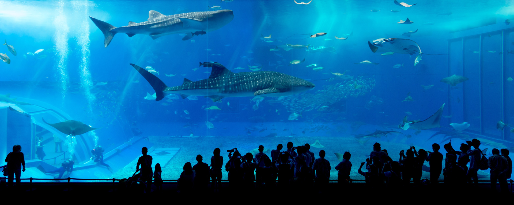
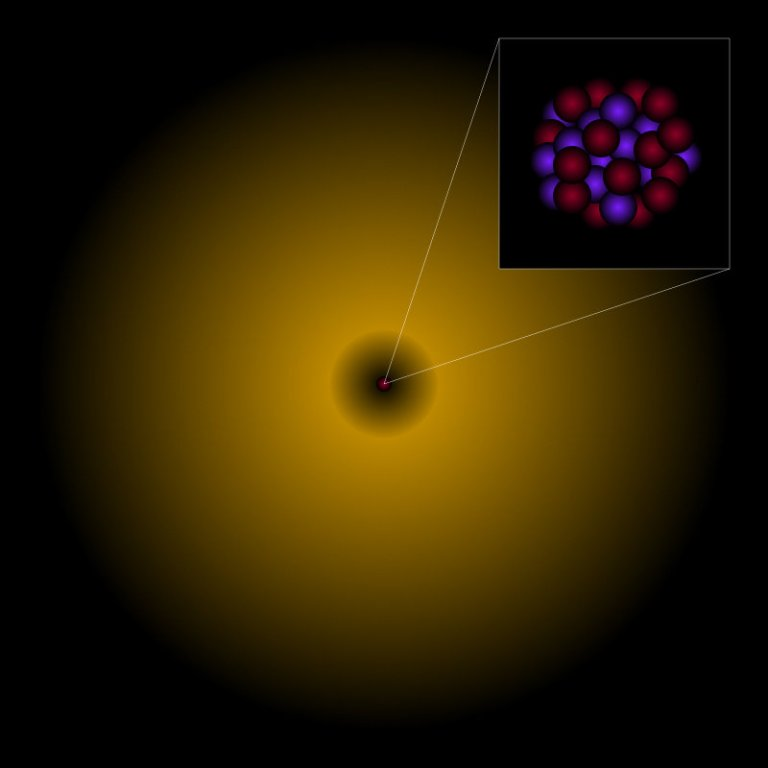
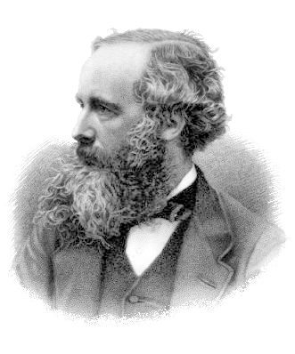
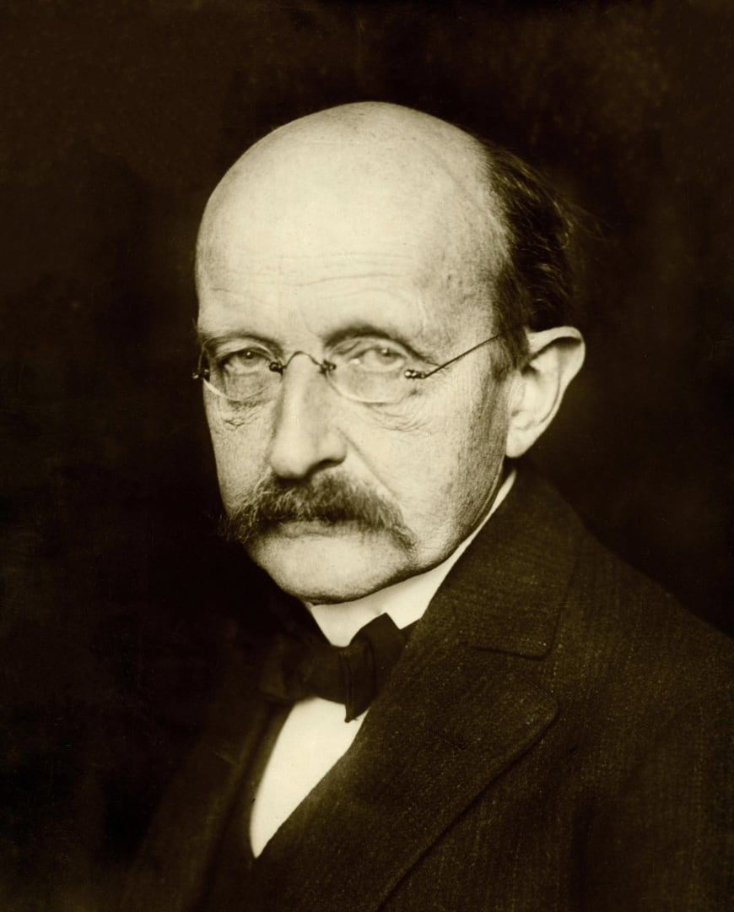

::: {.column-screen}
{width="100%"}
:::

::: {.column-margin}
::: {.author-sidebar}
{.author-photo}

::: {.author-name}
[**KJ Runia, BSc (Hons) MInstP AMIMA**](../../about.qmd)
:::

::: {.author-bio}
Initiatiefnemer & auteur. Heeft een Bachelor of Science (Honours) in wiskunde en natuurkunde van de School of Mathematics and Statistics en de School of Physical Sciences van de Britse universiteit The Open University, Walton Hall, Milton Keynes. Studeert momenteel voor een MPhys (Master of Physics). Is een Member van het Institute of Physics (IOP) en een Associate Member van het Institute of Mathematics and its Applications (IMA).
:::
:::
:::

::: {.lead-in}
Stel je eens voor dat doorzichtige materialen niet bestonden. Hoe zouden auto’s er dan uit zien? Hoe zou je vanuit je slaapkamer naar de koude wintermaan kunnen kijken zonder dat je het zelf koud kreeg? Zou lucht dan ook ondoorzichtig zijn? En hoe zit het dan met de lenzen van onze ogen? En als alle materialen uit moleculen bestaan, hoe kan het dan dat de moleculen van glas doorzichtig zijn en andere niet? Deze laatste vraag werd afgelopen week aan mij gesteld door de oudste[^1] zoon van één van mijn beste vrienden.
:::

Eerst zal ik proberen een zo kort mogelijk antwoord te geven. Als je beter wil weten hoe het zit, dan kun je verder lezen. Maar ik moet je wel waarschuwen. Het artikeltje is mogelijk wat lang. Het antwoord op deze op het oog eenvoudige vraag vraagt namelijk om een heleboel achtergrondkennis. Aan de andere kant, met zo’n briljante vraag vraag je er ook een beetje om.

::: {.callout-note icon=true appearance="default" title="Kort antwoord"}
Soms is de samenstelling van een molecuul zodanig dat de elektronen die daarin verwerkt zitten bijna niet reageren als er fotonen langs schieten. De elektronen laten dan de fotonen praktisch met rust. Hooguit veranderen ze de koers van de fotonen een beetje. In onze ogen is het materiaal dan transparant.

Als de elektronen wél reageren op invallende fotonen, kaatsen ze die fotonen weer terug of absorberen ze alle energie van die fotonen (die verdwijnen dan). Soms trillen ze dan een beetje en trillen de atomen een beetje mee (fonon), maar gebeurt er verder niets. Het materiaal warmt een minuscuul beetje op. Soms bewegen de elektronen zoveel dat ze heel snel daarna die energie weer kwijtraken waardoor nieuwe fotonen gecreëerd worden die weer verder gaan. Voor ons is het materiaal dan ondoorzichtig; de fotonen die weer van dat materiaal af komen, komen dan in onze ogen terecht.

Zo. Dit was het in het kort. Als je beter wil weten hoe de vork in de steel zit, lees vooral verder!
:::

# Moleculen, atomen, elementaire deeltjes

Waarschijnlijk weet je dit al wel, maar voor de zekerheid, alsnog: alle vaste stoffen, vloeistoffen en gassen bestaan uit moleculen. Hieronder zie je een foto van een groepje zogenaamde pentaceen-moleculen[^2] die door Canadese onderzoekers is gemaakt. Deze moleculen zijn niet in glas verwerkt, maar het geeft je een idee van hoe moleculen eruit kunnen zien.

{fig-align="center"}

Eén zo’n rupsje in de foto hierboven is dus een molecuul. Als ze sterk genoeg samengeklonterd zijn, vormen ze een vaste stof. Als ze toch langs elkaar kunnen bewegen, is het een vloeistof. En als ze heel veel kunnen bewegen ten opzichte van elkaar is het een gas.

Natuurlijk kunnen we het nog kleiner bekijken. Eigenlijk bestaan die moleculen namelijk weer uit atomen. Laten we daarom vooral even kijken naar een coole foto van één zo’n molecuul die Zwitserse natuurkundigen en een natuurkundige van Universiteit Utrecht hebben weten te maken in 2009[^3].

{fig-align="center"}

Je kunt hier misschien een vijftal zeshoekige vormen met uitsteeksels in zien. Op elke hoek en iedere uitsteeksel bevindt zich een atoom. De individuele atomen zie je dus niet – die zijn daar te klein voor. Maar je kunt wel de structuur goed zien die de aan elkaar vastliggende atomen met elkaar maken en zo het molecuul vormen.

Terug naar glas. Het glas in je slaapkamerraam bestaat uit een mix van verschillende soorten moleculen. Er zitten vooral een heleboel [siliciumdioxide-moleculen](https://nl.wikipedia.org/wiki/Siliciumdioxide) in, een hoop [natriumcarbonaat-moleculen](https://nl.wikipedia.org/wiki/Natriumcarbonaat), [calciumoxide-moleculen](https://nl.wikipedia.org/wiki/Calciumoxide), wat [magnesiumoxide-moleculen](https://nl.wikipedia.org/wiki/Magnesiumoxide) en dan ook nog wat [aluminiumoxide-moleculen](https://nl.wikipedia.org/wiki/Aluminiumoxide). Hieronder zie je één zo’n siliciumdioxide-molecuul uitvergroot, maar dan in de vorm van een tekening.

::: {style="width: 70%; margin: 0 auto;"}

:::

Zien ze er in het echt ook zo uit? Nee, absoluut niet. Het is maar een [model](https://nl.wikipedia.org/wiki/Model_(wetenschap)). In de wetenschap is een model puur een hulpmiddel en nooit een exacte kopie van de werkelijkheid. En toch gebruiken we modellen, want ze helpen ons om er toch enigszins een voorstelling van te kunnen maken waar je mee kunt werken. Je moet echter goed in het achterhoofd houden dat het model niet is zoals het molecuul er in het echt uitziet.

In (het model van) het siliciumdioxide-molecuul dat je hierboven ziet afgebeeld zijn drie atomen aanwezig: één siliciumatoom (grijs) en twee zuurstofatomen[^4] (rood). Je vraagt je natuurlijk af wat die twee staafjes aan weerszijden betekenen. Die symboliseren de elektronen die de atomen met elkaar delen. Atomen kunnen aan elkaar blijven plakken als ze elektronen met elkaar delen. Het geeft kortom aan hoe sterk de binding is tussen de atomen. Meerdere staafjes = sterkere binding.

Ieder atoom bestaat natuurlijk uit nog weer enkele onderdelen. Op één atoom na[^5] bestaan verder alle atomen uit drie soorten deeltjes: elektronen, protonen en neutronen. In de kern van een atoom zijn alle protonen en neutronen samengeklonterd. De elektronen zitten daaromheen in de vorm van een soort wolk. Omdat elektronen niet verder nog uit deeltjes bestaan, worden ze elementaire[^6] deeltjes genoemd. Hieronder zie je een model van een atoom.

::: {style="width: 70%; margin: 0 auto;"}

:::

De kern met alle protonen en neutronen is zo klein dat we hem meestal tekenen als een puntje of een bolletje, maar als je die zou uitvergroten, zou je een klontje met protonen en neutronen kunnen zien. De gele wolk daaromheen is model voor één of meer elektronen. (Als je precies wil weten waarom een wolk model is voor één of meer elektronen, kun je [Dit is geen atoom]() lezen.)

Het kan zijn dat een elektron verder van de kern af zit dan hier afgebeeld. Als een elektron bijvoorbeeld energie toegevoerd krijgt, dan springt het elektron verder af van de kern. Na een hele korte periode springt het elektron weer terug naar zijn oude positie rond de kern. En als het dat doet, verlaat die energie het atoom weer in de vorm van licht. Een van de manieren waarop het elektron energie verkrijgt, is lichtinval.

# Licht

Wat is licht? Is het een golf, bestaat het uit deeltjes? Heel lang wisten natuurkundigen niet precies wat het was. Sinds de zeventiende eeuw woedde het grote debat tussen natuurkundigen die het eens waren met [Sir Isaac Newton](https://nl.wikipedia.org/wiki/Isaac_Newton) en natuurkundigen die het eens waren met [Christiaan Huygens](https://nl.wikipedia.org/wiki/Christiaan_Huygens). Ik ben een beetje bang dat enkele natuurkundeleraren op scholen nog steeds denken dat het een groot raadsel is. Een van mijn natuurkundeleraren op de middelbare school was er nog steeds niet over uit of het nou deeltjes zijn of golven. Helaas voor hem is het sinds iets minder dan honderd jaar geleden eigenlijk al wel duidelijk.

::: {style="width: 70%; margin: 0 auto;"}

:::

Ik ga je nu iets vertellen dat je niet snel op de middelbare school zult leren. Ik weet niet waarom dat zo is, maar misschien is het omdat de schrijvers van lesboeken vinden dat de wiskunde die erbij hoort te moeilijk is. Wat je hier gaat lezen is ongeveer wat je onder andere op de universiteit zal leren als je natuurkunde gaat studeren, maar dan zonder de wiskunde.

Het probleem is vooral dat de vraagstelling verkeerd is: ‘golf of deeltje’ suggereert dat het één van de twee is. Dat is onjuist. De vraag moet eigenlijk zijn: wat is licht? Het antwoord is dan: een veld[^7], eigenlijk een van de vele soorten velden die in ons universum aanwezig zijn en in dit geval is dat ’t elektromagnetische veld, en om heel precies te zijn: licht is een verstoring van dat elektromagnetische veld. Je kunt die verstoring beschouwen als een golf maar ook als een deeltje, afhankelijk van wat handiger is.

Bovendien, in de moderne natuurkunde is de betekenis van het woord ‘deeltje’ anders dan je normaal zou verwachten. In de natuurkunde is een deeltje eigenlijk een pakketje, een golfpakketje. Het is dus geen kogeltje, een klein balletje of zelfs een punt. Het is een pakketje met informatie dat we wiskundig als een golfje (een verstoring) beschrijven.

::: {style="width: 70%; margin: 0 auto;"}
 was een belangrijke, Nobelprijswinnende natuurkundige die enorme bijdragen heeft geleverd aan de quantumelektrodynamica.](richardfeynman-2.jpg)
:::

Volgens een van de beste theorieën van het universum die we nu hebben, de zogenaamde quantumelektrodynamica[^8] (QED), is het hele universum doordrenkt met een meestal onzichtbaar – maar soms dus wel degelijk zichtbaar! – elektromagnetisch veld. In de meeste gevallen doet dat veld helemaal niets. Je voelt het niet, je ruikt het niet, je ziet het niet.

Echter, als het elektromagnetisch veld op een bepaalde plek in het universum wordt verstoord – bijvoorbeeld aan de binnenkant van een LED-lamp in jullie toilet – dan rolt die verstoring meestal alle kanten op, vanaf die bepaalde plek in het universum naar de rest van het universum – in dit geval de ruimte van jullie toilet. En die verstoring zie je! Ik weet niet hoe jullie slang, kat en kippen die verstoring noemen, maar mensen noemen die dus licht.

::: {style="width: 70%; margin: 0 auto;"}

:::

Als je enorm zou kunnen inzoomen met je ogen, zou je echter zien dat het licht eigenlijk uit miljarden en miljarden en miljarden ienieminiverstoringen bestaat. Licht is eigenlijk een bundel met ienieminiverstoringen van het alom aanwezige elektromagnetisch veld. Die ienieminiverstoringen werden vroeger door onder andere [Albert Einstein](https://nl.wikipedia.org/wiki/Albert_Einstein) ‘lichtquanta’ genoemd, maar sinds 1928 noemen we ze fotonen[^9]. In populaire boeken en magazines worden ze ‘deeltjes’ genoemd en zelfs ook door natuurkundigen. Maar nogmaals, eigenlijk zijn het dus geen kleine balletjes of kogeltjes of iets dergelijks. Het woord ‘deeltje’ geeft alleen maar aan dat het iets kleins is, maar zegt het verder niets over hoe het eruit ziet. Als model wordt wel vaak een balletje of puntje gebruikt, maar, wederom, dat is dus niet wat het is noch hoe het eruit ziet. Fotonen zijn overigens net als elektronen elementair.

Op de middelbare school en op de universiteit wordt ook wel een golfmodel gebruikt om licht te beschrijven en ermee te rekenen. De grote wis- en natuurkundige [James Clerk Maxwell](https://nl.wikipedia.org/wiki/James_Clerk_Maxwell) was een van de grondleggers van het wiskundige raamwerk voor het golfmodel voor het licht. Hij en anderen voor hem hebben ervoor gezorgd dat we ook vandaag de dag nog vaak van ‘lichtgolven’ spreken, in plaats van fotonen. De klassieke elektromagnetische theorie van Maxwell werkt zo goed dat het verplichte leerstof is voor natuurkundestudenten. Daarom is het ook helemaal niet verkeerd om te spreken van lichtgolven.

{fig-align="center"}

In de twintigste eeuw ontdekten natuurkundigen echter dat de quantumelektrodynamica meer fenomenen wist te voorspellen en te verklaren dan Maxwells klassieke elektromagnetische theorie, dus die eerste heeft die laatste min of meer vervangen. Anders gezegd, Maxwells theorie kun je op veel gebieden nog steeds prima toepassen in de industrie, maar met QED kun je zowel wat Maxwells theorie kan plus nog heel wat meer.

Zo gaat dat vaak in de natuurkunde. De [zwaartekrachtwet](https://nl.wikipedia.org/wiki/Wet_van_de_universele_zwaartekracht) van [Sir Isaac Newton](https://nl.wikipedia.org/wiki/Isaac_Newton) werkt bijvoorbeeld uitstekend. Je kunt het zelfs toepassen voor landingen op Mars. Maar met de zwaartekrachttheorie van [Albert Einstein](https://nl.wikipedia.org/wiki/Albert_Einstein), de zogenaamde [algemene relativiteitstheorie](https://nl.wikipedia.org/wiki/Algemene_relativiteitstheorie), kun je wat Newtons theorie kan en nog veel meer, en behoorlijk wat preciezer ook nog. Dus de algemene relativiteitstheorie heeft Newtons zwaartekrachtwet min of meer vervangen. En toch is die laatste verplichte leerstof op de middelbare school en op de universiteit. Hij is namelijk niet fout, hij is zelfs zeer bruikbaar! Maar hij kent dus ook zijn beperkingen. Daarom leren we eerst Newtons zwaartekracht en daarna leren natuurkundestudenten pas over Einsteins zwaartekracht. Zonder Einsteins algemene relativiteitstheorie hadden Google Maps en routeplanners met GPS-systemen bijvoorbeeld nooit goed gewerkt.

En daarom leren natuurkundestudenten eerst alles over Maxwells golftheorie en pas aan het einde van hun studie over quantumelektrodynamica. Zonder quantumelektrodynamica had je nooit computerchips gehad, geen internet, geen mobiele telefoons, geen touchscreens.

# Licht en energie

De grote natuurkundige [Max Planck](https://nl.wikipedia.org/wiki/Max_Planck) bedacht dat ieder foton een bepaalde hoeveelheid energie had. Hij bedacht ook dat bij ieder energieniveau het licht een andere kleur heeft. Zo heeft felblauw licht meer energie dan diepdonkerrood licht. En soms heeft het licht (= hebben de fotonen) zoveel energie dat ze onzichtbaar zijn voor menselijke ogen. Zo is het hoog-energetische ultraviolet[^10] licht (UV-licht) onzichtbaar voor ons. Maar als je ogen veel gevoeliger waren dan ze nu zijn, zou je dus een enorm fel ‘violetter-dan-violetkleurig’ licht kunnen zien. En omgekeerd heeft het licht soms heel weinig energie. Zo weinig zelfs dat het licht voor ons niet eens meer diepdonkerrood is, maar onzichtbaar. Zo is infrarood[^11] licht onzichtbaar voor ons, maar als onze ogen iets gevoeliger zouden zijn, zouden we dus ‘minder-rood-dan-roodkleurig’ licht kunnen zien.

::: {style="width: 70%; margin: 0 auto;"}

:::

WiFi en 4/5G zijn ook licht. De fotonen hebben maar heel weinig energie als je het vergelijkt met de fotonen in jullie toilet. Als onze ogen duizenden keren gevoeliger waren dan ze nu zijn, zou je hebben gezien dat de antennes in de WiFi-router en de mobiele telefoons eigenlijk lampjes zijn die ‘minder-rood-dan-minder-rood-dan-minder-rood-dan-(duizenden keren ‘minder-rood-dan’)-roodkleurig’ licht zouden verspreiden.

Het elektromagnetische veld dat ons hele universum bestrijkt kan dus op allerlei energieniveaus verstoord worden. En afhankelijk van het energieniveau ‘oogt’ het licht anders. Het heeft een andere kleur of – en in de meeste gevallen is dat zo – het is onzichtbaar. Onze ogen zijn niet de gevoeligste instrumenten om iets mee te zien. Van alle mogelijke energieniveaus die het elektromagnetische veld kan aannemen, zien we er maar een paar. Dat gedeelte noemen we het zichtbare licht.

Een ander woord voor verstoringen in het elektromagnetisch veld is *elektromagnetische straling*. En afhankelijk van het energieniveau van die straling hebben we weer andere termen voor die straling, zoals ‘radioactieve straling’ of ‘gammastraling’. Maar al deze verschillende vormen – het licht in jullie toilet, de WiFi in huis, 4/5G voor je mobiele telefoon, de koplampen van de auto, de radiogolven van de buurman, de Bluetooth-speaker van je ouders, de röntgenfoto’s bij de tandarts, de magnetron – zijn allemaal licht, zijn allemaal elektromagnetische straling, zijn allemaal verstoringen van hetzelfde elektromagnetisch veld. *Het enige verschil is het energieniveau van die verstoring.*

De juiste volgorde van heel weinig naar levensgevaarlijk veel energie is als volgt: radio, WiFi, magnetron[^12], 4/5G >> infrarood licht (afstandsbediening tv) >> zichtbaar licht (toiletlamp, discolampen) >> UV-licht (nu moet je voorzichtig zijn, goed insmeren in de zomer) >> röntgenstraling (alleen toegepast door professioneel medisch personeel) >> gammastraling (dodelijk, behalve voor [Bruce Banner](https://opencurve.info/wp-content/uploads/2019/10/professor-hulk-1.jpg)) >> kosmische straling (dodelijk, behalve voor [Captain Marvel](https://opencurve.info/wp-content/uploads/2019/10/captain-marvel-image-brie-larson-1.jpg)).

::: {.callout-note appearance="minimal"}
Omdat de meeste elektronen in de muren van het huis nauwelijks reageren op elektromagnetische verstoringen (fotonen) met het energieniveau van WiFi (heel weinig energie), zijn de muren voor WiFi-fotonen bijna transparant. Daarom ontvang je gewoon WiFi dwars door de muren heen. Als je ogen dus gevoelig genoeg waren, zou je het licht van de router dwars door de muren heen kunnen zien. Maar diezelfde elektronen reageren wel op fotonen met het veel hogere energieniveau dat overeenkomt met het zichtbare licht. Daarom vliegen die fotonen niet dwars door de muur heen. En daarom vinden wij dat muren ondoorzichtig zijn. Echter reageren diezelfde elektronen juist weer niet bij het nog weer veel en veel hogere energieniveau dat past bij röntgenstraling. Dit is precies de reden waarom muren wel weer doorzichtig zijn voor [Superman](https://nl.wikipedia.org/wiki/Superman).

Afhankelijk van de samenstelling van de moleculen en atomen reageren elektronen op fotonen van verschillende energieniveaus. Als de elektronen van het betreffende materiaal niet reageren op de fotonen die op het energieniveau zitten van het voor ons zichtbare licht, is het materiaal voor ons doorzichtig.
:::

Hieronder zie je een schema van het volledige spectrum[^13] van elektromagnetische straling (klik erop om uit te vergroten). Zoals je ziet is maar een klein gedeelte zichtbaar voor ons.

GHz verwijst naar de frequentie van het foton en is een maat voor de hoeveelheid energie die ieder foton bezit. Hoe hoger de frequentie des te hoger de energie. De ultraviolette straling begint op een gegeven moment gevaarlijk te worden voor ons. Dat is het moment waarop onze lichaamscellen beschadigd raken (‘DNA damage’). Zolang je niet te lang in de zon ligt en zolang het nemen van röntgenfoto’s maar heel kort duurt, is er nog niets aan de hand. Maar wees er voorzichtig mee! Nogmaals, gammastraling en kosmische straling zijn dodelijk. Ik begrijp dat je het misschien niet prettig en comfortabel vindt zitten, maar alsjeblieft, luister naar je ouders als je een ruimtewandeling gaat maken. Trek gewoon je ruimtepak aan.

# Beïnvloedbare elektronen

Natuurkundigen zoals Albert Einstein ontdekten in de vorige eeuw dat elektronen beïnvloed kunnen worden door invallende fotonen[^14]. Het hangt echter wel heel erg af van hoe die elektronen gevangen zitten in de moleculen – en dat hangt weer af van de soort atomen waaruit die moleculen zijn opgebouwd – bij welk energieniveau van die fotonen de elektronen reageren.

Bij glas is het zo dat de elektronen de elektromagnetische verstoringen wel een heel klein beetje voelen. Daardoor gaan de elektronen toch een heel klein beetje anders bewegen dan ze normaal gesproken doen. Die beweging zorgt ervoor dat er weer een verandering plaatsvindt in het deel van het elektromagnetische veld dat zich in het glas bevindt. En die verandering in het elektromagnetische veld zorgt er dan weer voor dat de fotonen (de invallende verstoringen van datzelfde elektromagnetisch veld) toch iets afbuigen.

Daarom zie je toch vaak een vertekend beeld als je door glas heen kijkt of als lichtstralen van lucht naar water overgaan (want water bevat ook elektronen die reageren op invallende fotonen). De elektronen reageren niet genoeg waardoor de fotonen er wel gewoon dwars doorheen gaan, maar reageren wel net genoeg om de koers van de fotonen iets te wijzigen. Of een heleboel te wijzigen, zoals je in het water kunt zien in de foto hierboven. In mijn artikel [Waarom veroorzaken glas en vloeistoffen lichtbreking?]() duiken we in de materie.

# Waarom is glas doorzichtig?

::: {.callout-note appearance="minimal"}
Kortom, glas is doorzichtig omdat de elektronen in glasmoleculen niet in staat zijn om heel erg te reageren op invallende elektromagnetische verstoringen (fotonen). Wel iets. Dus ze veranderen wel een beetje de koers van de fotonen.
:::

Er zijn stoffen waarin de elektronen op alle energieniveaus van invallende fotonen reageren behalve bij de energieniveaus van blauw licht bijvoorbeeld. Van blauw licht worden ze niet warm of koud. Dat betekent dus dat het blauwe licht gewoon dwars door het materiaal heen gaat terwijl de rest bijvoorbeeld wordt tegengehouden. Voor ons lijkt het dan dat het materiaal een blauw filter is.

Je kunt ook materialen fabriceren waarin de elektronen ontzettend sterk reageren op de fotonen van al het zichtbare licht. Zo sterk zelfs dat de fotonen weer volledig teruggekaatst worden. Wij zien het materiaal dan als reflecterend. En als die reflecterende werking optimaal is, noemen we het een spiegel.

Let op, we hebben het hier vooral over de fotonen die wij kunnen zien. Voor ons mensen is het meeste glas doorzichtig. Toch kunnen we een bepaald type glas maken die de voor ons zichtbare fotonen (zichtbaar licht dus) doorlaten, terwijl er vogelsoorten zijn die datzelfde glas ervaren als iets dat veel minder doorzichtig is.

Wij kunnen bijvoorbeeld UV-licht niet meer zien. Vogels nog wel. Als de ramen zodanig worden gefabriceerd dat ze UV-licht niet doorlaten, maar voor ons zichtbaar licht wel, zijn de ramen dus veel minder doorzichtig voor vogels en knallen ze er niet tegenaan.

Dus eigenlijk zou het antwoord op de vraag, ‘En als alle materialen uit moleculen bestaan, hoe kan het dan dat de moleculen van glas doorzichtig zijn en andere niet?’, een wedervraag moeten zijn: ‘Doorzichtig voor wie? Voor vogels? Of voor mensen?’

[^1]: Als ik me niet vergis is hij dertien jaar op het moment dat ik dit schrijf.
[^2]: Dinca, L. E. *et al.* (2015) "Pentacene on Ni(111): Room-Temperature Molecular Packing and Temperature-Activated Conversion to Graphene," *Nanoscale*, 7(7), pp. 3263–3269. doi: [10.1039/C4NR07057G](https://doi.org/10.1039/C4NR07057G).
[^3]: Gross, L. *et al.* (2009) "The Chemical Structure of a Molecule Resolved by Atomic Force Microscopy," *Science*, 325(5944), pp. 1110–1114. doi: [10.1126/science.1176210](https://doi.org/10.1126/science.1176210).
[^4]: Een ander woord voor zuurstof is ‘oxide’. In het Engels is het ‘oxygen’. Beiden zijn afgeleid van een samenstelling van de oud-Griekse woorden voor ‘scherp’ (ὀξύς, oxús) en ‘geboorte’ (γένος, génos) en het Latijnse woordje voor ‘zuur’, namelijk acidus. En ‘di’ komt van het oud-Griekse woordje δίς (dís) dat ‘twee keer’ betekent. Omdat het molecuul uit twee zuurstofatomen bestaat, is de officiële scheikundige benaming van het molecuul dus siliciumdioxide.
[^5]: Het waterstofatoom.
[^6]: ‘Elementair’ is afkomstig van het Latijnse woordje elementum. Het betekent onder andere zoiets als het ‘eerste principe’. Aan alles dat elementair is, ligt niets anders ten grondslag. Dat wat elementair is, vormt altijd de basis voor andere dingen.
[^7]: In de wiskunde noemen we het een ijkveld. In het Engels noemen we dat een gauge field. Het is heel abstracte wiskunde. Maar hoe abstract het ook is, het blijkt immens praktische toepassingen te hebben. Zo hadden mobiele telefoons niet bestaan zonder deze abstracte wiskunde.
[^8]: ‘Quantum’ is van oorsprong een Latijns woord dat ‘hoeveel’ betekent. Natuurkundigen gebruiken het in de betekenis van ‘deeltje’. Het meervoud is quanta. In Engelstalige landen worden ze precies zo genoemd, one quantum, two or more quanta (of gewoon particle/particles). In Nederland was de officiële spelling vroeger ‘kwantum’ en ‘kwanta’. Tegenwoordig mogen we het ook met een q schrijven. Mijn voorkeur gaat uit naar quantum en quanta. ‘Elektro’ verwijst naar de samenhang met elektriciteit en ‘dynamica’ komt uit het Grieks (δυναμικός, dunamikós, ‘krachtig’) en duidt erop dat de theorie krachten en veranderingen beschrijft.
[^9]: Dat komt dan weer van het oud-Griekse woordje φῶς, phôs, dat ironisch genoeg dan wel weer ‘licht’ betekent.
[^10]: ‘Ultra’ is Latijn voor ‘voorbij’. Met andere woorden, ultraviolet betekent eigenlijk voorbij het violet.
[^11]: ‘Infra’ is Latijn voor ‘beneden’. Dus infrarood is ‘beneden’ of ‘minder dan’ rood.
[^12]: Als je wil weten of magnetronstraling dodelijk is, lees dan mijn artikel [Is straling van magnetrons schadelijk voor de gezondheid?]() eens.
[^13]: ‘Spectrum’ is Latijn voor ‘verschijning’. Dus als je over het spectrum spreekt van iets, zoals elektromagnetisme, dan doel je op alle verschijningsvormen ervan.
[^14]: Daar kreeg hij de Nobelprijs voor. Lees meer daarover in mijn artikeltje [De formule die Albert Einstein de Nobelprijs bezorgde en ons ervan zou moeten weerhouden de huid te verbranden.]()