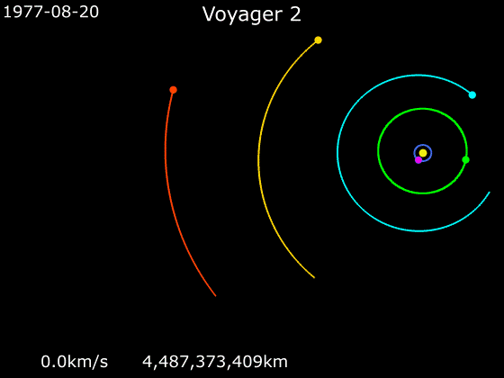

::: {.column-screen}
{width="100%"}
:::

::: {.column-margin}
::: {.author-sidebar}
{.author-photo}

::: {.author-name}
[**KJ Runia, BSc (Hons) MInstP AMIMA**](../../over.qmd)
:::

::: {.author-bio}
Initiatiefnemer & auteur. Heeft een Bachelor of Science (Honours) in wiskunde en natuurkunde van de School of Mathematics and Statistics en de School of Physical Sciences van de Britse universiteit The Open University, Walton Hall, Milton Keynes. Studeert momenteel voor een MPhys (Master of Physics). Is een Member van het Institute of Physics (IOP) en een Associate Member van het Institute of Mathematics and its Applications (IMA).
:::
:::
:::

::: {.lead}
Afgelopen kerst vroegen mijn vader en een van mijn twee broers hoe een zwaartekrachtsslinger van een ruimteschip bij een planeet precies werkt, waarbij het ruimteschip een extra zwieper meekrijgt terwijl het langs een planeet scheert. Ze realiseerden zich dat als een ruimtevaartuig door de zwaartekracht van een planeet wordt aangetrokken dat het een extra impuls krijgt, maar zodra het weer van de planeet wegvliegt, wordt door diezelfde zwaartekracht die impuls dan niet weer teruggenomen? Goede vraag natuurlijk, dus laten we snel bekijken hoe zo'n planetair duwtje in elkaar zit.
:::

# Symmetrie

Allereerst: het klopt. De hele situatie rondom de zwaartekracht van de planeet is symmetrisch. Oftewel, dezelfde 'kracht' die het vaartuig richting de planeet aantrekt waardoor het steeds sneller zal vliegen, zal, zodra het de planeet voorbij is, juist het tegenovergestelde gaan doen: het zal het vaartuig weer afremmen.

Maar wat is er verder dan nog dat _niet_ symmetrisch is in die situatie? Dat is het feit dat de planeet een omloopsnelheid heeft in een baan rondom de zon! Alle planeten in ons zonnestelsel vliegen in een baan om de zon. Hoewel op verschillende snelheden is hun positie ten opzichte van de zon iedere seconde weer anders. Dit feit gecombineerd met dat de planeten een flinke massa hebben leidt ertoe dat ze een een behoorlijke impuls hebben[^1]. En slimme klompjes menselijke cellen als wij af en toe zijn, kunnen dit uitbuiten.

Door gebruik te maken van de aantrekkingskracht van een planeet om het vaartuig te laten vallen richting die planeet, krijgt het vaartuig een extra duwtje door het simpele feit dat de planeet daarnaast zelf ook door de ruimte voortbeweegt. Dus ook al verliest het vaartuig zijn eerder door de zwaartekracht verworven impuls weer als het de planeet verlaat, het heeft wél een klap van de zweep meekregen van de omloopsnelheid van de planeet om de zon!

Stel dat je een Batman bent en je bent in het bezit van een grijphaak aan een koord dat met een motortje in je grijphaakpistool terug getrokken kan worden. En stel dat je op het perron staat in een treinstation. Er komt een trein aan, maar die stopt niet in dit treinstation. Die dendert gewoon voorbij, langs het perron. Jij begint mee te rennen, in de richting van waar de trein heen gaat. Je schiet de grijphaak op het dak van de trein en je drukt op de knop waardoor het koord je omhoog richting de trein trekt. Op precies het juiste moment laat je de haak en het koord los, spreid je je batvleugels en daar vlieg je weg. Je hebt een beetje gebruik gemaakt van de impuls van de trein.

En het klopt, dit betekent ook dat de trein een klein beetje impuls verloor omdat jij je van de trein hebt 'afgeduwd/afgezet'. Niettemin, door het grote verschil tussen jouw massa en die van de trein, in combinaties met de snelheden van beide, is het impulsverlies van de trein verwaarloosbaar, terwijl de toename in jouw impuls significant is.

Hetzelfde geldt voor de planeet. Een ruimtevaartuig die een zwaartekrachtsslinger uitvoert, of een gravity assist krijgt, zoals dat in het Engels heet, zal inderdaad de omloopsnelheid van de planeet om de zon, oftewel de impuls van de planeet, iets doen afnemen. En daarmee zal de planeet zelfs iets dichter bij de zon gaan bewegen. Uiteraard, gezien de verhouding tussen de massa's van het vaartuig en de planeet is het allemaal verwaarloosbaar.

# Voyager

Twee van de beroemdste voorbeelden van zwaartekrachtsslingers zijn Voyager [1](https://nl.wikipedia.org/wiki/Voyager_1) en [2](https://nl.wikipedia.org/wiki/Voyager_2). In de animatie hieronder, gemaakt door [Phoenix7777](https://commons.wikimedia.org/wiki/User:Phoenix7777), gepubliceerd onder [CC BY-SA 4.0](https://creativecommons.org/licenses/by-sa/4.0/deed.en), kun je het traject zien van Voyager 2, waar het zwaartekrachtsslingers kreeg van verschillende planeten van ons zonnestelsel. De aarde is het snel ronddraaiende, blauwe bolletje. Jupiter is groen, Saturnus is cyaan, Uranus is geel en oranje is Neptunus. En terwijl de Voyager-ruimtevaartuigen langs de planeten scheerden, stuurden ze enkele van de [beste ansichtkaarten](https://voyager.jpl.nasa.gov/galleries/images-voyager-took/) terug naar de aarde.

# Deceleratie

Uiteraard kun je ook het tegenovergestelde bewerkstelligen: je kunt het ruimtevaartuig vertragen. In dat geval laat je het in de tegenovergestelde richting vliegen ten opzichte van de bewegingsrichting van de planeet in zijn baan om de zon. Op die manier doneert het ruimtevaartuig een beetje impuls aan de planeet terwijl het zelf significant afremt.

Dus wat is de kerstboodschap? Precies. Zelfs de kleinste entiteit in dit universum is in staat om de impuls te veranderen van een hele planeet. Het maakt niet uit hoe klein, het effect is op één of andere manier altijd significant.

[^1]: Impuls, of momentum in het Engels, is massa vermenigvuldigd met de snelheid (in een bepaalde richting)