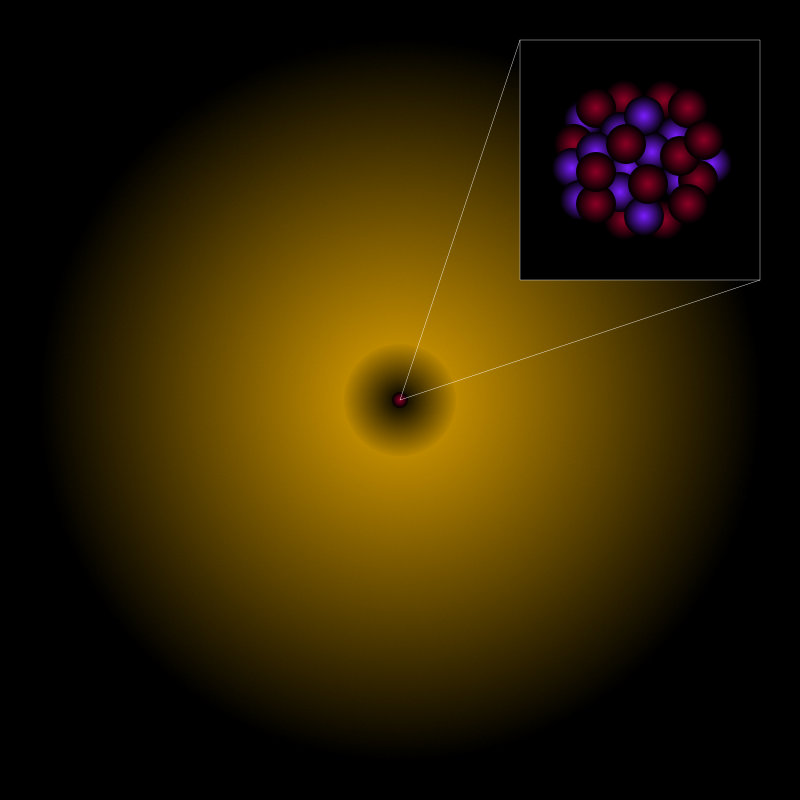
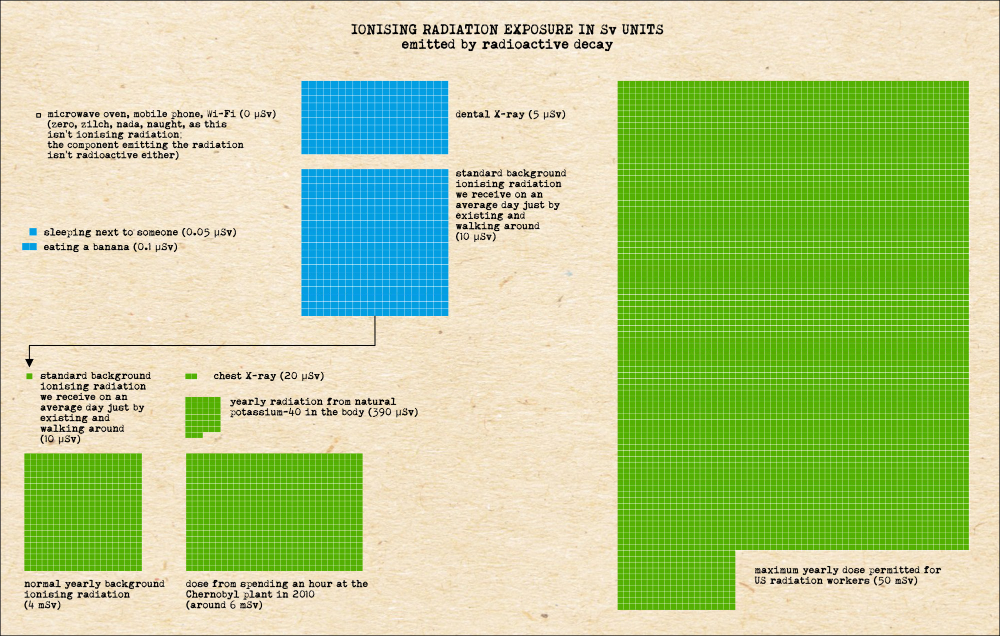
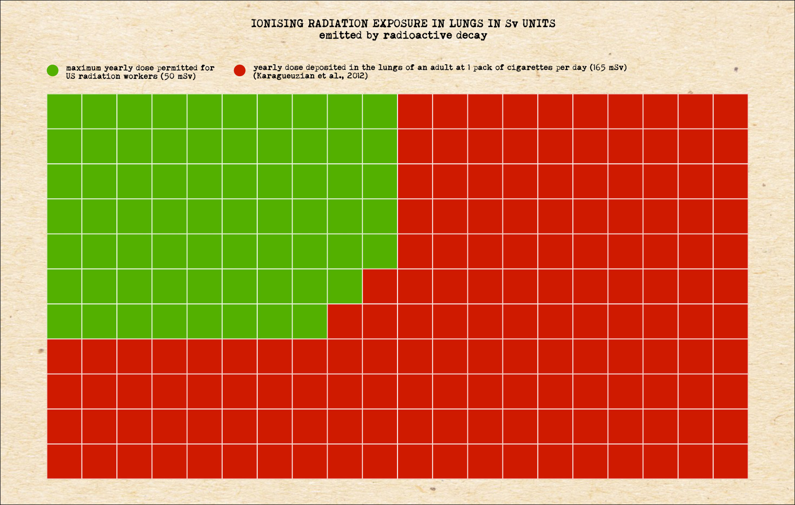

::: {.column-screen}

:::



::: {.lead-in}
As we discussed in a [previous article](../is-microwave-oven-radiation-unhealthy/), microwave ovens don't destroy atoms – their radiation simply isn't ionising radiation, while it's exactly the ionising stuff that is bad for your cells, such as gamma rays and cosmic rays. The latter reside at the high-energy end of the electromagnetic spectrum. We also mentioned that microwave oven radiation isn't the same as the radiation present in Chernobyl. Microwave ovens are not radioactive. But when *do* we call something radioactive then? What is radioactivity?
:::

# Unstable to the core

Matter is radioactive when the nuclei of its atoms are unstable enough to decay into different types of nuclei, emitting any of the following [ionising radiation](../is-microwave-oven-radiation-unhealthy/#ionising-radiation) in the process:

* [alpha rays](https://en.wikipedia.org/wiki/Alpha_particle), a stream of clumps of two protons and two neutrons;
* [beta rays](https://en.wikipedia.org/wiki/Beta_particle), a stream of electrons or positrons;
* [gamma rays](https://en.wikipedia.org/wiki/Gamma_ray), the higher-energy form of electromagnetic radiation beyond X-rays;
* [neutrinos](https://en.wikipedia.org/wiki/Neutrino), particles with almost negligible mass.

Two well-known examples of radioactive material are plutonium and uranium, mostly associated with nuclear power plants and nuclear weapons. Perhaps less known to be radioactive are radon-222, lead-210, polonium-210, and potassium-40.

Again, just to be clear: microwave ovens do not pour any of these particles over your food. Nothing gets "nuked". There's nothing nuclear going on. Your *food*, however, might very well be radioactive as it naturally contains potassium-40.

# A cartoon of an atom

Atoms consist of three constituents: electrons, protons, and neutrons. Only the most common hydrogen atom lacks neutrons; the rest is a composite of all three elements. In @fig-atom, a schematic cartoon of an atom is shown. The diffuse yellow glow represents the electron cloud, while the inset magnifies the atomic nucleus to reveal its protons and neutrons.

::: {style="width: 60%; margin: 1.5rem auto;"}
{#fig-atom fig-alt="Schematic diagram of an atom with a large golden spherical electron cloud and an inset box magnifying the compact central nucleus of red protons and purple neutrons."}
:::

What makes one atom different from another – say, calcium from potassium – is the number of electrons, protons, and neutrons. Protons and neutrons together are called **nucleons**. The number of protons is decisive: it determines which element of the [periodic table](https://en.wikipedia.org/wiki/Periodic_table#Overview) we are dealing with. Potassium has 19 protons. If it were to acquire or lose a proton, it would cease to be potassium. Calcium, by contrast, has 20 protons. 

The number 40 in "potassium-40" indicates that its nucleus contains 40 nucleons in total (19 protons and 21 neutrons). There are also stable potassium-39 (19 protons, 20 neutrons) and potassium-41 (19 protons, 22 neutrons).

Variations of the same chemical element with differing numbers of neutrons are called **isotopes**. Potassium-40 is a naturally occurring radioisotope.

# Radioactive decay

The nucleus of potassium-40 is unstable. It decays predominantly into calcium-40, which is a stable atom. During this decay, a neutron transforms into a proton, emitting a beta particle (a high-speed electron) and an antineutrino. This process is called radioactive decay because it actively radiates high-energy particles. The emitted electron travels at high speed and is ionising: it has sufficient kinetic energy to knock electrons out of nearby atoms, potentially damaging cellular molecules like DNA.

About 0.01% of the potassium in our bodies, acquired through diet, is potassium-40. In an average human adult, around 4,000 to 5,000 potassium-40 atomic nuclei decay every second. Thus, human bodies possess an intrinsic radioactivity of roughly 5,000 Bq (becquerel, named in honour of Henri Becquerel).

Bananas are likewise radioactive because they are rich in potassium, including potassium-40. A typical banana exhibits an activity of roughly 15 Bq.

# Ionising radiation and the human body

To assess the biological impact of ionising radiation on human tissue, physicists and medical professionals use the unit **sievert** (Sv), or more commonly millisieverts (mSv) and microsieverts ($\mu\text{Sv}$). The sievert measures the equivalent and effective radiation dose, weighting different radiation types by their biological damage potential.

The [International Commission on Radiological Protection](https://en.wikipedia.org/wiki/International_Commission_on_Radiological_Protection) (ICRP) estimates that an effective dose of 1 Sv carries approximately a 5.5% excess lifetime risk of fatal cancer.

Humans have evolved to withstand natural background radiation. @fig-exposure-1 illustrates the relative orders of magnitude of common radiation exposures, based on concepts popularised by Randall Munroe.

{.img-border #fig-exposure-1 fig-alt="Radiation exposure chart comparing doses using tiled blue and green square grids: from eating a banana (0.1 micro-sieverts) and dental X-rays to annual background radiation and the occupational dose limit of 50 millisieverts."}

# Smoking hot

Radiation exposure from consumer electronics or kitchen appliances is zero, but tobacco smoking presents a very different radiological reality.

Radioactive isotopes such as radon-222, polonium-210, and lead-210 naturally occur in soil and air, and are absorbed and concentrated by tobacco plants through phosphate fertilisers and airborne dust. These radionuclides settle on the sticky, glandular hairs of tobacco leaves and persist through curing and manufacturing.

When cigarette smoke is inhaled, sticky insoluble tar traps polonium-210 and lead-210 in the bifurcations of the bronchial tree. Over years of smoking, alpha-emitting polonium-210 accumulates in local tissue "hotspots", continually bombarding epithelial cells with high-energy alpha particles.

{.img-border #fig-exposure-2 fig-alt="Grid comparison chart displaying the 50 mSv occupational radiation worker annual limit in green squares against the much larger 165 mSv localized cigarette smoke lung dose represented in a dominating field of red squares."}

Research indicates that an individual smoking 1.5 packs of cigarettes per day receives a localized annual radiation dose to bronchial tissue estimated at roughly 160 to 165 mSv (@fig-exposure-2). For comparison, the maximum allowed annual occupational radiation dose for radiation workers in the United States and Europe is 20 to 50 mSv. 

While public anxiety often focuses on harmless, non-ionising sources such as Wi-Fi routers and microwave ovens, the severe health risk of cigarette smoking is directly linked to intense, internal, ionising radiation coupled with chemical carcinogens.

---

### Image credits and references

* *Featured image: Adult wearing cap smoking a cigarette by Julia Sakelli via Pexels.*
* *Atom diagram, exposure comparison charts, and editorial illustrations by KJ Runia.*
* Little, J. B., Radford, E. P., McCombs, H. L. and Hunt, V. R. (1965). "Distribution of Polonium-210 in Pulmonary Tissues of Cigarette Smokers", *The New England Journal of Medicine*, 273(25), pp. 1343–1351. doi: [10.1056/NEJM196512162732501](https://doi.org/10.1056/NEJM196512162732501).
* Little, J. B., Radford, E. P. and Holtzman, R. B. (1967). "Polonium-210 in Bronchial Epithelium of Cigarette Smokers", *Science*, 155(3762), pp. 606–607. doi: [10.1126/science.155.3762.606](https://doi.org/10.1126/science.155.3762.606).
* Karagueuzian, H. S., White, C., Sayre, J. and Norman, A. (2012). "Cigarette Smoke Radioactivity and Lung Cancer Risk", *Nicotine & Tobacco Research*, 14(1), pp. 79–90. doi: [10.1093/ntr/ntr145](https://doi.org/10.1093/ntr/ntr145).