::: {.column-screen}

:::



::: {.lead-in}
Well-known for their central role in Einstein's Special Relativity, the Lorentz transformations are derived from the rotation of two frames of reference in standard configuration while time is taken to be an imaginary coordinate of spacetime. This geometric approach is rarely presented in undergraduate syllabi.
:::

> One might think this means that imaginary numbers are just a mathematical game having nothing to do with the real world. (...) It turns out that a mathematical model involving imaginary time predicts not only effects we have already observed but also effects we have not been able to measure yet nevertheless believe in for other reasons. So what is real and what is imaginary? Is the distinction just in our minds?
>
> --- Stephen Hawking

Even though there are many derivations of the Lorentz transformations across textbooks and lecture syllabi, one of the most elegant formulations remains the version Henri Poincaré alluded to, which Hermann Minkowski subsequently explored in what we now call Minkowski space.

Poincaré noted that when the time coordinate is treated as an imaginary quantity ($ict$), the transformations formulated by Hendrik Lorentz arise naturally from an ordinary Euclidean rotation between two reference frames in the complex plane.

The objective of this article is to derive the complete set of Lorentz boost equations:

$$
t' = \dfrac{t - vx/c^2}{\sqrt{1 - v^2/c^2}}
$$ {#eq-lorentz-t}

$$
x' = \dfrac{x - vt}{\sqrt{1 - v^2/c^2}}
$$ {#eq-lorentz-x}

$$y' = y,$$

$$z' = z,$$

where $(t, x, y, z)$ and $(t', x', y', z')$ are the coordinates of an event in two inertial frames. The primed frame $\mathcal{E}$ moves with uniform speed $v$ along the positive $x$-axis relative to the unprimed frame $\mathcal{M}$. The vacuum speed of light is denoted by $c$, and the factor $\gamma = (1 - v^2/c^2)^{-1/2}$ is the Lorentz factor.

# Standard configuration

Suppose Hermann stands at rest on the ground in frame $\mathcal{M}$ with his origin $O$ at his feet. Albert travels in his car, defining frame $\mathcal{E}$ with origin $O'$.

Their frames are in **standard configuration** (@fig-standard-config): at initial time $t = t' = 0$, their spatial origins coincide ($x = x' = 0$), and frame $\mathcal{E}$ moves along the common $x$-axis at constant relative velocity $v$. Motion along the $y$- and $z$-axes is zero.

::: {style="width: 70%; margin: 1.5rem auto;"}
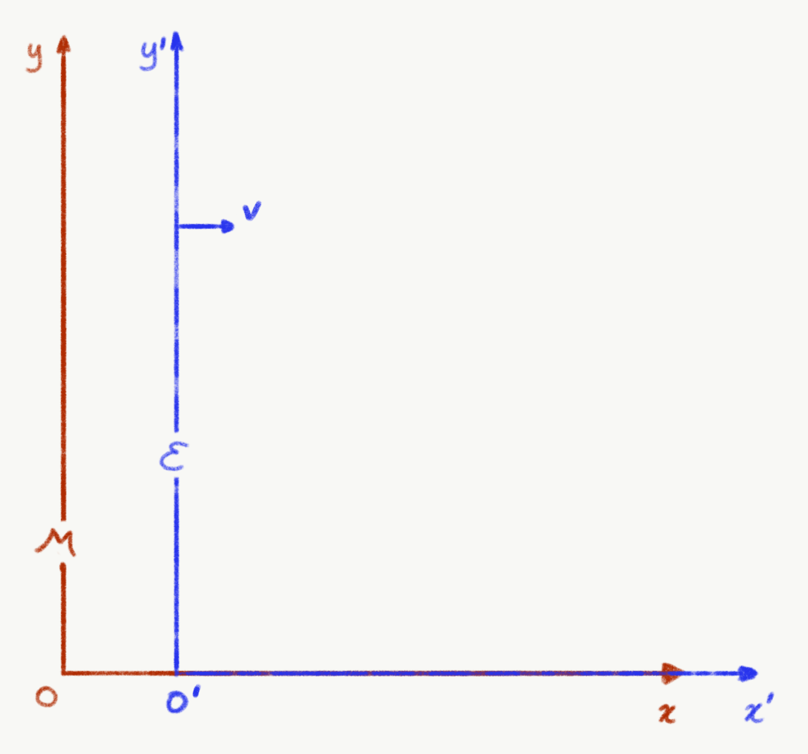{.img-border #fig-standard-config fig-alt="Standard configuration coordinate diagram of two inertial reference frames M (brown) and E (blue) moving along a common x-axis at velocity v."}
:::

In frame $\mathcal{M}$, the displacement of the origin of $\mathcal{E}$ after elapsed time $\Delta t$ is given by the law of uniform motion:

$$
\Delta x = v \Delta t
$$ {#eq-uniform-motion}

From Albert's perspective inside his car, he remains at rest at his own origin: $v' = 0$, so $\Delta x' = 0$.

# Invariances

::: {style="width: 70%; margin: 1.5rem auto;"}
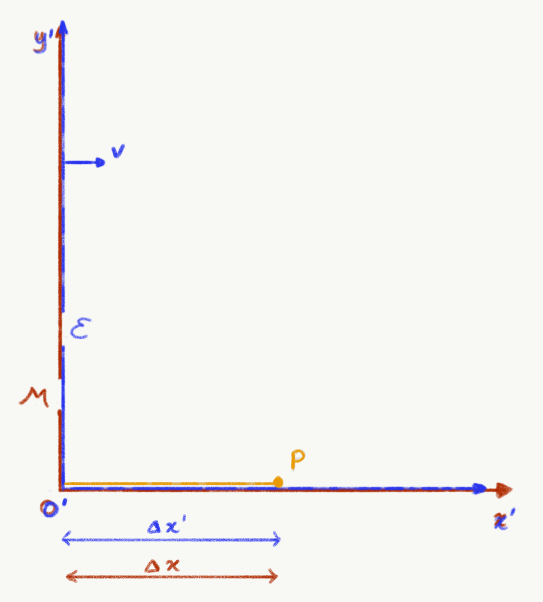{.img-border #fig-photon fig-alt="Coordinate axes diagram showing reference frames M and E aligned at their origin, with photon P propagating along the positive x-axis and intervals Delta x and Delta x prime marked beneath."}
:::

Suppose that at the synchronised instant $t = t' = 0$, Albert fires a photon $P$ along the positive $x$-axis (@fig-photon). Because transverse coordinates do not change ($y = y' = 0$ and $z = z' = 0$), we focus purely on $(x, t)$ and $(x', t')$.

By Einstein's second postulate of special relativity, the speed of light $c$ is identical in all inertial reference frames. Therefore, the distance traversed by photon $P$ satisfies:

$$\Delta x' = c\Delta t', \qquad \Delta x = c\Delta t.$$

Squaring both relations to ensure positive definite quantities and rearranging:

$$(\Delta x')^2 - (c\Delta t')^2 = 0,$$

$$(\Delta x)^2 - (c\Delta t)^2 = 0.$$

Equating both expressions yields:

$$
(\Delta x')^2 - (c\Delta t')^2 = (\Delta x)^2 - (c\Delta t)^2
$$ {#eq-interval}

Even though observers in $\mathcal{M}$ and $\mathcal{E}$ assign different spatial and temporal coordinates to event $P$, both agree precisely on the value of $(\Delta x)^2 - (c\Delta t)^2$. This quantity is invariant.

# Wick rotation and imaginary time

### Number sets and geometric transformations

::: {style="width: 75%; margin: 1.5rem auto;"}
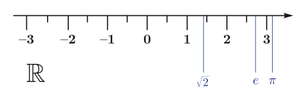{.img-border #fig-real-line fig-alt="Horizontal real number line showing integer tick marks from minus 3 to 3, with markers indicating values for the square root of 2, Euler's number e, and pi."}
:::

Historically, number systems expanded from counting numbers $\mathbb{N}$ to integers $\mathbb{Z}$, rational numbers $\mathbb{Q}$, and the real continuum $\mathbb{R}$ (@fig-real-line). Moving between these sets corresponds to one-dimensional translations along the line (@fig-number-sets).

::: {style="width: 70%; margin: 1.5rem auto;"}
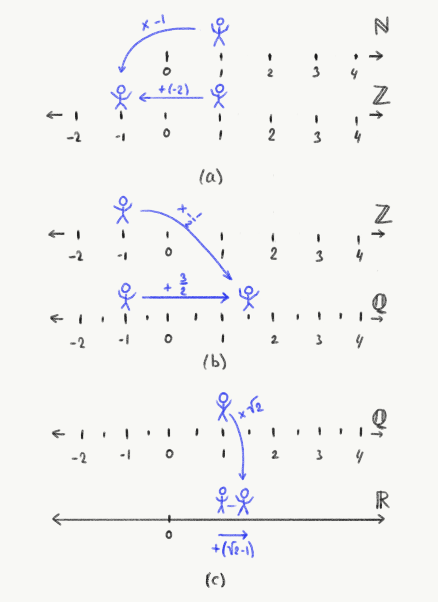{.img-border #fig-number-sets fig-alt="Three-panel schematic showing mappings between number sets (natural numbers N, integers Z, rational numbers Q, and real numbers R) illustrated with a figure moving along number lines."}
:::

In the sixteenth century, solving polynomial equations necessitated introducing the imaginary unit $i = \sqrt{-1}$. Extending the real line orthogonally with an imaginary axis formed the complex plane $\mathbb{C}$. 

Crucially, multiplying a real number by $i$ does not represent a translation: it corresponds to a **quarter-turn rotation of $\pi/2$ ($90^\circ$)** in the complex plane (@fig-wick-concept).

::: {style="width: 80%; margin: 1.5rem auto;"}
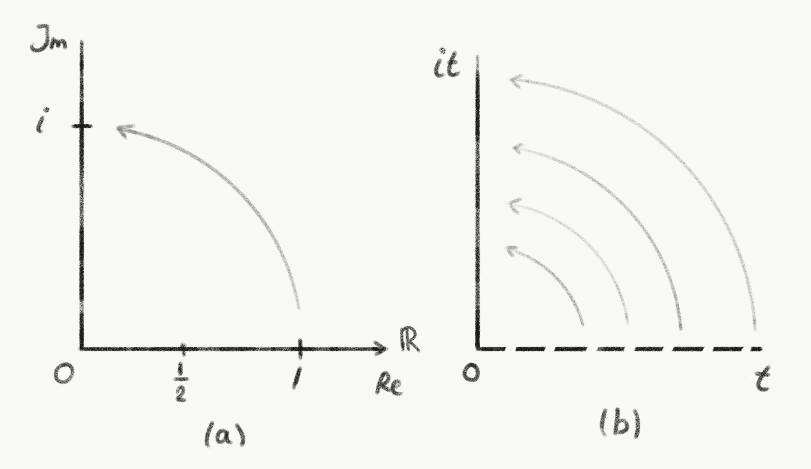{.img-border #fig-wick-concept fig-alt="Two-panel diagram illustrating Wick rotation: left panel shows a 90-degree quarter-turn from the real axis to the imaginary unit i; right panel shows real time t rotated to imaginary time it."}
:::

Multiplying the entire temporal coordinate by $i$ transforms real time into imaginary time: $t \mapsto it$. This mathematical operation is termed a **Wick rotation**.

### Spacetime diagrams and units

In introductory physics, distance is typically plotted on the vertical axis and time on the horizontal axis (@fig-xt). Relativistic physics reverses this convention, placing distance $x$ on the horizontal axis and time $t$ on the vertical axis (@fig-tx).

::: {layout="[50, 50]" layout-valign="top"}
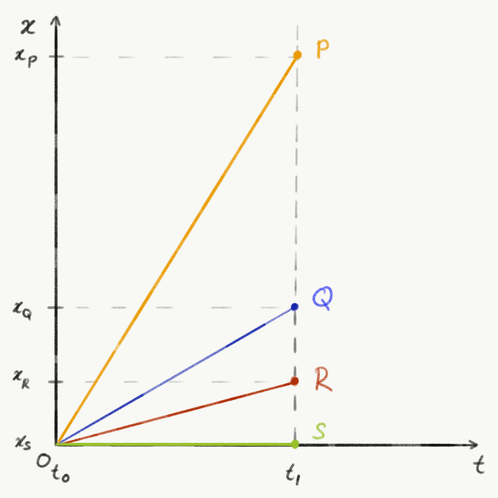{.img-border #fig-xt fig-alt="Spacetime diagram with time t on the horizontal axis and position x on the vertical axis, displaying worldlines for events S, R, Q, and P at time t1."}

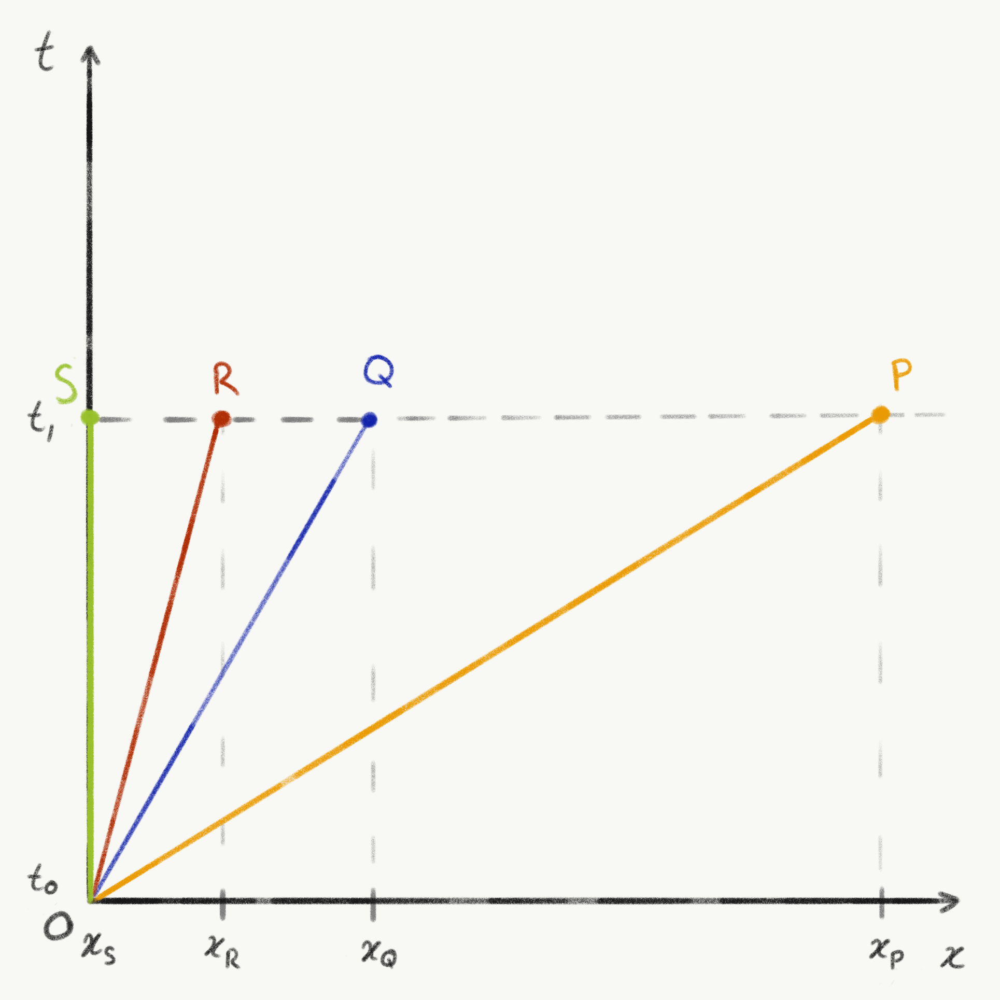{.img-border #fig-tx fig-alt="Minkowski diagram with spatial position x on the horizontal axis and time t on the vertical axis, showing straight trajectory rays for observers S, R, Q, and P."}
:::

Because spatial distance (metres) and time (seconds) carry different dimensions, we scale time by the constant speed of light: $t \mapsto ct$. Setting $c = 1$ in natural units orientates the worldline of light at an angle of $\pi/4$ ($45^\circ$) with respect to the coordinate axes (@fig-ct).

::: {style="width: 80%; margin: 1.5rem auto;"}
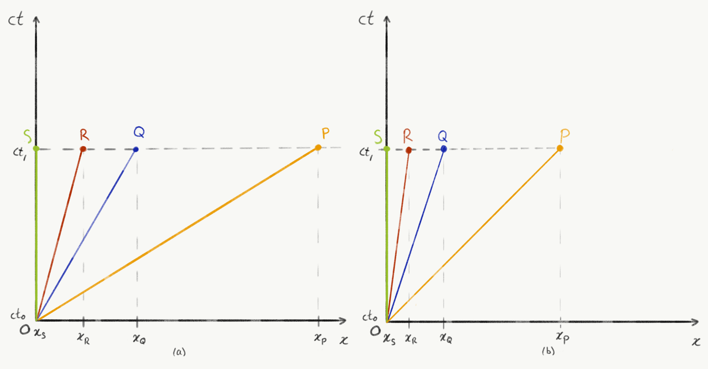{.img-border #fig-ct fig-alt="Two-panel spacetime plot showing scaled temporal coordinate ct on the vertical axis and position x on the horizontal axis, comparing worldlines under light-speed scaling."}
:::

### Wick rotation to imaginary distance

Applying a Wick rotation to the scaled coordinate $ct$ yields an imaginary temporal coordinate:

$$ct \longmapsto ict.$$

::: {style="width: 80%; margin: 1.5rem auto;"}
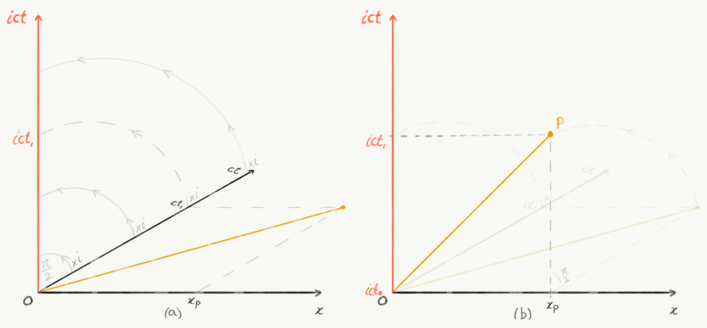{.img-border #fig-wick-ict fig-alt="Coordinate diagrams showing the progression of Wick-rotated temporal coordinates from imaginary time to imaginary distance ict on the vertical axis."}
:::

As shown in @fig-wick-ict, this operation rotates the temporal axis by $\pi/2$ into the complex plane, carrying the worldlines along with it.

# Deriving the Lorentz transformations

### Invariant worldlines in Euclidean complex space

::: {style="width: 70%; margin: 1.5rem auto;"}
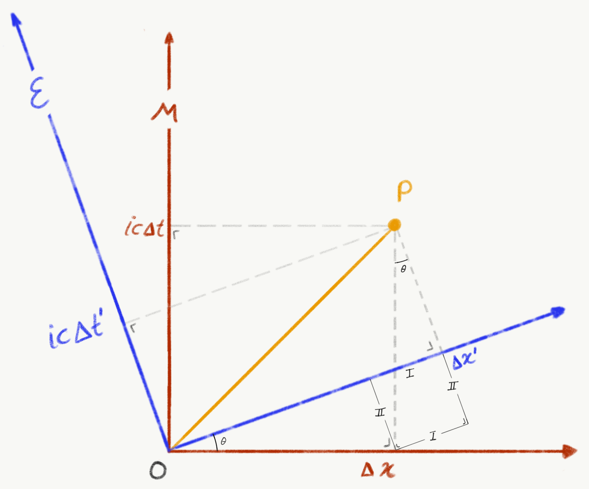{.img-border #fig-rotated-frames fig-alt="Geometric diagram showing two reference frames M and E rotated by angle theta in a Euclidean spacetime with imaginary time axes ic Delta t and ic Delta t prime."}
:::

In the complex coordinate plane $(x, ict)$, the squared distance from the origin to event $P$ is evaluated using the standard Pythagorean metric (@fig-rotated-frames):

$$(OP)^2 = (\Delta x)^2 + (ic\Delta t)^2 = (\Delta x')^2 + (ic\Delta t')^2.$$

Because $i^2 = -1$, this identity simplifies directly to:

$$(\Delta x)^2 - c^2(\Delta t)^2 = (\Delta x')^2 - c^2(\Delta t')^2.$$

Through imaginary time, the hyperbolic spacetime interval of special relativity becomes an ordinary Euclidean distance invariant under planar rotations.

### Coordinate projections

From the geometry of @fig-rotated-frames, the primed coordinates in frame $\mathcal{E}$ are related to the unprimed coordinates in $\mathcal{M}$ by a rotation of angle $\theta$:

$$\Delta x' = \Delta x\cos\theta + \text{I}, \qquad \text{where } \text{I} = ic\Delta t\sin\theta,$$

$$
\Delta x' = \Delta x\cos\theta + ic\Delta t\sin\theta
$$ {#eq-proj-x}

$$ic\Delta t' = ic\Delta t\cos\theta - \text{II}, \qquad \text{where } \text{II} = \Delta x\sin\theta,$$

$$
ic\Delta t' = ic\Delta t\cos\theta - \Delta x\sin\theta
$$ {#eq-proj-t}

To relate rotation angle $\theta$ to relative velocity $v$, consider the origin $O'$ of frame $\mathcal{E}$. Because Albert remains at rest at his own origin, $\Delta x' = 0$. Substituting this condition into @eq-proj-x:

$$\Delta x\cos\theta + ic\Delta t\sin\theta = 0.$$

Rearranging:

$$\dfrac{\sin\theta}{\cos\theta} = \tan\theta = -\dfrac{\Delta x}{ic\Delta t} = -\dfrac{v}{ic}.$$

Multiplying numerator and denominator by $i$ (recalling $i^2 = -1$):

$$
\tan\theta = \dfrac{iv}{c}
$$ {#eq-tan-theta}

### Constructing the trigonometric relations

::: {style="width: 50%; margin: 1.5rem auto;"}
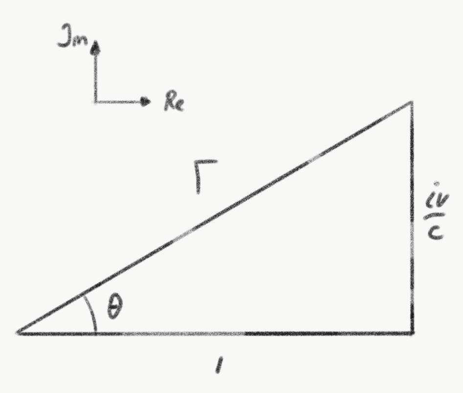{.img-border #fig-triangle fig-alt="Right-angled triangle in the complex plane with adjacent side 1, opposite side iv over c, hypotenuse Gamma, and rotation angle theta."}
:::

Writing $\tan\theta = \dfrac{iv/c}{1}$ corresponds to a right triangle with adjacent side 1 and opposite side $iv/c$ (@fig-triangle). The hypotenuse $\Gamma$ is found via the Pythagorean theorem:

$$\Gamma^2 = 1^2 + \left(\dfrac{iv}{c}\right)^2 = 1 - \dfrac{v^2}{c^2} \implies \Gamma = \sqrt{1 - \dfrac{v^2}{c^2}}.$$

The sine and cosine of the complex rotation angle are therefore:

$$\cos\theta = \dfrac{1}{\Gamma} = \dfrac{1}{\sqrt{1 - v^2/c^2}},$$

$$\sin\theta = \dfrac{iv/c}{\Gamma} = \dfrac{iv/c}{\sqrt{1 - v^2/c^2}}.$$

### Assembling the transformation equations

Substituting $\cos\theta$ and $\sin\theta$ into the spatial projection @eq-proj-x:

$$\Delta x' = \Delta x \left(\dfrac{1}{\sqrt{1 - v^2/c^2}}\right) + ic\Delta t \left(\dfrac{iv/c}{\sqrt{1 - v^2/c^2}}\right).$$

Since $i \cdot i = -1$:

$$\Delta x' = \dfrac{\Delta x - v\Delta t}{\sqrt{1 - v^2/c^2}}.$$

Measuring coordinates directly from the shared origin ($x_0 = t_0 = 0$), this recovers the spatial Lorentz transformation:

$$x' = \dfrac{x - vt}{\sqrt{1 - v^2/c^2}}.$$

Next, substituting into the temporal projection @eq-proj-t:

$$ic\Delta t' = ic\Delta t \left(\dfrac{1}{\sqrt{1 - v^2/c^2}}\right) - \Delta x \left(\dfrac{iv/c}{\sqrt{1 - v^2/c^2}}\right).$$

Dividing the entire equation by the common factor $ic$:

$$\Delta t' = \dfrac{\Delta t - (v/c^2)\Delta x}{\sqrt{1 - v^2/c^2}}.$$

Expressed in coordinate form, this yields the relativistic time transformation:

$$t' = \dfrac{t - vx/c^2}{\sqrt{1 - v^2/c^2}}.$$

Setting $\beta = v/c$ and $\gamma = 1/\sqrt{1 - \beta^2}$, the full set of Lorentz transformations in standard four-vector notation is:

$$\begin{aligned}
ct' &= \gamma(ct - \beta x), \\
x' &= \gamma(x - \beta ct), \\
y' &= y, \\
z' &= z.
\end{aligned}$$

Through the elegance of Wick rotation, the Lorentz boost of special relativity is revealed to be nothing other than a rotation in Euclidean spacetime with an imaginary time axis.

---

### Image credits and references

* *Featured image: Ruler scales texture by arielrobin via Pixabay (CC0 Public Domain).*[cite: 63]
* *Spacetime diagrams, Minkowski projections, and complex geometric triangles by KJ Runia.*
* Hawking, S. (2001). *The Universe in a Nutshell*. New York: Bantam Books.
* Poincaré, H. (1906). "Sur la dynamique de l'électron", *Rendiconti del Circolo Matematico di Palermo*.
* Einstein, A. (1905). "Zur Elektrodynamik bewegter Körper", *Annalen der Physik*, 322(10), pp. 891–921.
* Wick, G. C. (1954). "Properties of Bethe-Salpeter Wave Functions", *Physical Review*, 96(4), pp. 1124–1134.