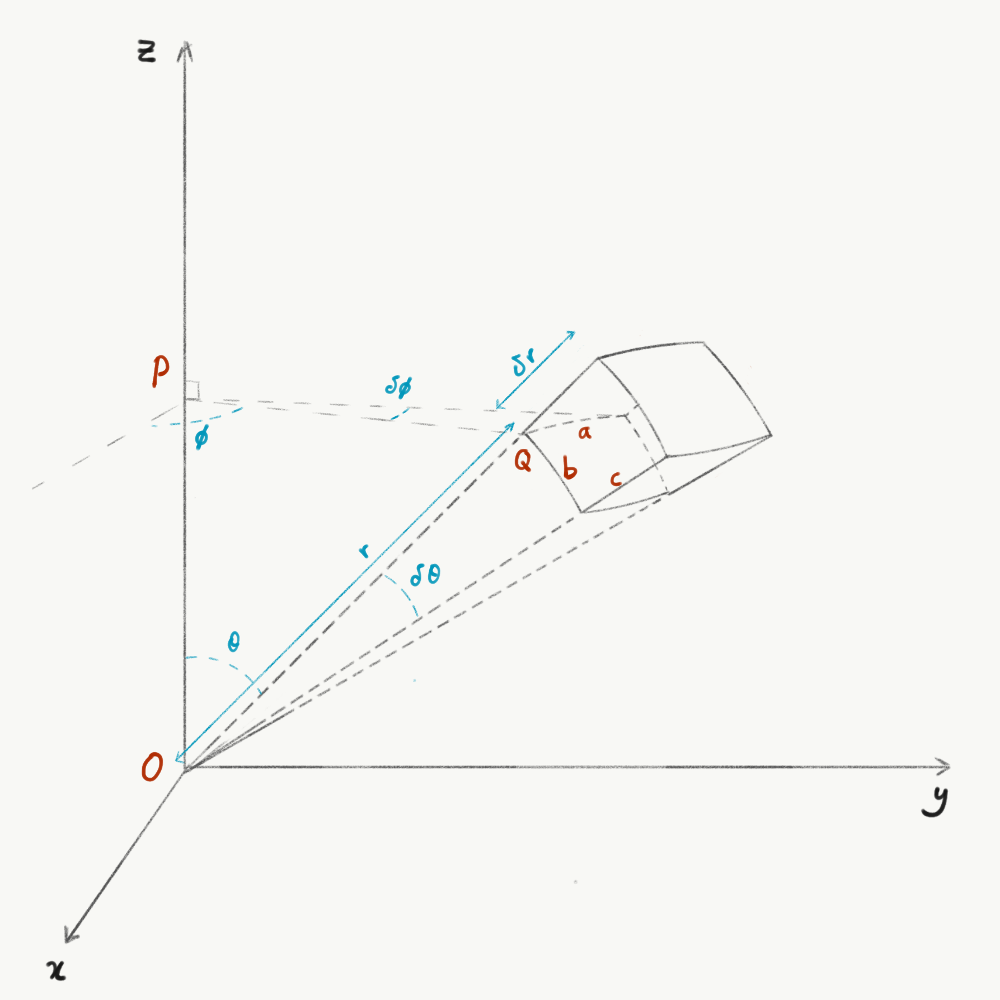
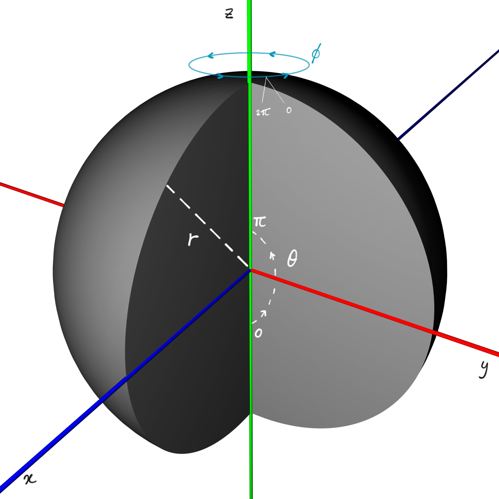

::: {.column-screen}

:::



::: {.lead-in}
Even though the well-known [Archimedes](https://www.britannica.com/biography/Archimedes) derived the formula for the volume of a sphere long before modern calculus was born, its derivation using spherical polar coordinates and triple integration is surprisingly absent from many introductory textbooks.
:::

In this post, we derive the classical formula for the volume of a ball:

$$V = \frac{4}{3}\pi r^3,$$

where $r$ is the radius.

Note the deliberate use of the term *ball* rather than *sphere*: in geometry, a sphere denotes the two-dimensional surface boundary embedded in three-dimensional space, which has zero volume. The solid interior enclosed by the sphere is properly termed a ball.

# Spherical coordinates

The volume of an infinitesimal Cartesian box $\delta V$ with sides $a$, $b$, and $c$ is given by $\delta V = a \times b \times c$.

In spherical coordinates $(r, \theta, \phi)$, an infinitesimal volume element forms a curved differential wedge, as illustrated in @fig-volume-element.

::: {style="width: 75%; margin: 1.5rem auto;"}
{#fig-volume-element fig-alt="Driedimensionaal assenstelsel x, y, z met een infinitesimaal volume-element dV in bolcoördinaten, aangeduid met straal r, poolhoek theta en azimutale hoek phi."}
:::

Although its edges are slightly curved, the volume of this element is approximated in the limit by the product of its three orthogonal arc lengths:

$$\delta V \approx a \times b \times c.$$

Using the geometry of spherical polar coordinates:

$$\begin{aligned}
a &= PQ \, \delta\phi = r\sin\theta \, \delta\phi, \\
b &= r \, \delta\theta, \\
c &= \delta r.
\end{aligned}$$

Multiplying these dimensions together gives the volume element:

$$\delta V \approx (r\sin\theta \, \delta\phi) (r \, \delta\theta) (\delta r) = r^2\sin\theta \, \delta r \, \delta\theta \, \delta\phi.$$

# The volume integral

As the increments $\delta r$, $\delta\theta$, and $\delta\phi$ approach zero, this approximation becomes exact. We can therefore formulate the total volume of the ball $B$ as a triple integral:

$$V_B = \iiint_B \mathrm{d}V = \int_\phi \int_\theta \int_r r^2\sin\theta \, \mathrm{d}r \, \mathrm{d}\theta \, \mathrm{d}\phi.$$

::: {style="width: 70%; margin: 1.5rem auto;"}
{#fig-ball fig-alt="Driedimensionale weergave van een gedeeltelijk opengewerkte bol in een assenstelsel, waarin de rotatiehoeken phi van nul tot twee pi en theta van nul tot pi zichtbaar zijn gemaakt."}
:::

To integrate over every interior point of the solid ball, we set the integration limits by exploiting its rotational symmetry (@fig-ball):

1. **Radial coordinate ($r$):** extends from the centre at $r = 0$ out to the boundary surface at $r = R$ (or $r$).
2. **Polar angle ($\theta$):** sweeps from the positive $z$-axis downwards to the negative $z$-axis, spanning the range from $\theta = 0$ to $\theta = \pi$.
3. **Azimuthal angle ($\phi$):** completes a full revolution around the $z$-axis, spanning $\phi = 0$ to $\phi = 2\pi$.

Setting these boundaries yields:

$$V_B = \int_0^{2\pi} \mathrm{d}\phi \int_0^\pi \sin\theta \, \mathrm{d}\theta \int_0^r r'^2 \, \mathrm{d}r'.$$

Because the limits of integration are independent constants, the triple integral factors into the product of three independent single integrals:

$$V_B = \left( \int_0^{2\pi} \mathrm{d}\phi \right) \left( \int_0^\pi \sin\theta \, \mathrm{d}\theta \right) \left( \int_0^r r'^2 \, \mathrm{d}r' \right).$$

Evaluating each integral separately:

$$\int_0^{2\pi} \mathrm{d}\phi = \Big[ \phi \Big]_0^{2\pi} = 2\pi,$$

$$\int_0^\pi \sin\theta \, \mathrm{d}\theta = \Big[ -\cos\theta \Big]_0^\pi = -(-1) - (-1) = 2,$$

$$\int_0^r r'^2 \, \mathrm{d}r' = \left[ \frac{1}{3}r'^3 \right]_0^r = \frac{1}{3}r^3.$$

Multiplying the evaluated factors:

$$V_B = (2\pi) \times 2 \times \left(\frac{1}{3}r^3\right) = \frac{4}{3}\pi r^3.$$

This completes the derivation of Archimedes' classic formula using spherical coordinates and multivariable calculus.

---

### Image credits and references

* *Featured image: Globe detailing the Arctic region and meridian ring via Pixabay (CC0 Public Domain).*
* *Coordinate geometry illustrations and 3D spherical diagrams by KJ Runia.*