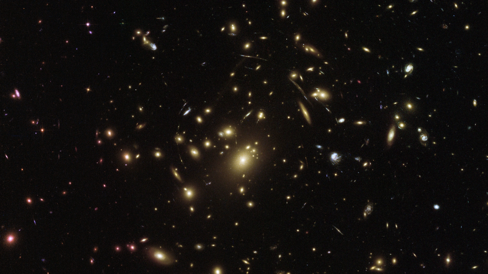
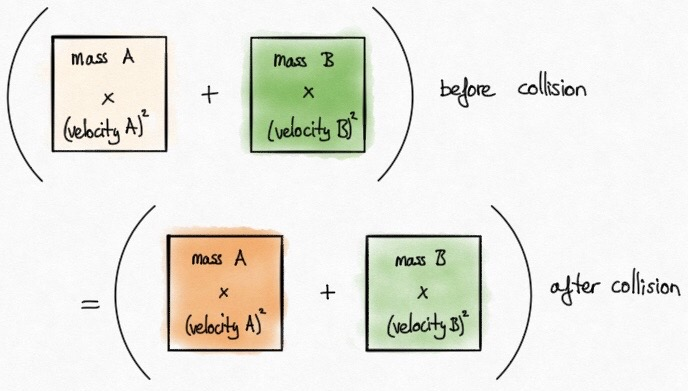
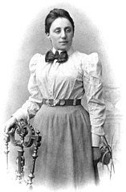
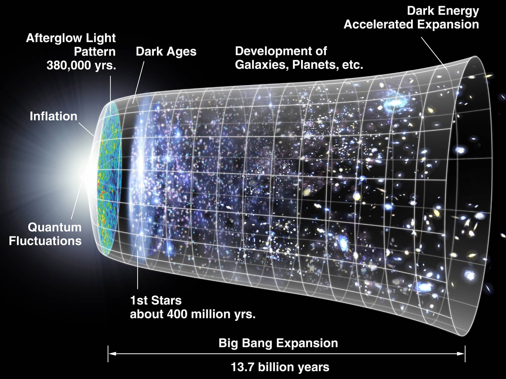
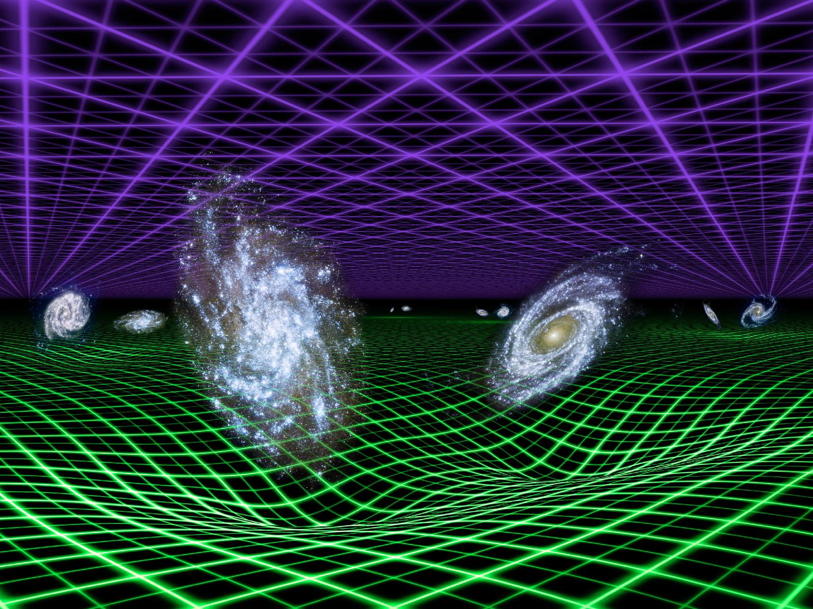

::: {.column-screen}

:::



::: {.lead-in}
Sometimes you may have heard someone say that, in the end, "everything is energy". "Einstein said himself that mass equals energy, we are energy ourselves, light is energy, and everything in this universe is energy." Often, it is represented as the fundamental substance everything is made out of. And that energy is conserved. Both statements are incorrect.
:::

To get straight to the point: energy is a mathematical concept. It is not a substance, and it is not a mysterious "elusive something". Nothing is flowing from one object to another. It is a number, very useful and ingenious to perform calculations with and base predictions on for the state of a physical system. It is clever mathematical bookkeeping originating from the seventeenth-century polymath Gottfried Wilhelm von Leibniz (@fig-leibniz).

::: {style="width: 50%; margin: 1.5rem auto;"}
.jpg){#fig-leibniz fig-alt="Oil portrait of German polymath Gottfried Wilhelm von Leibniz wearing a dark curly wig and historical robes."}
:::

Here, we must differentiate between *physical objects* and *properties* of those objects. Think of properties like position, volume, mass, velocity, and energy. These five properties are numbers—mathematical quantities. In school, we were taught to express quantities in units signifying physical phenomena: location, size, inertia, motion, and bookkeeping invariants.

Let us take a rolling cannonball A as an example. This physical ball has two measurable properties: mass $m_A$ and velocity $v_A$. Suppose there is another rolling cannonball with mass $m_B$ and velocity $v_B$, moving in the opposite direction. They will collide. Their speeds and directions will change after the collision.

Leibniz noticed that for each ball, its mass multiplied by its squared velocity and summed together yields a total that remains identical before and after an elastic collision (@fig-vis-viva).

{.img-border #fig-vis-viva fig-alt="Hand-drawn diagram demonstrating that the sum of mass times velocity squared before collision equals the sum after collision."}

Both the product and the sum are nothing more than numbers. The mathematical quantity resulting from mass multiplied by velocity squared Leibniz called *vis viva* ("living force").

Decades of refinement followed. Leibniz's original formulation was missing a factor of one half $\left(\dfrac{1}{2}mv^2\right)$, an extension to thermal dissipation was necessary, and it faced fierce competition from Newtonian momentum conservation.

At the beginning of the 19th century, polymath Thomas Young became the first to use the word "energy" in written form in his *Course of Lectures on Natural Philosophy and the Mechanical Arts*. Over time, the concept expanded beyond mechanics and heat into electrical, magnetic, chemical, and nuclear interactions.

# Conservation of energy

::: {style="width: 35%; float: right; margin: 0 0 1rem 1.5rem;"}
{#fig-noether fig-alt="Black and white portrait photograph of mathematician Emmy Noether wearing a blouse with a dark bow tie."}
:::

Emmy Noether (@fig-noether), a mathematical genius, laid the rigorous foundation for conservation laws in physics. Thanks to **Noether's theorem**, we understand *why* energy is conserved in an isolated system: the laws of physics possess continuous **time translation symmetry**.

In other words, the laws of nature do not change from one moment to the next. Whether a collision takes place at ten o'clock or two hours later, the physical interaction behaves identically. Whenever a physical system possesses time symmetry, Noether's theorem allows us to derive a conserved scalar quantity directly: energy.

# Einstein and cosmological expansion

{#fig-expansion fig-alt="Diagram showing the expansion history of the universe from quantum fluctuations and inflation through star formation to accelerated expansion."}

What many do not realise is that since Einstein formulated general relativity, global energy conservation does not hold for the observable universe as a whole.

On human scales, time symmetry holds to extraordinary precision. Engineering, chemistry, and everyday laboratory physics operate under strict local conservation.

However, on cosmological scales, spacetime itself is dynamic and expanding (@fig-expansion, @fig-dark-energy). Because the geometry of spacetime changes with cosmological time, the universe does not possess global time translation symmetry.

{#fig-dark-energy fig-alt="Artistic 3D rendering of galaxies sitting on a warped green gravitational grid beneath an expanding purple grid representing cosmological acceleration."}

A clear example is the cosmological redshift of photons: as the universe expands, light waves travelling across cosmological distances are stretched. Because the energy of a photon is directly proportional to its frequency ($E = h\nu$), a redshifted photon has less energy upon arrival than when it was emitted. That energy has not gone into another reservoir; it is simply not conserved in a time-dependent metric.

When we isolate a sufficiently small region of space over a short time interval, spacetime is approximately flat, time symmetry is restored, and energy conservation holds as an excellent local approximation.

# Not fundamental, but essential

Energy cannot be regarded as a fundamental building block of our universe for two key reasons:

1. It is a mathematical scalar quantity measuring properties like mass and motion, not a physical fluid or tangible material.
2. Its conservation is conditional—derived from time translation symmetry via Noether's theorem—and fails on cosmological scales where spacetime expands.

Even though energy is not a mystical essence, it remains an indispensable bookkeeping tool across all branches of physics, compactly packaging complex relativistic invariants:

$$E_{\text{tot}} = \dfrac{mc^2}{\sqrt{1 - \dfrac{v^2}{c^2}}}.$$

Energy is not the universe itself, but the mathematical balance sheet of nature.

---

### Image credits and references

* *Featured image: Galaxy cluster Abell 2537 acting as a gravitational lens, imaged by the NASA/ESA Hubble Space Telescope (Public domain).*
* *Portrait of Gottfried Wilhelm von Leibniz (ca. 1695) by Christoph Bernhard Francke, Herzog Anton Ulrich Museum (Public domain).*
* *Portrait of Emmy Noether (before 1910), Public domain.*
* *Cosmological timeline diagram via NASA/WMAP Science Team (Public domain).*
* *Vis viva collision diagram by KJ Runia.*