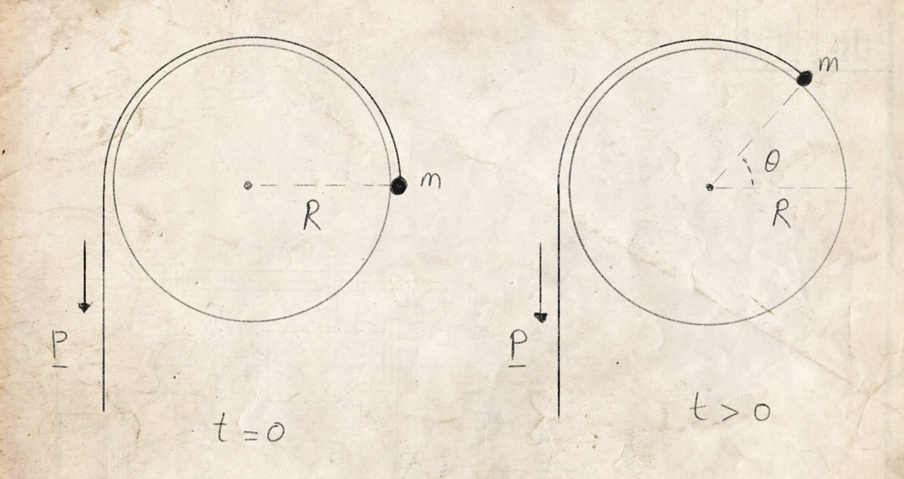
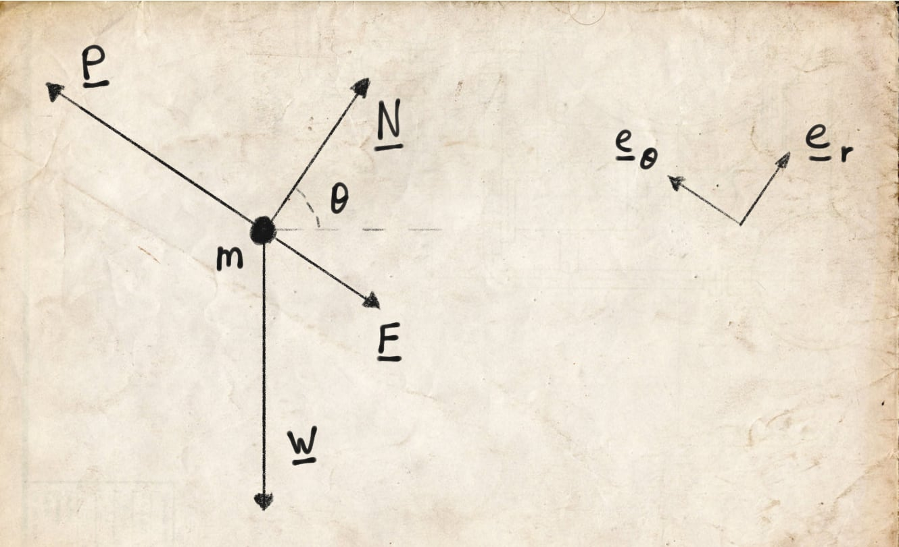
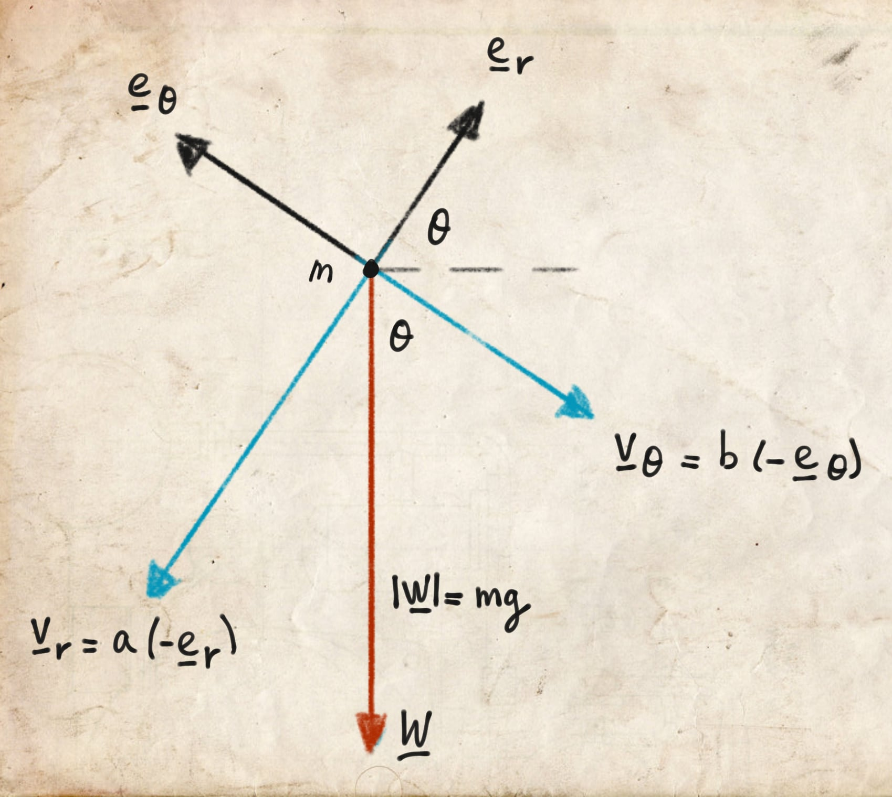

::: {.column-screen}

:::



::: {.lead-in}
In this post, we will derive an expression for the normal force on a uniform mass in planar non-uniform circular motion using polar coordinates. Finding this expression is enormously useful for determining under which physical conditions a mass will lose contact and fly off its circular path. Here, we investigate the cylinder-and-string system illustrated below. Obtaining an expression purely in terms of the position angle $\theta$ is not immediately straightforward: in step 7, we introduce an integration trick to eliminate the second-order derivative $\ddot{\theta}$.
:::

# Notation

We apply Newton's fluxion notation (dot notation) for compact time derivatives: if $\mathbf{x}$ is a displacement vector, its first and second time derivatives are written as $\dot{\mathbf{x}}$ and $\ddot{\mathbf{x}}$, respectively. Where explicit integration with respect to time is performed, we employ Leibniz's notation $\left(\dfrac{\mathrm{d}\mathbf{x}}{\mathrm{d}t}\text{ and }\dfrac{\mathrm{d}^2\mathbf{x}}{\mathrm{d}t^2}\right)$.

# Assignment

Consider the mechanical system depicted in @fig-system. A point mass $m$ is attached to a light, inextensible string draped over a fixed cylinder of radius $R.$ At $t = 0$, the mass rests at the horizontal midpoint ($\theta = 0$). A constant pulling force $\mathbf{P}$ is applied vertically downwards to the free end of the string. At time $t > 0$, the mass slides along the circular surface with a coefficient of kinetic friction $\mu$. The angle subtended at the centre of the cylinder is denoted by $\theta$.

Our objective is to calculate the normal force $\mathbf{N}$ on $m$ as a function of $\theta$, and thereby demonstrate that the cylinder's radius $R$ does not affect the liftoff criterion.

{#fig-system fig-alt="Hand-drawn schematic of a mass m on the perimeter of a circular cylinder of radius R connected to a string pulled by force P at initial time t equals 0 and displaced angle theta at time t greater than 0."}

### Step 1. Force diagrams and unit vectors

We define our basis using the standard planar polar unit vectors: the radial unit vector $\mathbf{e}_r$ pointing outwards from the origin, and the tangential unit vector $\mathbf{e}_\theta$ pointing in the direction of increasing $\theta$ (@fig-forces).

{#fig-forces fig-alt="Free-body vector diagram showing the acting forces on mass m: normal force N, string tension P, friction F, and downward weight W along with radial and tangential unit vectors."}

The forces acting on mass $m$ are:

* $\mathbf{P}$: the pulling force acting along the string;
* $\mathbf{N}$: the contact normal force exerted by the cylinder surface on $m$;
* $\mathbf{F}$: the frictional force opposing relative motion;
* $\mathbf{W}$: the gravitational force (weight);
* $\mathbf{e}_r$: the unit vector in the radial direction;
* $\mathbf{e}_\theta$: the unit vector in the transverse (tangential) direction.

### Step 2. Apply Newton's second law

Applying Newton's second law in vector form:

$$\sum \mathbf{F} = m \ddot{\mathbf{r}},$$

$$m \ddot{\mathbf{r}} = \mathbf{P} + \mathbf{N} + \mathbf{F} + \mathbf{W}.$$

### Step 3. Express forces in polar components

The string pulls purely in the tangential direction:

$$\mathbf{P} = |\mathbf{P}| \mathbf{e}_\theta = P \mathbf{e}_\theta.$$

The normal force acts purely along the outward normal (radial direction):

$$\mathbf{N} = |\mathbf{N}| \mathbf{e}_r = N \mathbf{e}_r.$$

Kinetic friction opposes the tangential velocity:

$$\mathbf{F} = -\mu N \mathbf{e}_\theta.$$

The downward gravitational weight $\mathbf{W}$ must be resolved along $(-\mathbf{e}_r)$ and $(-\mathbf{e}_\theta)$ as illustrated in @fig-weight:

{#fig-weight fig-alt="Geometric force decomposition diagram showing weight vector W with magnitude mg split into an inward radial component mg sin theta and a backward tangential component mg cos theta."}

$$\mathbf{W} = -mg \sin\theta \, \mathbf{e}_r - mg \cos\theta \, \mathbf{e}_\theta.$$

Summing all components yields:

$$m \ddot{\mathbf{r}} = (N - mg \sin\theta) \mathbf{e}_r + (P - \mu N - mg \cos\theta) \mathbf{e}_\theta.$$

### Step 4. Kinematics in polar coordinates

In planar polar coordinates with a fixed radius $r = R$ ($\dot{r} = 0$, $\ddot{r} = 0$), the kinematic acceleration is:

$$\ddot{\mathbf{r}} = (\ddot{r} - r\dot{\theta}^2)\mathbf{e}_r + (r\ddot{\theta} + 2\dot{r}\dot{\theta})\mathbf{e}_\theta = -R\dot{\theta}^2 \mathbf{e}_r + R\ddot{\theta} \mathbf{e}_\theta.$$

Multiplying by mass $m$ and equating with our force decomposition:

$$-m R \dot{\theta}^2 \mathbf{e}_r + m R \ddot{\theta} \mathbf{e}_\theta = (N - mg \sin\theta) \mathbf{e}_r + (P - \mu N - mg \cos\theta) \mathbf{e}_\theta.$$

### Step 5. Resolve radially and tangentially

Equating components along each unit vector:

$$\mathbf{e}_r : \quad -m R \dot{\theta}^2 = N - mg \sin\theta,$$

$$\mathbf{e}_\theta : \quad m R \ddot{\theta} = P - \mu N - mg \cos\theta.$$

### Step 6. The equation of motion

From the tangential component, the angular acceleration is:

$$\ddot{\theta} = \dfrac{P - \mu N - mg \cos\theta}{m R}.$$

While this provides $\ddot{\theta}$, substituting it directly into the radial equation is obstructed by the presence of $\dot{\theta}^2$. We require an analytical expression for $\dot{\theta}^2$ in terms of position $\theta$.

### Step 7. Integration trick via the chain rule

By applying the chain rule to the time derivative of $\dot{\theta}^2$:

$$\dfrac{\mathrm{d}(\dot{\theta}^2)}{\mathrm{d}t} = 2\dot{\theta} \dfrac{\mathrm{d}\dot{\theta}}{\mathrm{d}t} = 2\dot{\theta} \ddot{\theta}.$$

Substituting our expression for $\ddot{\theta}$:

$$\dfrac{\mathrm{d}(\dot{\theta}^2)}{\mathrm{d}t} = 2\dot{\theta} \left(\dfrac{P - \mu N - mg \cos\theta}{m R}\right).$$

Integrating both sides with respect to time $t$, noting that $\dot{\theta} \, \mathrm{d}t = \mathrm{d}\theta$:

$$\int \dfrac{\mathrm{d}(\dot{\theta}^2)}{\mathrm{d}t} \, \mathrm{d}t = \dfrac{2}{m R} \int (P - \mu N - mg \cos\theta) \, \mathrm{d}\theta.$$

Carrying out the integration term by term:

$$\dot{\theta}^2 = \dfrac{2P\theta}{m R} - \dfrac{2\mu N\theta}{m R} - \dfrac{2g \sin\theta}{R} + C.$$

Applying the initial conditions at $t = 0$: $\theta(0) = 0$ and $\dot{\theta}(0) = 0$, which sets the constant of integration to $C = 0$:

$$\dot{\theta}^2 = \dfrac{2P\theta}{m R} - \dfrac{2\mu N\theta}{m R} - \dfrac{2g \sin\theta}{R}.$$

### Step 8. Solve for the normal force

Substitute this expression for $\dot{\theta}^2$ directly back into the radial force balance $-m R \dot{\theta}^2 = N - mg \sin\theta$:

$$-m R \left(\dfrac{2P\theta}{m R} - \dfrac{2\mu N\theta}{m R} - \dfrac{2g \sin\theta}{R}\right) = N - mg \sin\theta.$$

Expanding the left side:

$$-2P\theta + 2\mu N\theta + 2mg \sin\theta = N - mg \sin\theta.$$

Gathering all terms containing $N$ on one side:

$$N - 2\mu N\theta = 3mg \sin\theta - 2P\theta,$$

$$N(1 - 2\mu\theta) = 3mg \sin\theta - 2P\theta.$$

Solving for the normal force $N$:

$$N(\theta) = \dfrac{3mg \sin\theta - 2P\theta}{1 - 2\mu\theta}.$$

### Conclusion and liftoff condition

The mass leaves the circular surface when the surface no longer needs to exert contact force to maintain the trajectory, which occurs precisely when $N(\theta) = 0$:

$$3mg \sin\theta - 2P\theta = 0.$$

As this condition contains only $m$, $g$, $P$, and $\theta$, the radius $R$ of the cylinder cancels out completely: the angle at which the mass flies off depends purely on the pulling force relative to weight, entirely independent of the cylinder's dimensions.

---

### Image credits and references

* *Featured image: Coiled mooring rope on rustic wooden decking via Pixabay (CC0 Public Domain).*
* *Coordinate and free-body diagrams by KJ Runia.*