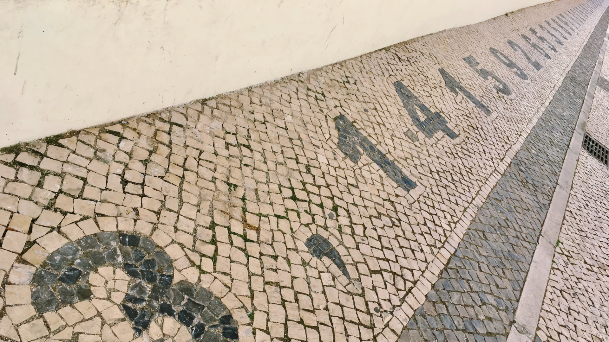
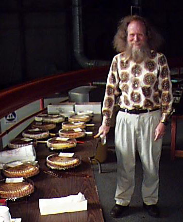
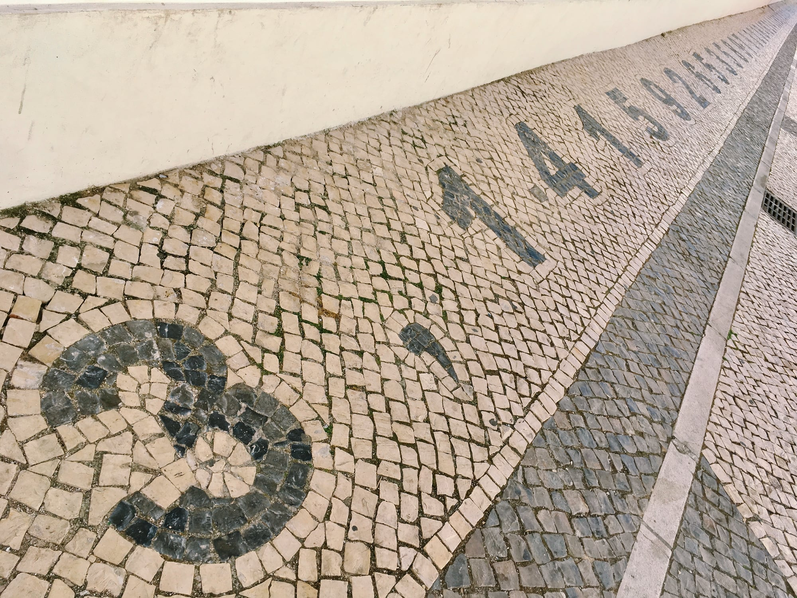

::: {.column-screen}

:::



::: {.lead-in}
Pi Day is the day on which we commemorate Albert Einstein's (1879–1955) birthday[cite: 91]. Also, people celebrate the existence of $\pi$ as today is 3/14, forming the first three digits of the number $\pi$ in the American date format[cite: 91]. Some Western European critics—on Twitter, for example—have stated one oughtn't as "we, here" simply do not use the American date format[cite: 91]. Of course, *nearly the whole rest of the world* does not use the American date format, but it hasn't stopped cheerful people from all over that same rest of the world celebrating and putting mathematics into the limelight once a year[cite: 91].
:::

::: {layout="[60, 40]" layout-valign="top"}
In [1988](https://doi.org/10.1038/news070312-6), a physicist named Larry Shaw (1939–2017), while working at the [Exploratorium](https://www.exploratorium.edu/pi) science museum in San Francisco, came up with the idea of celebrating mathematical constants on March 14th (@fig-shaw)[cite: 91]. What started out as eating fruit pie with colleagues became a beloved public tradition[cite: 91]. At 1:59 pm—yielding the next digits 3.14159—a circular parade would wind through the museum with visitors carrying digits of $\pi$, eating pie, and singing happy birthday to Albert Einstein[cite: 91].

{#fig-shaw fig-alt="Photograph of a smiling Larry Shaw with beard and long grey hair in a patterned shirt standing next to a table laden with pies at the Exploratorium."}
:::

# Hidden pis

One of the most fascinating aspects of $\pi$ is that it appears in fundamental equations completely detached from simple circles[cite: 91].

For example, Albert Einstein's general theory of relativity describes the geometry of spacetime through the Einstein field equations[cite: 91]:

$$R_{\mu\nu} - \dfrac{1}{2}R g_{\mu\nu} = \dfrac{8\pi G}{c^4} T_{\mu\nu}.$$

The gravitational constant $G$ and spacetime curvature are inextricably linked to $\pi$[cite: 91].

::: {style="width: 40%; float: right; margin: 0 0 1rem 1.5rem;"}
{#fig-calcada fig-alt="Traditional Portuguese white stone pavement with black basalt stones forming the number pi and its decimals."}
:::

Even more remarkably, $\pi$ emerges from pure number theory[cite: 91]. In 1734, Leonhard Euler solved the famous [Basel problem](https://en.wikipedia.org/wiki/Basel_problem), proving that the infinite sum of the reciprocals of squared positive integers converges directly to $\pi^2/6$[cite: 91]:

$$\sum_{n=1}^\infty \dfrac{1}{n^2} = \dfrac{1}{1^2} + \dfrac{1}{2^2} + \dfrac{1}{3^2} + \dfrac{1}{4^2} + \dots = \dfrac{\pi^2}{6}.$$

Euler's result connected prime numbers, infinite series, and the geometry of circles in a single stroke[cite: 91].

# Bouncing blocks and counting collisions

Speaking of "humble pi", stand-up mathematician Matt Parker published a book titled *Humble Pi* and demonstrated how classical mechanics can approximate $\pi$ using a [balancing beam](https://youtu.be/S26_O2B8h8k) (@fig-matt-parker)[cite: 91].

 where they are setting up a physical balancing beam to estimate $\pi$ on Pi Day.](MattParkerPiDay2019.jpg){#fig-matt-parker fig-alt="Screenshot of mathematician Matt Parker looking straight at the camera in a library hall while assistants set up a long measuring beam in the background."}

One of the most fascinating places where pi pops up is where billiard balls bounce against each other and the cushion on the inner rail of a billiard table[cite: 91]. Gregory Galperin at the Department of Mathematics of the Eastern Illinois University wrote a [paper](https://doi.org/10.1070/RD2003v008n04ABEH000252) demonstrating how pi could be obtained in a jaw-droppingly awesome way[cite: 91].

The New York Times published a [blog post](https://wordplay.blogs.nytimes.com/2014/03/10/pi/) about it in 2014 but not before the YouTube channel Numberphile—another favourite—had professor Ed Copeland [explain](https://youtu.be/abv4Fz7oNr0) it already in 2012[cite: 91].

Recently, however, the YouTube channel 3Blue1Brown published a [video](https://youtu.be/HEfHFsfGXjs) about it too[cite: 91]. (Yes, the channel is also a favourite.)[cite: 91]

It features a gorgeous simulation and is somehow very pleasing to the ears[cite: 91]. Also, Grant Sanderson, the mathematician behind the voice and videos, does a great job of visually deciphering the language of the universe[cite: 91]. Do have a [look](https://youtu.be/HEfHFsfGXjs)[cite: 91]. He then gives the answer as to "but how" and "why at all" in a [second video](https://www.youtube.com/watch?v=jsYwFizhncE)[cite: 91].

If you haven't seen it, do support your chin firmly with your hand while letting the video play out as it may gravitate towards the centre of Earth, radially (@fig-3blue1brown)[cite: 91].

 on the YouTube channel 3Blue1Brown.](3Blue1Brown%20pi%202019.jpg){#fig-3blue1brown fig-alt="Dark simulation screenshot showing a vertical wall on the left and two blocks weighing 1 kilogram and 10 kilograms on a frictionless surface with a collision counter at the top."}

A smaller block of mass $m_1 = 1\text{ kg}$ sits between a wall and a larger block of mass $m_2$[cite: 91]. The larger block is sent sliding toward the smaller block[cite: 91]. The blocks undergo completely elastic collisions with each other and the wall[cite: 91].

If the mass ratio of the two blocks is set to powers of 100[cite: 91]:

* When $m_2 = 1\text{ kg} = 100^0\text{ kg}$, the total number of collisions is **3**[cite: 91].
* When $m_2 = 100\text{ kg} = 100^1\text{ kg}$, the total number of collisions is **31**[cite: 91].
* When $m_2 = 10{,}000\text{ kg} = 100^2\text{ kg}$, the total number of collisions is **314**[cite: 91].
* When $m_2 = 100^N\text{ kg}$, the total number of collisions reproduces the first $N+1$ digits of $\pi$[cite: 91]!

As Grant Sanderson wonderfully visualised on 3Blue1Brown, the conservation of kinetic energy $\left(\dfrac{1}{2}m_1 v_1^2 + \dfrac{1}{2}m_2 v_2^2 = E\right)$ forms an ellipse in phase space, which transforms via rescaled coordinates into a circle[cite: 91]. Each physical collision corresponds to a step around that circle, connecting collision dynamics to the arc length and geometry of $\pi$[cite: 91].

---

### Image credits and references

* *Featured image: Pavement digits of $\pi$ in Faro by KJ Runia ([CC BY 4.0](https://creativecommons.org/licenses/by/4.0/))[cite: 91].*
* *Photo of Larry Shaw at the San Francisco Exploratorium by Ronhip ([CC BY-SA 3.0](https://creativecommons.org/licenses/by-sa/3.0/))[cite: 91].*
* *Video stills courtesy of Matt Parker (Stand-up Maths) and Grant Sanderson (3Blue1Brown)[cite: 91].*
* Galperin, G. (2003). "Playing pool with $\pi$ (the number $\pi$ from a billiard point of view)", *Regular and Chaotic Dynamics*, 8(4), pp. 375–394. doi: [10.1070/RD2003v008n04ABEH000252](https://doi.org/10.1070/RD2003v008n04ABEH000252)[cite: 91].