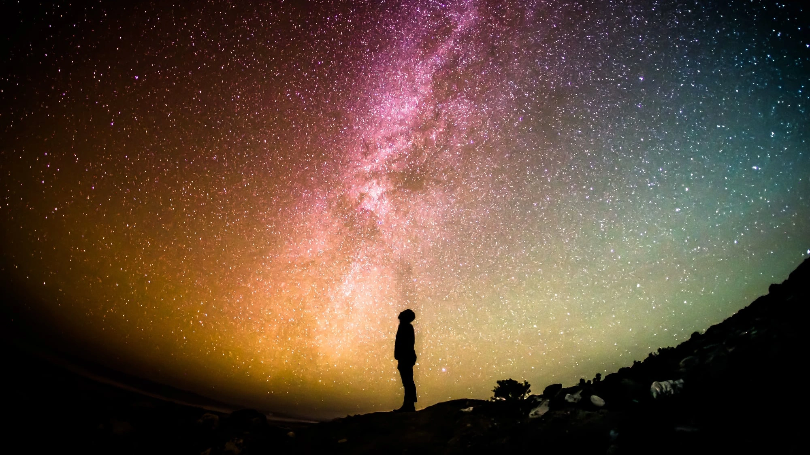
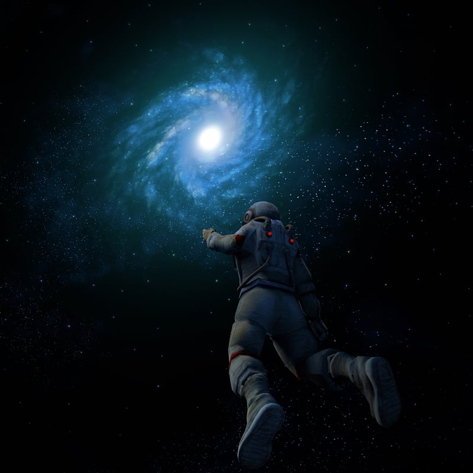
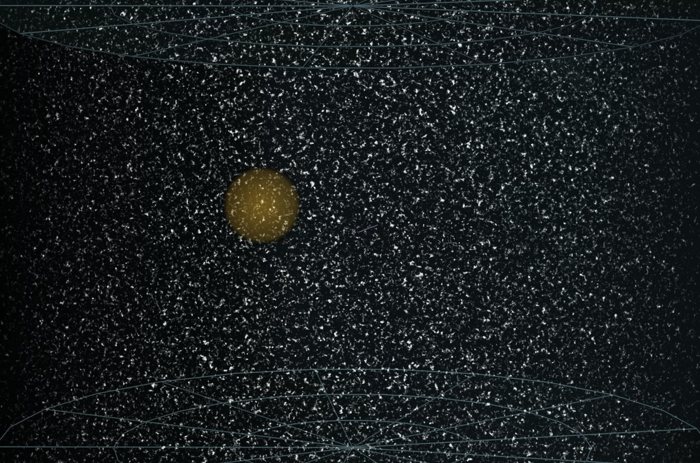
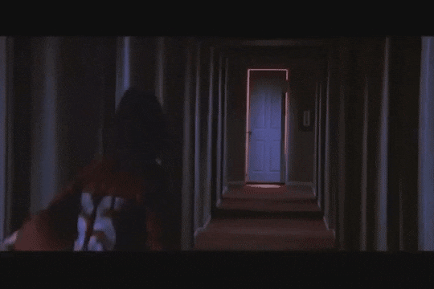
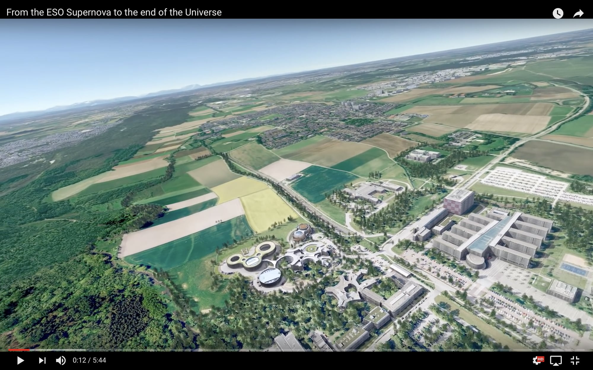

::: {.column-screen}

:::



::: {.lead-in}
In case a child asks how big the universe is exactly, you might want to know what the most honest, straightforward answer is. Although there is no direct way of knowing its total size with absolute certainty, telescopes and mathematics help tremendously in estimating the scale of what we can observe when we look up into the night sky.
:::

# Observable universe

Imagine floating in pitch darkness with no reference frame. Reaching into the pocket of your spacesuit, you retrieve an extensible monocular telescope. Gazing through the lenses like a nocturnal navigator, you notice what initially appears to be a faint dot of light, which gradually resolves into an entire cluster of shining points.

{#fig-astronaut fig-alt="Artwork of an astronaut in a spacesuit floating in deep space with outstretched arm towards a glowing blue spiral galaxy."}

Swivelling around—looking above, below, and in every direction—you discover an astronomical number of galaxy clusters surrounding you, forming a spherical horizon with you situated at its exact geometrical centre (@fig-astronaut).

Physics teaches us that light propagates at a finite speed ($c \approx 3 \times 10^8\text{ m/s}$). Consequently, more galaxies may exist beyond those visible, but their light has simply not had enough time to reach our sensors since the Big Bang.

The region of spacetime we can *in principle* observe—delimited by the finite speed of light and cosmological time rather than technological limitations—is termed the **observable universe**.

Now comes the crucial caveat: the entire universe could be vastly larger than our observable patch, but we cannot measure by how much because light from beyond the horizon will likely never reach us. The universe is expanding, and that expansion is accelerating.

{#fig-bubble fig-alt="Cosmological diagram showing a golden sphere representing the observable universe with Earth at the centre, embedded within a much larger dark expanse of hypothetical unobserved galaxies."}

Regarding our position at the centre: whenever you stand anywhere in open space, the distance from your vantage point to your observational horizon is identical in every direction. If you drift to another region, your bubble of observation moves with you.

The same geometrical principle applies to Earth's location in cosmology (@fig-bubble). This does not mean Earth is at the centre of the entire universe—the cosmos possesses no physical centre—but every observer is necessarily situated at the centre of their own *observable* sphere.

# Accelerated expansion

Light emitted from beyond our cosmic horizon cannot reach us because the fabric of space is expanding at an accelerating rate. With each passing second, more metric distance is created than light can traverse.

Imagine walking down a long hotel hallway toward a doorway at the far end. Now imagine the corridor dynamically stretching: the floor and walls do not merely distort optically, but new physical space is generated between you and the exit. Even though you keep walking forward, the doorway recedes faster than your walking pace.

{#fig-hallway fig-alt="Film still showing an elongated perspective down a dim domestic corridor with an open doorway at the far end, demonstrating optical expansion."}

This scenario mirrors what a solitary photon experiences when emitted from an ultra-distant star: it travels at the speed of light through expanding space, yet cannot close the distance because intervening space expands faster than $c$ (@fig-hallway). The distant galaxies are not physically moving through space at superluminal speeds; rather, the spacetime metric itself is stretching.

# Estimated size

::: {.callout-note appearance="minimal"}
At the current expansion rate and given the cosmic age of 13.8 billion years, the **observable universe** has a comoving diameter of approximately **93 billion light-years**. This corresponds to roughly $8.8 \times 10^{23}\text{ km}$ ($5.5 \times 10^{23}\text{ miles}$).
:::

In terms of spatial volume, this region spans approximately $4 \times 10^{80}\text{ m}^3$ (or about $4 \times 10^{83}\text{ litres}$).

By comparison, Earth has a physical volume of around $1.083 \times 10^{21}\text{ litres}$, meaning our planet occupies only about $0.000\,000\,000\,000\,000\,000\,000\,000\,000\,000\,000\,000\,000\,000\,000\,000\,000\,000\,3\%$ of the observable volume.

::: {.callout-note appearance="minimal"}
The total size of the entire **universe**, however, remains unknown. It could be finite and closed, or spatially flat and infinite. Observational cosmology has not established an upper limit.
:::

# ESO cosmic zoom

An animation produced by the European Southern Observatory (ESO) illustrates this cosmic scale vividly, zooming outward from the ESO Supernova Planetarium in Garching, Germany, into deep space (@fig-eso). Once the camera leaves the Milky Way, every single pinprick of light represents not an individual star, but an entire galaxy containing hundreds of billions of stars.

[{#fig-eso fig-alt="Aerial simulation view of the ESO Supernova Planetarium campus in Germany transitioning towards a cosmological view of the surrounding landscape."}](https://youtu.be/hy2cxmHuEAs)

# Epilogue

Looking across these distances is inextricably linked to looking backward in time. Because light travels at finite velocity, observing objects billions of light-years away means observing them as they were billions of years ago, near the dawn of structure formation. Every telescopic glance into deep space is literally a journey through cosmic history.

---

### Image credits and references

* *Featured image: Silhouette against the Milky Way via Pixabay (CC0 Public Domain).*
* *Astronaut and galaxy digital art via Pixabay (CC0 Public Domain).*
* *Observable universe diagram adapted from original work by Strogoff ([CC BY-SA 3.0](https://creativecommons.org/licenses/by-sa/3.0/)).*
* *Hallway still from Poltergeist (1982), Metro-Goldwyn-Mayer.*
* *Cosmic zoom screenshot courtesy of ESO / European Southern Observatory.*