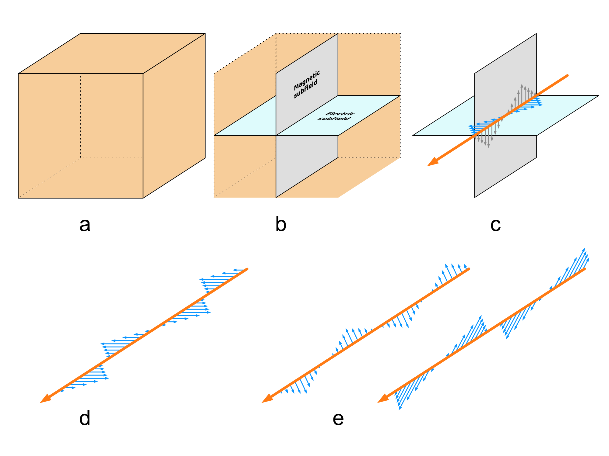
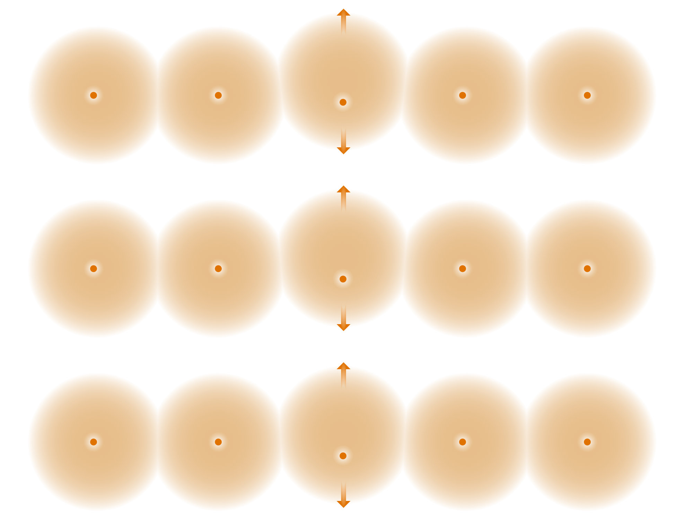

::: {.column-screen}

:::



::: {.lead-in}
According to our best understanding of the observable Universe, it is filled with an omnipresent electromagnetic field. Certain perturbations of that field correspond to what we call (electromagnetic) radiation, the visible part of which we call light or light particles, or photons. These disturbances can have specific but differing frequencies, which, when visible, we may perceive as red, yellow, green, blue or violet. Every photon has a frequency: some value is going up and down over time. It turns out that discovering what it is that is changing over time is the key to unlocking the answer to how polarised sunglasses work.
:::

Traditionally, it's useful to mathematically separate the electromagnetic field into two components: the magnetic and the electric subfield. For a slightly more in-depth discussion of this topic, have a look at [Why, exactly, do glass and liquids refract light?](../why-exactly-do-glass-and-liquids-refract-light/) Geometrically, these subfields are orientated perpendicularly to one another. Have a look at @fig-em-field.

{.img-border #fig-em-field fig-alt="Five-part diagram showing 3D field volume, perpendicular electric and magnetic planes, oscillating wavevectors, and multiple photon orientations."}

**Part a.** A three-dimensional electromagnetic field (EM-field) pervades the observable Universe. Here, it is depicted as a finite block but that's just a cartoony metaphor. In reality, it has the shape of the Universe, and it's seemingly infinite, or, to be more precise, it's everywhere you can possibly look.

**Part b.** As said before, it turns out to be very useful to mathematically separate the EM-field into two components: the magnetic and electric subfields, depicted here as two planes orientated perpendicularly.

**Part c.** When a photon passes through space, this is where the EM-field is disturbed. It is a local change of electric and magnetic values back and forth over time. Very important to note: there is nothing in space going up and down or left or right; it is just a cartoon depicting changing values of the respective subfields. The only thing that is actually spanning through space is the trajectory of the photon, depicted by an orange arrow.

**Part d.** For our polarised sunglasses, only the electric subfield is relevant, so we've left out the magnetic arrows; just the electric arrows are shown.

**Part e.** Of course, no light beam consists of merely one photon. In reality, a bundle of billions of photons are whizzing through space. The orientation of their EM-components will be at all sorts of angles.

# Inside the glasses

::: {style="width: 80%; margin: 1.5rem auto;"}
{.img-border #fig-filter fig-alt="Schematic illustration of three horizontal rows of atoms with orange nuclei and diffuse electron clouds, with arrows showing oscillation occurring predominantly in the vertical direction."}
:::

The atoms of polarised sunglasses are lined up in a chain of atoms in such a way that the most wiggle room they have is in the vertical direction as depicted by @fig-filter. Incoming photons transfer their energy, through the EM-field, to the wiggling electron cloud, which starts wiggling even more but only in the vertical direction. The latter will activate the EM-field with a vertically orientated electric subfield component, thereby propagating the vertically polarised parts of the incoming light beam.

Photons with a horizontal polarisation, i.e. with a horizontally orientated electric subfield, wiggle the long chains of the sunglasses' atoms in the horizontal direction. Their energy gets distributed over billions of atoms, horizontally, and is merely dissipated as heat: too low for light propagation. So, basically, these types of photons disappear and the sunglasses warm up a little bit.

Lastly, photons with an electric subfield perturbation at an angle in between the horizontal and vertical direction will sometimes pass through, and sometimes dissipate.

# Why are polarised sunglasses vertically polarised?

When light hits a surface, the outgoing or reflected light mostly consists of photons with the same electric orientation as that of the reflecting surface. So, roads and water mainly reflect horizontally polarised light. When you're navigating a vehicle, you would definitely want to prevent glare from reflections off the road or water.

# Pilots

Computer screens also emit polarised light. If you hold polarised sunglasses in front of one and turn them, at some point, the screen's light will be blocked.

::: {style="width: 70%; margin: 1.5rem auto;"}
{#fig-rotation fig-alt="Demonstration showing a pair of polarised sunglasses being rotated 90 degrees in front of a computer screen, turning completely black due to cross-polarisation."}
:::

This is also why pilots [don't wear polarised sunglasses](https://www.faa.gov/pilots/safety/pilotsafetybrochures/media/sunglasses.pdf): a slight turn of the head would make it impossible to quickly and reliably read vital information off their instruments. So, despite what expensive brands would like you to believe, a set of polarised sunglasses called something like "aviator sunglasses" is useless in real-life aviation.

To check whether your sunglasses have genuine polarised filters, tilt them in front of a working computer screen. This way you'll know which pair to leave at home before flying an aircraft.

# Cinema

Watching a 3D film at the cinema requires a different type of polarised glasses. So, despite what many people may have told you, it's not that one lens has been vertically polarised and the other horizontally. True, your left eye needs to receive slightly different images from your right eye, but this is achieved in a far more ingenious way.

As you would want the audience to be able to watch the film despite their (sometimes involuntary) head movements, both the film projector and the 3D glasses cleverly exploit [circular polarisation](https://en.wikipedia.org/wiki/Polarized_3D_system#Circularly_polarized_glasses). Otherwise, the moment you were to lovingly tilt your head towards your companion's shoulder, a simplistic left-right combination of horizontal and vertical polarisation would render any film star on the big silver screen into a vague and flat character.