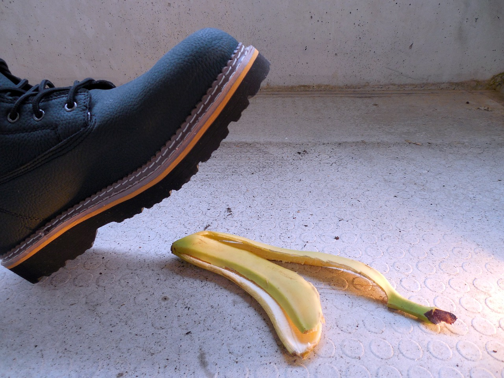
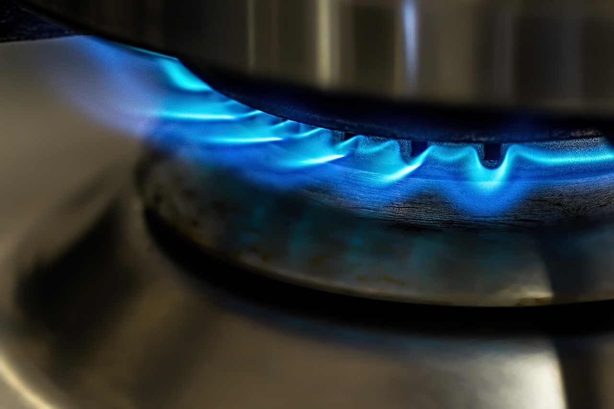

::: {.column-screen}

:::



::: {.lead-in}
Some say that the radiation inside a microwave oven is bad for our health. And that it's bad for our food. It's uncertain from where these contentions originate exactly. Even though the introduction of the microwave oven[^1] in our homes took place in the 1960s, among some, they never got rid of their unhealthy reputation entirely. In this article, we will have a look at what its radiation is and how that influences food and vitamins. We will then proceed to answer the question: is microwave oven radiation unhealthy?
:::

# The word 'radiation'

. That is absolutely not at all what microwave oven radiation is.](pripyat-1366159_1280.jpg){#fig-pripyat fig-alt="Overgrown and abandoned apartment buildings in the ghost town of Pripyat near Chernobyl under an overcast sky."}

In physics, "radiation" is the emission or transmission of energy in the form of waves or "particles". Not all radiation is a health hazard to our species, as we have evolved to be immune in most cases. Radiation emitted by nuclear reactors is dangerous. However, it may not surprise you that we have evolved to withstand the radiation of tea lights.

While society generally might not care about what physics says "radiation" means, this is what we're going to be using throughout this article.

::: {.callout-note appearance="minimal"}
Radiation is **not always dangerous**. There are more things in everyday life than you might think which are forms of radiation.
:::

::: {style="width: 45%; float: right; margin: 0 0 1rem 1.5rem;"}
{fig-alt="Yellow banana peel lying discarded on an asphalt road surface."}
:::

Some examples of sources of radiation: bananas (which are naturally radioactive), magnets, candlesticks, central heating, club and stage lights, any light source for that matter, including your bathroom light, human bodies, microwave ovens, the Sun, the uranium and plutonium rods of a nuclear plant, and furthermore, *anything* you can see with your eyes either emits or reflects radiation, right here, right now.

Just look straight into the eyes of your partner, or friend with merits, lying next to you the next morning: whether you want to or not, they have been literally gushing their radiation all over your body, right here, and are still, right now, the whole time. And not in any spiritual or venereal sense, no, you have been and are being exposed to actual spurts of electromagnetic radiation discharging from their bodies,[^2] at energy levels literally more than a hundred thousand times higher than microwave oven radiation.

::: {.callout-note appearance="minimal"}
In fact, in all the examples above, it's the same type of radiation as microwave oven radiation, called **electromagnetic radiation**. The difference is that *the examples are more than a hundred thousand times more energetic* than microwave oven radiation. Except for a big chunk of the Sun's radiation, and uranium and plutonium rods. Those entail dangerous forms of ionising radiation, and involve more than just the electromagnetic kind.
:::

# Ionising radiation

The dangerous form of radiation is called ionising radiation. This is the type of radiation many people think of when they hear the word "radiation". Microwave oven radiation isn't that.

::: {.callout-note appearance="minimal"}
If incoming radiation has so much energy that it strips one or more electrons away from their nucleus, we call this **ionising radiation**. An atom which has lost one or more electrons is considered to be ionised, and so, we call it an ion.
:::

Why is this dangerous? Well, our bodies are made of large strings and knots of intertwined atoms. Our skin, organs, cells, DNA—it's all made up of trillions of atoms. Those atoms are only able to form these large chains and knots because their electrons keep them together this way.

Thus, if ionising radiation strips away those electrons from their nucleus, then our molecules, cells, DNA—it all falls apart. Damage to our DNA is particularly dangerous, as this could develop into cancerous growth. Fortunately, our bodies have evolved to possess certain superpowers, enabling them to repair damaged cells and even DNA to an astonishing degree.

Sadly, there are limits. A sufficient blast of ionising radiation may cause damage beyond our bodies' repair capabilities and thereby cause cancer.

::: {.callout-note appearance="minimal"}
Ionising radiation breaks down atoms, thus molecules, thus organic cells. When our body's repair mechanism is overwhelmed by the amount of ionisation, this may eventually lead to cancer and organ failure. Microwave oven radiation, however, is not ionising at all. Far from it. It is simply not energetic enough. Not by a stretch.
:::

Examples of ionising radiation are:

* *subatomic particle radiation*: such as protons, neutrons, separate or combined to form an atomic nucleus,[^3] as well as electrons and positrons[^4] flying about, aimed in your general direction;
* *high-energy electromagnetic radiation*: cosmic rays, gamma rays,[^5] X-rays,[^6] and higher-energy ultraviolet (UV) light.

# Electromagnetic radiation

Microwave oven radiation is electromagnetic radiation. What is the latter then? In physics, we have one of the most successful theories ever formulated, called quantum electrodynamics (QED), which arose in the 1930s. Richard Feynman made major contributions to QED. It is the first theory within the larger physical framework called quantum field theory (QFT). In short, without QED, we wouldn't have had electromagnetism-based technology such as microprocessors—which means we wouldn't have had TVs, computers, mobile phones, or the internet.

::: {.callout-note appearance="minimal"}
Space throughout the entire observable Universe is filled with three-dimensional fields. In fact, fields are a *property* of space. Space without fields does not exist. With space come fields.

There are many fields. Two of these are the **electromagnetic field** and the **electron field**.

We perceive oscillations at specific frequencies in the electromagnetic field as **photons**, "particles" of light, sometimes visible light, but most of the time invisible light.

We perceive oscillations at specific frequencies in the electron field as **electrons**. If we measure them—interact with them using an electric probe in the laboratory, for instance—we perceive them as "particles".

Electrons influence the electromagnetic field. The latter influences electrons in return. Photons *are* oscillating parts of the electromagnetic field, and so electrons influence photons, while photons influence electrons. However, electrons are only influenced by photons when the latter have *specific* energy values, not just *any* energy value.

Photons, or the electromagnetic field disturbances caused by a microwave oven, do not have the required energy value to ionise the atoms in our body.
:::

{#fig-fields fig-alt="Schematic diagram illustrating two intertwined horizontal field sheets: a yellow electron field and a green electromagnetic field with energy oscillations."}

# How do we know?

Max Planck, the German theoretical physicist (1858–1947), found a way to calculate the energy values for photons. Einstein subsequently used Planck's formula to come up with another formula allowing us to calculate whether atoms would become ionised by certain forms of radiation.

::: {style="width: 50%; margin: 1.5rem auto;"}
{#fig-planck fig-alt="Black and white portrait photograph of German physicist Max Planck wearing spectacles and a formal dark suit."}
:::

After many more contributions by brilliant minds, the branch of science arose through which we are now able to harness the power of electromagnetic radiation, including that of the microwave oven, radio signals, TV broadcasts, Wi-Fi, and mobile phone signals.

If radiation in a microwave oven were dangerous, then the ordinary light bulbs in your home would liquidate you instantly to a warm pulp. Planck, Einstein, and others would be turning in their graves.

# Heat

Knowing this, the natural question to ask is: what about all the heat? If microwave oven radiation is really that low-energy, how does it manage to make food piping hot? The answer is friction.

Remember that time when you bent a piece of steel wire back and forth quickly for a while, and the bend eventually became hot? That is because you had been moving many molecules back and forth quickly enough to heat up the wire due to friction. You don't need life-threatening amounts of energy—merely mechanical work—to make something hot. Microwave radiation does that mainly with the water molecules in food.

::: {.callout-note appearance="minimal"}
Under the influence of the oscillating electromagnetic field inside the microwave oven, the polarised water molecules rotate back and forth about 2,400,000,000 times per second (2.45 GHz). Friction with their surroundings generates heat.
:::

It's like rubbing your hands together very rapidly, which entails friction and causes heat. This is why it's easier to heat up solid food in a microwave oven than liquids, such as a cup of water: in the latter, water molecules experience less resistance and friction than in a denser matrix.

The radiation does nothing to the atomic structure. It merely causes molecules to move, just as a flame does, or a conventional oven. Making molecules move: that's all there is to it.

# Vitamins

::: {.callout-note appearance="minimal"}
Does microwave oven radiation destroy vitamins? As stated before, the radiation isn't ionising, so it does not break chemical bonds directly. **Heat does**, however. Just as flames and conventional ovens heat up food and through that heat break down vitamins, so does thermal energy generated in a microwave.
:::

The longer food is exposed to heat, the more vitamins are broken down. Therefore, if food is heated quickly, fewer vitamins are lost. Heating vegetables quickly inside an efficient microwave oven often spares more vitamins than a long boil on the stove.

::: {style="width: 80%; margin: 1.5rem auto;"}
{#fig-flame fig-alt="Close-up photograph of bright blue gas flames heating the steel bottom of a cooking pot on a stove."}
:::

Moreover, boiling vegetables in water and discarding the cooking water means pouring the dissolved water-soluble vitamins down the sink. In a microwave oven, minimal water is needed, so nutrients stay on your plate.

Lastly, while microwave radiation does not create carcinogenic compounds, burning food on a conventional stove or barbecue can. So, avoid burning food to a crisp and then eating it.

# Is microwave oven radiation unhealthy?

::: {.callout-note appearance="minimal"}
Courtesy of quantum physics, microwave oven radiation is not unhealthy and does not make food radioactive. There is no residual radiation left in food once the oven is switched off: it is like turning off a light switch, except the photons carry a hundred thousand times less energy than visible light.
:::

If someone tells you that microwave ovens are unhealthy, ask them for the exact quantum-mechanical equations supporting their claim. If quantum mechanics weren't correct, computers wouldn't work, mobile phones would be fancy paperweights, and the internet wouldn't exist.

::: {style="width: 45%; float: right; margin: 0 0 1rem 1.5rem;"}
{fig-alt="Man paddling a red canoe across open water on a sunny day without a shirt."}
:::

By that same physics, however, do watch out for the Sun's UV light in the summer. Avoid unshielded exposure to cosmic rays, gamma rays, and high-energy particle beams.[^7] So, whatever you do, do not take a walk outside the International Space Station without a spacesuit.

Instead, warm up some broccoli in a microwave oven, eat a banana, and enjoy the maths and physics of everyday life.

---

### Image credits and references

* *Featured image: Modern kitchen interior via Pixnio (CC0 Public Domain).*
* *Photo of Pripyat by Denys Reznik via Pixabay (CC0).*
* *Max Planck portrait (1933), German Federal Archives (Bundesarchiv, Bild 183-R01144 / CC-BY-SA 3.0).*
* *Cooking flame and canoeing photographs via Pixabay (CC0).*

[^1]: Early models were originally marketed as "electronic ovens".
[^2]: Infrared radiation, mostly. Our bodies are also slightly radioactive: roughly 4,000 to 5,000 atomic nuclei (mainly potassium-40 and carbon-14) decay in our tissues every second (4,000–5,000 Bq).
[^3]: Also known as alpha radiation.
[^4]: Also known as beta radiation.
[^5]: Highly penetrating electromagnetic radiation arising from radioactive decay or astronomical processes.
[^6]: Diagnostic X-ray examinations use tightly regulated, low doses that tissue repair mechanisms handle easily.
[^7]: Unless exposure is administered for targeted medical therapy by oncology professionals.