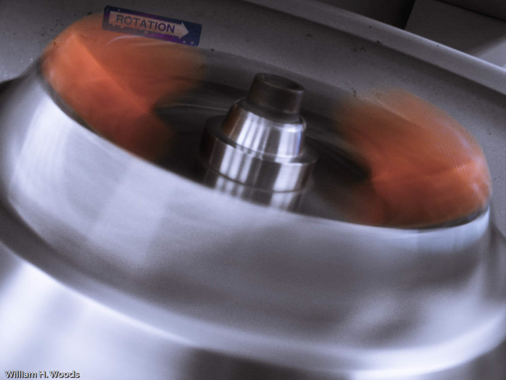
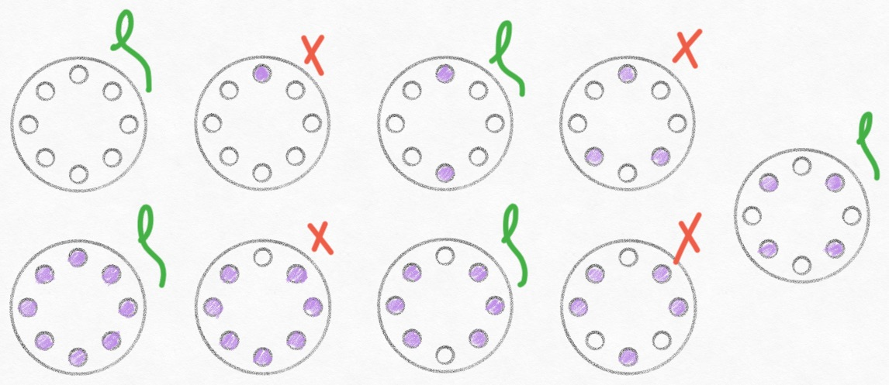
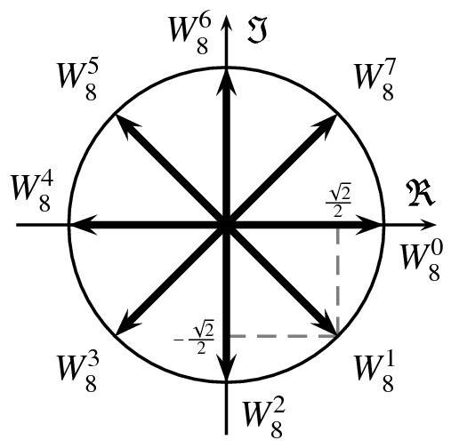

::: {.column-screen}

:::



::: {.lead-in}
When microbiologists or molecular biologists conduct research on viruses, bacteria, fungi, or human cells, one indispensable instrument in their laboratory is the centrifuge. This device allows them to separate substances suspended within a test tube by density—enabling the purification of enveloped viruses, such as SARS-CoV-2, or the isolation of nucleic acids like DNA.
:::

The rotor of a centrifuge spins at tens of thousands of revolutions per minute. It is critical that test tubes are placed in a balanced arrangement. If unevenly loaded, severe force imbalances can damage the rotor bearings or fling hazardous substances across the room[^1].

Fortunately, there is an elegant mathematical method to determine whether any given number of test tubes can be balanced, based entirely on **prime numbers**. Remarkably, a complete mathematical proof for this general criterion was published relatively recently, in 2010.

::: {style="width: 75%; margin: 1.5rem auto;"}
{#fig-rotor fig-alt="Close-up photograph of a metal centrifuge rotor spinning at high speed, creating motion blur around the central drive spindle."}
:::

# The set-up

We assume that all test tubes (and their contents) have identical mass. While one can calculate balance through torque and center of mass in classical mechanics, this problem can be formulated purely in terms of geometry and number theory.

Suppose a centrifuge has $n = 8$ symmetrically spaced slots arranged on a circle:

* **1 test tube:** Cannot be balanced; it will always be asymmetric.
* **2 test tubes:** Easily balanced by placing them diametrically opposite one another.
* **3 test tubes:** Impossible on an 8-slot rotor; any arrangement produces an off-centre net force.
* **4 test tubes:** Balanced by forming a symmetric square configuration.
* **5 test tubes:** Impossible, because leaving 3 empty slots is dynamically equivalent to placing 3 tubes!
* **6 test tubes:** Balanced; leaving 2 empty slots is the exact complement of placing 2 tubes.
* **7 test tubes:** Impossible; equivalent to leaving 1 empty slot.
* **8 test tubes:** Trivial balance; all slots filled.

Notice the complementary relationship: an arrangement of $k$ tubes is balanced if and only if the complementary arrangement of $n - k$ empty slots is also balanced (@fig-configurations).

::: {style="width: 85%; margin: 1.5rem auto;"}
{#fig-configurations fig-alt="Hand-drawn diagram of eight 8-hole circular centrifuge rotors, showing arrangements from 0 to 7 test tubes marked with green checkmarks for balanced configurations and red crosses for unbalanced ones."}
:::

# Prime factorisation

Recall that a prime number is an integer greater than 1 whose only positive divisors are 1 and itself ($2, 3, 5, 7, 11, 13, \dots$).

By the **fundamental theorem of arithmetic**, every integer greater than 1 can be uniquely represented as a product of prime factors. For example:

$$12 = 2^2 \times 3,$$

$$15 = 3 \times 5,$$

$$16 = 2^4.$$

Prime numbers act as the fundamental multiplicative building blocks of all integers.

# The criterion

Suppose a centrifuge rotor has $n$ symmetrically spaced slots, and we wish to load $k$ identical test tubes (leaving $n - k$ empty slots):

::: {.callout-note appearance="minimal"}
**Balancing Rule:** Determine the distinct prime factors of $n$. A balanced configuration of $k$ test tubes exists if and only if **both** $k$ and $n - k$ can be written as a sum of these prime factors.
:::

::: {.callout-note collapse="true"}
## Mathematical proof via roots of unity

In his 2010 paper, Gary Sivek formalised this problem by identifying the $n$ centrifuge positions with the $n$-th roots of unity on the complex unit circle:

$$z_m = e^{\frac{2\pi i}{n} m}, \quad m \in \{1, 2, \dots, n\}.$$

Placing $k$ identical test tubes at positions $S \subset \{1, \dots, n\}$ corresponds to selecting $k$ roots of unity. The system is physically balanced when the centre of mass lies at the origin, meaning the vector sum of these positions vanishes:

$$\sum_{m \in S} e^{\frac{2\pi i}{n} m} = 0.$$

Applying theorems by Lam and Leung regarding vanishing sums of roots of unity, Sivek proved that a subset of $k$ roots sums to zero if and only if both $k$ and $n - k$ can be expressed as linear combinations of the prime factors of $n$ with non-negative integer coefficients.

::: {style="width: 40%; margin: 1rem auto;"}
{#fig-roots fig-alt="Complex plane diagram displaying eight roots of unity arranged symmetrically along the circumference of a circle."}
:::
:::

# Examples

### An 8-slot centrifuge

For $n = 8$, the only prime factor is $2$.

* Can we balance **6** tubes?
  * Occupied slots: $6 = 2 + 2 + 2$ (valid sum of 2s).
  * Empty slots: $8 - 6 = 2$ (valid).
  * Verdict: **Yes**, 6 test tubes can be balanced.
* Can we balance **7** tubes?
  * Empty slots: $8 - 7 = 1$. The number 1 cannot be written as a sum of 2s.
  * Verdict: **No**, 7 test tubes cannot be balanced.

### A 12-slot centrifuge

For $n = 12$, the prime factors are $2$ and $3$.

Can we balance **7** test tubes in a 12-slot rotor?

* Occupied slots: $7 = 2 + 2 + 3$ (valid sum of prime factors $2$ and $3$).
* Empty slots: $12 - 7 = 5 = 2 + 3$ (valid sum of prime factors $2$ and $3$).

Verdict: **Yes**, 7 test tubes can indeed be perfectly balanced in a 12-hole rotor! This counter-intuitive result works because a balanced 7-tube arrangement can be formed by superposing a balanced equilateral triangle (3 tubes) and two diametric pairs ($2 + 2 = 4$ tubes).

# The additive shortcut

Any time you can express your target number of tubes as a sum of configurations that are individually balanced, their superposition remains balanced. For example, in a 12-hole rotor, 2 tubes form a line, and 3 tubes form an equilateral triangle. Because $7 = 2 + 2 + 3$, combining those independent symmetries yields a balanced arrangement.

# Final remarks

Modern centrifuges feature electronic imbalance sensors, labeled rotor slots, and swinging-bucket compartments holding standardized tube racks that simplify balancing during routine laboratory work.

The true elegance of this problem lies in the bridge it builds between everyday laboratory equipment and pure mathematics—connecting centrifugal dynamics to prime numbers, cyclotomic polynomials, and complex geometry.

---

### Image credits and references

* *Featured image: Centrifuge loading by Michail Tzortzatos ([CC BY-SA 4.0](https://creativecommons.org/licenses/by-sa/4.0/)).*
* *Spinning rotor photograph by musicalwoods ([CC BY-SA 2.0](https://creativecommons.org/licenses/by-sa/2.0/)).*
* *Configuration diagrams by KJ Runia.*
* Sivek, G. (2010). "On vanishing sums of roots of unity", *INTEGERS*, 10, A31, pp. 369–378.

[^1]: Imbalance sensors are standard equipment on modern benchtop and ultracentrifuges to abort spinning in case of severe vibration.