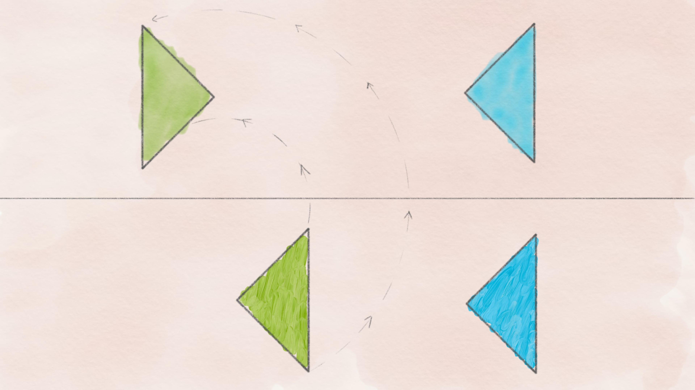
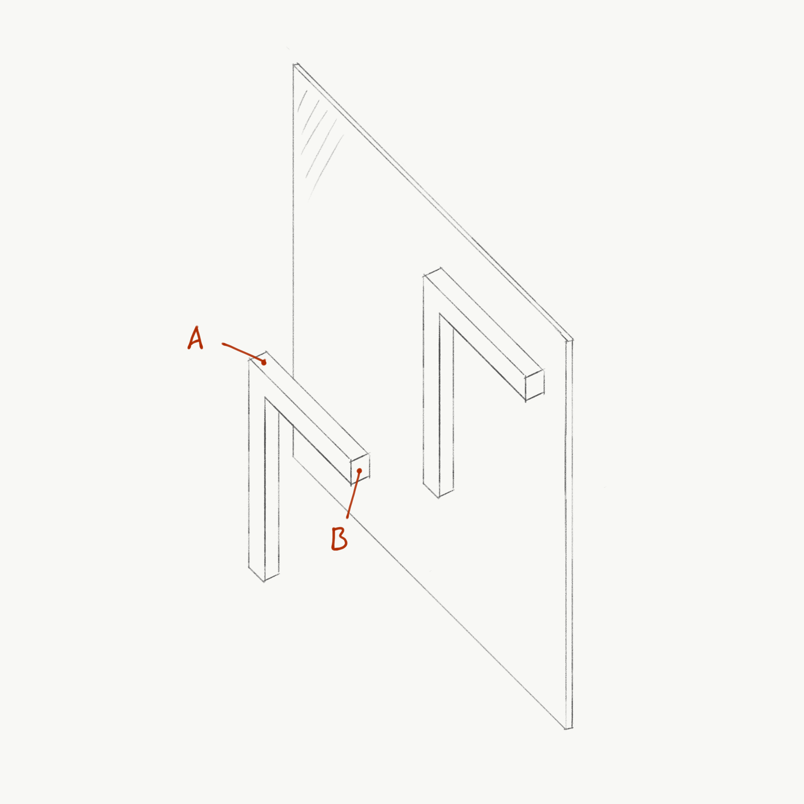
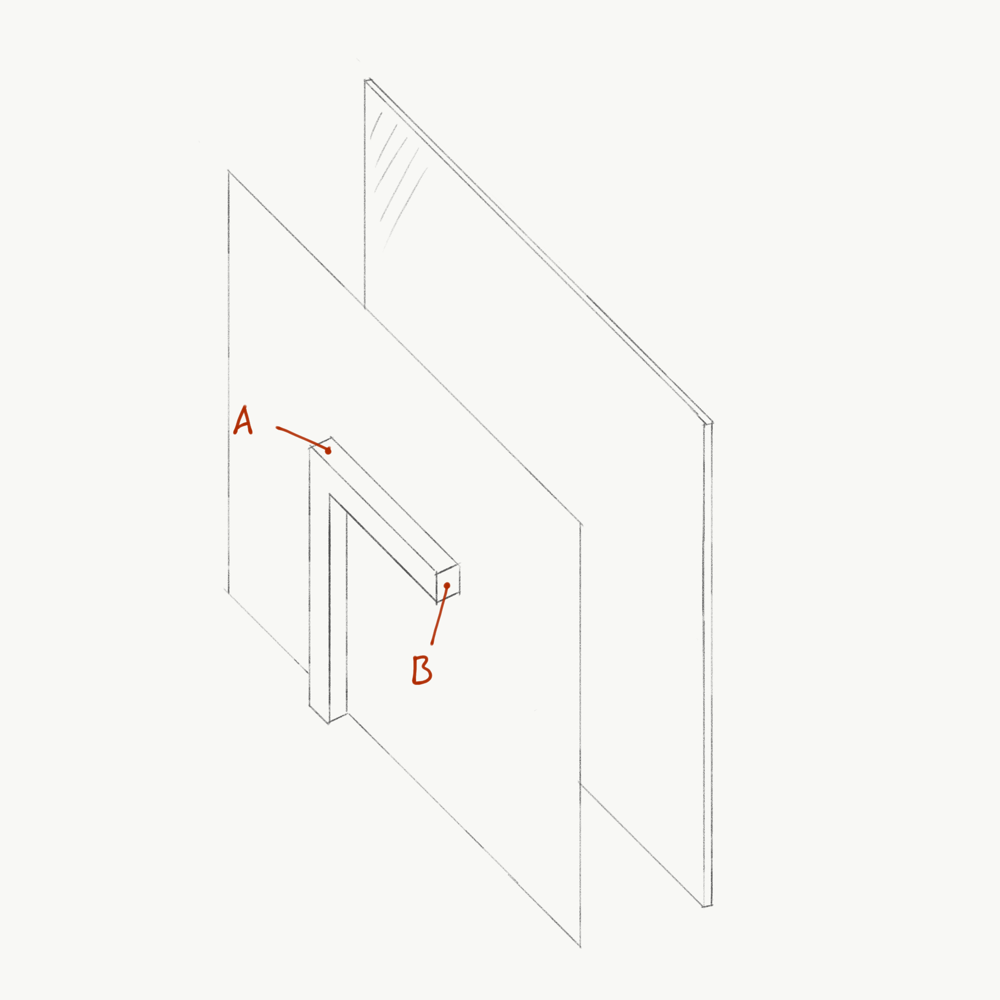
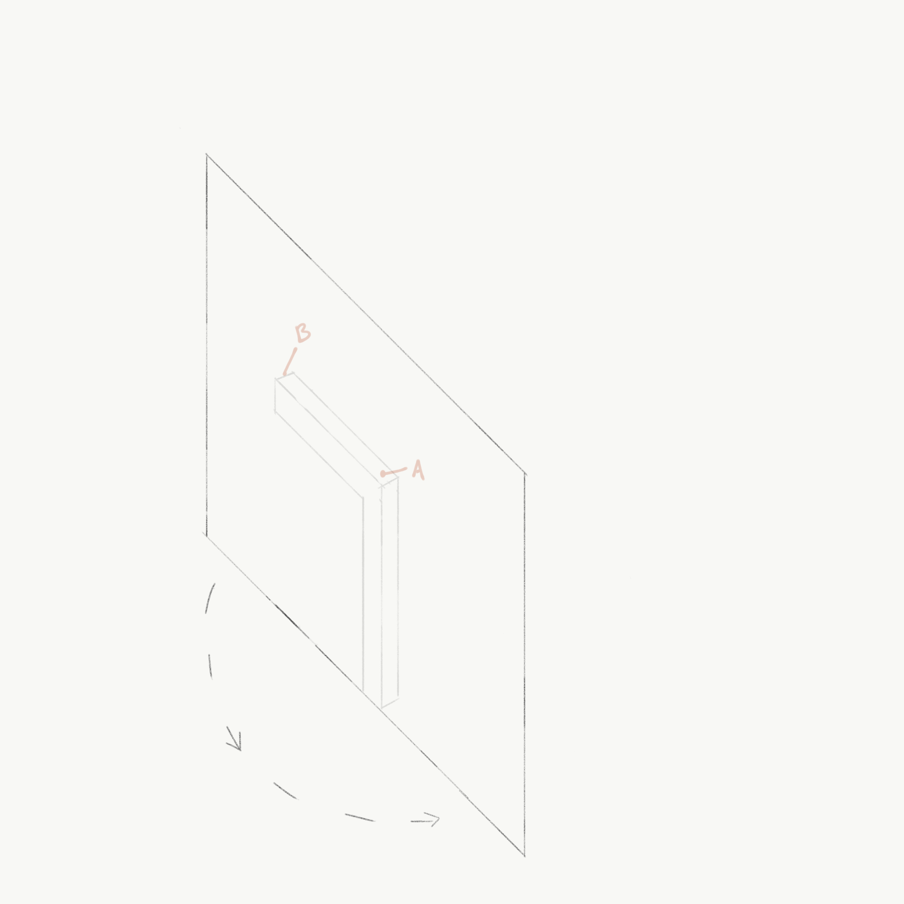
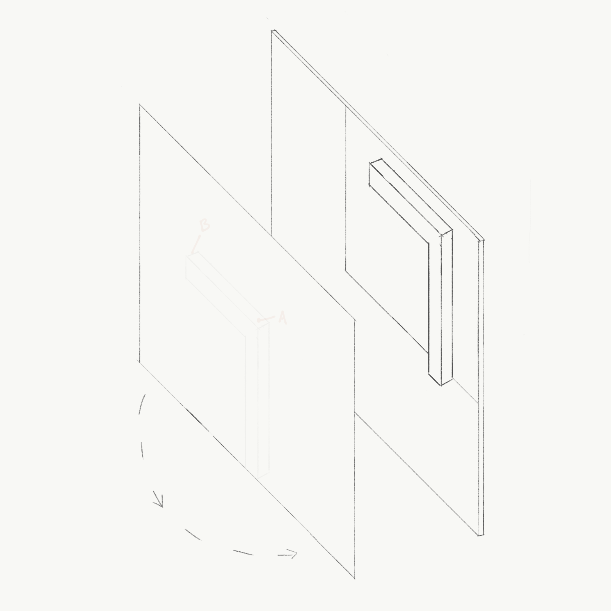
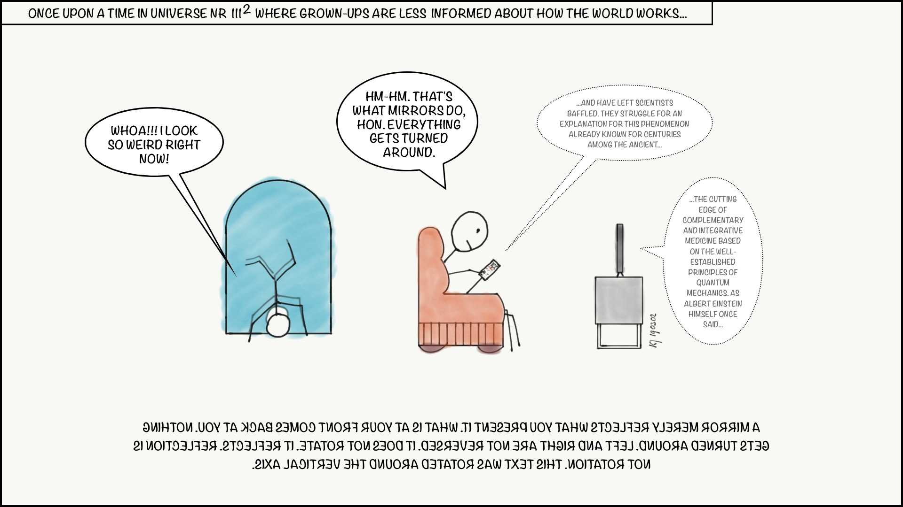
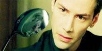

::: {.column-screen}

:::



::: {.lead-in}
Ever wondered why sentences, words, and letters always exclusively seem to have their left and right reversed in the looking glass, while mirror writing is almost never projected upside down? Things are happening which may not be obvious. For starters, mirrors do *not* reverse left and right.
:::

We are intelligent types with (sometimes too much) self-awareness. We look in the mirror, and we know it is our reflection and not someone else staring back at us. However, if you were ever under the impression that, for instance, the left and right sides of your face are reversed, you might want to re-evaluate the depth of this appreciation. You are probably still mistaking your mirror image for a real other person facing you. Even though the situations look similar, they are not equal—not just in the metaphysical sense but, more relevantly, in the *mathematical* sense. This relates to why letters, words, and sentences seem left-right-reversed by the mirror and almost never projected upside down, but we will get to that later.

# Mirror Guy

Let's reflect on the photo below for a moment. The Tie Guy in front of the mirror, trying to tie his tie for a white tie dinner, is looking at *himself* in the mirror. Who knew? I know, but bear with me, because both peculiarly and crucially, it is important to acknowledge that it is, in fact, himself, *and not someone else*.

{#fig-obama fig-alt="President Barack Obama viewed from behind as he looks into an oval gilded wall mirror adjusting his white bow tie, with his clear frontal reflection looking directly back."}

Let's perform a thought experiment. Imagine Tie Guy drawing a big L on the palm of his left hand and a big R on that of his right:

1. Tie Guy has an L on the palm of his left hand and an R on the palm of his right hand;
2. Mirror Guy is not someone else: Mirror Guy *is* Tie Guy;
3. Tie Guy presses his *left* hand with an L against the mirror;
4. If a mirror were to reverse Tie Guy's left and right, Mirror Guy should use the hand with an R, since that is Tie Guy's *right* hand;
5. Mirror Guy does not: he uses the hand with an L;
6. Hence, Tie Guy's *left* hand with an L *is* Mirror Guy's *left* hand with an L;
7. Therefore, a mirror *does not* reverse left and right.

Point 6 is probably hardest to grasp at first. Clearly, the Ls of both Guys are up against the mirror. Yet, we still think a mirror reverses left and right. The cognitive hurdle is perhaps that while we accept our mirror image to be us, we are hardwired to continue to treat it as though it were *someone else* facing us. On a daily basis, chances are we interact more with people facing us than we do with our mirrored selves.

We have grown accustomed to mentally reversing left and right, which evidently has proven to be useful during our interactions with everyday humans. We were taught already at an early age that "your left is her right" or "her left is your right". Similarly, a mathematical physics professor, upon *turning around* to face the audience in the lecture hall again, knows all too well that the strings of equations on the blackboard on her left are in fact on her students' right.

Ironically, left and right get reversed *in the real world* and not in mirrors. Our left hand is simply our mirror image's left hand and not "their right"—that is just how the Mirror Universe works.

# Transformation

Wait, did I just write "turning around" in italics for a particular reason? Indeed, I did. Turns out, rotations, reflections, and symmetries are tricky. Hence, what follows is an important distinction:

::: {.callout-note appearance="minimal"}
Mathematically, someone facing you—be it your biological clone—has been *rotated* (180 degrees) with respect to your position and direction, whereas your mirrored self is *not*. Instead, your mirror image is a *reflection*. Rotation and reflection are distinct geometrical transformations. Stating that a mirror reverses left and right is simply confusing rotation with reflection.
:::

{#fig-rotation-reflection fig-alt="Diagram comparing geometric transformations with green and blue triangles: top row shows a planar reflection across a horizontal axis, while dashed circular arrows demonstrate a 180-degree rotation."}

After a rotation of 180°, we need to use the antonym of "left" or "right", which is not needed in the case of a reflection. However, it is highly plausible one does not encounter reflected human beings very often. We mostly deal with rotated bipeds. So, in the case of looking at your mirror image, you just need to un-think that your mirrored self is someone else: you need to accept that the mirrored self *is* you.

Funnily enough, accepting that a mirror does not reverse up and down either is a lot easier. Imagine Tie Guy bumping his head against the mirror. Mirror Guy does not then bump his feet against the glass. Therefore, a mirror reverses neither up and down nor left and right.

# Why mirrored letters look weird

So, what's up with mirror writing? Clearly, *something* is going on with letters, words, and manuscripts, as Leonardo da Vinci knew all too well. Something is going on indeed, but not what you might think. In fact, the mirror has very little to do with it. I blame the opacity of the material we usually write on for our lack of immediate insight.

Have a look at @fig-gamma. We replace a symmetrical human with an asymmetric object resembling the Greek uppercase letter gamma ($\Gamma$), which makes reflection easier to visualize.

{#fig-gamma fig-alt="Perspective line drawing of a three-dimensional gamma-shaped frame standing in front of a mirror, showing point A on the top-left and point B on the top-right remaining on the exact same respective sides in the reflection."}

As you can see, points A and B in our original object have not swapped places in the mirrored object. If you imagine yourself standing behind the original object looking at the mirror, point A is on your left and point B is on your right. The exact same is true for the mirror reflection: point A remains on the left and point B remains on the right.

Now imagine the shape of the object being printed onto a large sheet of paper, as drawn in @fig-sheet.

{#fig-sheet fig-alt="Isometric drawing of the gamma-shaped letter attached to the front of a large opaque white rectangular sheet placed parallel to the mirror plane."}

Right now, we have written a letter on a piece of paper, but we cannot see it in the mirror because the back of the opaque sheet blocks the view. What do we naturally do? We turn the paper around to face the mirror.

So, as shown in @fig-sheet-rotated, we *rotate* the paper. Now look at what happened to points A and B: they have reversed positions! Why? Because *you rotated the paper* 180 degrees around its vertical axis!

{#fig-sheet-rotated fig-alt="Line drawing showing a curved arrow indicating a 180-degree rotation of the sheet around its vertical axis, with the letter now on the back side and points A and B laterally swapped."}

And what does the mirror do? Look at @fig-mirror-rotated: the mirror simply reflects what is presented to it—namely, an already rotated letter.

{#fig-mirror-rotated fig-alt="Line drawing of the rotated sheet facing the mirror, showing the mirror reflection faithfully displaying the already rotated shape with point B on the left and point A on the right."}

# Conclusion

::: {.callout-note appearance="minimal"}
Letters look weird in mirrors because *you* rotated them towards the mirror. It is this rotation around the vertical axis that inverts their left-right arrangement, not the mirror.
:::

Because humans almost always rotate paper around the vertical axis, it creates the illusion that mirrors selectively flip left and right. Had you flipped the sheet vertically around the horizontal axis (over its top edge), the mirror reflection would appear upside down instead!

{#fig-comic fig-alt="Single-panel cartoon showing a child standing on his head in front of a mirror exclaiming how weird he looks, while a parent in an armchair watches a phone, with an explanatory text at the bottom printed entirely in mirror writing."}

Two concluding thoughts to reflect on:

1. The way you see yourself in the mirror (reflection) is fundamentally distinct from the way other people see you (rotation).
2. To make text look like mirror writing, you do not even need a mirror: simply write on a transparent sheet, rotate it 180 degrees around the vertical axis, and hold it up.

There is no spoon, and there is no magical mirror flipping left and right: it was your own rotation all along.

{#fig-matrix fig-alt="Film still from The Matrix showing Neo (Keanu Reeves) staring intently at a distorted, curved reflection of himself in the surface of a metal spoon."}

*For completeness: while mirrors do not reverse left and right, nor up and down, they do invert front and back—the orthogonal axis perpendicular to the mirror surface in 3D space. Because flat paper letters have no depth extension along this normal axis, that physical inversion is not what causes text to read backwards.*

---

### Image credits and references

* *Featured image: Macaque examining its reflection in a motorcycle mirror via Pixabay (CC0 Public Domain).*
* *Photo of Barack Obama by Pete Souza (White House, Public domain).*
* *Geometrical coordinate illustrations and editorial cartoon by KJ Runia.*
* *Film still from The Matrix (1999), Warner Bros.*