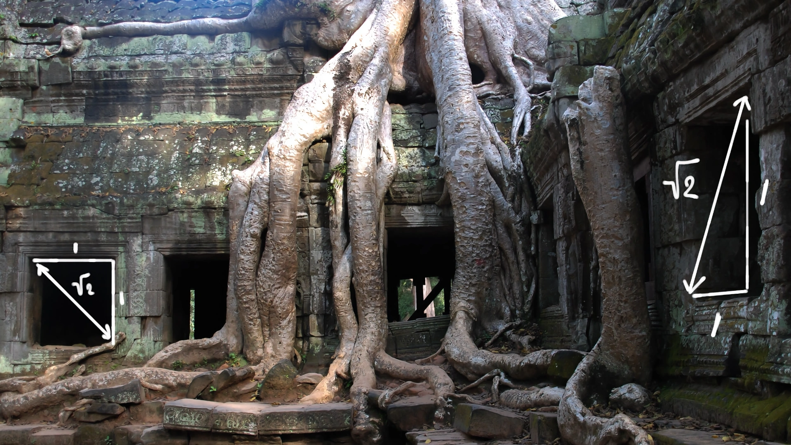
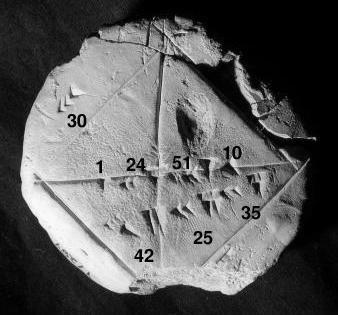

::: {.column-screen}

:::



::: {.lead-in}
While it is one of the most well-known and well-trodden proofs among proofs, the irrationality of $\sqrt{2}$ shouldn't be lacking on a blog about mathematics and physics. So, here it goes.
:::

# What is irrationality?

For those who aren't too familiar with mathematical jargon, let's first discuss what it means to be irrational. Obviously, we are not talking about the psychological attribute, but the mathematical one.

You might remember primary school when you had to learn about fractions such as:

$$1 = \dfrac{4}{12} + \dfrac{2}{3}.$$

A practical application of a fraction is when you were reading a recipe for a dish with a certain ratio of water and rice. Even if you might not be aware of it all the time, this ratio can be written as a fraction representing the proportions between water and rice. In fact, a fraction *is* a ratio.

For instance, in order to cook fluffy rice without needing to drain excess water, the ratio is typically 1 cup of rice to 1.5 cups of water.[^1] The fraction is $\dfrac{1}{1.5}$.

Conventionally, we write fractions using integers only:

$$\dfrac{1}{1.5} = \dfrac{2}{3}.$$

By multiplying both numerator and denominator by 2, we find that for 2 cups of rice, we add 3 cups of water.

In decimal form, $\dfrac{2}{3} = 0.666\dots$ There is no end to this repeating decimal, yet the value can be written down exactly as a rational ratio: $\dfrac{2}{3}$.

Of course, $\dfrac{2}{3}$ is identical to $\dfrac{4}{6}$, $\dfrac{10}{15}$, or $\dfrac{200}{300}$. All these fractions are multiples of our original ratio and can be simplified to their simplest irreducible form: $\dfrac{2}{3}$. In technical terms, $\dfrac{2}{3}$ is the fraction expressed in *lowest terms*.

Now we arrive at what irrational numbers are:

::: {.callout-note appearance="minimal"}
**Premise 1.** A number is irrational when it cannot be written as a ratio of two integers in lowest terms.
:::

Two famous examples of irrational numbers are $\pi$ and $\sqrt{2}$. When written in decimal notation, their digits continue indefinitely without any repeating pattern.

::: {style="width: 50%; margin: 1.5rem auto;"}
{#fig-tablet fig-alt="Black and white photograph of a circular Babylonian clay tablet with cuneiform inscriptions and geometric diagonal lines across an incised square."}
:::

# Proof by contradiction

How do we prove that $\sqrt{2}$ is irrational? We use a **proof by contradiction** (*reductio ad absurdum*): if assuming the opposite of a statement inevitably leads to a logical impossibility, the original statement must be true.

# Even and odd numbers

::: {.callout-note appearance="minimal"}
**Premise 2.** Any integer multiplied by 2 yields an even number. If $k$ is an integer, $2k$ is necessarily even.
:::

::: {.callout-note appearance="minimal"}
**Premise 3.** The square of an even number is always even, and the square of an odd number is always odd. Conversely, if $n^2$ is even, $n$ must also be even.
:::

# Proof that the square root of 2 is irrational

::: {.callout-note appearance="minimal"}
**Anti-Premise 1.** Suppose, by contradiction, that $\sqrt{2}$ *can* be written as a ratio of two integers in lowest terms:

$$\sqrt{2} = \dfrac{a}{b},$$

where $a$ and $b$ are non-zero integers sharing no common factors other than 1 ($\gcd(a, b) = 1$).
:::

Squaring both sides eliminates the radical:

$$2 = \dfrac{a^2}{b^2}.$$

Multiplying through by $b^2$:

$$a^2 = 2b^2.$$

Because $a^2$ is equal to 2 multiplied by an integer ($b^2$), $a^2$ must be an even number. By Premise 3, if $a^2$ is even, then $a$ itself must be even.

::: {.callout-note appearance="minimal"}
**Conclusion 1.** $a$ is an even number.
:::

Since $a$ is even, we can write $a = 2k$ for some integer $k$. Substituting this into our equation:

$$(2k)^2 = 2b^2,$$

$$4k^2 = 2b^2.$$

Dividing both sides by 2 yields:

$$2k^2 = b^2, \quad \text{or} \quad b^2 = 2k^2.$$

Because $b^2$ is equal to 2 multiplied by an integer ($k^2$), $b^2$ is also an even number. Applying Premise 3 once more, $b$ must be even as well.

::: {.callout-note appearance="minimal"}
**Conclusion 2.** $b$ is an even number.
:::

If both $a$ and $b$ are even, they both share a common factor of 2.

::: {.callout-note appearance="minimal"}
**Conclusion 3.** The fraction $\dfrac{a}{b}$ is not in lowest terms, as both $a$ and $b$ are divisible by 2.
:::

This contradicts our initial assumption that $\dfrac{a}{b}$ was expressed in lowest terms ($\gcd(a,b) = 1$).

Because assuming that $\sqrt{2}$ is rational produces a direct contradiction, the assumption must be false. Therefore, $\sqrt{2}$ cannot be written as a ratio of two integers.

Hence, $\sqrt{2}$ is irrational. $\blacksquare$

---

### Image credits and references

* *Featured image: Ancient temple ruins overgrown with tree roots, with mathematical overlays by OpenCurve.*
* *Babylonian clay tablet photograph by Bill Casselman ([CC BY-SA 3.0](https://creativecommons.org/licenses/by-sa/3.0/)), courtesy of the Yale Babylonian Collection (Tablet YBC 7289).*

[^1]: Rinse the rice thoroughly to remove surface starch. Add water equal to 1.5 times the volume of rice. Bring to a boil quickly, then reduce heat to low, cover with a tight-fitting lid, and simmer undisturbed for eight minutes. Turn off the heat and let it rest covered for another eight minutes.