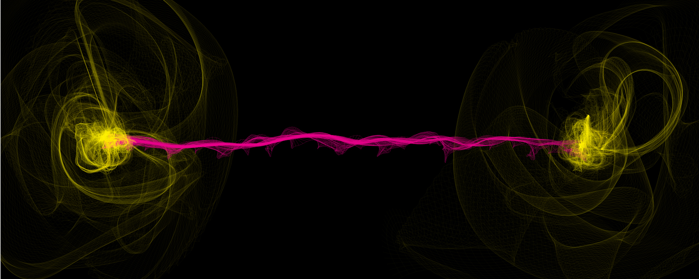

::: {.column-screen}

:::



::: {.lead-in}
To this day, quantum entanglement and its effects are phenomena which still leave physicists scratching their heads when trying to get a deeper understanding of what is actually happening. This series on quantum entanglement is going to be a two-parter. In this post, we will discuss what is meant by locality and non-locality and what quantum entanglement is. The term quantum entanglement has been used in many instances of popular culture pertaining to spirituality, healing, and a flurry of new age approaches to human consciousness. This is not the kind of "quantum entanglement" we will discuss here. We will purely look at the physics of it, its original and proper meaning. We will study the state of a two-particle system. In the [next post](https://opencurve.info/quantum-entanglement-the-epr-paradox-and-bells-theorem/), we will discuss what Einstein and his friends proposed, what Bell wrote, and whether Einstein was right. And then there are also exciting caveats which we will explore.
:::

# The basics

Let's go over the basics one more time. "Particles" aren't particles in the classical sense at all – they're absolutely not like tiny balls or pellets. They are best described by the *wave function*, a mathematical expression containing all possible states the particle can be in. This pertains to its energy levels, its positions or a number of other properties it can have.

As long as no measurements have been performed on it, the particle has no definite state or states. It displays wave-like behaviour like being caught in a haze of all possible states. However, as soon as you measure it, the particle will snap out of its haze and it will appear to be a particle, an actual particle in the classical sense, with a definite state.

Note that "the state of an electron" can refer to a particle with no definite set of states when no measurement was performed. The state of an electron is then best described by the wave function, which contains all possible definite states upon measurement.

Hereafter, "wave function" and "state" are used interchangeably.

In [This is not an atom](../this-is-not-an-atom/), the wave function is discussed. In [The double-slit experiment](../the-double-slit-experiment/), the wave-like and the particle-like behaviours are showcased.

# Locality vs non-locality

Isaac Newton knew he had a problem when he formulated his theory of gravity. While it beautifully described the extent to which two masses exert gravitational forces upon each other, his theory didn't explain *how* they did that. He didn't like the conclusion that the gravitational influence between Earth and the Moon seemed to spookily operate at a distance through the vacuum. He wrote it was "so great an Absurdity that I believe no Man who has in philosophical Matters a competent Faculty of thinking can ever fall into it". He famously stated to leave this unsolved mystery to "the Consideration of my readers".[^1]

In other words, Newton wasn't big on *non-locality*. And yet, his own theory did entail an invisible force operating over vast distances through the vacuum. Moreover, it seemed to be an *instantaneous* effect: if the Sun were to suddenly disappear, then Earth would be flung off its trajectory immediately. Of course, today, we know that nothing can travel faster than light, so the gravitational changes of the Sun would take about eight minutes to "reach" Earth.

The following years, physical phenomena such as magnetism and electricity proved, in fact, to be very *local* indeed. It became clear there is always an indirect way through which one object is able to influence another object at a distance. What is meant with locality? Here's the mechanism: an object interacts with its immediate environment, a field embedded within the three-dimensional space we live in, i.e. the electromagnetic field, which then passes on that ripple of disturbance onto the other object. In terms of "fields", one could say that at one particular location the field's value is changed by some object. That value change then changes the values of the field in the direct vicinity, which then change the values in their vicinity, and so on. It's a bit like "the wave" done by thousands of sports fans in a stadium. Or like falling dominoes. Every change is ever local and the propagation of that change through space is limited to the speed of light.

{fig-alt="Sculpture of classic red British telephone boxes falling like dominoes in a curved row along a street pavement."}

Many years later, Einstein replaced Newton's theory with his own theory of gravity, General Relativity (GR). It showed that Newton's intuition was correct. Gravity couldn't be *non-local* and Einstein showed it isn't. In GR, space and time itself are the stretchy substance through which gravitational disturbances propagate at the speed of light towards the other object. When a mass curves or disturbs spacetime around it, that curvature or disturbance then ripples through the universe, on its way to influence other objects. In fact, on 11 February 2016, a large collaboration of incredibly talented scientists physically measured these gravitational ripples in spacetime as predicted by Einstein in 1916. It won [three key figures](https://www.bbc.co.uk/news/science-environment-41476648) the Nobel Prize.

And so, it seems there is no spooky influence at a distance in physics. Even still to this day, in modern quantum physics, our best understanding and most successful theory is that quantum fields pervade our universe, forming the mediums through which forces are propagated, limited by the speed of light.

::: {.callout-note appearance="minimal"}
*Non-locality* entails a change in one patch of space instantaneously influencing another patch of space irrespective of their distance. *Locality* entails the propagation of change through space by influencing only neighbouring patches of space at a maximum of the speed of light.
:::

# Spin

Electrons have several properties. One of the more obvious is (negative) charge. The [Stern-Gerlach experiments](https://en.wikipedia.org/wiki/Stern–Gerlach_experiment) showed that they possess another property which was given the name [spin angular momentum](https://en.wikipedia.org/wiki/Spin_(physics)) or simply spin for short, for lack of a better term as electrons [aren't](../this-is-not-an-atom/) exactly like spinning balls.

Nevertheless, as it stands, electrons have an *intrinsic spin*, which cannot in any sensible way be described like a classical-mechanical rotation. Like with any object in three-dimensional space, you can measure its spin along any angle within 360 degrees in three dimensions. With respect to whichever axis you choose, they can only ever spin clockwise or anticlockwise.[^2] The latter is called *spin up* and the former *spin down*, according to the [right-hand rule](https://en.wikipedia.org/wiki/Right-hand_rule#A_rotating_body).

![If electrons were like tiny, fluffy balls such as displayed here, you could picture their spin as an anticlockwise or clockwise rotation about the axis of measurement. Using the right-hand rule, we can designate this spin-up or spin-down. Of course, in three dimensions, any axis of measurement at any angle can be chosen with respect to which it will be found spinning. Disclaimer: this classical-mechanical illustration does not portray actual electrons nor actual quantum mechanical spins. But it's perhaps useful as a simile. (Illustration by KJ Runia)](spins.jpg){.img-border fig-alt="Illustration showing three fuzzy grey spherical models of electron spin on a light blue background: spin up, spin down, and arbitrary three-dimensional measurement axes x, y, and z."}

# Symbols

As we take our readers seriously, we'll take this opportunity to introduce a few mathematical symbols which will prove to come in handy at later stages of this series.

Let's use the symbol $|A\rangle$ to denote the state of the electron in Amsterdam with respect to its spin. As long as we haven't performed any measurements on the electron, it has no definite state. However, upon measurement, its spin with respect to the vertical axis of measurement is ever either spin up or down. Let's write these two possible measurement outcomes as $|\!\uparrow\rangle_A$ or $|\!\downarrow\rangle_A$.

Likewise, if the state of an electron in Boston $|B\rangle$ is spin up or spin down, we write $|\!\uparrow\rangle_B$ or $|\!\downarrow\rangle_B$.

Assuming the state of the electron in Amsterdam hasn't been measured yet, we can express this (with respect to spin) as a *combination* of both spin states:

$$|A\rangle = \alpha |\!\uparrow\rangle_A + \beta |\!\downarrow\rangle_A.$$

This is why physicists often poetically say that the unmeasured particle is in a state of both spins at the same time while it's more accurate to say it has no definite state. Mathematically, its state is an amalgam of all possible, *linearly superposed* (added together), algebraic solutions to the [Schrödinger equation](../this-is-not-an-atom/), hence, it's said to be in quantum superposition.

What's that $\alpha$ and $\beta$, you ask? Well, they're numbers of probability we need to find in order to complete our expression. The [Born rule](https://en.wikipedia.org/wiki/Born_rule) states that if we *square* the (modulus of the) wave function (the state), we will get the probability (density) of either possible outcome after measurement. Now, experiments have shown that either outcome, spin up or spin down, $|\!\uparrow\rangle_A$ or $|\!\downarrow\rangle_A$, appears in 50% of the total number of measurements. In other words, the probability of measuring either spin state is exactly $\dfrac{1}{2}$. So, if we put $\alpha = \beta = \dfrac{1}{\sqrt{2}}$, then $|\alpha|^2 = |\beta|^2 = \dfrac{1}{2}$. After all, $(\dfrac{1}{\sqrt{2}})^2 = \dfrac{1}{2}$, which is exactly what we want. So, the state (wave function) of our Amsterdam electron with respect to spin can be represented by:

$$|A\rangle = \dfrac{1}{\sqrt{2}} |\!\uparrow\rangle_A + \dfrac{1}{\sqrt{2}} |\!\downarrow\rangle_A.$$

Similarly, the state of the electron in Boston with respect to spin is then represented by:

$$|B\rangle = \dfrac{1}{\sqrt{2}} |\!\uparrow\rangle_B + \dfrac{1}{\sqrt{2}} |\!\downarrow\rangle_B.$$

What you need to take from this is the following: the state of an electron *before measurement* is the sum of all possible states (multiplied by a probability factor, in this case $\dfrac{1}{\sqrt{2}}$).

In the case of spin as measured along the vertical axis, the state of the electron is the sum of two possible states, spin up $|\!\uparrow\rangle$ or spin down $|\!\downarrow\rangle$.

Note that there are other possibilities: we could measure the spin along a horizontal axis. We could represent this with spin left $|\!\leftarrow\rangle$ or spin right $|\!\rightarrow\rangle$. Or we could measure the spin at angles of +120 or -120 degrees from the vertical axis, which we might represent as $|\!\nwarrow\rangle$ and $|\!\searrow\rangle$ or $|\!\nearrow\rangle$ and $|\!\swarrow\rangle$. We will get to that in the discussion of Bell's Theorem in the next post.

# Quantum entanglement

So, what is quantum entanglement? [Recall](../this-is-not-an-atom/) that the most complete description of a particle is the wave function. This has always been about a free, single particle, not interacting with anything. In the case of quantum entanglement, however, this doesn't fly anymore.

::: {.callout-note appearance="minimal"}
When the state of a particle can no longer be described without a description of the state of *another* particle, those two particles are said to be quantum entangled. No longer can we describe either particle by *one* wave function *each*. They can only be described as a two-particle system by *one and the same wave function*.
:::

This has an astonishing consequence. Suppose our two electrons become entangled in such a way that they always have opposite spins.[^3] So, if one has "spin up", $|\!\uparrow\rangle$, the other always has "spin down", $|\!\downarrow\rangle$, or vice versa.[^4] So, we now have *one* system with *two* particles who always have opposite spins, which means that the *total spin* of our system is 0, zero. Let's denote the total spin of our system with $|S\rangle$.

Before our experiment takes place, they are both separated. One is staying in a laboratory in Amsterdam. The other is transported to Boston. Since no measurement has taken place on either particle, they are in a superposition according to the *one* wave function. They haven't an exact location (although one is very likely to be somewhere in Amsterdam at the moment of measurement and, likewise, the other in Boston), their energy levels are all over the place, and their spin isn't either spin up or spin down along this or that axis.

We can represent this whole situation with respect to spins as follows:

$$|S\rangle = \dfrac{1}{\sqrt{2}} \left( |\!\uparrow\rangle_A |\!\downarrow\rangle_B - |\!\downarrow\rangle_A |\!\uparrow\rangle_B \right).$$

When you look carefully at the expression above, you can see that the state of the total spin $|S\rangle$ of our two-particle system is a combination of two situations: the electron in Amsterdam is spin up and so the electron in Boston is spin down *or* the electron in Amsterdam is spin down and the electron in Boston is spin up. They need to be subtracted from each other because the total spin equals 0, remember? Hence, the minus sign. Lastly, both states are multiplied by the fraction $\dfrac{1}{\sqrt{2}}$ because both states have a 50% chance of occurring (which you get if you square the whole thing).

And so, what does this mean? As soon as you perform measurements on the one in Amsterdam, and you find it has spin up, the other electron in Boston *immediately* has spin down along that particular axis upon measurement, even though the probability before measurement was still 50%! How does the electron in Boston "know" what the measurement result in Amsterdam was? And how does it know this so fast? Faster than the speed of light! Besides this, it turns out you'll *always* get a definite spin from the other particle *opposite* to the one you measured first. As soon as the measurement in Amsterdam took place, the measurement outcome in Boston being the opposite result is always 100% all of a sudden! (Or the other way around.) There are never any exceptions!

In other words, as soon as you do the measurement, the mathematical description changes from

$$|S\rangle = \dfrac{1}{\sqrt{2}} \left( |\!\uparrow\rangle_A |\!\downarrow\rangle_B - |\!\downarrow\rangle_A |\!\uparrow\rangle_B \right),$$

to either

$$|S\rangle = |\!\uparrow\rangle_A |\!\downarrow\rangle_B,$$

meaning the state of the total spin equals the one in Amsterdam being spin up and the one in Boston being spin down, or, vice versa:

$$|S\rangle = |\!\downarrow\rangle_A |\!\uparrow\rangle_B.$$

And here's the astonishing part: this will always work this way, *no matter how great the physical distance between the two particles*. Locality out the window. Welcome back, non-locality.

Einstein accepted this prediction in quantum mechanics as being correct. However, he didn't like it. How did the other particle *instantly* "know" which spin to exhibit when Einstein's fantastically successful theories of relativity relied on the universal law that nothing can exceed the speed of light? He accepted the theory but he concluded it wasn't complete. There had to be some sort of hidden mechanism which they had overlooked.

We will discuss Einstein's attempt at saving the principle of locality and the universal speed limit in the next post. As well as John Bell's and Alain Aspect's subsequent work. For now, the question of whether Einstein was right, we will "leave up to the Consideration of our readers."

---

### Image credits and references

* *Featured image by KJ Runia.*
* *Phone boxes photo (David Mach's Out of Order) by 272447 via Pixabay.*
* *Spin illustration by KJ Runia.*

[^1]: Newton, I. (1756). *Four Letters from Sir Isaac Newton to Doctor Bentley: Containing Some Arguments in Proof of a Deity*. [Online available](https://books.google.nl/books?id=hTl53UB77-kC&ots=Ogsd6IB8hm&dq=newton%20bentley&lr&pg=PA26#v=onepage&q&f=false).
[^2]: Yes, this does sound like there is an actual rotation around an axis in the classical sense. And maybe, in some deep sense, there is after all; however, this deserves a post of its own, so suffice to say for now, our language is simply too limited to avoid using classical terms for quantum mechanical phenomena misleadingly.
[^3]: Producing spin-entangled electrons is difficult but clever experimental physicists have their [ways](https://phys.org/news/2015-07-spin-entangled-electrons.html).
[^4]: It's also possible to have them correlate such that they have identical spin, but for our example, let's not.