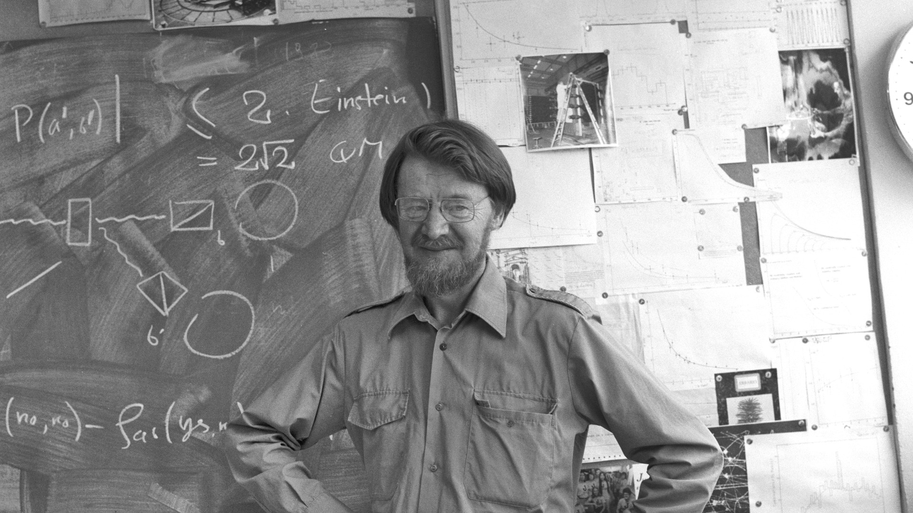
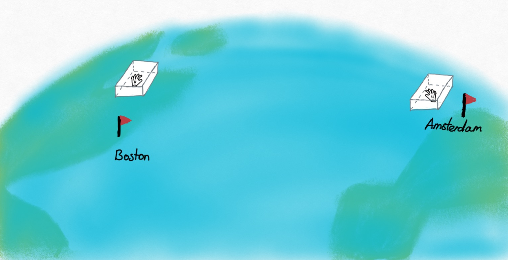
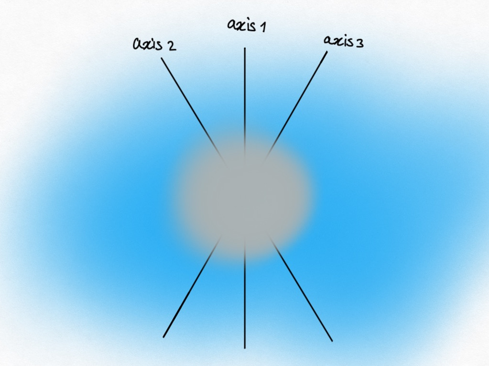
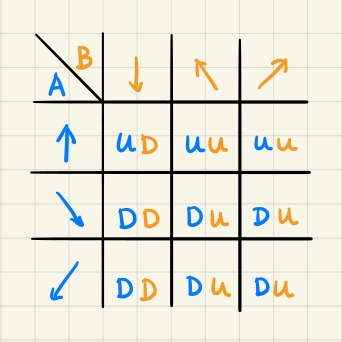
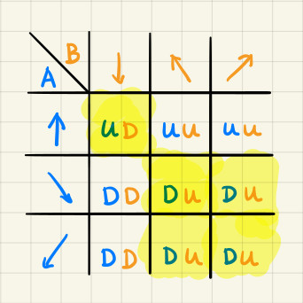
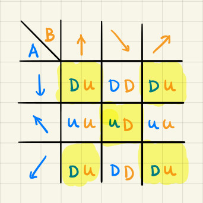
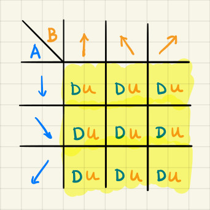

::: {.column-screen}

:::



::: {.lead-in}
When the state of a subatomic particle cannot be described by a wave function without taking the state of another subatomic particle into account, we speak of quantum entanglement. It's the special case where both particles can only be described by one and the same wave function. No longer are they separate entities nor do they have separate wave functions. The astonishing consequence is that performing a measurement on one particle has an immediate effect on the measurement of the other particle, no matter how far apart they are from each other. In this article, the second part of our mini-series on quantum entanglement, we will discuss the EPR paradox which Einstein and colleagues put forward. After that, we will discuss Bell's Theorem which allowed physicists to test Einstein's proposal. Was Einstein correct?
:::

::: {style="width: 80%; margin: 1.5rem auto;"}
{#fig-spins fig-alt="Drawing of a fuzzy blue sphere with an arrow indicating clockwise spin alongside three-dimensional axes x, y, and z on a textured background."}
:::

# Quick summary

Firstly, let me give a quick summary of the [previous post](../quantum-entanglement-non-locality-and-the-state-of-a-two-particle-system/):

::: {.callout-note appearance="minimal"}
1. We used the property of spin as a way of distinguishing between the two entangled electrons;
2. The orientation of an electron's spin is expressed as spin up (anticlockwise) or spin down (clockwise) along the axis of measurement;
3. You can arbitrarily choose along which axis you want to measure its spin, in three dimensions;
4. No matter which axis you choose, the result is always going to be a spin up or spin down (there is no spin-a-bit-to-the-right, for instance);
5. We are able to entangle particles in such a way that they will either always yield opposite spin or they always yield identical spin; once prepared this way, they will never deviate from this correlation when measured;
6. We used the opposite-spin entanglement in our example and we will do so again here;
7. Quantum mechanics states that before measurement neither electron has a specific spin: the wave function contains all possible measurement outcomes, in this case pertaining to both spin up and spin down (which can be characterised as having no definite spin yet);[^1]
8. As soon as you measure one electron's spin along a certain axis, the other electron's spin immediately snaps to the opposite orientation along that same axis, regardless of spatial distance between the two entangled particles.[^2]
:::

# EPR paradox

Even though Einstein understood quantum mechanics like few others, and while accepting these predictions and results, he didn't quite like the non-local implications brought forth by quantum entanglement. He didn't like point 8 of the previous section. There seems to be zero time delay between influencing a particle in Amsterdam (through measuring its spin) and influencing its entangled particle in Boston. It violates a pivotal consequence of Einstein's theory of special relativity: no signal or piece of information – anything within this universe, really – can exceed the speed of light[^3] or else *causality would not exist*. In other words, if information or signals were able to travel faster than light, an effect could occur before its cause had taken place. To put it mildly, this doesn't seem to be the universe you and I are living in.

So, Einstein, Podolsky, and Rosen (EPR) hypothesised that something else, something secretive was going on in nature – well out of sight for theoretical and experimental physicists. Quantum mechanics as it was known then had to be *incomplete*. Obviously, they acknowledged its successes, but when it came to quantum entanglement, they asserted something was missing in the theory of describing nature through wave functions.

To solve for the seemingly faster-than-light signal, they proposed that what *really* was going on was that the particles have always been in a specific state. *When the electron pair were separated from each other, they have always had either spin up or spin down from the start from the moment of their creation.*

Suppose a pair of gloves were made. Like all pairs of gloves, they always were each other's opposite with respect to "handedness".[^4] One has always been left-handed, the other has always been right-handed. And if the first one happened to be right-handed, then the other was left-handed. (Or else you're holding a glove from another pair.)

Suppose the machine which had made the pair put each glove in a separate box. We can't see which glove went in which box until we open the box. The boxes were sent to Amsterdam and Boston. The experimental physicists then open the box in Amsterdam: it's the right-handed one! And so, we now *instantly* know the one in Boston is left-handed. No magic, no non-locality, no lightspeed-breaking shenanigans.

{#fig-gloves fig-alt="Illustration of a globe with transparent boxes in Boston and Amsterdam, each containing a single glove separated across the ocean."}

This is what Einstein and friends said was happening in the case of electrons. An electron pair always had specific spins to start with. It's only in Amsterdam and Boston that we "open the box" aka measure their spin. It's only logical now that as soon as you know which spin the Amsterdam electron has, you *immediately* know which spin the Boston electron has.

So, said Einstein, non-locality is an illusion. It's all just normal local laws of nature and a bit of logical thinking. For one, spin orientation is merely hidden from us and not principally uncertain. Secondly, there's no spooky action at a distance,[^5] as he famously described it.[^6]

In everyday parlance, physicists call this a local version of the "hidden variables" theory. "Hidden variables" pertain to the stuff that we can't see yet (such as spin orientation or other variables influencing this) because our quantum mechanical description (the wave function) is incomplete; however, they are there, they do exist – they do not *not* exist yet, according to the hidden variables theory.

# Bell's inequalities

Unfortunately, Albert Einstein passed away in 1955. And Niels Bohr, the other great physicist with whom he used to debate the fundamental nature of quantum mechanics, passed away in 1962. In both cases too soon for them to be able to read John Stuart Bell's 1964 paper called "On the Einstein Podolsky Rosen Paradox".[^7] Bell realised that Einstein's proposal was in principle testable. It yielded a clear prediction, called Bell's inequality.

At this point, we must note that over the years, more than one Bell's inequality has been put forward by physicists.[^8] To explain Bell's inequality, we will apply a version of [David Mermin's](https://en.wikipedia.org/wiki/N._David_Mermin) original version as mentioned in his fantastic *Boojums All the Way Through: Communicating Science in a Prosaic Age*.[^9]

Recall from point 3 before that we can measure an electron's spin orientation along any axis. We're going to be measuring along *three* axes. These axes will be at an angle of 120° relative to each other.

{#fig-spin-axes fig-alt="Illustration of a central fuzzy particle with three linear measurement axes labeled axis 1, axis 2, and axis 3 arranged at 120-degree angles."}

The first axis will be the spin orientation along the vertical axis, which we will denote with the following symbols for spin up and spin down:

$$\uparrow \quad \downarrow$$

The spin orientations up and down will also be measured along this second axis:

$$\nwarrow \quad \searrow$$

And the spin orientations along the third axis will be denoted by:

$$\nearrow \quad \swarrow$$

So, imagine two entangled electrons being separated in space from each other. The usual quantum-mechanical description of each electron is that they are in a superposition of spins up and spins down for all three axes.

Except, Einstein says, no, no, not really: hidden behind the "veil of superposition" they are in fact already in definite, specific spin orientations for each of the three axes. We just don't yet know which until we measure them!

He says the electron in Amsterdam *may already be in the specific spin states as follows:*

$$\left( \uparrow \searrow \swarrow \right)_A$$

So, along axis 1 it's spin up, along axis 2 it's spin down, and along axis 3 it's also spin down.

Einstein continues and says that the entangled electron in Boston *has to already be in the opposite states:*

$$\left( \downarrow \nwarrow \nearrow \right)_B$$

And so, Einstein concludes, as soon as you actually perform a measurement in Amsterdam along the first axis, *of course, you get the opposite spin* in Boston. Only logical!

Bell's insight was that if you would work out this entire argument for all possible combinations, you could actually get a prediction of a ratio of outcomes. Here's how that goes.

First of all, if you measure along axis 1 in Amsterdam, that doesn't mean you have to measure along that same axis in Boston. You could just choose to measure along axis 3. So, with the two examples above, your results would simply be that in Amsterdam you get spin up and in Boston you also get spin up:

$$\left( \uparrow \right)_A \text{ and } \left( \nearrow \right)_B$$

Bell then argued: if you would count the number of times you would get the combinations up-up, down-down, and of course up-down and down-up like this, you should get ratios of these combinations which should match experiment. If, however, these ratios don't appear in the experiments, then Einstein's hypothesis is incorrect. In that case, something entirely different is going on. The electrons were *not* already in a specific state, which in turn means that *the non-local measurement effect in quantum entanglement does exist!*

# Bell's theorem

So, let's put them all together. Let's first take our example above:

$$\left( \uparrow \searrow \swarrow \right)_A \quad \text{and} \quad \left( \downarrow \nwarrow \nearrow \right)_B$$

If you measure along axis 1 in Amsterdam and along axis 1 in Boston, you get spin up, spin down. If you measure along axis 1 in Amsterdam and along axis 2 in Boston, you get spin up, spin up. And so on, and so forth! We've put it in a table:

::: {style="width: 60%; margin: 1.5rem auto;"}
{#fig-combinations fig-alt="Handwritten 3 by 3 grid showing detector combinations for observers A and B across three measurement axes."}
:::

Here you can see all the possible combinations of measurement outcomes along the three possible axes of the electrons in Amsterdam (A) and Boston (B). We used U for spin up and D for spin down.

Bell then says that if Einstein was correct, and the states of the spin orientations along these three axes were already there, then these are the expected outcomes.

Let's focus on the number of UD or DU combinations, in other words, let's focus on the number of times we find opposite spin orientations, irrespective of the axes along which they are measured. We've marked them yellow.

::: {style="width: 60%; margin: 1.5rem auto;"}
{#fig-comb-02 fig-alt="A 3 by 3 grid with five cells highlighted in yellow, indicating combinations where spin measurements yield opposite results (UD or DU)."}
:::

Exactly five out of nine times you will find opposite spin directions.

Let's check for other spin combinations. Suppose the electron in Amsterdam is secretly in the following spin states, $\left( \downarrow \nwarrow \swarrow \right)_A$, and the electron in Boston is then the opposite, $\left( \uparrow \searrow \nearrow \right)_B$. If we count again the number of times we get opposite spins, we find, again, five out of nine.

::: {style="width: 60%; margin: 1.5rem auto;"}
{#fig-comb-03 fig-alt="A 3 by 3 grid for a different spin assignment with five cells highlighted in yellow for opposite spin outcomes."}
:::

Suppose, just for completeness, that the one in Amsterdam is all spin down, $\left( \downarrow \searrow \swarrow \right)_A$, and the Boston one is its opposite, $\left( \uparrow \nwarrow \nearrow \right)_B$. In that case, we would get opposite spins in nine out of nine times.

::: {style="width: 60%; margin: 1.5rem auto;"}
{#fig-comb-04 fig-alt="A 3 by 3 grid with all nine cells highlighted in yellow, representing 100 percent opposite spin outcomes."}
:::

::: {.callout-note appearance="minimal"}
And so, this particular Bell inequality states that the probability ($P$) of finding opposite spins along all three axes is at least $\dfrac{5}{9}$ or ~55.6% (and at most 1 or 100%). In other words:

$$P(\text{opposite}) \geq \dfrac{5}{9}.$$

If this inequality were violated by experiment, the underlying local hidden-variable theory will have been proven to be incorrect.
:::

# Experimental outcomes

Over the past decades, many experiments were carried out to test multiple versions of Bell's inequality. Usually, these tests involved photons rather than electrons and pertained to measurements of polarisation rather than spin.

Stuart Freedman and John Clauser carried out the first experimental Bell test in 1972, testing a version of the so-called CH74 inequality.[^10]

The most celebrated test was performed in 1982 by Alain Aspect and colleagues. As Bell had originally proposed, they were able to have the two detectors randomly switch measurement orientations while the entangled photons were in flight, preventing any slower-than-light communication between the detectors.[^11]

In all tests, Bell's inequalities were unequivocally violated. Instead, the statistical outcome was entirely congruent with the predictions of quantum mechanics. The conclusion is unavoidable: Einstein's local hidden-variable theory was incorrect. There is nothing local about measuring entangled particles.

In our specific three-axis setup at 120° angles, quantum mechanics predicts that the probability of measuring opposite spins across randomly chosen axes is:

$$P(\text{opposite}) = \cos^2\left(\frac{120^\circ}{2}\right) = \cos^2(60^\circ) = \left(\frac{1}{2}\right)^2 = 0.25 \quad (25\%),$$

or 50% across matching and non-matching subsets, distinctly violating the classical lower bound of $\dfrac{5}{9} \approx 55.6\%$.

# Conclusions

In quantum mechanics, particles which have not been measured yet don't have a definite, specific state. Instead, they are best described by a wave function which incorporates all possible future states they can assume once measured.

When a particle can only be described in tandem with another particle, i.e. both particles can only be described by one and the same wave function, they are maximally quantum entangled.[^12]

If their entanglement entails their spins will always correlate in a certain way – be it identical spins or opposite spins – a measurement on one particle, causing it to snap into one of the possible definite states, has an *immediate* effect on the state of the other particle: it instantly collapses into the correlating, definite state.

Einstein disliked this because it seemed to imply that signals were travelling faster than light between particles. He postulated that particles have always been in definite states from the moment they separated, with nature simply keeping those values hidden from us.

John Bell showed that Einstein's hypothesis leads to measurable statistical bounds. Decades of experimental tests confirmed that nature violates these bounds. Particles do not carry predetermined local properties before observation.

And if that is true, then non-locality is an inherent feature of quantum mechanics.

Nobody knows the ultimate physical mechanism behind this. Theoretical models exploring this include non-local hidden variables (such as De Broglie–Bohm pilot wave theory) and modern geometric conjectures like ER=EPR by Juan Maldacena and Leonard Susskind.

Einstein's discomfort with this intrinsic indeterminacy prompted his famous remark: "God does not play dice."

Yet all experiments to date suggest that nature does indeed play dice – and tosses them where classical intuition cannot follow.

---

### Image credits and references

* *Featured image: Theoretical physicist John Stewart Bell at CERN, June 1982. Photo: CERN ([CC BY 4.0](https://creativecommons.org/licenses/by/4.0/)).*
* *Spin illustration and glove diagram by KJ Runia.*

[^1]: Analogously, the [double-slit experiment](../the-double-slit-experiment/) showed that before measurement, particles don't have a specific location yet.
[^2]: Or, if their entanglement were prepared in such a way that they always have identical spin, the other electron would then immediately snap to the identical spin orientation along the same axis of measurement.
[^3]: In a vacuum.
[^4]: "Handedness" in this context is a form of the more generalised term [chirality](https://en.wikipedia.org/wiki/Chirality).
[^5]: In German, he wrote *spukhafte Fernwirkung*.
[^6]: Einstein, A., Podolsky, B. and Rosen, N. (1935) "Can Quantum-Mechanical Description of Physical Reality Be Considered Complete?", *Physical Review*, 47(10), pp. 777–780. doi: [10.1103/PhysRev.47.777](https://doi.org/10.1103/PhysRev.47.777).
[^7]: Bell, J. S. (1964) "On the Einstein Podolsky Rosen Paradox", *Physics Physique Fizika*, 1(3), pp. 195–200. doi: [10.1103/PhysicsPhysiqueFizika.1.195](https://doi.org/10.1103/PhysicsPhysiqueFizika.1.195).
[^8]: Besides his [original inequality](https://en.wikipedia.org/wiki/Bell's_theorem#Original_Bell's_inequality), there is the widely applied [CHSH inequality](https://en.wikipedia.org/wiki/CHSH_inequality), for instance.
[^9]: Mermin, N. D. (1990) *Boojums all the way through: communicating science in a prosaic age*. Cambridge: Cambridge University Press.
[^10]: Freedman, S. J. and Clauser, J. F. (1972) "Experimental Test of Local Hidden-Variable Theories", *Physical Review Letters*, 28(14), pp. 938–941. doi: [10.1103/PhysRevLett.28.938](https://doi.org/10.1103/PhysRevLett.28.938).
[^11]: Aspect, A., Dalibard, J. and Gérard, R. (1982) "Experimental Test of Bell's Inequalities Using Time-Varying Analyzers", *Physical Review Letters*, 49(25), pp. 1804–1807. doi: [10.1103/PhysRevLett.49.1804](https://doi.org/10.1103/PhysRevLett.49.1804).
[^12]: In real-world environments, macroscopic bodies interact continuously with trillions of surrounding particles, causing instantaneous quantum decoherence that prevents macroscopic systems from maintaining entangled states.