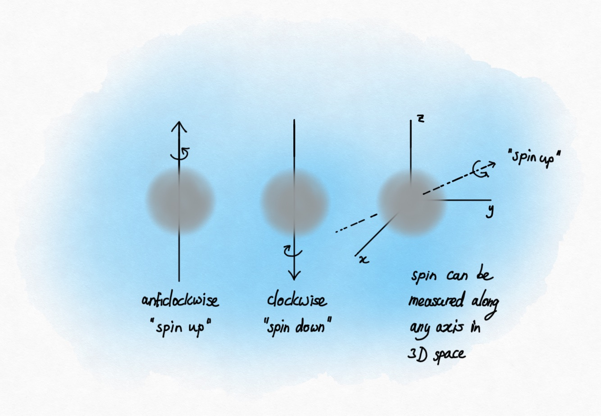
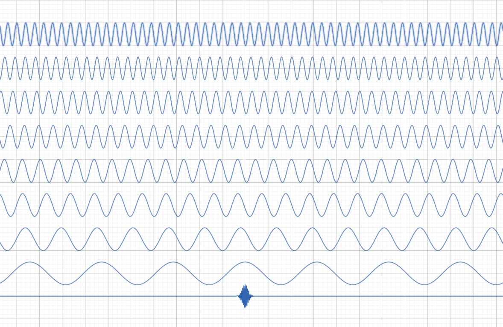
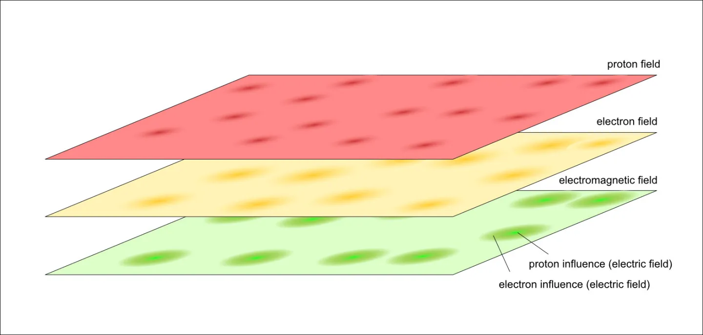

::: {.column-screen}

:::



::: {.lead-in}
The last few posts on quantum mechanics have been quite extensive and at times rather deep for those who are on the move. So, here are ten important ideas about particles and wave functions for when you're *en route* in slightly more normal English.
:::

::: {.callout-note icon=false appearance="simple"}
**Listen to this article** *(audio edition for people on the move)*

<audio controls style="width: 100%; margin-top: 0.5rem;" src="OpenCurve.info-Quantum_mechanics_in_ten_ideas_for_people_on_the_move.mp3"></audio>
:::

# 1: Subatomic particles

To describe objects in our everyday world, such as rocks, buildings, and cars, Newton's laws suffice. To describe **subatomic, elementary particles**, such as electrons, protons, neutrons, and photons, however, there is a whole different type of physics: quantum mechanics.

# 2: Wave functions

The most complete description of an elementary particle is called the [wave function](../this-is-not-an-atom/). Actually, the word 'particles' seems to incorrectly refer to tiny points, balls or spheres or something, which they are absolutely not. They aren't waves either. 'Particles' are wave functions with wave-like properties (emphasis on 'like'). Upon interaction with other particles and/or measurement, they exhibit particle-like behaviour, however. The wave function contains all physically possible states a 'particle' can be in at the moment we measure its state. The wave function can be seen as a mathematical description of the probabilities of the states that the particle will snap into as soon as you measure it. It's often visualised as a 'cloud' even though that's not what it actually looks like. It's just a visual metaphor for a mathematical object that actually lives in complex space as it is [complex valued](../complex-numbers-an-introduction/).

# 3: Quantum state

Once measured, particles show one specific quantum state out of a whole range of possible quantum states prior measurement. [Position](../the-double-slit-experiment/) is the most intuitive to understand example of a quantum state. Momentum is another (momentum is a measure of the amount of motion of a particle). Then there are states such as polarity, spin, and a bunch of others. The wave function encapsulates all these possible states and yields a probability-value for actually measuring a particular state. In other words, even before you measure it, the wave function allows you to calculate the chances of encountering this particular quantum state.

# 4: Measurement problem

As long you *don't* measure a particle, and as long as it doesn't interact with other particles, the particle is not in a specific quantum state yet. Instead, its wave function just describes all these possible states as though they are mathematically added on top of each other. This 'adding of quantum states' is what is meant when physicists talk about **superposition**. The term is from the mathematics of waves and **linear algebra** in general, not quantum mechanics in particular. While the situation is often portrayed as particles being in multiple states all at once (such as being in two positions at the same time), it's more accurate to say that **the particle does not have a specific state at all**. There's just the wave function with all the probabilities of future quantum states. As soon as you perform a measurement, the particle snaps out of its wave function full of possibilities into a single possibility. **In other words, what you see is not what it was. What you observe is just a sliver of its total prior existence.** How this happens, nobody knows. It's called the **measurement problem**. There's a Nobel Prize waiting for you.

# 5: Schrödinger equation

Wave functions obey the [Schrödinger equation](../this-is-not-an-atom/). You could say that what Newton's second law is for objects in our everyday world, is what the Schrödinger equation is for the subatomic world. It gives us the ability to predict how the wave function evolves in time. This is a completely classical equation; it is 100% deterministic. Where the wave function captures a range of probabilities, the Schrödinger equation tells us how this range of probabilities changes over time perfectly predictably so. In other words, it doesn't predict the exact state of a particle once measured, but it does accurately predict the probability-value of an exact state once measured at any given time.

# 6: Uncertainty

There is a fundamental informational trade-off between certain possible states such as between position and momentum, energy and time, and time and frequency. The origin for this does not lie in quantum mechanics. It's due to the way they are related to each other. Mathematically, these variables are called [Fourier transform pairs](https://opencurve.info/heisenbergs-uncertainty-principle/) or conjugate variables. To calculate one from the other, you have to execute a mathematical procedure called a Fourier transform. The trade-off is that Fourier transforming a variable whose range of possible values is smaller leads to the other variable having a larger range of possible values. And if a range of possible values becomes larger, then the exact outcome of measurement is less certain (the probability of a specific state after measurement becomes more uncertain). Heisenberg showed that this uncertainty principle also applies to the wave function in quantum mechanics, hence, there the principle is called [Heisenberg's uncertainty principle](https://opencurve.info/heisenbergs-uncertainty-principle/).

# 7: Certainty

That same principle predicts that, while very valid at the scale of subatomic particles, **this uncertainty becomes utterly meaningless at our large-scale world of everyday objects**. A bowling ball whose range of possible positions is very limited (locked in a very tight enclosure with little to no leeway), will never portray any uncertainty values pertaining to its motion (momentum), for instance. By Heisenberg's uncertainty principle, upon measurement, it might show to have the speed of $3.283 \times 10^{-35}\text{ m/s}$. This means that after 965.9 billion years it will have travelled the distance of the width of a proton. So, no, uncertainty effects play no role in our everyday world, unless you are doing experiments with a running time of seventy times the age of our current Universe. In that case, you will have to deal with the uncertainty of the width of a proton.[^1] We do note that extraordinarily sensitive larger-scale equipment such as the mirrors at the [LIGO](https://en.wikipedia.org/wiki/LIGO) and [Virgo](https://en.wikipedia.org/wiki/Virgo_interferometer) experiments are [capable](https://www.ligo.caltech.edu/news/ligo20200701) of measuring quantum effects, however, this isn't really unexpected nor is it the same as saying a human body is in a quantum superposition. Measuring quantum effects is one thing, brains supposedly being in two places on Earth ('based on principles from quantum mechanics') is a whole other thing.

# 8: Quantum entanglement

When two or more particles can only be described by one wave function – not as separate wave functions – those particles are said to be [quantum entangled](https://opencurve.info/quantum-entanglement-non-locality-and-the-state-of-a-two-particle-system/), either partly or completely. A measurement performed on one particle immediately determines the measurement outcome on the other entangled particle, irrespective of the spatial distance between them. This is why this phenomenon is said to be non-local. How this happens, is unknown. This effect dissipates to zero when entangled particles interact with yet other particles. At the large scale of our everyday world, the number of particles inside an object to be interacted with is so great, quantum entanglement completely fades away. In very special conditions, however, such as in our labs, entanglement can be sustained for quite some time.

# 9: Quantum Field Theory

Over the years, the mathematical and physical theory of (quantum) wave mechanics has been extended to describe quantum fields as the fundamental building blocks of our Universe. The Universe is made of quantum fields. The most complete description of fields are wave functions. This is called [Quantum Field Theory (QFT)](https://opencurve.info/why-exactly-do-glass-and-liquids-refract-light/). The most successful version of QFT is called the **Standard Model of quantum physics**. 'Particles' are here some kind of disturbance in their field: an electron is a disturbance in the electron field. The particle's description is here part of the wave function of its entire field. The challenge is now to extend this quantum field theory into its next form, encapsulating something called quantum gravity. What we don't know yet, for example, is how to have space and time in extreme regions such as black holes, naturally appear out of a quantum theory.

# 10: Applications

While the famous physicist and Nobel Prize winner [Richard Feynman](https://en.wikipedia.org/wiki/Richard_Feynman) is known for having said, "I think I can safely say that nobody understands quantum mechanics", this is sometimes incorrectly taken to be a reason to state that, therefore, physicists don't know what they're talking about. Feynman alluded to the fact that there is much we don't know about the foundations of quantum mechanics. There is still much employment in solving hard problems such as quantum gravity, the measurement problem, the strong CP problem, the interpretation of quantum mechanics, non-locality, and so forth.

On the other hand, we now have WiFi, internet, touchscreens, lasers, MRI scanners, LEDs, flash memory, solid state disks, the old crunchy hard disks, transistors, and CPUs or integrated chips (ICs) in general.

I think I can safely say that the fact that you've plucked this article out of the air to have it displayed on your (touch)screen is at least an indication of the level at which "nobody understands quantum mechanics".

Nevertheless, we're far from done. There is still much to discover in this Universe with a bit of maths and physics.

[^1]: When people state or think that everyday objects (our bodies, brains, tennis balls, animals) can exhibit quantum effects such as being at multiple places at the same time, I suspect this is because they have no well-defined idea how small subatomic particles really are and no inkling as to how large the everyday world is in those terms. Also, they didn't do the calculations.