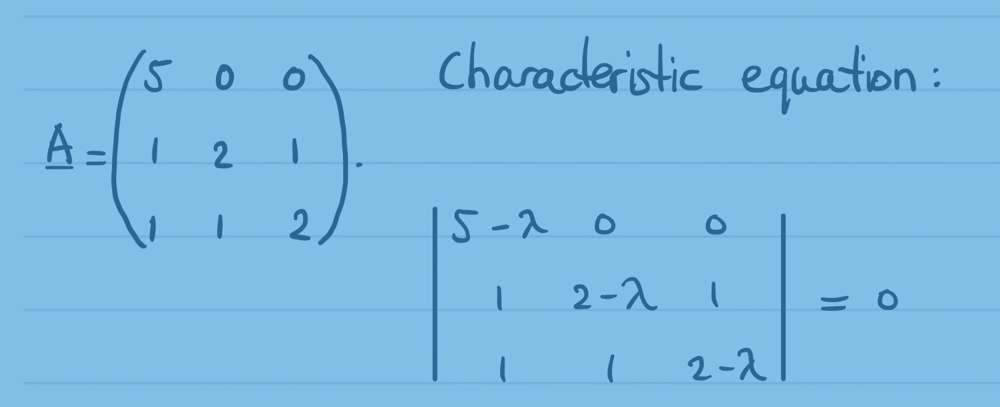

::: {.column-screen}

:::



::: {.lead-in}
In these examples, the eigenvalues of matrices will turn out to be real values. In other words, the eigenvalues and eigenvectors reside entirely in $\mathbb{R}^n$.
:::

Suppose we have the following matrix:

$$\mathbf{A} = \begin{pmatrix} 5 & 0 & 0 \\ 1 & 2 & 1 \\ 1 & 1 & 2 \end{pmatrix}.$$

The objective is to find the eigenvalues and the corresponding eigenvectors.

# Characteristic equation

Firstly, formulate the characteristic equation and solve it. The solutions are the eigenvalues of matrix $\mathbf{A}$.

If $\mathbf{I}$ is the $3 \times 3$ identity matrix and $\lambda$ represents the scalar eigenvalue, the characteristic equation is given by:

$$\det(\mathbf{A} - \lambda \mathbf{I}) = 0.$$

Written in determinant form:

$$\begin{vmatrix} 5-\lambda & 0 & 0 \\ 1 & 2-\lambda & 1 \\ 1 & 1 & 2-\lambda \end{vmatrix} = 0.$$

Choose the row or column easiest to use to compute the determinant. In this case, we expand along the first row because it contains two zeros and only one non-zero entry, $(5-\lambda)$:

$$(5-\lambda) \begin{vmatrix} 2-\lambda & 1 \\ 1 & 2-\lambda \end{vmatrix} - 0 \begin{vmatrix} 1 & 1 \\ 1 & 2-\lambda \end{vmatrix} + 0 \begin{vmatrix} 1 & 2-\lambda \\ 1 & 1 \end{vmatrix} = 0,$$

$$(5-\lambda) \begin{vmatrix} 2-\lambda & 1 \\ 1 & 2-\lambda \end{vmatrix} = 0.$$

Evaluating the $2 \times 2$ determinant:

$$\begin{aligned}
(5-\lambda)\left[(2-\lambda)^2 - 1^2\right] &= 0, \\
(5-\lambda)\left[4 - 4\lambda + \lambda^2 - 1\right] &= 0, \\
(5-\lambda)(\lambda^2 - 4\lambda + 3) &= 0.
\end{aligned}$$

Factoring the quadratic term yields:

$$(5-\lambda)(\lambda - 1)(\lambda - 3) = 0.$$

The roots of the characteristic equation are immediately apparent:

$$\lambda = 1 \quad \vee \quad \lambda = 3 \quad \vee \quad \lambda = 5.$$

### Verifying the eigenvalues

We can verify these eigenvalues by checking the matrix trace and determinant:

1. **Trace check:** The sum of the eigenvalues must equal the trace of $\mathbf{A}$ (the sum of the main diagonal elements):
   $$\text{tr}(\mathbf{A}) = 5 + 2 + 2 = 9 \quad \Longleftrightarrow \quad 1 + 3 + 5 = 9. \quad \checkmark$$
2. **Determinant check:** The product of the eigenvalues must equal $\det(\mathbf{A})$:
   $$\det(\mathbf{A}) = 5\left(2^2 - 1^2\right) = 5(3) = 15 \quad \Longleftrightarrow \quad 1 \times 3 \times 5 = 15. \quad \checkmark$$

# Eigenvector equations

To determine the eigenvectors, let:

$$\mathbf{v} = \begin{pmatrix} x_1 \\ x_2 \\ x_3 \end{pmatrix},$$

satisfying:

$$(\mathbf{A} - \lambda \mathbf{I})\mathbf{v} = \mathbf{0}.$$

In explicit matrix form:

$$\begin{pmatrix} 5-\lambda & 0 & 0 \\ 1 & 2-\lambda & 1 \\ 1 & 1 & 2-\lambda \end{pmatrix} \begin{pmatrix} x_1 \\ x_2 \\ x_3 \end{pmatrix} = \begin{pmatrix} 0 \\ 0 \\ 0 \end{pmatrix},$$

which gives the following system of linear equations:

$$\begin{cases}
(5-\lambda)x_1 = 0, \\
x_1 + (2-\lambda)x_2 + x_3 = 0, \\
x_1 + x_2 + (2-\lambda)x_3 = 0.
\end{cases}$$

# Finding the eigenvectors

## Eigenvalue $\lambda = 1$

Substituting $\lambda = 1$ into the eigenvector equations:

$$\begin{cases}
4x_1 = 0, \\
x_1 + x_2 + x_3 = 0, \\
x_1 + x_2 + x_3 = 0.
\end{cases}$$

The first equation gives $x_1 = 0$. Substituting $x_1 = 0$ into the remaining equations gives $x_2 + x_3 = 0$, or $x_2 = -x_3$. Setting $x_3 = 1$ yields $x_2 = -1$. 

Thus, an eigenvector corresponding to $\lambda = 1$ is:

$$\mathbf{v}_1 = \begin{pmatrix} \phantom{-}0 \\ -1 \\ \phantom{-}1 \end{pmatrix}.$$

Verification via matrix multiplication $\mathbf{A}\mathbf{v} = \lambda \mathbf{v}$:

$$\begin{pmatrix} 5 & 0 & 0 \\ 1 & 2 & 1 \\ 1 & 1 & 2 \end{pmatrix} \begin{pmatrix} \phantom{-}0 \\ -1 \\ \phantom{-}1 \end{pmatrix} = \begin{pmatrix} 0 \\ -2 + 1 \\ -1 + 2 \end{pmatrix} = \begin{pmatrix} \phantom{-}0 \\ -1 \\ \phantom{-}1 \end{pmatrix} = 1 \begin{pmatrix} \phantom{-}0 \\ -1 \\ \phantom{-}1 \end{pmatrix}. \quad \checkmark$$

## Eigenvalue $\lambda = 3$

Substituting $\lambda = 3$ into the system:

$$\begin{cases}
2x_1 = 0, \\
x_1 - x_2 + x_3 = 0, \\
x_1 + x_2 - x_3 = 0.
\end{cases}$$

The first equation requires $x_1 = 0$. With $x_1 = 0$, both remaining equations reduce to $x_2 = x_3$. Setting $x_3 = 1$ gives $x_2 = 1$.

An eigenvector corresponding to $\lambda = 3$ is therefore:

$$\mathbf{v}_2 = \begin{pmatrix} 0 \\ 1 \\ 1 \end{pmatrix}.$$

Verification:

$$\begin{pmatrix} 5 & 0 & 0 \\ 1 & 2 & 1 \\ 1 & 1 & 2 \end{pmatrix} \begin{pmatrix} 0 \\ 1 \\ 1 \end{pmatrix} = \begin{pmatrix} 0 \\ 2 + 1 \\ 1 + 2 \end{pmatrix} = \begin{pmatrix} 0 \\ 3 \\ 3 \end{pmatrix} = 3 \begin{pmatrix} 0 \\ 1 \\ 1 \end{pmatrix}. \quad \checkmark$$

## Eigenvalue $\lambda = 5$

Substituting $\lambda = 5$ into the system:

$$\begin{cases}
0x_1 = 0, \\
x_1 - 3x_2 + x_3 = 0, \\
x_1 + x_2 - 3x_3 = 0.
\end{cases}$$

The first equation holds for any value of $x_1$. Subtracting the third equation from the second:

$$-4x_2 + 4x_3 = 0 \implies x_2 = x_3.$$

Substituting $x_3 = x_2$ into the second equation:

$$x_1 - 3x_2 + x_2 = 0 \implies x_1 - 2x_2 = 0 \implies x_2 = \frac{x_1}{2}.$$

Thus, $x_2 = x_3 = \frac{1}{2}x_1$. Setting $x_1 = 2$ gives the smallest integer components $x_2 = 1$ and $x_3 = 1$.

An eigenvector corresponding to $\lambda = 5$ is:

$$\mathbf{v}_3 = \begin{pmatrix} 2 \\ 1 \\ 1 \end{pmatrix}.$$

Verification:

$$\begin{pmatrix} 5 & 0 & 0 \\ 1 & 2 & 1 \\ 1 & 1 & 2 \end{pmatrix} \begin{pmatrix} 2 \\ 1 \\ 1 \end{pmatrix} = \begin{pmatrix} 10 \\ 2 + 2 + 1 \\ 2 + 1 + 2 \end{pmatrix} = \begin{pmatrix} 10 \\ 5 \\ 5 \end{pmatrix} = 5 \begin{pmatrix} 2 \\ 1 \\ 1 \end{pmatrix}. \quad \checkmark$$

---

### References and downloads

* *Hero banner: Handwritten mathematics notes by KJ Runia.*