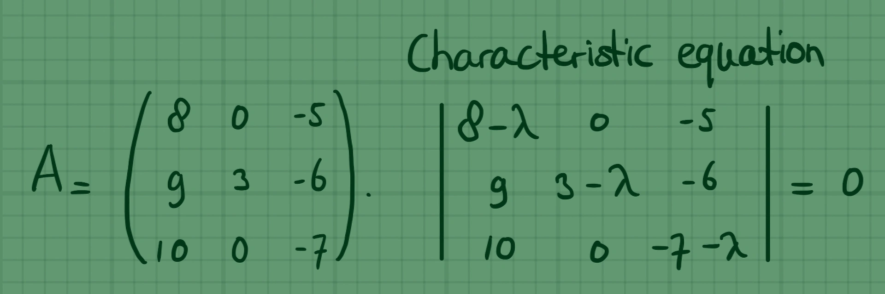

::: {.column-screen}

:::



::: {.lead-in}
In these examples, the eigenvalues of matrices will turn out to be real values. In other words, the eigenvalues and eigenvectors are in $\mathbb{R}^n$.
:::

Suppose we have the following matrix:

$$\mathbf{A} = \begin{pmatrix} 8 & 0 & -5 \\ 9 & 3 & -6 \\ 10 & 0 & -7 \end{pmatrix}.$$

The objective is to find the eigenvalues and the corresponding eigenvectors.

# Characteristic equation

Firstly, formulate the characteristic equation and solve it. The solutions are the eigenvalues of matrix $\mathbf{A}$.

If $\mathbf{I}$ is the $3 \times 3$ identity matrix and $\lambda$ represents the scalar eigenvalue, the characteristic equation is:

$$\det(\mathbf{A} - \lambda \mathbf{I}) = 0.$$

Written in determinant form:

$$\begin{vmatrix} 8-\lambda & 0 & -5 \\ 9 & 3-\lambda & -6 \\ 10 & 0 & -7-\lambda \end{vmatrix} = 0.$$

Choose the row or column easiest to use to compute the determinant. In this case, we expand along the second column because it contains two zeros and only one non-zero entry, $(3-\lambda)$:

$$-0 \begin{vmatrix} 9 & -6 \\ 10 & -7-\lambda \end{vmatrix} + (3-\lambda) \begin{vmatrix} 8-\lambda & -5 \\ 10 & -7-\lambda \end{vmatrix} - 0 \begin{vmatrix} 8-\lambda & -5 \\ 9 & -6 \end{vmatrix} = 0,$$

$$(3-\lambda) \begin{vmatrix} 8-\lambda & -5 \\ 10 & -7-\lambda \end{vmatrix} = 0.$$

Simplifying the $2 \times 2$ determinant:

$$\begin{aligned}
(3-\lambda)\left[(8-\lambda)(-7-\lambda) - (-5)(10)\right] &= 0, \\
(3-\lambda)\left[-56 - 8\lambda + 7\lambda + \lambda^2 + 50\right] &= 0, \\
(3-\lambda)(\lambda^2 - \lambda - 6) &= 0.
\end{aligned}$$

Factoring the quadratic term gives a manageable form:

$$(3-\lambda)(\lambda + 2)(\lambda - 3) = 0,$$

or equivalently:

$$-(\lambda + 2)(\lambda - 3)^2 = 0.$$

The solutions for $\lambda$ are immediately apparent:

$$\lambda = -2 \quad \vee \quad \lambda = 3 \quad (\text{multiplicity } 2).$$

### Verifying the eigenvalues

We can verify these values by checking the matrix trace and determinant:

1. **Trace check:** The sum of the eigenvalues must equal the trace of $\mathbf{A}$ (the sum of the main diagonal elements):
   $$\text{tr}(\mathbf{A}) = 8 + 3 - 7 = 4 \quad \Longleftrightarrow \quad (-2) + 3 + 3 = 4. \quad \checkmark$$
2. **Determinant check:** The product of the eigenvalues must equal $\det(\mathbf{A})$:
   $$\det(\mathbf{A}) = 3\left[(8)(-7) - (-5)(10)\right] = 3(-56 + 50) = -18 \quad \Longleftrightarrow \quad (-2) \times 3 \times 3 = -18. \quad \checkmark$$

# Eigenvector equations

To determine the eigenvectors, let:

$$\mathbf{v} = \begin{pmatrix} x_1 \\ x_2 \\ x_3 \end{pmatrix},$$

satisfying:

$$(\mathbf{A} - \lambda \mathbf{I})\mathbf{v} = \mathbf{0}.$$

In matrix form:

$$\begin{pmatrix} 8-\lambda & 0 & -5 \\ 9 & 3-\lambda & -6 \\ 10 & 0 & -7-\lambda \end{pmatrix} \begin{pmatrix} x_1 \\ x_2 \\ x_3 \end{pmatrix} = \begin{pmatrix} 0 \\ 0 \\ 0 \end{pmatrix},$$

which gives the system of linear equations:

$$\begin{cases}
(8-\lambda)x_1 - 5x_3 = 0, \\
9x_1 + (3-\lambda)x_2 - 6x_3 = 0, \\
10x_1 + (-7-\lambda)x_3 = 0.
\end{cases}$$

# Finding the eigenvectors

## Eigenvalue $\lambda = -2$

Substituting $\lambda = -2$ into the eigenvector equations:

$$\begin{cases}
(8 - (-2))x_1 - 5x_3 = 0 \implies 10x_1 - 5x_3 = 0, \\
9x_1 + (3 - (-2))x_2 - 6x_3 = 0 \implies 9x_1 + 5x_2 - 6x_3 = 0, \\
10x_1 + (-7 - (-2))x_3 = 0 \implies 10x_1 - 5x_3 = 0.
\end{cases}$$

The first and third equations both reduce to $2x_1 = x_3$. Substituting $x_3 = 2x_1$ into the second equation:

$$9x_1 + 5x_2 - 6(2x_1) = 0 \implies -3x_1 + 5x_2 = 0 \implies 3x_1 = 5x_2.$$

Setting the smallest positive integer values, if $x_1 = 5$, then $x_2 = 3$ and $x_3 = 10$. 

Thus, an eigenvector corresponding to $\lambda = -2$ is:

$$\mathbf{v}_1 = \begin{pmatrix} 5 \\ 3 \\ 10 \end{pmatrix}.$$

We verify this via matrix-vector multiplication $\mathbf{A}\mathbf{v} = \lambda \mathbf{v}$:

$$\begin{pmatrix} 8 & 0 & -5 \\ 9 & 3 & -6 \\ 10 & 0 & -7 \end{pmatrix} \begin{pmatrix} 5 \\ 3 \\ 10 \end{pmatrix} = \begin{pmatrix} 40 + 0 - 50 \\ 45 + 9 - 60 \\ 50 + 0 - 70 \end{pmatrix} = \begin{pmatrix} -10 \\ -6 \\ -20 \end{pmatrix} = -2 \begin{pmatrix} 5 \\ 3 \\ 10 \end{pmatrix}. \quad \checkmark$$

## Eigenvalue $\lambda = 3$

Substituting $\lambda = 3$ into the eigenvector equations:

$$\begin{cases}
(8 - 3)x_1 - 5x_3 = 0 \implies 5x_1 - 5x_3 = 0, \\
9x_1 + (3 - 3)x_2 - 6x_3 = 0 \implies 9x_1 - 6x_3 = 0, \\
10x_1 + (-7 - 3)x_3 = 0 \implies 10x_1 - 10x_3 = 0.
\end{cases}$$

The first and third equations require $x_1 = x_3$, while the second equation requires $9x_1 = 6x_3$ (or $3x_1 = 2x_3$). The only simultaneous solution is $x_1 = 0$ and $x_3 = 0$.

Because the term $(3-\lambda)x_2$ becomes $0 \cdot x_2 = 0$, $x_2$ is completely unconstrained and acts as a free variable. Setting $x_2 = 1$ yields the eigenvector:

$$\mathbf{v}_2 = \begin{pmatrix} 0 \\ 1 \\ 0 \end{pmatrix}.$$

Verification:

$$\begin{pmatrix} 8 & 0 & -5 \\ 9 & 3 & -6 \\ 10 & 0 & -7 \end{pmatrix} \begin{pmatrix} 0 \\ 1 \\ 0 \end{pmatrix} = \begin{pmatrix} 0 \\ 3 \\ 0 \end{pmatrix} = 3 \begin{pmatrix} 0 \\ 1 \\ 0 \end{pmatrix}. \quad \checkmark$$

---

### References and downloads

* *Hero banner: Handwritten mathematics notes by KJ Runia.*