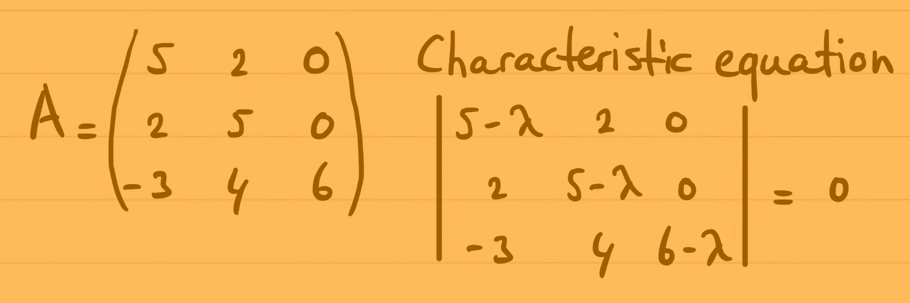

::: {.column-screen}

:::



::: {.lead-in}
In these examples, the eigenvalues of matrices will turn out to be real values. In other words, the eigenvalues and eigenvectors reside entirely in $\mathbb{R}^n$.
:::

Suppose we have the following matrix:

$$\mathbf{A} = \begin{pmatrix} \phantom{-}5 & 2 & 0 \\ \phantom{-}2 & 5 & 0 \\ -3 & 4 & 6 \end{pmatrix}.$$

The objective is to determine all eigenvalues and their corresponding eigenvectors.

# Characteristic equation

Firstly, we formulate and solve the characteristic equation. The solutions are the eigenvalues of matrix $\mathbf{A}$.

If $\mathbf{I}$ is the $3 \times 3$ identity matrix and $\lambda$ represents the scalar eigenvalue, the characteristic equation is given by:

$$\det(\mathbf{A} - \lambda \mathbf{I}) = 0.$$

Written in determinant form:

$$\begin{vmatrix} \phantom{-}5-\lambda & 2 & 0 \\ \phantom{-}2 & 5-\lambda & 0 \\ -3 & 4 & 6-\lambda \end{vmatrix} = 0.$$

To compute the determinant efficiently, we expand along the third column because it contains the greatest number of zeros:

$$0 \begin{vmatrix} \phantom{-}2 & 5-\lambda \\ -3 & 4 \end{vmatrix} - 0 \begin{vmatrix} 5-\lambda & 2 \\ -3 & 4 \end{vmatrix} + (6-\lambda) \begin{vmatrix} 5-\lambda & 2 \\ 2 & 5-\lambda \end{vmatrix} = 0,$$

$$(6-\lambda) \begin{vmatrix} 5-\lambda & 2 \\ 2 & 5-\lambda \end{vmatrix} = 0.$$

Evaluating the $2 \times 2$ determinant:

$$\begin{aligned}
(6-\lambda)\left[(5-\lambda)^2 - 2^2\right] &= 0, \\
(6-\lambda)\left[25 - 10\lambda + \lambda^2 - 4\right] &= 0, \\
(6-\lambda)(\lambda^2 - 10\lambda + 21) &= 0.
\end{aligned}$$

Factoring the quadratic term yields:

$$(6-\lambda)(\lambda - 3)(\lambda - 7) = 0.$$

The roots of the characteristic equation are immediately apparent:

$$\lambda = 3 \quad \vee \quad \lambda = 6 \quad \vee \quad \lambda = 7.$$

### Verifying the eigenvalues

We can verify these eigenvalues by checking the matrix trace and determinant:

1. **Trace check:** The sum of the eigenvalues must equal the trace of $\mathbf{A}$ (the sum of the main diagonal elements):
   $$\text{tr}(\mathbf{A}) = 5 + 5 + 6 = 16 \quad \Longleftrightarrow \quad 3 + 6 + 7 = 16. \quad \checkmark$$
2. **Determinant check:** The product of the eigenvalues must equal $\det(\mathbf{A})$:
   $$\det(\mathbf{A}) = 6(5^2 - 2^2) = 6(21) = 126 \quad \Longleftrightarrow \quad 3 \times 6 \times 7 = 126. \quad \checkmark$$

# Eigenvector equations

To determine the corresponding eigenvectors, let:

$$\mathbf{v} = \begin{pmatrix} x_1 \\ x_2 \\ x_3 \end{pmatrix},$$

satisfying the linear system:

$$(\mathbf{A} - \lambda \mathbf{I})\mathbf{v} = \mathbf{0}.$$

In explicit matrix notation:

$$\begin{pmatrix} \phantom{-}5-\lambda & 2 & 0 \\ \phantom{-}2 & 5-\lambda & 0 \\ -3 & 4 & 6-\lambda \end{pmatrix} \begin{pmatrix} x_1 \\ x_2 \\ x_3 \end{pmatrix} = \begin{pmatrix} 0 \\ 0 \\ 0 \end{pmatrix},$$

which yields the simultaneous system:

$$\begin{cases}
(5-\lambda)x_1 + 2x_2 = 0, \\
2x_1 + (5-\lambda)x_2 = 0, \\
-3x_1 + 4x_2 + (6-\lambda)x_3 = 0.
\end{cases}$$

# Finding the eigenvectors

## Eigenvalue $\lambda = 3$

Substituting $\lambda = 3$ into the system:

$$\begin{cases}
2x_1 + 2x_2 = 0, \\
2x_1 + 2x_2 = 0, \\
-3x_1 + 4x_2 + 3x_3 = 0.
\end{cases}$$

The first two equations reduce to $x_1 = -x_2$. Substituting this into the third equation:

$$-3(-x_2) + 4x_2 + 3x_3 = 0 \implies 7x_2 + 3x_3 = 0 \implies 7x_2 = -3x_3.$$

Choosing the smallest non-trivial integer solution, setting $x_2 = -3$ gives $x_3 = 7$ and $x_1 = 3$. Thus, an eigenvector corresponding to $\lambda = 3$ is:

$$\mathbf{v}_1 = \begin{pmatrix} \phantom{-}3 \\ -3 \\ \phantom{-}7 \end{pmatrix}.$$

We verify this via matrix-vector multiplication $\mathbf{A}\mathbf{v} = \lambda \mathbf{v}$:

$$\begin{pmatrix} \phantom{-}5 & 2 & 0 \\ \phantom{-}2 & 5 & 0 \\ -3 & 4 & 6 \end{pmatrix} \begin{pmatrix} \phantom{-}3 \\ -3 \\ \phantom{-}7 \end{pmatrix} = \begin{pmatrix} 15 - 6 + 0 \\ 6 - 15 + 0 \\ -9 - 12 + 42 \end{pmatrix} = \begin{pmatrix} \phantom{-}9 \\ -9 \\ \phantom{-}21 \end{pmatrix} = 3 \begin{pmatrix} \phantom{-}3 \\ -3 \\ \phantom{-}7 \end{pmatrix}. \quad \checkmark$$

## Eigenvalue $\lambda = 6$

Substituting $\lambda = 6$ into the system:

$$\begin{cases}
-x_1 + 2x_2 = 0, \\
2x_1 - x_2 = 0, \\
-3x_1 + 4x_2 + 0x_3 = 0.
\end{cases}$$

The first two equations require $x_1 = 2x_2$ and $x_2 = 2x_1$, which can only be satisfied simultaneously if $x_1 = 0$ and $x_2 = 0$. Because the third equation imposes no constraint on $x_3$ ($0x_3 = 0$), $x_3$ is a free parameter. Setting $x_3 = 1$ yields:

$$\mathbf{v}_2 = \begin{pmatrix} 0 \\ 0 \\ 1 \end{pmatrix}.$$

Verification:

$$\begin{pmatrix} \phantom{-}5 & 2 & 0 \\ \phantom{-}2 & 5 & 0 \\ -3 & 4 & 6 \end{pmatrix} \begin{pmatrix} 0 \\ 0 \\ 1 \end{pmatrix} = \begin{pmatrix} 0 \\ 0 \\ 6 \end{pmatrix} = 6 \begin{pmatrix} 0 \\ 0 \\ 1 \end{pmatrix}. \quad \checkmark$$

## Eigenvalue $\lambda = 7$

Substituting $\lambda = 7$ into the system:

$$\begin{cases}
-2x_1 + 2x_2 = 0, \\
2x_1 - 2x_2 = 0, \\
-3x_1 + 4x_2 - x_3 = 0.
\end{cases}$$

The first two equations state that $x_1 = x_2$. Substituting $x_1 = x_2$ into the third equation:

$$-3x_2 + 4x_2 - x_3 = 0 \implies x_2 - x_3 = 0 \implies x_2 = x_3.$$

Hence, $x_1 = x_2 = x_3$. Setting $x_1 = 1$ yields the eigenvector:

$$\mathbf{v}_3 = \begin{pmatrix} 1 \\ 1 \\ 1 \end{pmatrix}.$$

Verification:

$$\begin{pmatrix} \phantom{-}5 & 2 & 0 \\ \phantom{-}2 & 5 & 0 \\ -3 & 4 & 6 \end{pmatrix} \begin{pmatrix} 1 \\ 1 \\ 1 \end{pmatrix} = \begin{pmatrix} 5 + 2 + 0 \\ 2 + 5 + 0 \\ -3 + 4 + 6 \end{pmatrix} = \begin{pmatrix} 7 \\ 7 \\ 7 \end{pmatrix} = 7 \begin{pmatrix} 1 \\ 1 \\ 1 \end{pmatrix}. \quad \checkmark$$

---

### References and downloads

* *Hero banner: Handwritten mathematics notes by KJ Runia.*