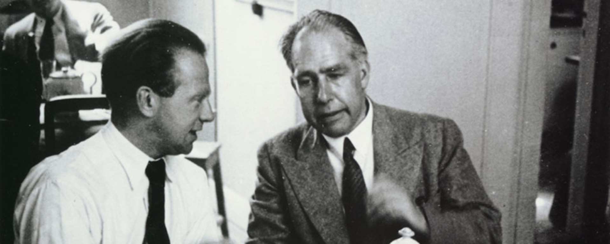
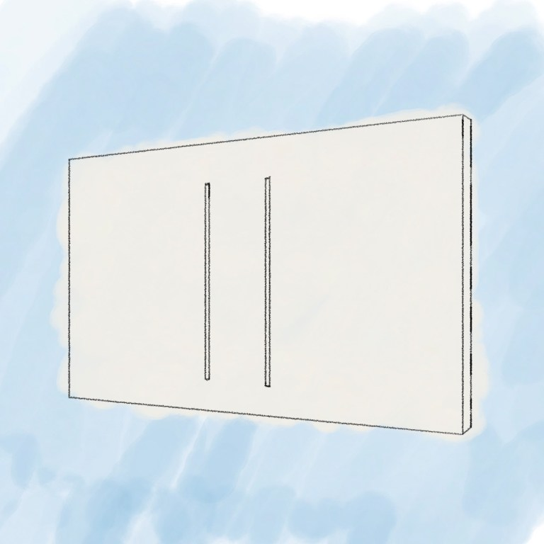
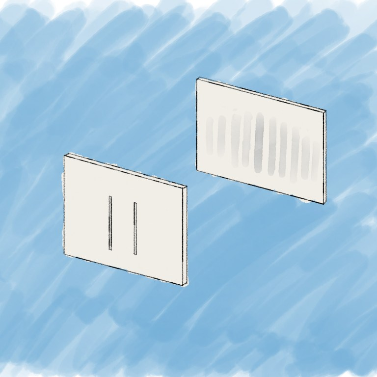
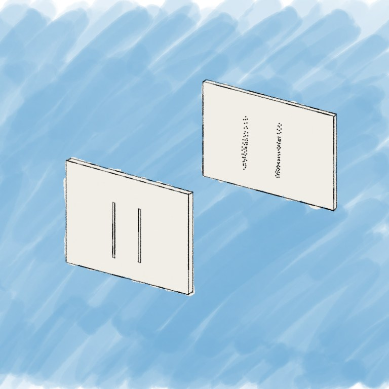
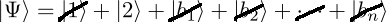

::: {.column-screen}

:::



::: {.lead-in}
So, you're reading this post on a quantum mechanical thing, be it a portable device or a less mobile desktop computer. This is all possible because quantum mechanics is the most successful theory humans have been able to conjure up. Nevertheless, there are still a few things to figure out. One of those things is called the measurement problem and sits at the level of a Nobel Prize. Since 1925, one way of solving this was mainly proposed by [Niels Bohr](https://en.wikipedia.org/wiki/Niels_Bohr) and [Werner Heisenberg](https://en.wikipedia.org/wiki/Werner_Heisenberg). They coined what is now called the Copenhagen interpretation.
:::

# Wave function

Let's do a quick recap of the mechanics as described in [The double-slit experiment](../the-double-slit-experiment/). Suppose we release a bunch of free electrons, meaning that they are not disturbed nor confined by any interaction with any other thing. They are launched from a cannon towards a screen with two slits.

One important element to describe the behaviour of the electron is what is called the [wave function](https://opencurve.info/quantum-mechanics-in-ten-ideas-for-people-on-the-move/) (the other element is the [Schrödinger equation](../this-is-not-an-atom/)). It's a mathematical description of all the possible states the electron can be in as soon as you measure it. In the case of our double-slit experiment, we look at two possible states pertaining to its position: it can be in the position-state of being at slit 1 or it can be in the position-state of being at slit 2.

::: {style="width: 80%; margin: 1.5rem auto;"}
{#fig-double-slit fig-alt="Perspective drawing of a single upright barrier screen with two narrow vertical rectangular slits on a light blue painted background."}
:::

Let's use the symbol $|\Psi\rangle$ to denote the wave function of the electron. Indeed, this is the actual notation for the wave function in quantum mechanics. We'll use $|1\rangle$ and $|2\rangle$ to denote the position-states slit 1 and slit 2.

So, when we don't put particle-measuring detectors at both slits, we will not know through which slit the electron will have gone. Quantum mechanics dictates that the wave function of our free electron with respect to its position in space is the addition of the two possible slits it can go through. It is true that it could also bump into the screen, missing the slits. So, let's label all those positions $|b_n\rangle$, where $b$ stands for bumping-into-screen and $n$ is a number denoting every tiny position on the screen that is not a slit. The wave function can then be written[^1] as follows:

$$|\Psi\rangle = |1\rangle + |2\rangle + |b_1\rangle + |b_2\rangle + \dots + |b_n\rangle$$

Put differently, we say that with respect to its position, the electron is in a superposition of slit 1 and slit 2 and a whole bunch of other positions on the first screen that lead to nowhere but an inglorious end on the first screen.

The unmeasured, free particle is wave-like – going through the two slits at once, spread-out like a wave – as is visible on the second screen: after a while a wave-interference pattern will have emerged.

::: {style="width: 80%; margin: 1.5rem auto;"}
{#fig-interference fig-alt="Drawing showing two screens in series: a front barrier with two slits and a rear detection screen displaying a faint, multi-band wave interference pattern."}
:::

# Measurement

However, as soon as you attach particle detectors on both slits, the detectors show that the particle only ever goes through one slit. Also, the interference pattern disappears instantly and makes place for your typical particle-like pattern.

The detectors determine or measure the position of the electron to be either at slit 1 or slit 2. Somehow, they never measure the electron to be at slit 1 and 2 at the same time. In other words, its wave-like existence has been replaced by a particle-like existence!

::: {style="width: 80%; margin: 1.5rem auto;"}
{#fig-pellets fig-alt="Drawing showing a double-slit screen and a rear detection screen displaying two sharp vertical columns of localized particle impact dots."}
:::

# The Copenhagen interpretation

Undergraduate students are usually taught the following interpretation of these strange events.

::: {.callout-note appearance="minimal"}
Upon measurement, the particle's wave function collapses.
:::

That's it. This is what's at the heart of the Copenhagen interpretation. This explanation of what's happening at the act of measurement is named after the city where Niels Bohr worked.

In other words, all the terms of the wave function "collapse" into just one term. Suppose we measured the electron to be going through slit 2, then by some unknown mathematical operation our wave function

$$|\Psi\rangle = |1\rangle + |2\rangle + |b_1\rangle + |b_2\rangle + \dots + |b_n\rangle$$

gets all the other terms cancelled, leaving the measurement outcome as:

::: {style="width: 80%; margin: 1.5rem auto;"}
{#fig-collapse fig-alt="Mathematical bra-ket equation showing wave function Psi equals ket 1 plus ket 2 plus terms b-sub-n, with black diagonal slash marks crossing out all terms except ket 2."}
:::

$$|\Psi\rangle = |2\rangle.$$

Note that neither the measurement nor the mathematics influence or prescribe at all *which* terms eventually get cancelled. In this example, it just happens to be that $|2\rangle$ was left over. What is eventually being crossed out is fundamentally unpredictable. Moreover, the very process of crossing out is unknown.

# The Born rule

Max Born wrote in a Nobel Prize-winning footnote of his 1926 paper that the probability of a solution to the Schrödinger equation of a quantum-mechanical system (such as an electron) is proportional to the wave function squared. A solution to the Schrödinger equation represents a possible specific quantum state, such as being at slit 2. In our equations above, each term represents such a specific quantum state.

So, the only thing we have is the [Born rule](https://en.wikipedia.org/wiki/Born_rule)[^2], stating that we can only predict the *probability* of each of the possible terms to not be crossed out after measurement.

::: {style="width: 80%; margin: 1.5rem auto;"}
![The footnote that got Max Born the Nobel Prize.[^3]](Max-Born-Rule-Footnote.png){.img-border #fig-born-footnote fig-alt="Historical printed German text excerpt from Zeitschrift für Physik page 866 by Max Born, highlighting footnote 1 stating probability is proportional to the square of the function."}
:::

# Acceptance of the Copenhagen interpretation

Bohr stated that this collapsing process cannot be described by quantum mechanics. This interpretation seems rather unsatisfactory to many. As the Nobel Prize laureate [Steven Weinberg](https://en.wikipedia.org/wiki/Steven_Weinberg) notes: "This answer is now widely felt to be unacceptable."[^4] A growing number of physicists realise that one of the problems is that in this case nobody knows what is supposed to be described by quantum mechanics and what not. If wave function collapse oughtn't fall under the purview of the mathematical formalism, for example, then what criteria should we uphold to determine if something else can be studied quantum-mechanically and what cannot be known, ever?

The major proponents Heisenberg and Bohr stressed that the wave function is purely a mathematical affair. While their views did not always align perfectly, they obviously agreed on wave function collapse.[^5] Bohr noted that we had to give up any physical representation of the whole matter. Those who uphold the traditional Copenhagen interpretation are generally [instrumentalists](https://en.wikipedia.org/wiki/Instrumentalism).

::: {.callout-note appearance="minimal"}
However, nobody knows if the Copenhagen interpretation is correct. There are other contenders aiming to solve the measurement problem.
:::

We will discuss other instrumentalist and realist interpretations of quantum mechanics in another bit of maths and physics.

---

### Image credits and references

* *Featured image: Werner Heisenberg (left) and Niels Bohr (right). Photo by Fermilab, U.S. Department of Energy (Public domain).*

[^1]: I'm deliberately leaving out any complex coefficients so as to not complicate things for the purpose of this post.
[^2]: It would have been too cheesy and/or dorky perhaps, but I would have loved [Robert Ludlum's trilogy](https://en.wikipedia.org/wiki/Bourne_(novel_series)) to at least contain one with the title *The Bourne Rule: One Man Against the Odds*.
[^3]: Born, M. (1926). "Zur Quantenmechanik der Stoßvorgänge", *Zeitschrift für Physik*, 37(12), pp. 863–867. doi: [10.1007/BF01397477](https://doi.org/10.1007/BF01397477).
[^4]: Weinberg, S. (2018). "The Trouble with Quantum Mechanics", in *Third Thoughts*. Cambridge, MA: Harvard University Press, pp. 124–124.
[^5]: Kiefer, C. (2003). "On the Interpretation of Quantum Theory — from Copenhagen to the Present Day", in Castell, L. and Ischebeck, O. (eds.) *Time, Quantum, and Information*. Berlin: Springer, pp. 291–299. doi: [10.1007/978-3-662-10557-3_19](https://doi.org/10.1007/978-3-662-10557-3_19).