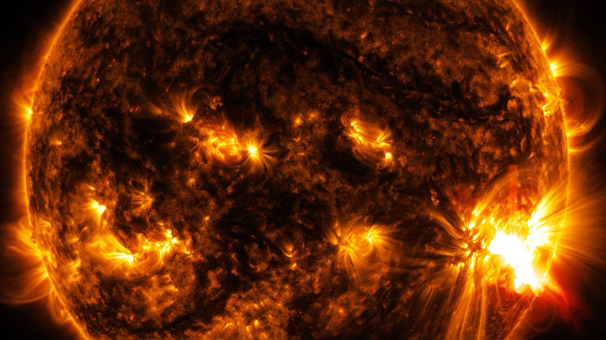
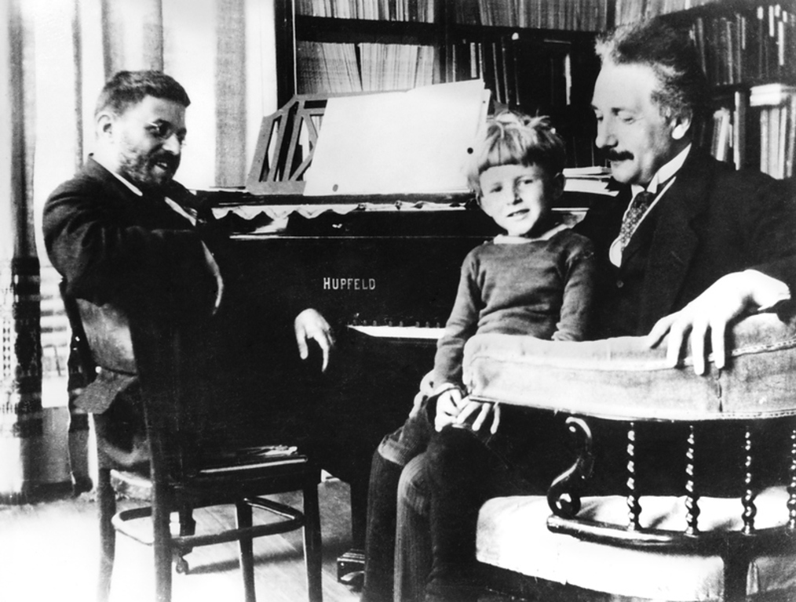
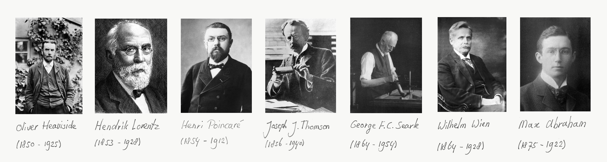
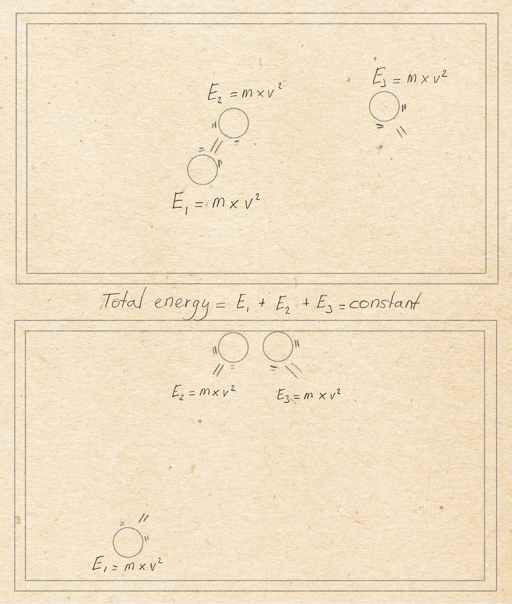
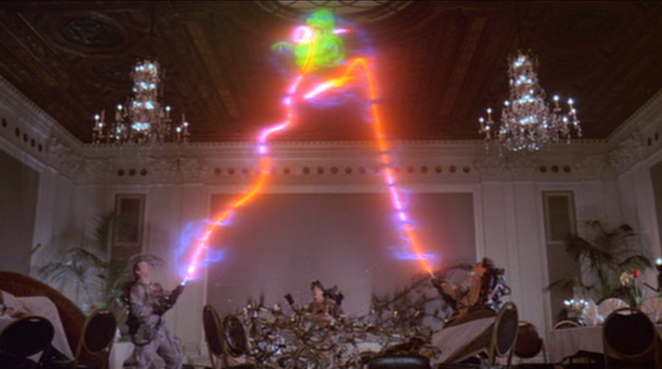
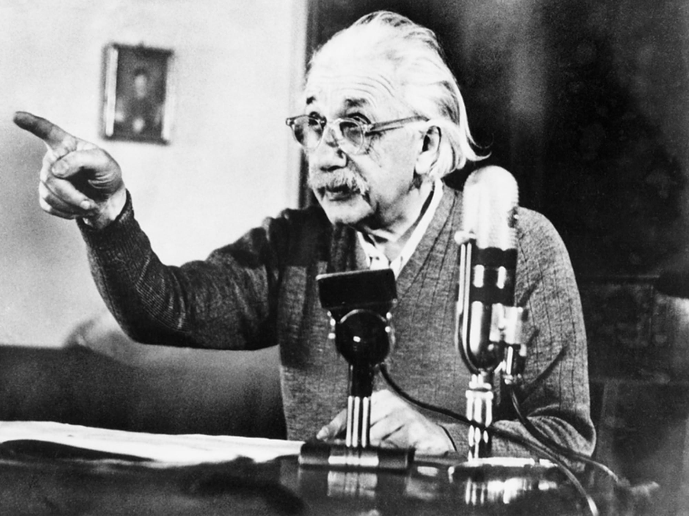
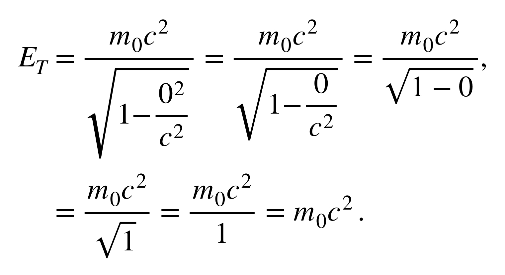
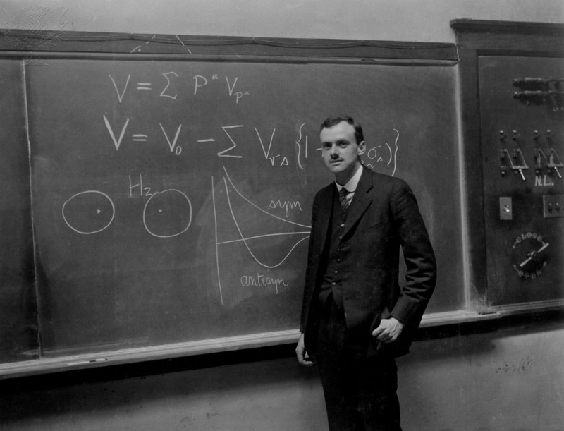

::: {.column-screen}

:::



::: {.lead-in}
Probably the most famous equation on this planet is $E = mc^2$. Energy equals mass times the speed of light squared.[^1] Usually, the formula is associated with Albert Einstein. This relationship between energy, mass, and the speed of light, this equation, has a name: the mass-energy equivalence. Perhaps you've read or heard people explain that "Einstein taught us", that mass is a form of energy, mass is frozen energy, mass can be converted into energy, and that, in the end, all *matter* is essentially pure energy.
:::

The equation is, however, definitely not about all of that. At least, not in this Universe. Here, we will discuss the actual meaning of it. We think it's time for disposing of some of the unnecessary obscurantism accompanying many popular explanations. We think the involved mathematicians and physicists of yore deserve better.

# Standing on the shoulders of giants

Einstein wasn't the first to write down this very relationship between mass and energy. There were many others before him who, one way or the other, explored the connection between mass, energy, and velocity. However, most hypothesised that a mechanical mass increase was exclusively due to interactions with electromagnetic fields. They called it electromagnetic self-energy of some kind, giving rise to a form of electromagnetic mass (Miller, 1981; Okun, 1989). Einstein then showed that there was no need for such a concept and was the first to derive the relation correctly.

However, over the course of a few years, he published several derivations of the equation, none of which were literally written down as $E = mc^2$. You might not recognise them if you saw them. Furthermore, the versions he did write down, weren't universally true.

Lastly, the famous equation isn't the complete version. Usually, people only know the snazzy edition fitting on baseball caps. The full equation is valid in a more universal way and sometimes referred to by contemporary physicists as the "correct version".[^2] However, this one wasn't first formulated by Einstein but by Paul Dirac (Eisberg & Resnick, 1974; Miller, 1981). We will get back to that.

# Energy is a mathematical idea

We should remind ourselves that *energy* isn't any "thing". As we mentioned in a previous [article](https://opencurve.info/energy-is-neither-fundamental-nor-conserved/), it isn't some invisible, immaterial, fluid-like "essence" which everything is made of, within and behind the façade of the tangible world. [Fork](https://youtu.be/QPXsYOPex4s/), no.

It has always been just a number, an accounting tool, an important and practical, mathematical concept, first proposed by the 17th century German scholar Gottfried Wilhelm von Leibniz. How is it a mathematical concept? It's the number you get when you multiply an object's mass with its velocity squared.[^3] It's a pragmatic way of keeping the books on these two things.

Suppose we have a billiard table with three billiard balls. We ignore any sort of friction. Imagine this isolated system of balls changing internally: the balls constantly collide and bounce off of the edge of the table. He assumed that what doesn't change, is their mass. What does change, are their velocities. Leibniz then noticed that if you multiply for each ball its mass with its velocity squared, and summed all three products, that sum remained constant, irrespective of how the balls were bouncing in which direction, and how fast, at each point in time (until you changed something to the system by introducing a whack by a cue stick, for example).

This was the early formulation of what we now fancifully call the law of conservation of energy,[^4] which, by the way, is true in a small enough patch of the Universe, such as Earth or the solar system, but in the context of the entire observable Universe, for instance, [energy is not conserved](https://opencurve.info/energy-is-neither-fundamental-nor-conserved/). So, indeed, the law of conservation of energy is fundamental enough for us, Earthlings, and our physics experiments; however, contrary to what people usually think, in the grander scheme of the Universe, it's not.[^5]

For the purpose of this post, however, this is irrelevant. What is important to note, is that since then, with their propensity to invent intricate systems of categorisation, humans have made distinctions between various forms of energy. Think of potential energy (something's high up and can fall down or wound up and unwind rapidly), thermal energy (something's hot), chemical energy (something's "charged"), and kinetic energy (something moves). All of these, including their mother-concept "energy", are human constructs. Thinking of any of these nouns as referring to physically separate, physical, tangible things is, ironically, a [category mistake](https://en.wikipedia.org/wiki/Category_mistake).

# It's [not](https://youtu.be/7PCkvCPvDXk) all about that mass

Sometimes, people misinterpreted Albert Einstein. In the old days, again, being the talented labellers that they are, humans split up the term "mass" into rest mass and relativistic mass. Rest mass is the mass when the object is at rest. Relativistic mass is the mass when the object is in motion. If then the object would start to move faster and faster, then this particular mass would become larger and larger, because, you know, that's what he said.

Well, no. He wrote in his third 1905 paper (1905a, p. 920), *Zur Elektrodynamik bewegter Körper*, an equation for the kinetic energy of an electron, which went as follows:

{.img-border}

While it may not look like it, you could say that this was his first expression for the relationship between (kinetic) energy, mass, and speed of light squared.[^6] It does require a little translation, but it's easy. Ignore the part in the middle, focus on the letter $W$, and the part behind the last equals sign. You should know that in modern notation, kinetic energy $W = E_k$, rest mass $\mu = m_0$, and speed of light $V = c$. So, what it says is:

$$E_k = \frac{m_0c^2}{\sqrt{1-\dfrac{v^2}{c^2}}} - m_0c^2.$$

So, this is slowly starting to resemble our familiar $E = mc^2$. It doesn't state, however, that *mass* increases. It only says that when the speed of the object $v$ approaches the speed of light $c$, the result of this whole equation is infinity – infinite energy.

As the standing interpretation is that mass equals energy (mass-energy equivalence), people nevertheless concluded that if the energy of a moving object becomes infinite at the speed of light, that an object's *mass* becomes infinite, or *relativistic mass*, to be precise (in the minds of the old folk).

This, however, is something of the past – well, technically. As soon as 1940, the great Lev Landau and Evgeny Lifshitz ignored the distinction between rest mass and relativistic mass in their book *The Classical Theory of Fields*. The legendary John A. Wheeler and Edwin F. Taylor also brought an up-to-date *Spacetime Physics* to the reading table. Unfortunately, many textbooks today still mention archaic notions, terms, and notation.

Contemporary professional physicists don't speak of relativistic mass anymore. In [special relativity](https://opencurve.info/einsteins-special-relativity-in-under-6-999-minutes-for-people-on-the-move/), Einstein showed that observations and measurements depend on one's frame of reference. By definition, there are at least a couple of things that do not depend on the motion of observers. Besides the spacetime interval, the laws of physics, and the speed of light, this turns out to be rest mass.

An object's rest mass is invariant, i.e. it doesn't vary or change, regardless of the motion of the observer relative to the object (Taylor & Wheeler, 1992, p. 211). And, as you can see in Einstein's equation for the kinetic energy, only rest mass is used. No mentioning of relativistic mass whatsoever. In fact, Einstein himself wrote (as cited in Okun, 1989, p. 32):

> "It is not good to introduce the concept of mass $M = m/(\sqrt{1-v^2/c^2})$ of a body for which no clear definition can be given. It is better to introduce no other mass concept than the 'rest mass' $m$. Instead of introducing $M$ it is better to mention the expression for momentum and energy of a body in motion."

Of course, $M$ is what humans would later call "relativistic mass", which means that they did it anyway, against Einstein's wishes.

Today, however – well, at least since 1940 – professional physicists speak only of mass. We tossed out relativistic mass as, with Einstein, it's "not good". Furthermore, the adjective "rest" in rest mass is redundant. Mass *is* about an object at rest. If it's in motion, we speak of the product of some proportion of mass and velocity: either momentum or energy. An object's mass does not grow by its motion.

# Resistance is crucial

So, what is mass then? Well, just to be clear, mass isn't weight: the same amount of mass has different weight on different planets. We were taught this in high school. A spring scale measures weight, not mass. A balance with calibrated counter-weights – *cough* masses – is your best option during interplanetary travels. These masses should have been calibrated to the definition of a [kilogram](https://www.bipm.org/en/measurement-units/) according to the [International Bureau of Weights and Measures](https://en.wikipedia.org/wiki/International_Bureau_of_Weights_and_Measures).

Mass isn't matter either. Mass and matter are different categories. The first is a property, the second is a "thing". Elementary "particles", things,[^7] such as the electron, have a certain amount of mass. An electron gains its mass through interacting with the Higgs field, the existence of which was [proved](https://youtu.be/0Tnd8bxDYOs) in 2012 at [CERN](https://en.wikipedia.org/wiki/CERN). And the amount of elementary particles does correlate with the amount of mass. However, the mass of an object isn't defined by merely the amount of elementary particles: it's also the motion of gluons inside protons, the motion of electrons, atoms, molecules – the kinetic, thermal, and chemical energy contained *within* the (resting) object.

Einstein wrote this in his fourth paper of 1905, *Ist die Trägheit eines Körpers von seinem Energieinhalt abhängig?* (1905b, p. 641):

> "If a body releases the energy $L$ in the form of radiation, its mass decreases by $L/V^2$,"

where, in modern notation, $L = E$, and $V = c$. Also, the energy he's talking about is not the kinetic energy (of a body in motion) but the internal energy (of a body at rest), such as thermal energy. And yes, this does mean that mass increases or decreases depending on the object's internal energy.

Two structurally identical balls of steel have different mass if one ball is hotter (more mass) than the other due to their diverging thermal energy content. Two structurally identical mobile phones have different mass if one is charged (more mass) and the other is out of juice (electrochemical energy). Note, we are talking about the whole object being at rest in its reference frame.

As soon as either object starts radiating light or heat, they lose mass. The fraction $E/c^2$, however, is very small because the speed of light is very high. And so, the extra mass gained or lost is so small that this may be a reason for people confusing mass with the amount of matter. It's almost the same. It's the amount of matter plus something more, its internal energy.

Mass could be best described by the resistance to acceleration – a ratio between the force needed to accelerate it to the extent it's accelerating. Mass is inertial mass, an object's inertia (as Einstein put it in the title of his 1905b paper).

# The complete equation

If you're not into equations any longer, skip this section. If you want to know the real equation, let's go.

Einstein published several derivations. One of the more familiar was the following for the total energy:

$$E_T = \frac{m_0c^2}{\sqrt{1-\dfrac{v^2}{c^2}}}.$$

::: {style="width: 38%; float: right; margin: 0 0 1rem 1.5rem;"}

:::

If you happen to be fluent in algebra, then you could see how we obtain $E = mc^2$. If not, not to worry. If an object is at rest, it has no speed, so $v = 0$. If you fill in that number in the equation, the denominator of the big fraction becomes the value 1. And anything divided by 1 equals exactly that same anything. So, that means that what you get is $E = m_0c^2$.

Of course, since nowadays there is only one mass, which is $m$, and since "rest" is redundant, we should really leave out the subscript 0. This also means that the famous equation $E = mc^2$ is only applicable if the object isn't moving in our (inertial) reference frame. Moreover, it's not applicable to phenomena without mass either, such as a photon. Hence:

::: {.callout-note appearance="minimal"}
$E = mc^2$ is not universally true. Only in an inertial reference frame where the object isn't moving, and only in the case of particles with mass, does this equation hold. This equation is not valid for photons and gluons.
:::

The following equation, however, does hold for massless as well as massive particles, and while Einstein laid the groundwork, the genius [Paul Dirac](https://en.wikipedia.org/wiki/Paul_Dirac) was to write this down for the first time in 1928 (Eisberg & Resnick, 1974; Miller, 1981), albeit in a slightly more technical fashion than presented here. The following equation handles all objects, including light:

$$E^2 = m^2c^4 + p^2c^2.$$

The letter $p$ is the [momentum](https://en.wikipedia.org/wiki/Momentum). Suppose we want to calculate the energy of a photon. Since the photon has no mass ($m = 0$), this equation becomes $E = pc$, which is, indeed, the correct relation between energy and a photon. If you try to use $E = mc^2$ to calculate the energy of a photon, you get a silly answer.

So, $E = mc^2$ isn't even a universal equation because it doesn't fly for massless particles: photons and gluons. The equation first written down by Paul Dirac does, however. And it still fits on a T-shirt.

Often, though, it's written as:

$$E^2 = (pc)^2 + (mc^2)^2,$$

which makes it possibly even snazzier as it shows a beautiful Pythagorean relationship triangle.

# The meaning of E = mc²

All well and good, but, technicalities aside, *what does it mean?*

What it means is that *energy is mass*, proportioned by a factor of $c^2$.

What it also means is that an object's mass is a measure of its total *intrinsic* energy (potential, thermal, chemical, electrical, even kinetic, if parts inside the object have motion) proportioned by a factor of $1/c^2$.

$E = mc^2$ should actually be written $E_0 = mc^2$ as it's about the energy of an object at rest and the subscript 0 usually denotes something at rest.

However, it *isn't* the *full* equation.

What it *doesn't* mean is that energy is matter, and, conversely, it doesn't mean that matter is energy. *Mass isn't matter*. This is a category mistake.

It also doesn't mean that mass can be converted into energy or vice versa. For one, mass cannot be converted as it isn't a "thing". Secondly, energy isn't a "thing" either. Mass is a property, a measurable property. Energy is also a property, a *calculable* property, which can be done by measuring mass.

Imagine an object had the following properties: size, colour, hardness, and energy. Suppose the equation had said $E = \text{hardness} \times c^2$. Perhaps it's more clear now that this doesn't mean that hardness gets converted into energy. What it means is that you have a mathematical way of *calculating* one measure in terms of the other measure. The only thing that's being converted here is a number, a quantity.

Matter is a different beast. It's a clump of things: particles. An object is a clump of matter and matter interactions. As CERN shows on a daily basis, matter in motion can be converted into a thousand other things in motion. If people insist on talking about things getting converted, then they could talk about converting particle A with motion $a$ and particle B with motion $b$ into particles C, D, E, F, G, $\dots$ with motions $c, d, e, f, g, \dots$

So, next time someone thinks they should explain to you that $E = mc^2$ means that mass can be converted into energy or that no object can gain the speed of light because its mass would become infinite, you can just reply with: "Nah, mate, mass is an invariant property of an object, calculable through the complete equation, you know, $E^2 = (pc)^2 + (mc^2)^2$. Although you would have to solve for $m$ and merely use the pseudo-Euclidean norm for momentum, not the whole four-vector, but that shouldn't be a problem – it makes it easier." Then pause, and add: "In Minkowski space, obviously."[^8]

Also, pure energy = pure nonsense. If Leibniz were somehow able to hear this, he would cackle and turn over in his grave – if he could muster the energy for it. To be fair, physicists use the word energy all the time, all over the place. It's short, sweet, and simple to use on a daily basis, which is fine, just as long as we're all in [agreement](https://youtu.be/v1W4UTuUtDw?t=32s) about what we mean.

Energy isn't fundamental to motion, it's motion[^9] and interactions giving rise to the construct of energy.

However, if you do bump into a floating blob of pure energy down the long narrow hall upstairs of your rich aunt's mansion, then, well, yes, that would most certainly be [something strange](https://youtu.be/Fe93CLbHjxQ).

# References

Carroll, S. (2014) *Spacetime and Geometry: Pearson New International Edition : an Introduction to General Relativity.* 1st ed. Pearson.

Einstein, A. (1905a) 'Zur Elektrodynamik bewegter Körper', *Annalen der Physik*, 322(10), pp. 891–921.

Einstein, A. (1905b) 'Ist die Trägheit eines Körpers von seinem Energieinhalt abhängig?', *Annalen der Physik*, 323(13), pp. 639–641.

Eisberg, R. M. and Resnick, R. (1974) *Quantum physics of atoms, molecules, solids, nuclei, and particles*. New York: Wiley.

Miller, A. I. (1981) *Albert Einstein's special theory of relativity: emergence (1905) and early interpretation (1905-1911)*. Reading, Mass.: Addison-Wesley.

Okun, L. B. (1989) 'The Concept of Mass', *Physics Today*, 42(6), pp. 31–36.

Taylor, E. F. and Wheeler, J. A. (1992) *Spacetime physics: introduction to special relativity*. 2nd ed. New York: W.H. Freeman.

---

### Image credits

* *Featured image: NASA's Solar Dynamics Observatory captured this image of an X2.0-class solar flare bursting off the lower right side of the sun on Oct. 27, 2014. The image shows a blend of extreme ultraviolet light with wavelengths of 131 and 171 Angstroms. Credit: NASA/SDO.*
* *Einstein and Ehrenfest. [Photography]. Encyclopædia Britannica ImageQuest. Retrieved 21 Aug 2019.*
* *Oliver Heaviside (1850–1925) - Science and Society Museum / Universal Images Group. Oliver Heaviside, English physicist, c. 1900. [Photograph]. Encyclopædia Britannica ImageQuest.*
* *Hendrik Lorentz (1853–1928) - Science and Society Museum / Universal Images Group. Hendrik Antoon Lorentz, Dutch physicist, c. 1920. [Photograph]. Encyclopædia Britannica ImageQuest.*
* *Henri Poincaré (1854–1912) - akg-images / Universal Images Group. Henri Poincaré, Photo c. 1890. [Photograph]. Encyclopædia Britannica ImageQuest.*
* *Joseph J. Thomson (1856–1940) - Science and Society Museum / Universal Images Group. Sir Joseph J. Thomson, English physicist. [Photography]. Encyclopædia Britannica ImageQuest.*
* *George Frederick Charles Searle FRS (1864–1954) - Royal Society. As printed in Thomson, G. (1955) 'George Frederick Charles Searle. 1864–1954', Biographical Memoirs of Fellows of the Royal Society, 1, p. 247.*
* *Wilhelm Wien (1864–1928) - National Library of Congress / Science Photo Library / Universal Images Group. Wilhelm Wien, German physicist. [Photography]. Encyclopædia Britannica ImageQuest.*
* *Max Abraham (1875–1922) - Niedersächsische Staats- und Universitätsbibliothek Göttingen. Max Abraham around 1905. Public domain.*
* *Albert Einstein, Swiss-German physicist. [Photograph]. Encyclopædia Britannica ImageQuest.*
* *Paul Dirac. [Photography]. Encyclopædia Britannica ImageQuest.*

[^1]: Usually, in mathematics, we leave out the multiplication sign ($\times$).
[^2]: cf. [MinutePhysics: The Real Meaning of E=mc²](https://youtu.be/mkiCPMjpysc)
[^3]: Which was later calibrated to $1/2$ times the mass times velocity squared.
[^4]: He called this product quantity *vis viva*, so, not even energy yet. Perhaps he was being poetic. Furthermore, Leibniz also had some fierce competition: his rival Newton had come up with a different quantity, a different way of keeping the books. He stated that the sum of the products of mass and velocity — just velocity, not velocity squared — remained constant. This is the law of conservation of momentum. Later, it was understood that the two laws were complementary, not contradictory.
[^5]: Courtesy of the genius Emmy Noether (Noether's theorem) and Albert Einstein (general relativity).
[^6]: Incidentally, Max Abraham had published Walter Kaufmann's work just before Einstein, showing the same equation for kinetic energy. Einstein probably wasn't aware of this (Miller, 1981).
[^7]: We use quotation marks in "particles" because, while it's easier to use that term, we acknowledge it's actually quantum field oscillators we should be talking about or, even prettier, wave functions.
[^8]: Minkowski space is like Euclidean space but in four dimensions. This might be a good time to add the footnote that there is an even more fundamental equation, which is Einstein's field equation of general relativity (Carroll, 2014), but that's something to discuss at a later point in time.
[^9]: Of quantum fields as described by wave functions.