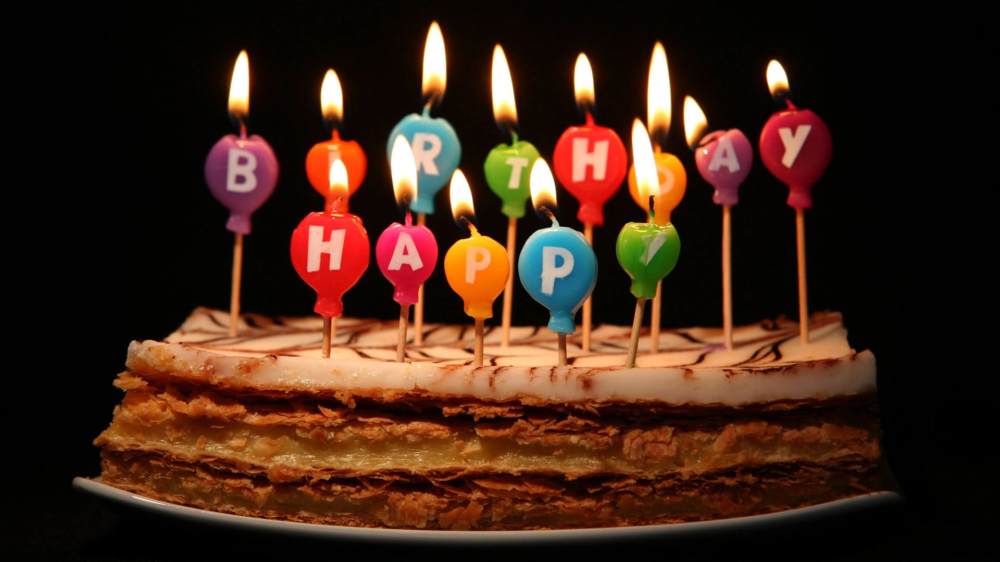

::: {.column-screen}

:::



::: {.lead-in}
Probabilities can be hard to grasp. For instance, what are the chances that among a birthday party's attendees two or more people will have their birthdays on the same day? Probably better than you might expect.
:::

Since the day she was born, my mother's birthday has been on 1 January. This year, she celebrated her twelfth jubilee year in a cosy party room filled with about fifty people.

Being the life and soul of any party, during my short talk I presented the guests with the fact that the probability of my mother's date of birth being 1 January equalled $\dfrac{1}{365}$. As most years consist of 365 days, I left leap years out of consideration. I also assumed a uniform distribution of birthdays across the calendar, as this simplifies the arithmetic.

Then I asked what the probability was for my father to be born on 8 July, given that there are 365 days to choose from. The answer was, again, 1 out of 365, or $\dfrac{1}{365}$. In this respect, a particular date is no more special than any other, other than the cultural significance we attach to some.

Then I posed the crucial question: what is the probability that two or more people in this room share the same birthday? Irrespective of their year of birth; purely focusing on the day of the year.

In other words: with 365 days in a year and 50 people in the room, what are the chances that two or more birthdays coincide?

{#fig-talk fig-alt="The author in a suit giving a presentation with an illustrated blackboard chart behind him showing mathematical sketches and coordinate axes."}

Sometimes people think of dice. If you roll two dice, the probability of rolling a six on the first die is $\dfrac{1}{6}$, and on the second die it is also $\dfrac{1}{6}$. The chance of throwing two sixes is $\dfrac{1}{6} \times \dfrac{1}{6} = \dfrac{1}{36}$. Many people argue that the probability of two specific guests being born on 8 July, for instance, equals $\dfrac{1}{365} \times \dfrac{1}{365} = \dfrac{1}{133{,}225}$. Intuition suggests that finding a shared birthday among fifty guests must be exceedingly rare.

Others imagine 50 marked marbles in an urn containing 365 marbles, concluding that the odds must be around $\dfrac{50}{365}$.

Both intuitions are incorrect. In reality, the probability is **97%**.

# The calculation

In probability theory, it is often simpler to evaluate the complementary event: what is the probability that *nobody* shares a birthday?

We have 365 available days and 50 people. What is the probability that person 1 has their birthday on *a* day? Not a predefined date like 8 July, but simply *any* day of the year. That is 365 choices out of 365, or:

$$\dfrac{365}{365} = 1 \quad (100\%).$$

Now, what is the probability that person 2 has their birthday on a different day from person 1? Person 2 can celebrate on any day except the one already claimed, leaving 364 options:

$$\dfrac{364}{365} \approx 0.99726 \quad (99.7\%).$$

The joint probability that *both* people celebrate on different days is:

$$\dfrac{365}{365} \times \dfrac{364}{365} \approx 0.9973 \quad (99.7\%).$$

What happens when we introduce a third person? Person 3 must avoid the birth dates of persons 1 and 2, leaving 363 available days:

$$\dfrac{365}{365} \times \dfrac{364}{365} \times \dfrac{363}{365} = \dfrac{132{,}132}{133{,}225} \approx 0.9918 \quad (99.2\%).$$

Introducing a fourth person leaves 362 distinct days:

$$\dfrac{365}{365} \times \dfrac{364}{365} \times \dfrac{363}{365} \times \dfrac{362}{365} \approx 0.9836 \quad (98.4\%).$$

With every individual added to the group, the probability of everyone having a unique birthday drops steadily.

Extending this sequence across all 50 people, person 50 has $365 - 49 = 316$ unique dates remaining. The probability that all 50 people have mutually distinct birthdays is:

$$\dfrac{365}{365} \times \dfrac{364}{365} \times \dfrac{363}{365} \times \dots \times \dfrac{317}{365} \times \dfrac{316}{365} = \dfrac{365!}{365^{50} \times (365 - 50)!} \approx 0.0296.$$

There is only a **2.9%** chance that nobody in the room shares a birthday!

The probability of the complementary event—that at least two people share a birthday—is therefore:

$$1 - 0.0296 = 0.9704 \quad (\sim 97.0\%).$$

Among the fifty guests at the party, no fewer than six people shared a birthday—yielding three shared pairs.

The odds cross the 50% threshold surprisingly early: in a room of just **23 people**, the probability of a shared birthday is already $0.5073$ (roughly 50.7%).

In mathematics, this combinatorial crowding effect is intimately tied to the **pigeonhole principle** (or Dirichlet's box principle).

---

### Image credits and references

* *Featured image: Birthday cake candles photo by Will Clayton ([CC BY 2.0](https://creativecommons.org/licenses/by/2.0/)).*
* *Photograph of talk by OpenCurve archive.*