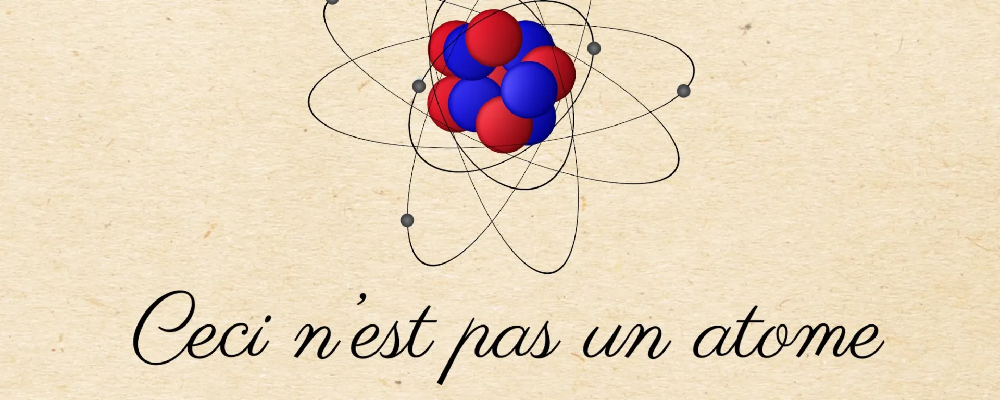
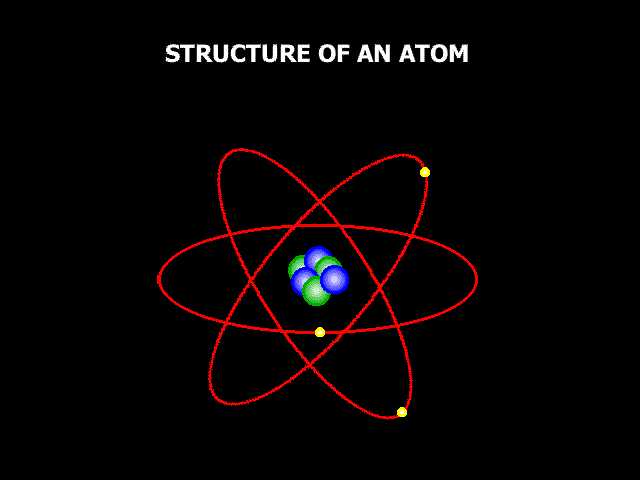
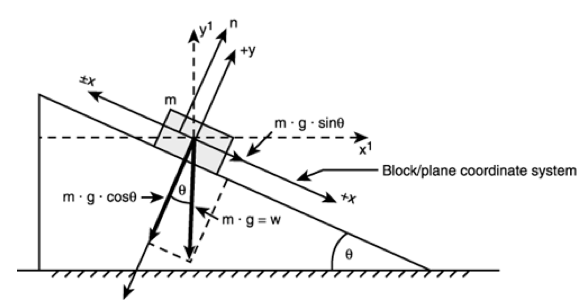
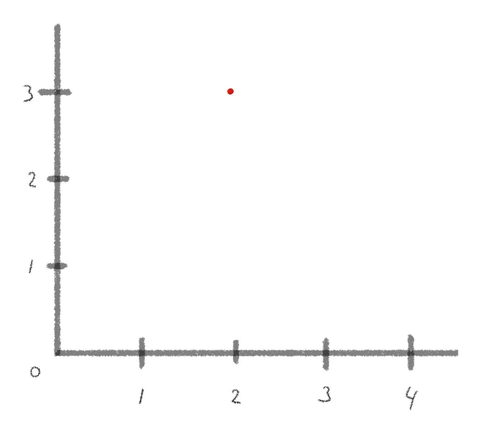
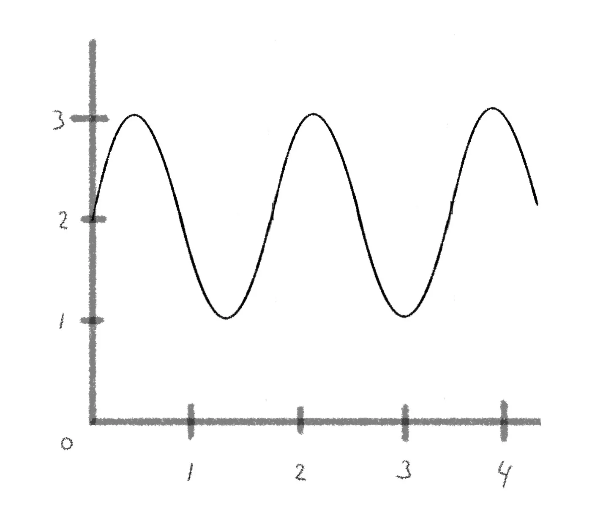
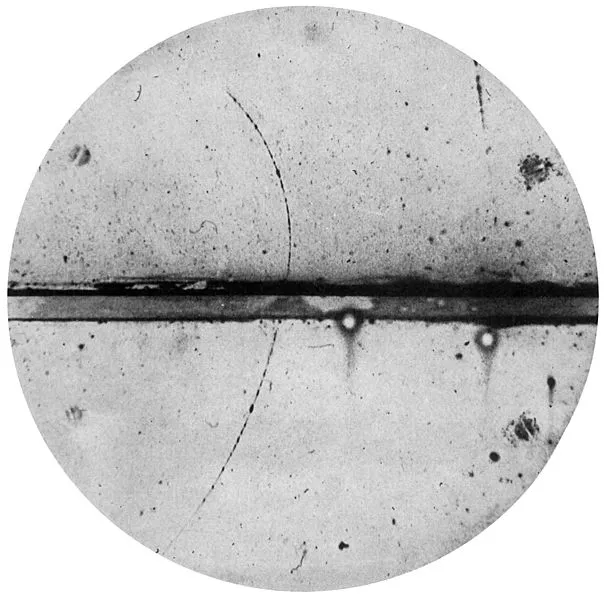

::: {.column-screen}

:::



::: {.lead-in}
Today, many people know that all things around us – the chair we sit on, the screen we look at – are a composition of all sorts of different molecules and that they are in turn composed of all sorts of different atoms. Indeed, ancient Greek philosophers such as Democritus hypothesized matter consists of tiny, physically indivisible entities, which they then [named](https://en.wiktionary.org/wiki/atom#Etymology) atoms.
:::

However, we also know that the Greeks weren't entirely correct: the atom itself is composed of electrons, protons, and neutrons. We also know that the latter two are composed of even smaller things – quarks and gluons.

What not many people know, however, is that this classical picture:

is absolutely *not* what an atom is!

# Old ideas

If you hung out in the wrong street corners, you might have been told that electrons whizz around the nucleus like tiny planets around the Sun or tiny moons around a planet. If that were the case, then you have been lied to.

If you hung out in yet other unsavoury street corners, you might have been told that quantum mechanics is something magical, spiritual, and the doorway to a deeper understanding of love, consciousness, and healing. Telepathy, even. Again, you have been lied to.

Admittedly, the famous physicist Richard Feynman is often quoted as saying that nobody understands quantum mechanics. In a specific way, that's true. Particles don't behave like everyday objects and that is a strange fact. Furthermore, the mathematical descriptions of particles tell us what they *do* but not what they *are*. We know all the equations, but we don't know what they mean – as opposed to knowing the meaning of the words "microscopically tiny ball".

However, this doesn't mean we shouldn't make an effort to make particles predictable, useful, and less mysterious and esoteric. It doesn't mean we can't harness the power of a good theory of quantum behaviour.

In fact, that's exactly what we've been doing rather successfully since quantum mechanics took shape in the 1920s. Hence, the existence of your mobile phone, computers, cameras, and self-checkout in the supermarket.

So, let's slice off the fat and cut to the chase.

# Classical mechanics versus quantum mechanics

In high school, we were taught Newtonian mechanics. We were told that the world is reigned by Newton's laws, the most powerful of them being the second: force equals mass times acceleration,

$$F = ma.$$

We were taught that when an object is moving, it moves according to Newton's second law. The beauty of his mechanics was that physicists and engineers were now able to predict the future (and retrodict its past) of a sliding block, for instance, based on just a few known initial conditions.

More generally speaking, and in physics jargon, Newtonian mechanics is capable of describing the *state of a system* over time with mathematically infinite precision based on a sufficient set of initial conditions. We call this a deterministic theory as it's possible to determine the past and future of the state of a system. Thanks to this property, even space vessels such as the Apollo Lunar Module and Mars Rover Curiosity were able to arrive successfully at their extraterrestrial destinations.

In quantum mechanics, we study the behaviour of subatomic stuff, such as electrons and quarks. After many twists and turns throughout history, it turns out we can't actually determine the past and future of, say, an electron – not as we could for blocks and balls in Newtonian mechanics. Why not? Because it's simply not a tiny block or ball. It's not even a particle in that sense (assuming a particle is like a tiny ball)! It's a *wave function*, a mathematical expression describing all the possible states of a "particle". Quite a different beast.

*Possible* states? Yes, in quantum mechanics, things aren't so deterministic. Turns out that to describe the state of an electron, for example, Newton's second law doesn't apply. It's fundamentally impossible to predict or retrodict where an electron will be at any given time, for instance. Or how fast it's moving at a particular point in time. The best we can do is calculate the *probability* it'll be here or there or whizzing at this or that velocity. In other words, the state of an electron can only be described in terms of probabilities.

It also turns out that the probabilities of this set of possible states may change over time. Luckily, like in Newtonian mechanics, there's an equation for that. In quantum mechanics, the analogue of Newton's second law is called the Schrödinger equation. It tells you how a wave function, i.e., the set of all possible states of a particle, changes over time. In its most compact form[^1], it goes like this:

$$i\hbar \dfrac{\partial}{\partial t}\Psi = \hat{H}\Psi.$$

No need to understand all the symbols, but here you can see that also in quantum mechanics there's a beautiful equation at its centre, and it's this one[^2]. It tells you the evolution of $\Psi$, the symbol for the wave function.

Deterministic theories, such as Newtonian mechanics, are called "classical" as opposed to quantum mechanics, dealing with probabilistic wave functions[^3].

# Wave functions

As we've learnt in the previous section, a particle is not a particle. Granted, we still talk about a "particle", but that's only for lack of a better term. It's an artefact of humankind's limited understanding of the Universe back in the day. The idea of a particle simply fits among the things we already know. We can picture a little ball because we grew up playing with little balls. Or marbles, or whatever. Admittedly, sometimes particles do look like particles, which we'll discuss in the last section.

Nevertheless, experiments from the early 20th century proved that tiny balls were definitely the wrong idea. Therefore, nowadays, our best descriptions of "particles" are indeed wave functions, mathematical expressions. The fundamental question is whether the wave function *is* the particle or just a mathematical representation of it. This question hasn't been answered yet; however, the personal opinion of the author of this post is that after about a century of the highly successful theory of quantum mechanics, it's maybe time to start regarding the wave function as the thing that is a "particle".

Just to illustrate the difference between a particle and a wave, have a look at this point-like particle. The horizontal axis is the $x$-coordinate in space and the vertical axis is the $y$-coordinate in space.

::: {style="width: 60%; margin: 1.5rem auto;"}

:::

Now tell me, where in space is the particle located? You probably got the answer straight away. It's at coordinate $(2, 3)$. Good.

Now, have a look at this (two-dimensional) wave.

::: {style="width: 65%; margin: 1.5rem auto;"}

:::

So, tell me, where in space is the wave located? You may find it harder to pinpoint the wave to a specific set of coordinates. That's because it's in several places at once. It doesn't have a specific position. In physics speak, this is called a superposition.

This is also the case for an electron (or any other "particle"). It's in a superposition, and not just in terms of its position: it's also in a superposition in terms of its energy, momentum, and a few other properties. In other words, it's in all places at once at several energy levels at once, whizzing at all kinds of velocities at once.

Note, however, that the wave function is absolutely not the same as a simple sine wave in normal space, which was merely displayed here for reasons of clarity[^4].

Maybe now you can appreciate how revolutionary quantum mechanics truly is compared to the simple mechanics of the blocks and tiny balls of everyday life.

# Picture of an atom

So, we've arrived at the correct picture of an atom. We already learnt that an electron isn't a point-like particle; it's a wave function. What do wave functions look like then? Well, they are cloud-like but not clouds, smeared out in space, yet both size- and location-less. They don't have a specific position, they don't have a specific momentum, they don't have a specific energy value. They are in a superposition of all these possible states. The probabilities of these states may oscillate over time as dictated by the Schrödinger equation.

That doesn't help much, does it?

Well, fear not. Dillon Berger, a PhD student of Theoretical Particle Physics at UC Irvine, made a beautiful animation of a cross-section of a hydrogen atom using the Schrödinger equation. The contours represent the wave function of the electron. The colours denote the probability of the electron being in that particular state. Note, there is only one electron in a hydrogen atom. So, yes: it's almost everywhere at the same time, while also oscillating over time. (This animation has time slowed down by a thousand trillion. The nucleus, a proton, is too small, so it's invisible.)

::: {style="max-width: 550px; margin: 1.5rem auto;"}
<blockquote class="twitter-tweet">
  
</blockquote>

:::

That whole tiny balls or planets revolving around the nucleus analogy? Flush it out of your system. For good.

# Unless we're looking

Now, hold on, you might say. Why is it then that professional physicists still talk of particles? And what did you mean, when, earlier, you said they're size-less? How then do you explain the fact that in scientific tables we saw in high school, actual, physical sizes of particles are listed? And how do you explain this classical picture of the readout of a cloud chamber demonstrating the existence of a subatomic particle? That trajectory certainly looks like it was created by a point-like particle and not at all a wave.

::: {style="width: 75%; margin: 1.5rem auto;"}

:::

You're quite right to doubt the whole story about wave functions in the face of these empirical findings. You've also arrived at a mystery that is at the heart of quantum mechanics, worthy of a Nobel Prize, which, of course, has a name: *the measurement problem*.

Turns out, particles are indeed wave functions *but only if we're not looking.* As soon as we do *measurements*, trying to gauge their position, for example, we won't find them at all places at once, like a wave. Instead, we will find them at one particular location – just as we would expect from an actual particle!

This is what the famed double-slit experiment demonstrated. [In another post](https://opencurve.info/the-double-slit-experiment/), we discussed this.

This is why, to this day, you might have heard of the "wave-particle duality" of the subatomic world. The wave function is the most complete description of a particle. As soon as we do measurements, we see only a sliver of its original wave function, a mere shard of the set of all possible states.

Therefore, Dillon Berger's animation shows a hydrogen atom when left completely alone. This is its fundamental state of being: its electron being a wave function in superposition, oscillating over time according to the Schrödinger equation. And as soon as it interacts with its environment, only a metaphorical slice of its full existence will show (a slice corresponding to the disguise of an actual particle).

How this happens or what actually happens when we do measurements is still up for debate. We will most certainly dive deeper into a variety of views on how to tackle this phenomenon in another post. Expect a post on the Copenhagen interpretation of quantum mechanics, the Many-Worlds interpretation, and others soon.

Now you have a better mental picture of an atom, at least. Probably.

[^1]: Although, technically, using Newton's notation instead of Leibniz's, an even more compact form is $i \hbar \dot{\Psi} = \hat{H} \Psi.$
[^2]: There are other ways to calculate the time-evolution of the wave function, of course, such as in Heisenberg's matrix mechanics, Feynman's path integral formulation, and Dirac's formulation for matrix mechanics and the Schrödinger equation combined. However, this one is invariably taught at undergraduate level.
[^3]: Note that the Schrödinger equation is deterministic. It's the wave function itself that yields probabilities, or, if you're a stickler for accuracy like me, it's the wave function's *norm squared* that yields probability densities (by integrating the norm squared over a volume, area or distance).
[^4]: And, indeed, those who read a [previous post](https://opencurve.info/why-exactly-do-glass-and-liquids-refract-light/) on light refraction in glass know that "particles" are oscillations in their respective three-dimensional quantum fields in quantum field theory. The wave function plays a central role in this highly successful theory. Secondly, the wave function is a so-called complex function and therefore exists in so-called complex space $\mathbb{C}$, not in the "regular" number space $\mathbb{R}$, we all grew up with. Lastly, and at the cutting edge of our scientific knowledge, there is actually only one wave function, the wave function of the Universe. Every field and particle in it are mere parts of that wave function, which can be thought of as small, individual wave functions to keep it manageable.