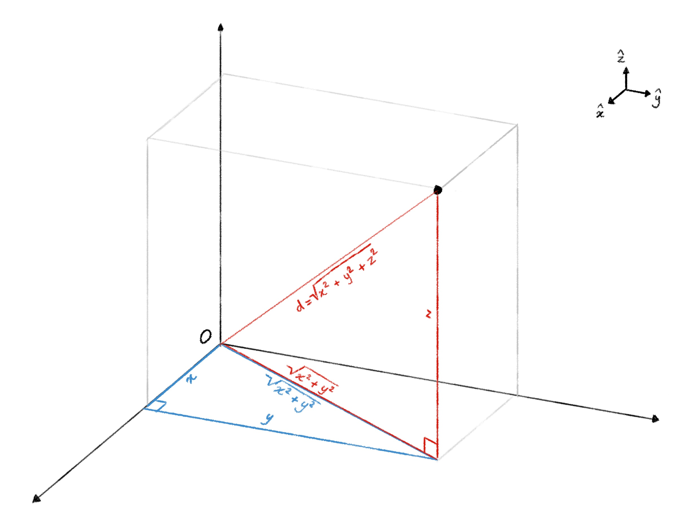
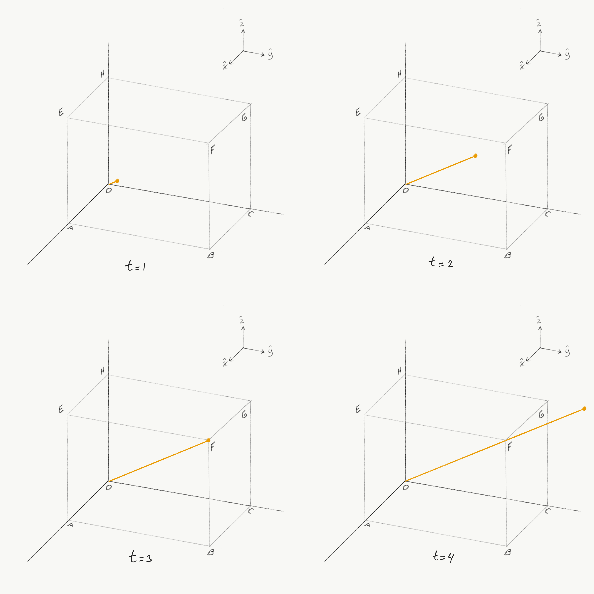
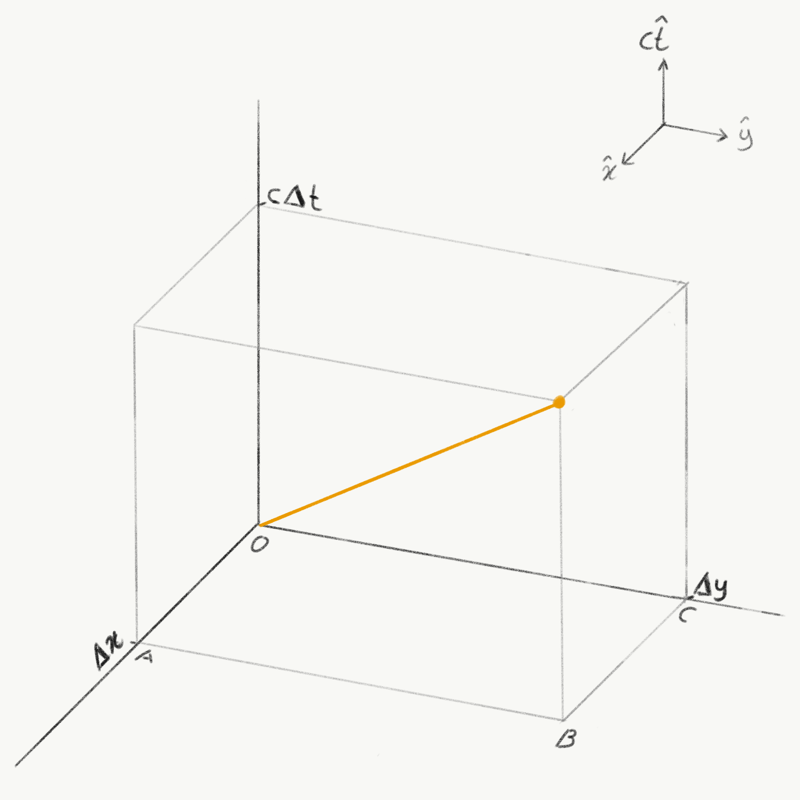

::: {.column-screen}

:::



::: {.lead-in}
Einstein and collaborators taught us that space and time are not fixed, immutable quantities. They stretch, dilate, and contract depending on relative motion. There is one quantity, however, that remains strictly invariant across all inertial reference frames: the **spacetime interval**.
:::

# Spatial interval

Suppose a photon is emitted from the origin $O$ and travels to point $F$ in three-dimensional space (@fig-spatial-interval). We write down the expression for its squared distance $d(O,F)^2$ using the Pythagorean theorem:

$$d(O,F)^2 = d(O,A)^2 + d(A,B)^2 + d(B,F)^2.$$

{.img-border #fig-spatial-interval fig-alt="Isometric line drawing of a 3D rectangular box showing the coordinate axes x, y, z and a red diagonal vector d representing distance from origin O to point F."}

Defining the coordinates of the origin as $O = (0,0,0)$ and the destination as $F = (x, y, z)$, this spatial separation becomes:

$$
d(O,F)^2 = (\Delta x)^2 + (\Delta y)^2 + (\Delta z)^2
$$ {#eq-spatial-distance}

Because the coordinate axes in @fig-spatial-interval represent standard Euclidean space, $d(O,F)^2$ is called a Euclidean or spatial interval. Geometrically, it represents the space diagonal of a rectangular cuboid bounding that region of 3D space.

In everyday life, specifying a location in space requires three spatial coordinates—for instance, 1 Einstein Drive, 2nd floor. But to specify an event completely, we need one additional piece of information: *when* does it happen?

# Time interval

Consider @fig-timed-series, which illustrates our photon's progress toward point $F$ across successive moments in time. It demonstrates that physical reality requires not just three spatial coordinates, but also a temporal coordinate.

{.img-border #fig-timed-series fig-alt="Four-panel sequence showing a 3D cuboid with a yellow photon trajectory vector progressively extending from origin O at time t equals 1 to passing point F at time t equals 3 and beyond at t equals 4."}

Suppose photon $P$ passes through point $F$ at $t = 3$. The time coordinate for this arrival event is:

$$t_F = 3.$$

Assuming the photon was emitted from the origin at $t_O = 0$, the elapsed temporal interval between emission and arrival is:

$$\Delta t_{OF} = t_F - t_O = 3 - 0 = 3.$$

# Converting time to distance units

To describe an **event** in physics, four coordinates are required. The three spatial intervals are measured in units of distance (e.g. metres), whereas the temporal interval is measured in units of time (seconds). To make them dimensionally compatible and mathematically comparable, we multiply the time interval by a fundamental physical invariant: the speed of light in vacuum, $c$.

By Einstein's second postulate of special relativity, $c$ is identical in all inertial reference frames. Multiplying time by velocity yields distance units:

$$\Delta t \longmapsto c\Delta t.$$

# The spacetime interval

In @fig-spacetime-interval, we represent this four-dimensional geometry on a two-dimensional surface by omitting the spatial $z$-axis and replacing it with the temporal $ct$-axis.

{.img-border #fig-spacetime-interval fig-alt="Spacetime coordinate box with horizontal axes Delta x and Delta y and a vertical axis labeled c Delta t, showing an orange trajectory vector from origin O."}

For a photon travelling at velocity $c$, the distance travelled in time $\Delta t$ is:

$$d(O,F) = c\Delta t \implies d(O,F)^2 = (c\Delta t)^2.$$

Equating this expression with our Pythagorean spatial distance from @eq-spatial-distance:

$$(\Delta x)^2 + (\Delta y)^2 + (\Delta z)^2 = (c\Delta t)^2.$$

Rearranging all terms onto one side:

$$
-(c\Delta t)^2 + (\Delta x)^2 + (\Delta y)^2 + (\Delta z)^2 = 0
$$ {#eq-lightlike}

Whenever an expression in physics sums to zero, it points toward an underlying symmetry or conservation principle. As Emmy Noether proved, continuous symmetries in nature correspond directly to invariant conservation laws.

Under the Lorentz transformations of special relativity, an observer in relative motion measures different values for $\Delta x$, $\Delta y$, $\Delta z$, and $\Delta t$. Space contracts and time dilates. However, **the combination of these variations remains strictly invariant**.

This invariant quantity is the **spacetime interval**, denoted by $(\Delta s)^2$ (where $s$ stands for spatial separation):

$$(\Delta s)^2 = -(c\Delta t)^2 + (\Delta x)^2 + (\Delta y)^2 + (\Delta z)^2.$$

Depending on convention, textbooks may adopt the opposite sign signature ($+---$ rather than $-+++$). In either convention, the negative sign on the time component distinguishes temporal separation from spatial separation, defining the hyperbolic geometry of Minkowski spacetime.

While observers in different states of motion disagree on distances and elapsed times, all observers agree on the spacetime interval separating events.

---

### Image credits and references

* *Featured image: Laser light show by Klaus P. Rausch via Pixabay (CC0 Public Domain).*
* *Spacetime diagrams and Euclidean distance illustrations by KJ Runia.*
* *Einstein, A. (1905). "Zur Elektrodynamik bewegter Körper", Annalen der Physik.*
* *Noether, E. (1918). "Invariante Variationsprobleme", Nachrichten von der Gesellschaft der Wissenschaften zu Göttingen.*