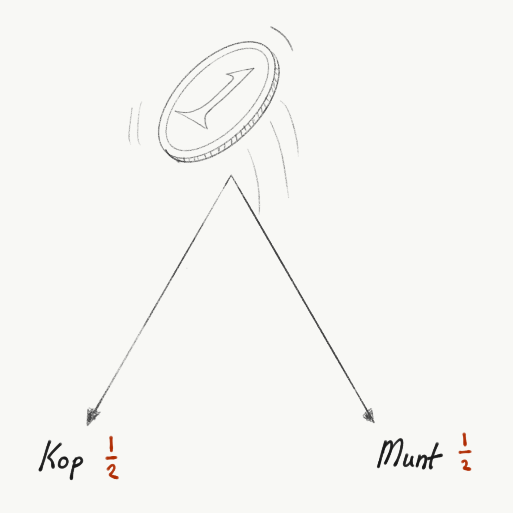
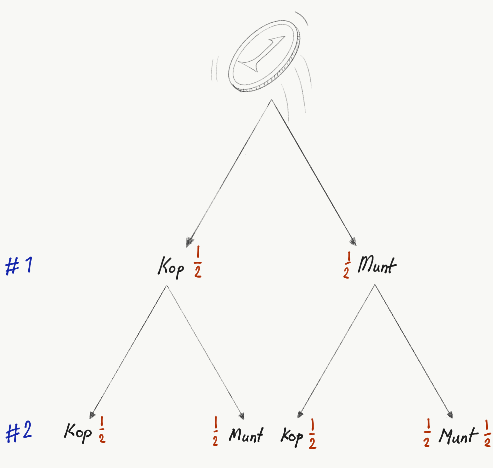

::: {.column-screen}

:::



::: {.lead-in}
At school you may have been taught that, sometimes, you have to multiply probabilities. We briefly discuss when and why you do this.
:::

First, a few notes on the notation of probabilities. When throwing a die, the event of rolling a six represents 1 out of 6 mutually exclusive possibilities. We write this as a fraction, $1/6$, or:

$$\dfrac{1}{6}.$$

We say there is a probability of 1 in 6 of rolling a 6. The probability is $\dfrac{1}{6}$, or one-sixth.

This also means that the probability of throwing *a* number—that is, *any* valid outcome from 1, 2, 3, 4, 5, or 6—equals:

$$\dfrac{6}{6} = 1.$$

When an outcome is certain to occur (100% certainty), its probability equals 1. When an outcome is less certain, its probability represents a fractional share of 1.

Finally, an essential note on fractional multiplication: calculating an $n$-th part of a quantity—for instance, 16—can be performed either by dividing by 2 or by multiplying by $\dfrac{1}{2}$:

$$\dfrac{16}{2} = 16 \times \dfrac{1}{2} = 8.$$

# Two coins

Suppose you toss coin #1 into the air. It lands on either heads or tails (@fig-single-coin). The probability of tossing heads is $\dfrac{1}{2}$, and the probability of tails is likewise $\dfrac{1}{2}$.

{#fig-single-coin fig-alt="Hand-drawn sketch of a tossed coin branching into two equal downward arrows labeled Kop and Munt, each with a probability of one half."}

Now imagine tossing coin #1 and coin #2 together, as illustrated in @fig-two-coins.

{#fig-two-coins fig-alt="Tree diagram showing the outcome branches of two sequential coin tosses, splitting into heads and tails for coin 1 and sub-branching into heads and tails for coin 2 with one-half probabilities."}

Ask yourself: of all the times coin #1 lands on heads, how often will coin #2 also land on heads? Coin #1 lands on heads half of the time, and coin #2 lands on heads for half of *those* specific occasions.

What is half of a half? Mathematically, it is:

$$\underbrace{\dfrac{1/2}{2}}_{\text{half of a half}} = \dfrac{1}{2} \times \dfrac{1}{2} = \dfrac{1}{4}.$$

# Part of a part

Consider @fig-grid. Suppose we toss two coins across 16 independent trials.

{#fig-grid fig-alt="Three-stage visual grid of sixteen circles: sixteen blank circles, eight circles filled with blue brushstrokes, and four of those blue circles overpainted in green."}

Coin #1 lands on heads roughly half the time—represented by the 8 blue circles in the middle panel. Out of those 8 occasions, how often does coin #2 also land on heads? Again, half the time. We paint these joint successes green in the right panel (4 circles).

What fraction of the original 16 trials is green? Half (4) of half (8) of the total (16), which is 4 out of 16, or $\dfrac{1}{4}$:

$$\dfrac{1/2}{2} = \dfrac{1}{2} \times \dfrac{1}{2} = \dfrac{1}{4}.$$

# A coin and a die

Suppose you toss a coin and roll a six-sided die simultaneously. The coin landing on heads has a probability of $\dfrac{1}{2}$. The die landing on a six has a probability of $\dfrac{1}{6}$.

Across all trials where the coin turns up heads (half of the total attempts), in what fraction will the die also show a 6? It will be one-sixth of that one-half:

$$\dfrac{1/2}{6} = \dfrac{1}{2} \times \dfrac{1}{6} = \dfrac{1}{12}.$$

# Combined independent events

If independent events $A$, $B$, and $C$ have individual probabilities of $\dfrac{2}{3}$, $\dfrac{1}{6}$, and $\dfrac{4}{5}$, respectively, the probability of all three occurring together is simply their product:

$$\underbrace{\dfrac{2}{3}}_{A} \times \underbrace{\dfrac{1}{6}}_{B} \times \underbrace{\dfrac{4}{5}}_{C} = \dfrac{8}{90} = \dfrac{4}{45} \approx 0.0889 \quad (\sim 8.9\%).$$

To find the probability of multiple independent conditions occurring together, you calculate a fraction of a fraction. And taking a fraction of a fraction is precisely what multiplying fractions does.

---

### Image credits and references

* *All diagrams, probability trees, and visual proofs by KJ Runia.*