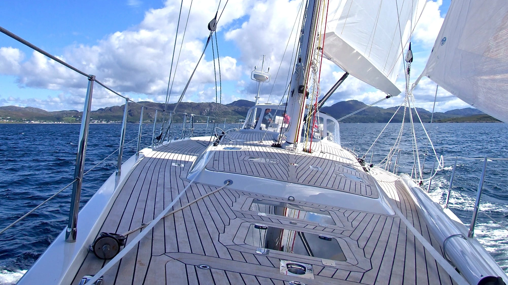
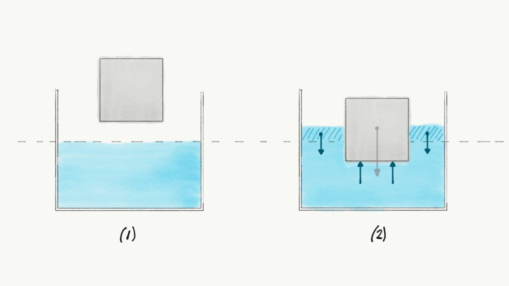

::: {.column-screen}

:::



::: {.lead-in}
Until they do due to a mistake, ships do not sink, not even the large and heavy ones. Textbooks occasionally explain this in terms of dissimilar densities. While density is a convenient parameter, it is not the fundamental physical cause. While ships sink to the bottom of the ocean due to gravity, they also float thanks to gravity.
:::

When a vessel is launched into the water, it sinks slightly beneath the surface until hydrostatic equilibrium is reached. Because water and the submerged hull cannot occupy the same volume simultaneously, the submerged portion of the hull displaces an identical volume of water. This displacement causes a slight rise in the surrounding water level, though in large bodies of water the change is imperceptible.

Despite being imperceptible, gravity exerts a downward force on every cubic centimetre of the elevated water column. Through hydrostatic pressure, this displaced water pushes back against the submerged hull. The weight of the displaced water equals the net upward force exerted on the vessel. This balance of forces is known as **Archimedes' principle**.

{#fig-buoyancy fig-alt="Two-stage illustration of a floating block: left panel shows the dry block above water, right panel shows the partially submerged block displacing water, with upward blue pressure arrows balancing the downward gravitational arrow."}

While the vessel pushes down on the water because of gravity, the surrounding water pushes back through pressure—also driven by gravity (@fig-buoyancy). As long as the upward buoyant force produced by the displaced water equals the total weight of the ship, the ship floats. Lateral water pressures act against the submerged sides equally in opposing directions, cancelling each other out completely.

Naval architecture exploits this balance: hulls are shaped so that their submerged volume displaces a quantity of water whose total mass equals that of the entire vessel. The ratio of total mass to total enclosed volume determines the effective density of the ship. While density explains everyday observations like oil floating on water on Earth, density alone does not create buoyancy without a gravitational field.

Aboard the International Space Station, where effective gravity is absent, lower-density oil and higher-density water do not separate into layers: without a gravitational pressure gradient, buoyancy ceases to function.

---

### Image credits and references

* *Featured image: Teak deck of a cruising yacht via Pixabay (CC0 Public Domain).*
* *Buoyancy and displacement schematics by KJ Runia.*