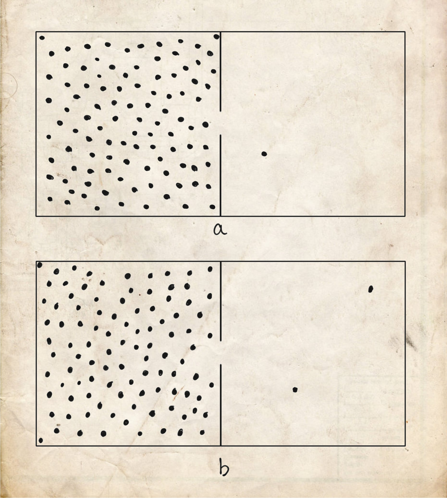
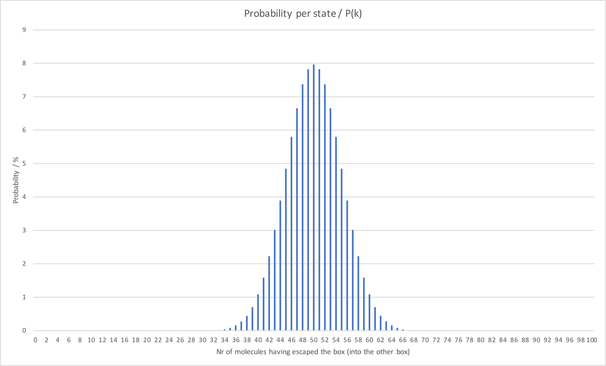
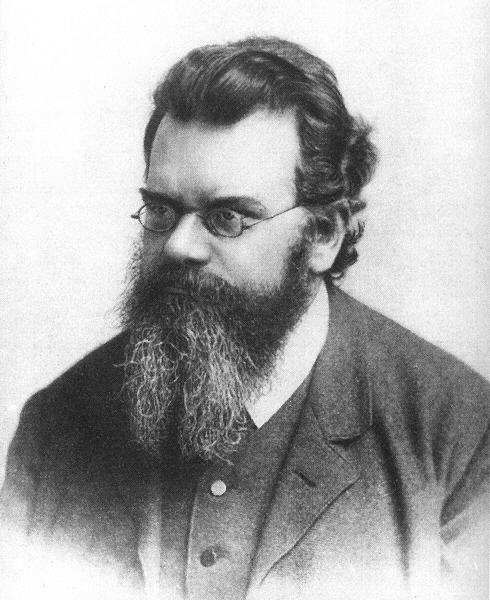

::: {.column-screen}

:::



::: {.lead-in}
In the Northern Hemisphere, summer has arrived. The time has come for us to chase the general public with water guns, jump through the neighbour's garden sprinklers' water rays, and either carefully place a soggy, wet sea cucumber on a human's belly during their beach nap,[^1] or simply dump them (the human) in the actually-still-too-cold seawater, especially if you love them. At the end of the day, after all those wet adventures, nothing will beat hanging your clothes out to dry in a soothing breeze of fresh alpine air.
:::

A few years ago, a friend asked what exactly causes wet clothes to dry. How does that work, exactly? I thought it was a great question because what may seem like a simple problem actually exposes one of the fundamental aspects of the way our universe works and, at the same time, forms one of the main causes for headaches among undergraduates: the second law of thermodynamics.

TL;DR? Don't like mathematics (high school level) and prefer to read the "dashboard" version? Skip straight to the bottom summary. Everyone else, please read on!

# A box of gas

Let's first paint ourselves a simpler picture than the actual situation where we wear whatever is the latest summer catwalk beach fashion. For now, we will also ignore the Sun, we will ignore the wind, and we will ignore the humidity of the air.

Imagine your colourful pair of swimming trunks is actually a simple box with a hundred gas molecules. The particles bounce [chaotically](https://en.wikipedia.org/wiki/Brownian_motion) back and forth against each other and the walls of the box itself.

Now, let there be a hole in the wall. Imagine, by pure chance, one molecule escaping the box through the hole, arriving in another container of exactly the same size. This obviously means there are now only 99 gas molecules left in the original box.

::: {style="width: 70%; margin: 1.5rem auto;"}
{#fig-box fig-alt="Hand-drawn diagram of two adjacent rectangular chambers connected by an opening: panel (a) shows 99 dots on the left and 1 dot on the right; panel (b) shows 98 dots on the left and 2 dots on the right."}
:::

Have a look at @fig-box(a). Assuming all gas molecules look exactly alike, how many ways do we have to arrange them in order to get the same result? Well, instead of this particular molecule having escaped, *any other one* of these hundred molecules could have escaped just as well. And so, as each one of the hundred gas particles was capable of escaping the box, exactly a hundred possibilities could have led to the same outcome (i.e. 1 escaped, 99 remain). In other words, exactly one hundred different configurations, or microstates, will entail the macrostate of the box where it lost one molecule while 99 remain inside. Let's call this number $W$. And let's call that number for the microstate where one molecule escaped (and 99 remain inside), $W(1)$. So, $W(1) = 100$.

Now, imagine not one, but two particles flew out, as is depicted in @fig-box(b). Well, this means that a different number of arrangements would have led to this situation or macrostate. For the first particle, 100 possibilities existed. For the second particle, however, only 99 possibilities existed since one had left already. The product gives $100 \times 99 = 9{,}900$. However, since it doesn't matter which of the two particles leaves first and which second, we divide by two:

$$W(2) = \frac{100 \times 99}{2} = 4{,}950.$$

More generally, to calculate the number of microstates for any combination, we use the binomial coefficient:

$$W(k) = \frac{n!}{k!(n - k)!},$$

where $n$ is the total initial number of molecules (100) and $k$ is the number of molecules that have escaped through the aperture.

| Escaped ($k$) | Remaining ($100-k$) | Number of arrangements $W(k)$ |
|:---:|:---:|---:|
| 0 | 100 | 1 |
| 1 | 99 | 100 |
| 2 | 98 | 4,950 |
| 3 | 97 | 161,700 |
| 4 | 96 | 3,921,225 |

: Number of possible microstate arrangements $W(k)$ as initial molecules escape. {#tbl-microstates-initial}

# Probabilities

In this model, the system naturally proceeds until an equal distribution is reached: 50 escaped, 50 remaining ($k = 50$). 

| Escaped ($k$) | Remaining ($100-k$) | Number of arrangements $W(k)$ |
|:---:|:---:|---:|
| 0 | 100 | 1 |
| 10 | 90 | $1.73 \times 10^{13}$ |
| 25 | 75 | $2.43 \times 10^{23}$ |
| 50 | 50 | $1.01 \times 10^{29}$ |
| 75 | 25 | $2.43 \times 10^{23}$ |
| 90 | 10 | $1.73 \times 10^{13}$ |
| 100 | 0 | 1 |

: Progression of microstate counts $W(k)$ showing symmetry around the central equilibrium point. {#tbl-microstates-distribution}

As seen in @tbl-microstates-distribution, the number of arrangements peaks at equilibrium ($k = 50$) and decreases symmetrically thereafter.

To calculate the probability $P(k)$ of observing a specific macrostate $k$, we divide its microstate count $W(k)$ by the total sum of all possible arrangements across all configurations:

$$P(k) = \frac{W(k)}{\sum_{j=0}^{100} W(j)} = \frac{W(k)}{2^{100}}.$$

The total sum of all possible arrangements is:

$$\sum_{j=0}^{100} \frac{100!}{j!(100-j)!} = 2^{100} \approx 1.268 \times 10^{30}.$$

The probability of finding all 100 molecules remaining in the left chamber is astronomically small:

$$P(0) = \frac{1}{2^{100}} \approx 7.9 \times 10^{-31} \quad (\sim 8 \times 10^{-29}\%).$$

By contrast, the equilibrium state $P(50)$ has a probability of roughly 7.96% (@fig-probability).

{#fig-probability fig-alt="Bar chart showing a symmetric bell-shaped binomial distribution peaking at 50 escaped molecules with a probability of approximately 8 percent, tapering off to zero at the tails."}

Given enough time, random particle motion inevitably drives the system toward the macrostate with the highest statistical weight.

# Back to our wet clothes

::: {style="width: 40%; float: right; margin: 0 0 1rem 1.5rem;"}
{.img-border #fig-boltzmann fig-alt="Black and white photographic portrait of Austrian physicist Ludwig Boltzmann wearing spectacles with a full, bushy beard."}
:::

Real garments do not consist of a rigid box containing 100 gas molecules. A soaked pair of swimming trunks holds trillions of water molecules bound to textile fibres.

However, if the first box represents our wet clothes, the second box represents the surrounding atmosphere.

In an isolated system, molecules exchange evenly. In the open air, several environmental drivers shift the probability distribution:

* **Sunshine** supplies thermal energy, increasing the kinetic energy of water molecules and lowering the activation barrier for evaporation.
* **Wind** continuously carries away evaporated water vapour adjacent to the fabric, preventing local saturation.
* **Low relative humidity** ensures the surrounding air remains well below vapor equilibrium.

::: {.callout-note appearance="minimal"}
These environmental factors shift the equilibrium distribution dramatically to the right: states where 99.999% of the water molecules have escaped into the air become statistically overwhelmingly favoured.
:::

Furthermore, because the volume of the Earth's atmosphere is practically infinite compared to the volume of a bathing suit, the phase space of available configurations in the open air vastly outnumbers the configurations inside the textile fibres. Even on an overcast, windless day, water molecules will eventually disperse into the room or outdoors simply by random molecular movement.

It was the Austrian physicist [Ludwig Boltzmann](https://en.wikipedia.org/wiki/Ludwig_Boltzmann) (@fig-boltzmann) who established that macroscopic thermodynamic states are directly rooted in the statistical counting of microscopic molecular configurations.

::: {style="width: 40%; margin: 1.5rem auto;"}
{#fig-grave fig-alt="Marble tombstone with a sculpted bronze bust of Ludwig Boltzmann, bearing the famous equation S = k log W carved above his head."}
:::

# Entropy and the second law of thermodynamics

Because the number of microscopic arrangements $W(k)$ escalates to unwieldy magnitudes, Boltzmann worked with the natural logarithm of $W$.

He multiplied this logarithmic value by a universal constant ($k_\text{B} \approx 1.380649 \times 10^{-23}\text{ J/K}$), bridging microscopic microstates to macroscopic thermodynamic entropy $S$ (@fig-grave):

$$S = k_\text{B} \ln W.$$

| Escaped ($k$) | Microstates $W(k)$ | Entropy $S$ ($10^{-23}\text{ J/K}$) |
|:---:|---:|---:|
| 0 | 1 | 0.00 |
| 10 | $1.73 \times 10^{13}$ | 42.1 |
| 25 | $2.43 \times 10^{23}$ | 74.4 |
| 50 | $1.01 \times 10^{29}$ | 92.2 |
| 75 | $2.43 \times 10^{23}$ | 74.4 |
| 90 | $1.73 \times 10^{13}$ | 42.1 |
| 100 | 1 | 0.00 |

: Thermodynamic entropy $S = k_\text{B} \ln W$ calculated across configuration states. {#tbl-entropy}

Entropy reaches its maximum precisely at statistical equilibrium (@tbl-entropy).

::: {.callout-note appearance="minimal"}
This is the second law of thermodynamics: the entropy of an isolated system tends toward a maximum.
:::

# Why do wet clothes dry?

While warmth, breezes, and dry air accelerate evaporation, clothes dry fundamentally because of probability and statistics.

The number of spatial microstates available to water molecules distributed across the open atmosphere is unimaginably larger than the number of states confined within the threads of a swimsuit.

::: {.callout-note appearance="minimal"}
There are vastly more ways for water molecules to be arranged dispersed in the surrounding atmosphere than trapped within wet fabric. Wet clothes dry because the universe evolves toward states of higher probability—which is to say, toward maximum entropy.
:::

---

### Image credits and references

* *Featured image: Alpine laundry drying on a wooden fence via PxHere (CC0 Public Domain).*
* *Portrait of Ludwig Boltzmann (ca. 1875), Public domain.*
* *Photograph of Boltzmann's grave at Zentralfriedhof Vienna by Daderot ([CC BY-SA 3.0](https://creativecommons.org/licenses/by-sa/3.0/)).*
* *Chamber diagrams, probability plot, and statistical calculations by KJ Runia.*

[^1]: The author does not approve of this; sea cucumbers should be left alone.