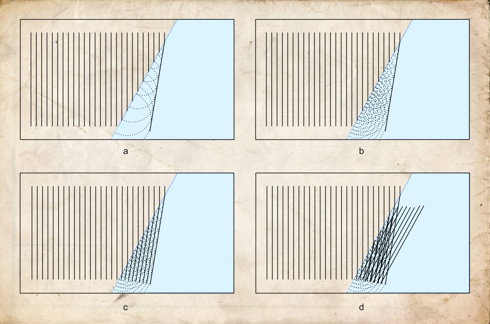
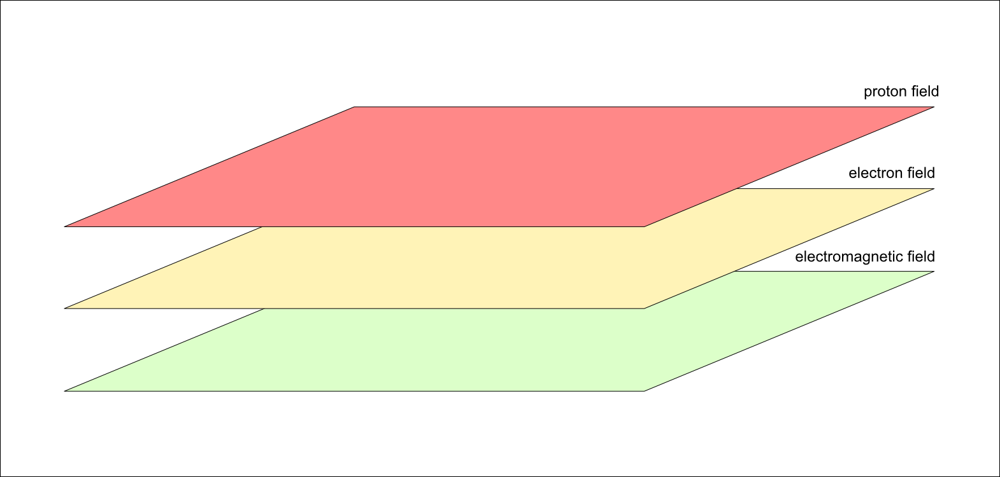
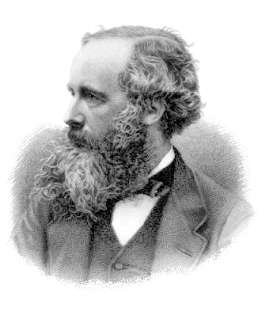
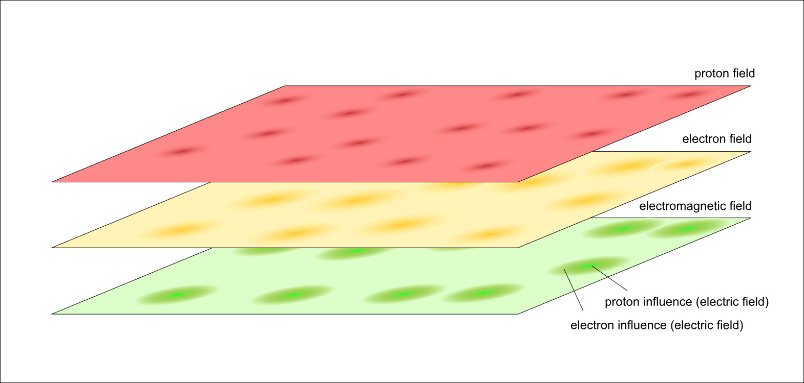
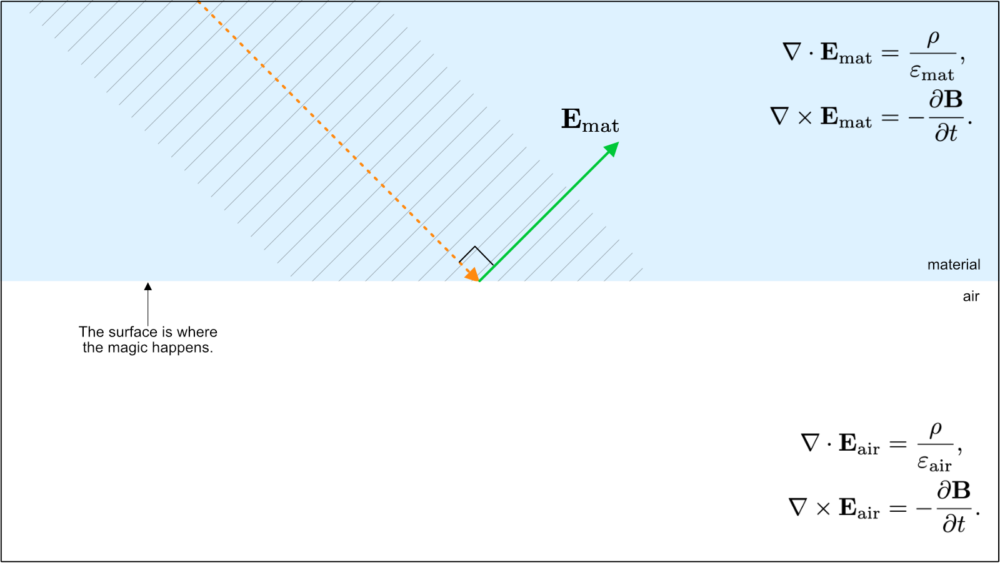
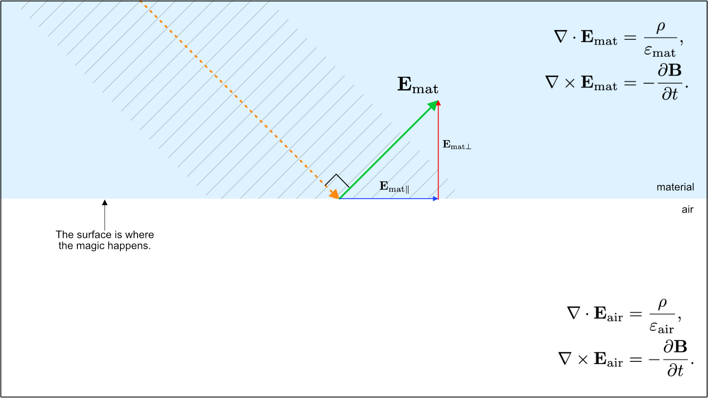
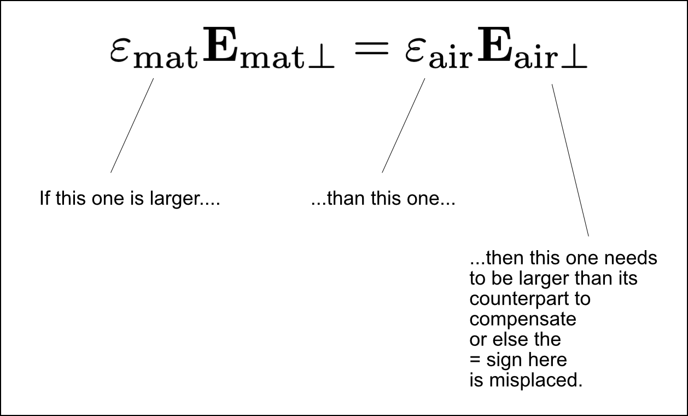
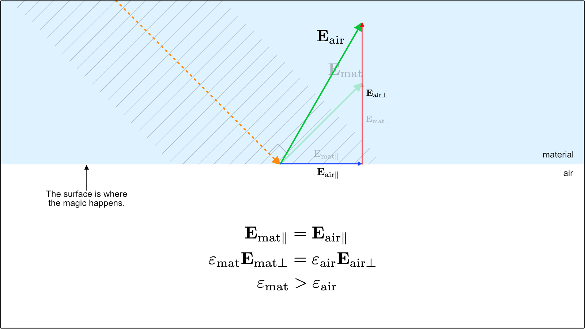
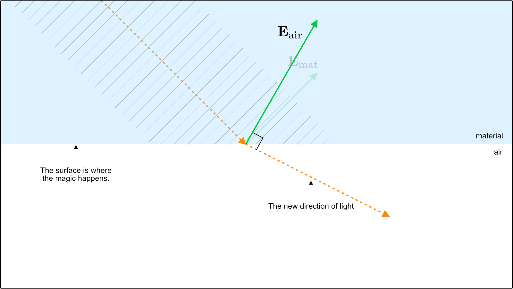
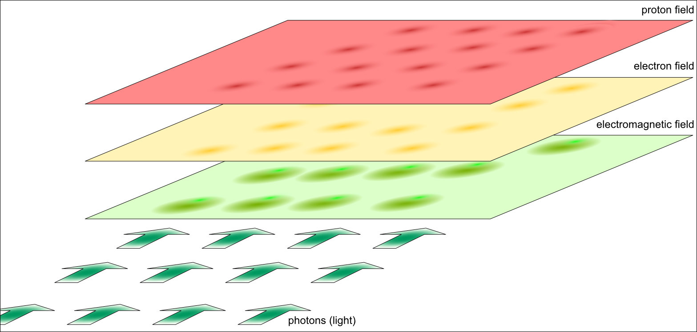

::: {.column-screen}

:::



::: {.lead-in}
Summer has arrived, and you have been served a gorgeous-looking cocktail. Condensation droplets on the glass reveal you are set for a much needed particularly refreshing indulgence. However, just as you were about to soak up the colourful fluid of blissful gratification, your shockingly intelligent child asks why the straw seems to be broken inside your drink. And if not about that, then it's about why this bear's head is in the wrong place. Sure, the answer is light refraction, but why, exactly, do glass and liquids refract light?
:::

{#fig-bear fig-alt="Visitors watching a polar bear through an aquarium glass barrier where the submerged body appears horizontally detached and displaced from the head above water."}

We will provide you with the answer. However, before we begin, we need to ask: TL;DR? Rather not see formulas? Scroll down to the last section, the Quick summary. More curious? Then by all means, read on. I promise, not a single calculation will be done. And if you do read on, you will know actual physics. Shockingly more than most.

# A few incorrect explanations

What would you answer? Here are just a few bad examples which other people (but not you) tend to tell their offspring:

1. Light takes the fastest route. As its speed differs per material, it needs to change direction. Or: light takes the path of the least amount of action. Same reasoning.
2. When light enters the glass and the liquid, it bounces back and forth between the molecules and atoms of the material. Due to their crystalline or liquid arrangement, the overall direction of light changes. Hence, light is refracted.
3. Light consists of particles, so-called photons, which get absorbed by the atoms of the material, causing their electrons to temporarily increase their orbital radius around the nucleus. The instant they fall back to their original orbit, they emit another photon in a direction which depends on and is consistent with the type of atom, i.e. material. The overall result is that the beam of particles has changed direction. Hence, light is refracted.
4. Huygens' Principle. Light is a wave. Every point on its wavefront can be a source for a circular wavelet. Draw them, connect the dots and you'll see: light gets refracted.

# Why are they incorrect?

1. Okay, this is not incorrect, however, while light does that, it doesn't explain what really happens. It's an answer to a different kind of question. So, to be "that person" here, in terms of answer-to-the-question-asked, it's incorrect after all.
2. By this logic, light should appear much more spread out due to the probabilistic nature of the supposed bouncing back and forth between chaotically moving or vibrating molecules and atoms. The specific direction of bouncing light is not guaranteed to be as consistent as we nevertheless observe in the real world. The resulting image should be a blur. It is not.
3. Here too, light should appear much more spread out. The direction of the re-released photon is not guaranteed to be in the direction we observe in the real world. A photon could be re-emitted in any direction, regardless of the type of atom. The frequency of the photon correlates with the atomic configuration, not its direction. Moreover, "getting absorbed" and "re-emitted" are not well defined. What does that even mean?
4. This is a sophisticated one. At first glance, it does produce an angle for the outbound light beam. However, Huygens' Principle only corresponds to observations if you cherry-pick from multiple possibilities. See @fig-huygens for a brief explanation.

{#fig-huygens fig-alt="Four-panel diagram (a to d) on aged paper illustrating Huygens wavelets propagating at an angled interface, showing how multiple wavelet intersections could yield numerous divergent wavefronts rather than a single neat beam."}

# Step 1. Not particles, not waves: it's all fields

So, what does make light refract then? We need to take a few mental steps. Here is the first one, which you'll just have to get used to.

::: {.callout-note appearance="minimal"}
Space throughout the entire observable Universe is filled with fields. In fact, fields are a *property* of space. Space without fields does not exist. With space come fields. Points in most fields not only have a value, they also have a direction. They are called [vector fields](https://en.wikipedia.org/wiki/Vector_field). Some are called [scalar fields](https://en.wikipedia.org/wiki/Scalar_field); their points have no direction, they only have values. There are more types of fields, such as [tensor fields](https://en.wikipedia.org/wiki/Tensor_field) and [fermionic fields](https://en.wikipedia.org/wiki/Fermionic_field). This is [quantum field theory](https://en.wikipedia.org/wiki/Quantum_field_theory) (QFT), the most successful and accurate theory to date.
:::

Next question is: what concrete fields are we talking about?[^1] In 2012, the Large Hadron Collider at [CERN](https://en.wikipedia.org/wiki/CERN) produced an excitation in the Higgs field.[^2] That excitation is what we call the Higgs particle. The field was proven to be real. Two Nobel Prizes were awarded to François Englert and Peter Higgs for having proposed the existence of the Higgs field forty-eight years earlier.

There are more fields. There is an **electron field**. Most of the time, the field has value zero. But when the values of a tiny part of that field oscillate at a distinct frequency, we call that an electron.

There is also an **electromagnetic field**. A stream of billions of local oscillations across a range of frequencies is what we call a beam of visible light. It is practical to sometimes talk about it as particles (**photons**) and sometimes as waves (**electromagnetic radiation**).

There is also a **proton field** (or more fundamentally, quark and gluon fields). A fairly local oscillation is a proton, which we usually perceive as a particle.

So, what is light, what are electrons, what are protons or quarks? Are they both particle and wave? No, that's an old and misleading question.

::: {.callout-note appearance="minimal"}
"Particles" aren't actual particles like tiny silver ball bearings. They are best described as a mathematical function, which we call the wave function (denoted by the symbol $\Psi$). When measured, they are fairly local oscillations or excitations at specific frequencies in fields pervading through all of space. Sometimes, it is practical to model them as either particles or waves, but it is more accurate to treat them as mathematical field states.
:::

{#fig-fields-0 fig-alt="Three stacked horizontal rectangular sheets representing the proton field in red, the electron field in yellow, and the electromagnetic field in green."}

# Step 2. Maxwell's field equations

James Clerk Maxwell showed that an electric field and a magnetic field were two aspects of the same space-filling electromagnetic field, and that light is an electromagnetic disturbance.

::: {style="width: 40%; float: right; margin: 0 0 1rem 1.5rem;"}
{fig-alt="Engraved black and white portrait of Scottish physicist James Clerk Maxwell with a full beard and formal attire."}
:::

He formulated four fundamental differential equations. We will look at two of them:

$$\mathbf{\nabla} \cdot \mathbf{E} = \frac{\rho}{\varepsilon_0},$$

$$\mathbf{\nabla} \times \mathbf{E} = -\frac{\partial \mathbf{B}}{\partial t}.$$

The first equation (Gauss's law) shows how the electric field $\mathbf{E}$ is influenced by a charge density $\rho$. The parameter $\varepsilon_0$ denotes the permittivity of free space. Inside matter, this value changes to:

$$\varepsilon_\text{air} \quad \text{and} \quad \varepsilon_\text{mat}.$$

These two permittivity values play a decisive role in why light bends at an interface.

{#fig-fields-a fig-alt="Diagram of three stacked field planes showing localized excitations in the proton and electron fields producing induced disturbances in the green electromagnetic field below."}

# Step 3. Draw the vectors

Have a look at @fig-model-01. The orange vector denotes the direction of light inside a material. Maxwell demonstrated that light has an electric field oscillation $\mathbf{E}_\text{mat}$ perpendicular to its direction of propagation (green arrow).

{#fig-model-01 fig-alt="Technical illustration showing a dashed orange ray of light traveling through a light blue material toward an interface with air, accompanied by a perpendicular green electric field vector."}

The electric field vector has two fundamental components: a component parallel to the surface ($\mathbf{E}_\parallel$) and a component perpendicular to the surface ($\mathbf{E}_\perp$), as shown in @fig-model-02.

{#fig-model-02 fig-alt="Vector diagram decomposing the green electric field vector into a blue horizontal vector parallel to the surface and a red vertical vector perpendicular to the surface."}

At the boundary interface between the material and air, electromagnetic boundary conditions require that:

$$\mathbf{E}_{\text{mat}\parallel} = \mathbf{E}_{\text{air}\parallel},$$

$$\varepsilon_\text{mat} \mathbf{E}_{\text{mat}\perp} = \varepsilon_\text{air} \mathbf{E}_{\text{air}\perp}.$$

Because the optical permittivity of dense matter is larger than that of air:

$$\varepsilon_\text{mat} > \varepsilon_\text{air}.$$

::: {style="width: 45%; float: right; margin: 0 0 1rem 1.5rem;"}
{fig-alt="Equation layout demonstrating that because epsilon-mat is larger than epsilon-air, E-air-perp must be proportionally larger than E-mat-perp."}
:::

This directly dictates that the perpendicular vector component in air must be larger than in the material:

$$\mathbf{E}_{\text{air}\perp} > \mathbf{E}_{\text{mat}\perp}.$$

This change in the normal component alters the total resultant electric field vector in air, as illustrated in @fig-model-03.

{#fig-model-03 fig-alt="Diagram showing that the vertical red component expands in air, resulting in a steeper and longer green electric field vector labeled E-air compared to the lighter E-mat vector."}

Since light must propagate perpendicularly to its electric field vector, constructing the ray perpendicular to the new electric field in air reveals the refracted transmission angle (@fig-model-04).

{#fig-model-04 fig-alt="Ray diagram showing the new transmitted orange dashed ray of light emerging into air at a visibly altered, bent angle that is perpendicular to the new green E-air vector."}

# Step 4. The electric field inside materials

What causes the permittivity $\varepsilon_\text{mat}$ to differ between materials?

When an electromagnetic wave traverses a medium, its electric field drives oscillations in the electron clouds of the constituent atoms (@fig-fields-b). These oscillating electrons generate their own secondary electric fields, which superpose with the original wave. The macroscopic consequence of this microscopic interaction is a modified net permittivity $\varepsilon_\text{mat}$.

::: {.callout-note appearance="minimal"}
Light alters the medium's electromagnetic configuration, and that altered configuration in turn dictates the trajectory and phase velocity of the light.
:::

{#fig-fields-b fig-alt="Three stacked field planes with incoming green photon wavevectors underneath inducing polarization ripples across the electron and electromagnetic fields."}

# Quick summary: why, exactly, do glass and liquids refract light?

Space contains an omnipresent electromagnetic field. We mathematically separate this field into electric and magnetic subfields.

::: {.callout-note appearance="minimal"}
Electrons in glass and liquids are driven by the electric field of incoming light. In turn, the moving electrons induce their own counteracting electric fields. At the interface with air, electromagnetic boundary conditions require the parallel electric field to remain continuous while the perpendicular component scales with permittivity. Because matter has higher permittivity than air, the perpendicular component changes, tilting the net electric field. Because light propagates perpendicular to its electric field, the beam bends.
:::

Or, colloquially: light pushes on electrons via the electric field; the electrons push back; and the light beam adjusts its trajectory accordingly.

---

### Image credits and references

* *Featured image: Cocktails and snacks on a beach terrace at sunset via PxHere (CC0 Public Domain).*
* *Polar bear photo at zoo enclosure via OpenCurve archive.*
* *Portrait of James Clerk Maxwell engraved by G. J. Stodart (1890), Public domain.*
* *Field model diagrams and vector boundary illustrations by KJ Runia.*

[^1]: The Higgs field is a scalar field: its points have magnitude but no direction.
[^2]: The Higgs boson itself decays extremely rapidly into other particles, which are detected by instrumentation.